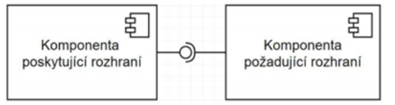

## 02 - Prvky struktury softwarových systémů v popisu architektury, koncept softwarových komponent a konektorů. Způsoby jejich realizace v konkrétních jazycích/prostředcích.[KIV/SAR]

**Architektura** (takové jak ho známe, píšeme metody, píšeme jak se má co udělat)
- Souhrn zásadních designových rozhodnutí o daném systému
- struktura, chování, interakce, mimofunkční vlastnosti
- Celkový pohled na SW jako celek, jeho rozdělení a jak jednotlivé části spolu interagují
- Preskriptivní – jak se to má udělat (vytvořeno na začátku vývoje) / Deskriptivní – jak je to udělané (ex post)

**Komponenta**
- entita architektury
- zapouzdřují nějaké chování (black box)
- mají jeden účel
- Komponenta omezuje přístup (do dat a procesů) přes pevně definované rozhraní (co vyžaduje, co poskytuje)
- komunikují mezi sebou pomocí konektorů; komponenty + konektory = konfigurace
- Má explicitně definované závislosti na požadovaný kontext. Já jsem komponenta a abych mohla fungovat, tak
  potřebuji (třeba: práva k zápisu, připojení k síti, aby běžela jiná komponenta, …)

**Komponentové modely a frameworky**
- komponentový model
  - definice sémantiky jednotlivých komponent
  - definice toho, jak mají komponenty interagovat
  - definice toho, jak mají být komponenty skládány do větších celků
- Komponentový framework
  - Sada interfaců a abstraktních tříd, které implementují komponentový model
- výhody
  - snadná výměna komponent
  - separation of concerns (viz #1)
  - Nezávislost komponent
  - Jedna zodpovědnost, o kterou se komponenta chová
  - Minimalizace interakce mezi komponenty
  - Znovupoužitelnost komponent
  - Měly by urychlit a tím pádem zlevnit vývoj
- nevýhody
  - řežie
  - ukecanost kódu, větší duplicita (často u SoC)
  - Často těžší sestavení systému kvůli složitým závislostem
  - Udržitelnost - při změně jedné komponenty může dojít k ovlivnění ostatních
  - Mnoho různých modelů / frameworků

**Konektor**
- definuje způsob a prostředky pro interakci komponent (zajišťuje jejich propojení)
- Např. volání procedur, RPC, pipes (UNIX pipes, TCP/IP sockety), sdílená paměť, REST, SOAP, ESB, eventy, …
- Konektor může být poskytnut běžícím prostředím (např. volání procedury), ale může se jednat i o komplexní
  mechanismus interakce (např. http, tcp/ip, port)
- reguluje a řídí interakce mezi komponenty
- obvykle se jedná pouze o jednoduchý procedure call či přístup ke sdíleným
  datům, ale může být mnohem složitější
- koordinace
  - kontrola výpočtu
  - kontrola doručení dat
  - odděluje řízení komunikace od výpočtu
- konverze
  - převod dat mezi nezávisle vyvýjenými systémy
  - př. převod jednotek dat
  - realizace: adapter, wrapper
- usnadnění
  - různé podpory interakce
  - řízení přístupu ke sdíleným datům (monitory, kritická sekce)
  - load balancing
- příklady:
  - procedure call, shared memory, message passing, data stream, wrapper/adaptor
- **Role**
  - Komunikační – komunikace mezi komponentami
    - hlavní role konektoru - přenáší data mezi komponentami
    - odděluje komunikaci od výpočtů
    - mohou ovlivnit mimofunkční požadavky (výkon, škálovatelnost, bezpečnost);
    - mohou mít různé vlastnosti (persistence), mechanismy (volání procedur, RPC, sdílení dat, zasílání
      zpráv) a omezení (stream dat pro pipes/filters)
  - Koordinační/Řídící – předávání řízení / řídí doručení dat
    - pro oddělení řízení od samotného výpočtu, určuje “co kdy bude běžet”
    - eventy, arbitrátor
  - Konverzní 
    - – umožňuje komunikaci i pro vzájemně nekompatibilní komponenty, zajistí převod (datových typů,
      čísel, frekvencí, …);
    - adaptéry a wrappery
  - Facilitační
    - zprostředkování komunikace komponent, které mají spolupracovat
    - arbitrátor, distributor
  
 **Příklady konektorů**
- Procedure call connector
  - jedná se o klasické volání procedury
  - při volání procedury se předává řízení volané proceduře
  - informace se předávají pomocí parametrů
  - velké množství variací, např. předání pomocí hodnoty, reference
  - volaná procedura může vracet hodnotu. Můžeme měnit přístupnost, resp. viditelnost (private, protected).
- Event connector
  - konektor generuje zprávy na základě nějaké události
  - různé způsoby oznámení
  - pollování, kdy potencionální příjemce periodicky kouká, jestli nenastala událost, která ho zajímá
  - dalším způsobem je Publish-Subscribe
  - používá se v GUI apod.
- Data access connector
  - konektor se stará o přístup k datům v repozitáři (databáze, souborový systém, apod.)
  - konektor může poskytovat konverzní služby (překlad informací XML na JSON např).
    Stream connector
  - hlavní úkol je přenesení dat mezi autonomními procesy, hlavně komunikační služba. Např. roury, TCP/UDP
    sockety.
- Arbitrator connector
  - především role facilitační, řeší konflikty ve chvíli, kdy je více komponent ale nelze nic říci o jejich potřebách či
    stavech.
  - umožňují přesměrování toku řízení
  - můžou se používat např. k dohodnutí kolik prostředků bude poskytnuto k řešení určitého problému
  - můžou řešit dále plánování nebo load balancing
- Distributor connector
  - především role facilitační, identifikují cesty interakce a směřují další komunikaci mezi komponentami
  - pomáhají ostatním konektorům, např. DNS.
  
- **Způsoby jejich realizace**
  - V OO jazycích lze za komponentu považovat objekt (je to entita, která něco zapouzdřuje).
  - V procedurálních jazycích (typ ANSI C) lze za komponentu považovat modul (obvykle vlastní .c a .h soubor).
  - Konektory můžou být implementované pomocí volání metod (i RPC či RMI) či nějakého složitějšího toku řízení (např.
    různé manažery a DAO)
  - Konektorem může být také nějaká již hotová infrastruktura či middleware.
