## 04 - Architektonické styly, architektonické vzory a produktové řady – principy, účel a použití, způsoby realizace. [KIV/SAR]

**Architektonický styl**
  - Soubor designových rozhodnutí, které se aplikují během vývoje
  - Způsob organizování kódu
  - Styl je obecnější a neřeší konkrétní problém, je přenositelný do jiné domény
  - př.: object-oriented, layered, monolith, pipes and filters, blackboard, serviceoriented, cloud
  - pojmenovaná kolekce návrhových rozhodnutí, které jsou aplikovatelné v
    různých kontextech
  - nejvyšší úroveň abstr. definice použitelných elementů a jejich vztahů spolu s určitými omezeními na jejich použití akce
  - 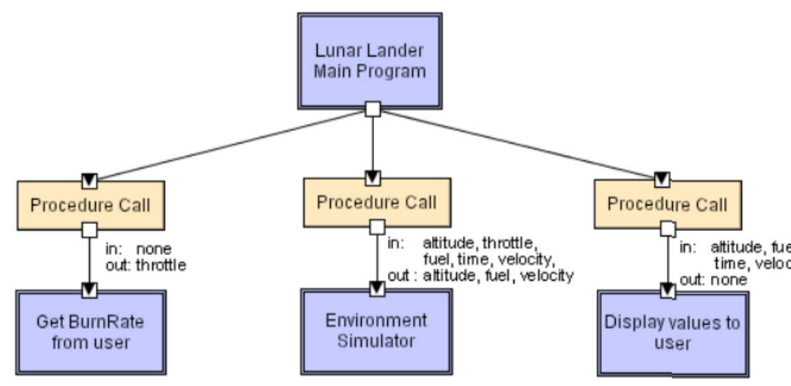
  

- **Monolit**
  - aplikace je jeden funkci celeke ktery se sklada z vice modulu (dela vice cinnosti napr registraci uzivatele, ucetnictvi, tisknuti dokumentu atd)
  - veškerá funkcionalita celého SW systému je implementovaná v jednom
    programu
  - ne úplně styl; jeden velký program, chybí modularita
  - v pripade skalovani musime skalovat celou aplikaci i kdyz jsou vytizenne napr jen nektere jeji casti
  - horsi to zacne byt az se aplikace zacne zvetsovat
  - neprehlednost kodu, prace vice programatoru
  - vyzauje dobrou vnitrni architekturu a rozlozeni trid
  - aplikace dlouho startuje
  - cela aplikace musi byt napsana s pouzitim stejne technologie
  - pri zmene frameworku musime celou app prepsat
  - nevýhody: 
    - nemožnost znovupoužití jednotlivých částí bez převzetí celého systému
    - velmi obtížná změna control flow programu
    - velká propojenost jednotlivých částí
    - v průběhu času velmi narůstá množství kódu, který se stává těžko
      pochopitelný a těžko udržovatelný
    - nemožnost horizontálního škálování
    - chyba jedné části rozbije celý systém
  - výhody:
    - dela vice cinnosti napr registraci uzivatele, ucetnictvi, tisknuti dokumentu atd
    - pro malé projekty je přehlednější
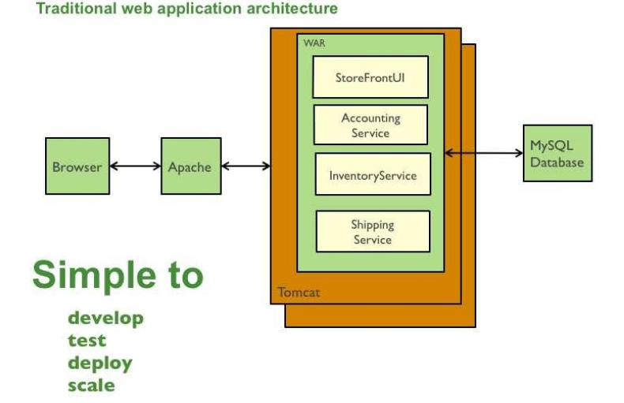

- **Hlavní program a podprogramy**
  - komponenty jsou hlavní programy a podprogramy
  - konektory jsou volání procedur
  - hierarchická organizace, kdo volá koho (např. jazyk C)
  - 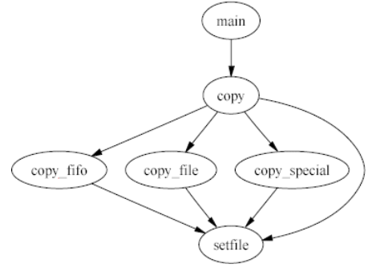
  

- **Objektově orientovaný styl**
  - komponentou je objekt
  - konektorem zasílání zpráv, resp. volání metod
  - např. Java
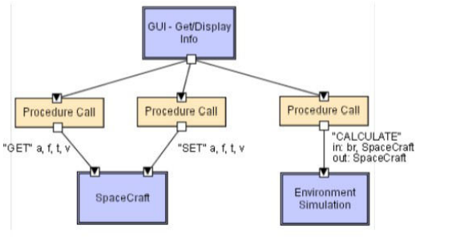
  

- **Component-based**
  - Nástupce objektově orientovaného stylu - objekty jsou příliš specifické a je obtížné je znovu použít.
  - Komponenty jsou jako samostatné service provideři.
  - Příklad: @Component ve Springu (pomocí DI zavádíme závislosti…)
  - Typy:
    - Black box: je známa pouze specifikace
    - Glass box: vnitřní části lze kontrolovat, ale nelze je měnit
    - Grey box: část vnitřních součástí lze kontrolovat, změna je povolena v omezeném rozsahu
    - While box: komponenty je možné kontrolovat a upravovat

- **Service-oriented architecture (SOA)** - [Podrobněji v EITM (KIV/VS #13)]
  - principiálně přechod od monolitu
  - menší služby, které mezi sebou komunikují a tvoří komplexní systém
    - každá služba je autonomní a nese za sebe odpovědnost
  - Služba (Service) = program, se kterým může být komunikováno pomocí přesně definovaných zpráv
    - je nezávislá na svém okolí, své funkce zpřístupňuje pomocí známého rozhraní
  - W3C Web Services (standard)
    - služba dostupná přes internet pro využití jiným systémem
    - protokol pro volání služeb – SOAP (Simple Object Access Protocol) – jeho zprávy jsou založeny na XML
    - Pro popis rozhraní SOAP rozhraní se používá WSDL (Web Services Description Language)
  - Výhody
    - separation of concerns, z principu menší provázanost
    - jednotlivé servisy mohou být vytvořené v různých technologiích
    - snadné přizpůsobení měnícímu se businessu (to bylo cílem)
    - škálovatelnost
  - Nevýhody
    - režie, ze začátku vyšší náklady na vývoj než monolit apod.

- **Mikroservisová architektura**
  - nezávislé komponenty (služby), které mezi sebou komunikují
  - modernější nástupce SOA (ještě menší komponenty)
  - každá je autonomní a nese za sebe odpovědnost
  - Výhody
    - modulárnost (přehlednější kód, snazší testování, odolná proti zastarání), SoC
    - škálovatelnost (služby jsou nasazovány nezávisle na sobě, běží v nezávislých procesech)
    - integrace (část monolitu lze nahradit mikroslužbou)
    - paralelní vývoj (malé týmy, každý řeší svojí služby samostatně, jiné technologie)
  - Nevýhody
    - nároky na síť, nasazení je komplikovanější
    - většinou větší HW nároky - spousta režie na komunikaci

- **Vrstvený architektonický styl** (architektura rozdělená do vrstev)
  - hierarchická organizace - každá vrstva poskytuje rozhraní pro komunikaci s vyšší vrstvou
  - konektory jsou protokoly mezi vrstvami
  - velká výhoda rozšiřitelnost - výměna vrstvy ovlivní max. 2 okolní vrstvy (nebo vůbec když stejné rozhraní)
  - není příliš univerzální, slabý výkon

  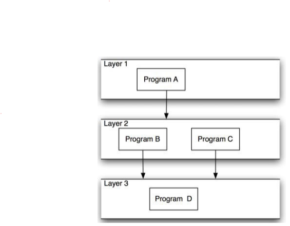

  - **Virtuální Stroj**
    - hierarchický systém organizace, víceúrovňový klient-server
    - každá vrstva vystaví své rozhraní, které může používat vrstva nad
    - každá vrstva je server - tj. poskytuje službu vyšší vrstvě, a zároveň je klient, kdy využívá služeb nižší
      vrstvy - například TCP/IP zásobník
    - výhodou je zvýšená abstrakce
  - **Klient-Server**
    - pouze dvě vrstvy, klient a server
    - klient zasílá požadavky na server, který provede požadavek a odpoví
    - klienti mohou být tencí (připojí se na server a ten za něj dělá vše) nebo tlustí (vlastní OS, vlastní rutiny)

- **Data-flow architektonický styl**
  - **Filtry a roury**
    - komponenty jsou filtry, které transformují vstupní datový proud do výstupního datového proudu
      - komponenty mohou pracovat souběžně
      - komponenty jsou na sobě nezávislé, protože nesdílej žádný stav
    - konektory jsou roury, vedení pro pro datové proudy
    - Výhody:
      - Jednoduché na pochopení, snadná údržba, rozšiřitelnost, paralelní běh
      - příkladem je např. UNIX SHELL: ls | wc -l
    - Nevýhody:
      - výkon je určen nejslabší komponentou.
    
      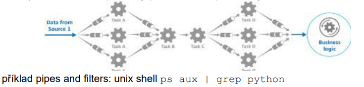

  - **Dávkově Sekvenční Styl**
    - komponenty jsou nezávislé programy
    - program čeká dokud program před ním úplně nedokončí zpracování dat
      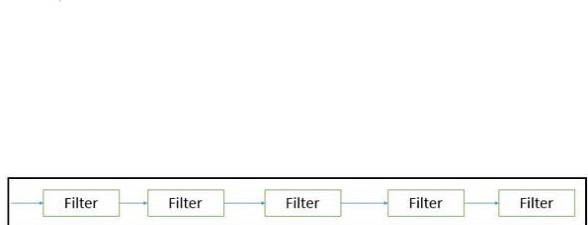

- **Sdílená paměť** (styl tabule, pravidlově založený styl)
  - dva t ypy komponent
    - centrální datová struktura - tabule
    - přidružené komponenty pracující s tabulí
  - systém je zcela kontrolován stavem tabule
  - výhodou je konzistence sdílených dat díky synchronizaci sdíleného přístupového bodu
  - nevýhodou je zas, že je pouze jeden přístupový bod, který může být úzkým hrdlem (bottleneck)
  - např. rezervační systém, AI systémy
  - Pravidlově založený styl - pravidla přidáváme, upravujeme poradi atd..

  - **Black Board**
    - systém má dva druhy komponent:
    - blackboard - centrální datová struktura, ke které může každý přistoupit a
      měnit jí
    - komponenty operující nad black boardem
    - systém je řízen stavem blackboardu
    - využití: AI systémy, kompilátory
    - výhody: konzistentní a transparentní přístup ke sdíleným datům
    - nevýhody: výkon black boardu může být výkonostním bottleneckem
    - 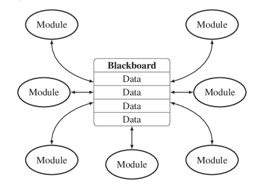
  
  - **Rule Based Architecture**
    - vhodné pro znalostní/expertní systémy
    - odvozovací systém analyzuje vstup uživatele a rozhodne, zda se jedná o
      pravidlo/fakt, nebo dotaz
    - pokud se jedná o pravidlo/fakt, je uložen do znalostní databáze
    - pokud se jedná o dotaz, je tento dotaz vyhodnocen nad znalostní databází
    - v systému může být i část, která automaticky z dostupných faktů a pravidel odvozuje
      fakta nová
    - 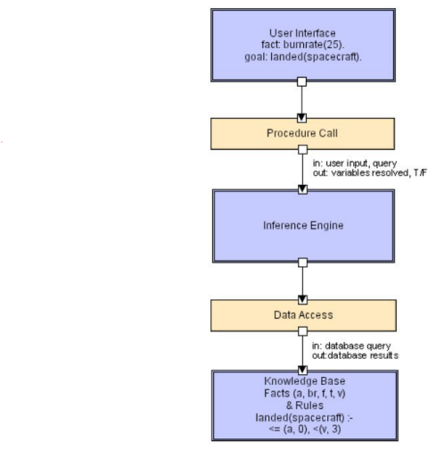

- **Implicit invocation**
    - základní myšlenkou je ohlášení události (někomu) místo vyvolání metody
    - klienti, posluchači, si zaregistrují metody na různé události
    - systém vyvolá všechny registrované metody implicitně
    - **Vydavatel-Předplatitel** (Publisher-Subscriber)
      - subscriber (je jich více) se registruje/odregistruje pro
        přijímání specifických zpráv
      - publisher (pouze 1) vysílá zprávy subscriberům
        - udržuje seznam subscriberům !
      - Příklad: Handlery v GUI
      - 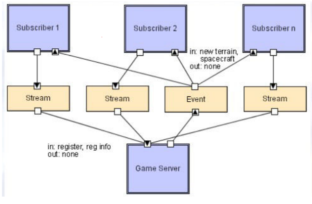
    - **Styl založený na událostech** (Event-based)
      - Podobné jako výše s tím rozdílem, že vydavatel si neudržuje
        seznam předplatitelů (neví o nich)
      - předplatitelé přijímají události přes tzv. event bus.
      - ted’ je předplatitel zodpovědný za to, že ví o svém publisherovi
      - 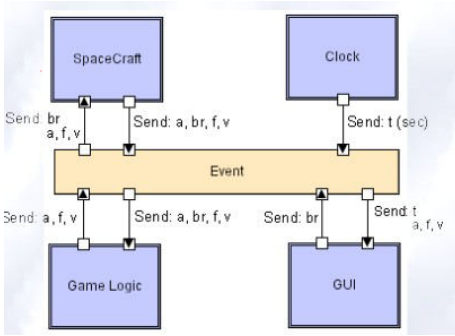

- **Interpreter**
  - **Interpreter**
    - architektura dovoluje jednoduché rozšíření funkcionality pomocí
      např. skriptů, maker nebo pravidel, které jsou vyhodnocovány interpretem
    - poskytuje klientům přenositelnou a flexibilní funkcionalitu
    - interpret parsuje a vykonává vstupní příkazy
    - rozšíření je možné např. díky vkládání předdefinovaných funkcí pomocí
      skriptu, který interpret vykoná
    - Příklady: Excel, rozčení do prohlížečů

  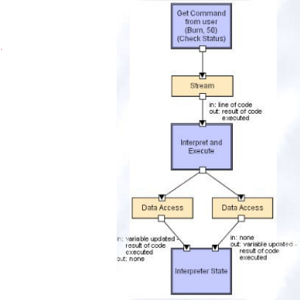

  - **Mobile code**
    - umožňuje dynamicky měnit místo výkonu kódu 
    - jsou případy, kdy interpretace nemůže být provedena lokálně
    - kód je někam poslán (execution dock => komponenta) a tam bude vykonán
      - Konektor = internetové protokoly
    - příklad - server má spustitelný kód, klient si o tento kód požádá a vykoná ho lokálně u sebe
      (JavaScript)
    - umožňuje přenést kód pomocí sítě
    - komponenty: interpreter kódu, execution dock
    - konektory: síťový přenosový protokol
    - data: kód
    - **code on demand**
      - interpretovatelný kód je získán ze vzdáleného serveru a vykonán lokálně u
        klienta
      - například JS v prohlížeči uživatele
    - **remote evaluation**
      - zachycuje situaci, kdy interpretovatelný kód je klientem odeslán na vzdálený
        stroj (server)
      - server kód vykoná, získá výsledek a výsledek vrací uživateli
      - příkladem jsou programovací soutěže, kdy soutěžící odesílají svůj kód na
        validační server
    - **mobile agent**
      - software spolu s daty se umí skrz síť autonomně pohybovat a vykonávat se
      - lze to využít například k využití nevyužívaných výpočetních zdrojů v síti
      - agent si najde stroj s využitelnou kapacitou, přesune se tam a
        pokračuje ve výpočtu

- **Peer-to-peer**
  - uzly komunikují přímo mezi sebou, ne přes centrální prvek, žádný centrální prvek tedy není
  - všechny uzly si jsou rovny
  - Výhody: Robustní, Nevýhody: Komplexnost při rozhodování
  - příklad: torrent, bitcoin
  - 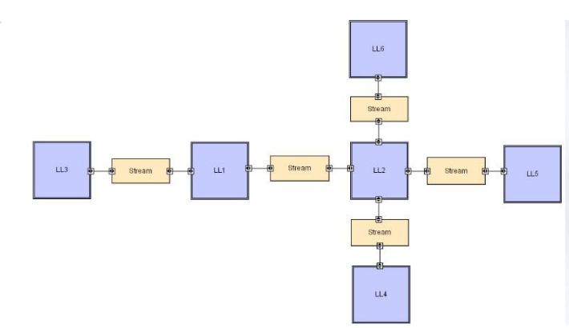

**Architektonický vzor (pattern)**
  - řešení pro opakující se problémy
  - vzor ovlivňuje kód bud’ horizontálně, tj. jak strukturovat kód ve vrstvě
  - nebo vertikálně, tj. jak zpracovat požadavky z vnější vrstvy ve vnitřní.
  - Specifický pro danou doménu.
  - Příklady vzorů: Three-tier, MVC, MVVM, REST

- **3-vrstvá architektura**
  - jedná se vícevrstvou architekturu klient-server, kde každá vrstva je vrstva komunikuje pouze s dvěma vrstvami
  - vyšší vrstva zajišťuje služby a používá služby nižší vrstvy
  - typicky se dělí na prezentační, aplikační a datovou vrstvu.
    - prezentační vrstva reprezentuje data uživateli. Uživatel komunikuje s touto vrstvou např. pomocí
      webové stránky
    - aplikační vrstva obsahuje business/doménovou logiku aplikace
    - datová vrstva zajišťuje přístup a ukládání dat - databáze, souborový systém
  - např.: informační systém (v Javě, C#, …), webové aplikace
  - Od MVC se liší tím, že neumí přeskakovat vrstvy

  

- **MVC (Model - View - Controller)**
  - návrhový vzor, který odděluje řídicí logiku od datového modelu a uživatelského rozhraní (hodně pro webové aplikace)
  - dělí logiku do tří propojených částí - model, view a controller
  - aplikace MVC vzoru dovoluje znovu použití jednotlivých částí
  - **Model** - struktura a správa dat, business logiku a pravidla aplikace
  - **View** 
    - zobrazuje data z modelu uživateli, umožňuje uživateli interakci s controllerem
    - reprezentace informace, např. graf nebo tabulka
    - informace může mít několik reprezentací
  - **Controller** - přijímá vstup, obsluhuje uživatelské příkazy (validace), aktualizuje data v modelu
    - Např. webová aplikace v PHP (e-shop)
      - Model - databaze
      - View - šablonovací systém (HTML + CSS)
      - Controller - PHP skripty obsluhujici uzivatelske pozadavky

  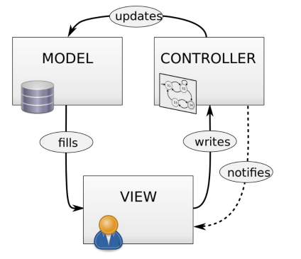

- **MVP (Model-View-Presenter)**
  - Model
  - View - pasivní rozhraní, které zobrazuje data a směřuje uživatelské akce na presenter
  - Presenter - získává data z modelu a formátuje ho pro view
  - V podstatě 3-vrstvá architektura, pokud se na to podíváme trochu jinak
  - Swing, JavaFX, GWT

- **Sensor-Controller-Actuator**
  - několik senzorů, hlavní počítač a ovladače
  - senzory získávají data, která ve smyčce hlavní počítač čte a nad daty provádí výpočty
  - na základě výpočtů posílá řízení k ovladačům

  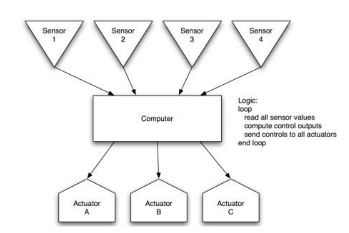

**Jaký je rozdíl mezi architektonickým vzorem a architektonickým stylem? Může být kombinace více architektonických vzorů
použita k realizaci architektonického stylu?**
- Obě kolekce designových rozhodnutí, které se osvědčily v minulosti pro řešení problémů (jeden styl může obsahovat více vzorů)
- NE - Rozhodujeme se vždy pro jeden styl (vrstvená nebo MVC apod.)

**Produktové řady**
  - produktová řada je sada produktů, které mají společné podstatné vlastnosti
  - jinými slovy to je software v různých variantách, které mají společné jádro
  - příklady - systém pro e-shop, WordPress, edice windows – home, pro, SW u aut
  - Další pohled: vyvineme produkt a poté vydáváme nové verze s minimálními náklady
  - Přístup k architektuře
    - Jádro dobře zdokumentované a stabilní
    - Důraz na modularitu, rozšiřitelnost a zpětnou kompatibilitu

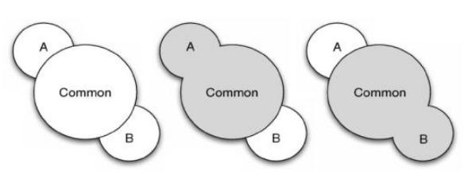