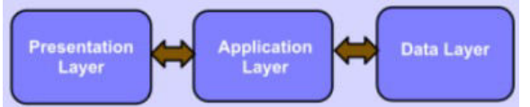

## 5. Vícevrstvé a servisně orientované architektury – struktura a vlastnosti, příklady použití a technologie používané pro realizaci. [KIV/SAR, KIV/PIA]

- Viz. #4
- Vícevrstevný architektonický styl / třívrstvá architektura / klient-server / virtuální stroj
- SOA (zároveň viz. KIV/VS #13)

**Architektonický styl**
  - Soubor designových rozhodnutí, které se aplikují během vývoje
  - Způsob organizování kódu
  - Styl je obecnější a neřeší konkrétní problém, je přenositelný do jiné domény
  - př.: object-oriented, layered, monolith, pipes and filters, blackboard, serviceoriented, cloud
  - pojmenovaná kolekce návrhových rozhodnutí, které jsou aplikovatelné v
    různých kontextech
  - nejvyšší úroveň abstr. definice použitelných elementů a jejich vztahů spolu s určitými omezeními na jejich použití akce
  - 

- **Service-oriented architecture (SOA)** - [Podrobněji v EITM (KIV/VS #13)](13.mdto ne)
  - principiálně přechod od monolitu
  - menší služby, které mezi sebou komunikují a tvoří komplexní systém
  - pokus o vyreseni problemu s monolitickou aplikaci
  - kazda service je black box - komunikujeme pouze pres rozhrani
    - u monolitu pri volani funkce se nemuze defakto nic pokazit
    - v pripade SOA komunikujeme pres sit - musime mit v pameti transakce (kdyz spadne pripojeni napr), bezpecnost (HTTPS)
  - kazda service by mela byt bezstavova - bud vratime error nebo odpoved
  - Komunikace
    - na přímo
    - pres frontu zprav - odpoved je jen potvrzení že ji přijal a někdy ji zpracuje
  - tezsi debuggovani - danou sluzbu nemusime spravovat my
    - každá služba je autonomní a nese za sebe odpovědnost
  - Služba (Service) = program, se kterým může být komunikováno pomocí přesně definovaných zpráv
    - je nezávislá na svém okolí, své funkce zpřístupňuje pomocí známého rozhraní
  - W3C Web Services (standard)
    - služba dostupná přes internet pro využití jiným systémem
    - protokol pro volání služeb – SOAP (Simple Object Access Protocol) – jeho zprávy jsou založeny na XML
    - Pro popis rozhraní SOAP rozhraní se používá WSDL (Web Services Description Language)
  - Výhody
    - separation of concerns, z principu menší provázanost
    - jednotlivé servisy mohou být vytvořené v různých technologiích
    - snadné přizpůsobení měnícímu se businessu (to bylo cílem)
    - škálovatelnost
  - Nevýhody
    - režie, ze začátku vyšší náklady na vývoj než monolit apod.
    - NEJHORSI PRIPAD JE KDYZ DO TOHO INTEGRUJEME MONOLITICKOU APLIKACI - prinasi nevyhody obou reseni
    - integracni testy jsou slozitejsi
    - pri nastartovani muze zalezet na poradi stupusteni jednotlivych sluzeb
    - casto jedna aplikace = vice repozitaru, nestaci jedno IDE (ruzne technologie)
  - příklad:
    - existuji ruzne komunikacni protokoly - HTTP, WebSocket, SOAP, AMQP, MQTT, Stomp

- **Mikroservisová architektura**
  - nezávislé komponenty (služby), které mezi sebou komunikují
  - modernější nástupce SOA (ještě menší komponenty)
  - každá je autonomní a nese za sebe odpovědnost
  - Výhody
    - modulárnost (přehlednější kód, snazší testování, odolná proti zastarání), SoC
    - škálovatelnost (služby jsou nasazovány nezávisle na sobě, běží v nezávislých procesech)
    - integrace (část monolitu lze nahradit mikroslužbou)
    - paralelní vývoj (malé týmy, každý řeší svojí služby samostatně, jiné technologie)
  - Nevýhody
    - nároky na síť, nasazení je komplikovanější
    - většinou větší HW nároky - spousta režie na komunikaci
    - 

- **Vrstvený architektonický styl** (architektura rozdělená do vrstev)
  - hierarchická organizace - každá vrstva poskytuje rozhraní pro komunikaci s vyšší vrstvou
  - konektory jsou protokoly mezi vrstvami
  - velká výhoda rozšiřitelnost - výměna vrstvy ovlivní max. 2 okolní vrstvy (nebo vůbec když stejné rozhraní)
  - není příliš univerzální, slabý výkon

  

  - **Virtuální Stroj**
    - hierarchický systém organizace, víceúrovňový klient-server
    - každá vrstva vystaví své rozhraní, které může používat vrstva nad
    - každá vrstva je server - tj. poskytuje službu vyšší vrstvě, a zároveň je klient, kdy využívá služeb nižší
      vrstvy - například TCP/IP zásobník
    - výhodou je zvýšená abstrakce

  - **Klient-Server**
    - pouze dvě vrstvy, klient a server
    - klient
      - zasílá požadavky na server, který provede požadavek a odpoví
      - jsou počítačové systémy nebo zařízení, které žádají o zdroje nebo služby od serverů
      - klienti mohou být tencí (připojí se na server a ten za něj dělá vše) nebo tlustí (vlastní OS, vlastní rutiny)
      - poskytují uživatelské rozhraní a interagují s uživateli
      - mohou žádat o data nebo služby od serverů a zpracovávat odpovědi pro zobrazení uživateli
    - server
      - počítačové systémy, které poskytují zdroje, služby nebo data klientům
      - zpracovávají požadavky od klientů
    - Typy serverů:
      - Webové - Poskytují webové stránky, API nebo jiný obsah klientům přes HTTP nebo HTTPS protokol.
      - Databázové - Poskytují přístup k databázím a umožňují ukládání a získávání dat.
      - Aplikační - Poskytují prostředí pro běh aplikací a zpracovávají aplikační logiku.
      - Souborové - Poskytují sdílený přístup k souborům a umožňují jejich ukládání a správu.
    - Klienti a servery komunikují mezi sebou pomocí definovaných protokolů a formátů zpráv, jako je HTTP, TCP/IP nebo SOAP.
    - Klienti posílají požadavky na servery a čekají na odpovědi, které obsahují požadované informace nebo výsledky operací.
    - Vlastnosti:
      - Škálovatelnost
        -  Klient-server architektura umožňuje škálování systému horizontálně (přidávání dalších serverů) nebo vertikálně (zvětšování výpočetního výkonu serverů) podle potřeby
      - Oddělení zodpovědnosti
        - Oddělení klientů a serverů umožňuje snadnou správu, údržbu a rozšíření systému.
      - Flexibilita a interoperabilita
        - Klienti a servery mohou být vyvíjeni nezávisle na sobě a mohou být implementováni v různých technologiích a platformách.
    - 

**Architektonický vzor (pattern)**
  - řešení pro opakující se problémy
  - vzor ovlivňuje kód bud’ horizontálně, tj. jak strukturovat kód ve vrstvě
  - nebo vertikálně, tj. jak zpracovat požadavky z vnější vrstvy ve vnitřní.
  - Specifický pro danou doménu.
  - Příklady vzorů: Three-tier, MVC, MVVM, REST

- **3-vrstvá architektura**
  - jedná se vícevrstvou architekturu klient-server, kde každá vrstva je vrstva komunikuje pouze s dvěma vrstvami
  - vyšší vrstva zajišťuje služby a používá služby nižší vrstvy
  - typicky se dělí na prezentační, aplikační a datovou vrstvu.
  - 
    - **prezentační**: Tato vrstva je zodpovědná za prezentaci dat uživateli a interakci s uživatelským rozhraním. Používá se zde technologie jako HTML, CSS, JavaScript a frameworky pro uživatelské rozhraní, například Angular, React nebo Vue.js
    - **aplikační**:  Zde se nachází logika aplikace, která zpracovává požadavky od uživatelů a provádí potřebné operace. Tato vrstva často obsahuje business logiku a servisy. Technologie používané v této vrstvě mohou zahrnovat různé programovací jazyky (např. Java, C#, Python) a frameworky pro vývoj backendových aplikací, jako je Spring pro Java nebo ASP.NET pro C#.
    - **datová**: Tato vrstva zajišťuje přístup k datům a manipulaci s nimi. Používají se zde technologie pro práci s databázemi, jako je SQL pro relační databáze (např. PostgreSQL, MySQL) nebo NoSQL databáze (např. MongoDB, Cassandra).
  - např.: informační systém (v Javě, C#, …), webové aplikace
  - Od MVC se liší tím, že neumí přeskakovat vrstvy

  