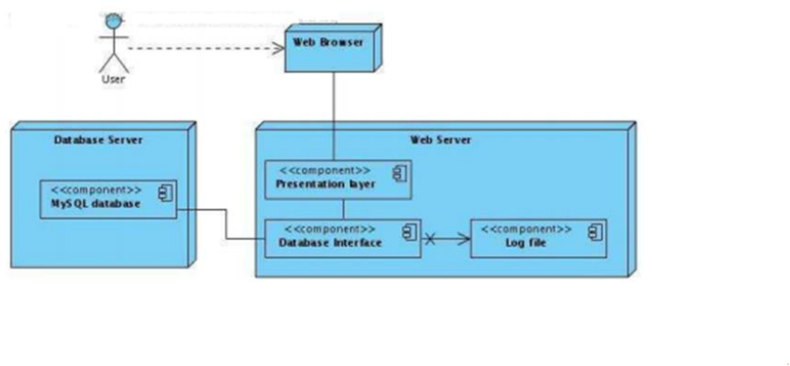

## 6. Způsoby modelování, vizualizace a dokumentace architektury softwarových systémů a programových rozhraní (API), související standardy. [KIV/SAR, (KIV/ASWI)]
- Okecávací, Jak API dělat - SOAP, REST, Gráfko

- preskriptivní architektura
  - zachycuje to, jak byl systém navržen před jeho konstrukcí
  - “as intended architecture”
- deskriptivní architektura
  - zachycuje to, jak by systém ve skutečnosti implementován
  - “as implemented architecture”

**Architektonický model**
- komplexní pohled na systém
- dokument obsahující veškerá designová rozhodnutí o systému
- má přesně popisovat architekturu (prescriptive/descriptive) a obsahovat i důvody, které vedly k rozhodnutím jak
  architektura vypadá
- mohl/měl by obsahovat:
  - komponenty
  - konektory
  - konfigurace
  - rozhraní
  - důvody učiněných rozhodnutí o architektuře
  - funkční a nefunkční aspekty
  - data flow
- různé pohledy (view)
  - RUP 4+1 View Model
  - je dobré pokud obsahuje více pohledů, ale nesmějí si obsahem odporovat
- způsoby popisu
  - přirozený jazyk
  - UML
  - jazyk pro popis architektury (ADL – Architecture Description Language)

**UML**
- grafický jazyk pro vizualizaci, specifikaci, navrhování a dokumentaci programových systémů.
- Diagramy struktury (structural)
- Diagramy chování (behavioral)
- Diagramy interakce

**Diagramy struktury**
- Diagram tříd (Class diagram)
  - vztahy na úrovni instance:
    - Asociace
      - představuje statický vztah sdílené mezi objekty dvou tříd
      - Nejčastějším typem asociace je binární asociace (se dvěma konci). Ta je obvykle reprezentována jako čára. Asociace však může propojit libovolný počet tříd. Asociace se třemi odkazy se nazývá ternární asociace. Samotná asociace může být v grafickém UML vzhledu pojmenována, mít přiřazena jména rolí, mohutnost, viditelnost či jiné další vlastnosti.
      - typy sdružení:
        - obousměrný
        - jednosměrný
        - agregaci
        - reflexivní
    - Agregace (v UML je znázorněn nevyplněným diamantem)
      - vyjadřuje slabší vztah mezi objektem a jeho částmi
      - Objektu reprezentujícímu celek se říká agregační (seskupený) objekt, jeho částem pak konstituční objekty (konstituenty).
      - vlastnosti:
        - Seskupený objekt může existovat bez svých konstitučních objektů.
        - Konstituent může být součástí více seskupení
      - příklad:
        - Faktura se skládá z jedné nebo více položek. V okamžiku, kdy faktura z nějakého důvodu zanikne, jsou nám k ničemu i položky pro tuto fakturu.
    - Kompozice/složení (v uml znározněna vyplněným diamantem)
      - Kompozice vyjadřuje silnější vztah mezi objektem a jeho částmi. Objektu reprezentujícímu celek se říká kompozitní (složený) objekt, jeho částem pak komponentní (složkové) objekty.
      - vlastnosti:
        - Složený objekt nemůže existovat bez svých komponent
        - Komponentní objekt může být součástí pouze jedné kompozice
      - příklad:
        - Faktura se skládá z jedné nebo více položek. V okamžiku, kdy faktura z nějakého důvodu zanikne, jsou nám k ničemu i položky pro tuto fakturu.
  - Vztahy na úrovni třídy
    - Dědičnost (v UML trojúhelník)
      - hierarchický vztah mezi třídami
      - Jeden ze dvou příbuzných tříd (podtříd), je považován za specializovaný druh druhého (super typu)
      - potomka je zároveň instancí rodičovské třídy
      - př.
        - Lidé jsou podtřídou opic, Ty jsou zase podtřídou savců atd. To znamená, že všechny opice jsou savci, mají jejich vlastnosti atd. Jsou zvláštní podtřídou savců a mají své specifické atributy, ale ty základní, dědí od své rodičovské třídy, tedy savců.
      

- Diagram komponent (Component diagram) 
  - znázorňuje komponenty použité v systému.
    - Checkout využívá službu, kterou nabízí CardProcessing
    
    

- Diagram nasazení (Deployment diagram)
  - zobrazuje zdroje/zařízení/stroje systému a komponenty/aplikace/služby/artefakty, které na nich běží. Vhodné např. pro popis distribuovaného systému
  
 
- Diagram balíčků (Package diagram) – mohou zobrazovat závislosti balíků, případně i jejich obsah
 
  

- Diagram objektů / instancí (Object diagram)
  - podobné class diagramu, ale s konkrétními hodnotami
  - Tím jak může mít třída více instancí, může být v diagramu (její instance) vícekrát

**Diagramy chování (behavioral)**
- Diagram aktivit (Activity diagram) – modelování procesů a workflow. Hlavní entity jsou aktivity/akce.
    
  
  
- Diagram užití (Use case diagram)
  - modelování interakce účastníků a systému
  - Systém je ohraničen, venku aktéři.
  
  

- Stavový diagram (State diagram)
  - souvislost s konečným automatem.
  - Hlavní entity jsou stavy (rozdíl oproti diagramu aktivit).
    

**Diagramy interakce**
- Sekvenční diagram (Sequence diagram) 
  - zachycuje komunikaci mezi prvky systému s důrazem na časovou posloupnost zasílaných zpráv.

  

- Diagram komunikace (Communication diagram)
  - zachycuje komunikaci mezi prvky systému
  - Podobá se sekvenčnímu diagramu.
  - Použití diagramu komunikace bývá vhodnější v těch případech, kde chceme ukázat hlavně kdo s kým komunikuje 
  - jsou méně vhodné pro zdůraznění časových souvislostí interakcí

**Architecture Description Language (ADL)**
- Formální způsob reprezentace architektur
- Určeny k tomu, aby byly čitelné jak pro stroj, tak pro člověka
- Zaměřují se na
  - strukturu – components, connectors, interfaces, configurations
  - analýzu – completeness, consistency, ambiguity, performance (simulacemi z m.)
- výhody
  - formální způsob popisu architektury
  - čitelné pro lidi i stroje
    - zaměřuje se na strukturu (komponenty, konektory, rozhraní, konfigurace) a analýzu analýza (kompletnost, konzistence, výkonnost)
  - automatické generování grafických diagramů
  - použití vlastních symbolů, které mají lepší vypovídající hodnotu
- Nevýhody
  - Nutná znalost, když lidé neznají => těžká komunikace
  - Omezená nabídka dostupných nástrojů
  - V byznysu nepříliš využívány
- Konkrétní jazyky: ACME, Rapide, AADL…
- **AADL** (Architecture Analysis and Design Language)
  - Umožňuje popis architektury složené z SW i HW komponent, včetně jejich interakce
  - Zejména pro systémy pracující v reálném čase a embedded systémy, kde je kladen velký důraz na spolehlivost
  - Zdá se aktuálnější a rozšířenější než ACME
- dále viz RUP 4+1

**Dokumentace programových rozhraní (API)**
- Lze přímo v kódu – Javadoc – z toho vygenerovat HTML dokumentaci
- WSDL (Web Services Description Languages)
  - pro popis rozhraní služby. Popisuje jména dostupných operací, typy jejich parametrů a návratových hodnot, a
    kde a jak je služba dostupná (HTTP/HTTPS/SMTP, port, stroj, URL). Vztah mezi SOAP službou a WSDL je asi jako
    mezi zkompilovanou C knihovnou a header souborem se seznamem funkcí v ní obsažených.
  - WSDL je jazyk založený na XML, obsahující tyto hlavní tagy:
    - \<types> definice datových typů
    - \<message> komunikační zpráva - odpovídá zavolání nebo návratu z funkce
    - \<portType> souhrn operací - odpovídá interface (Java) nebo header souboru C
    - \<operation> odpovídá metodě (Java) nebo funkci C
    - \<binding> definuje možný způsob přístupu různými protokoly
    - \<service> a \<port> pro každý \<binding> definují adresu na kterou se má příslušný protokol spojit
- Swagger
  - Framework pro návrh, dokumentaci, tvorbu, testování a generování REST API
  - definice API endpointů jako JSON nebo YAML soubor
  - dokumentace
  - testování API
- Apiary