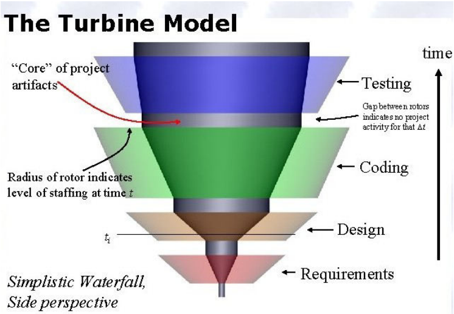
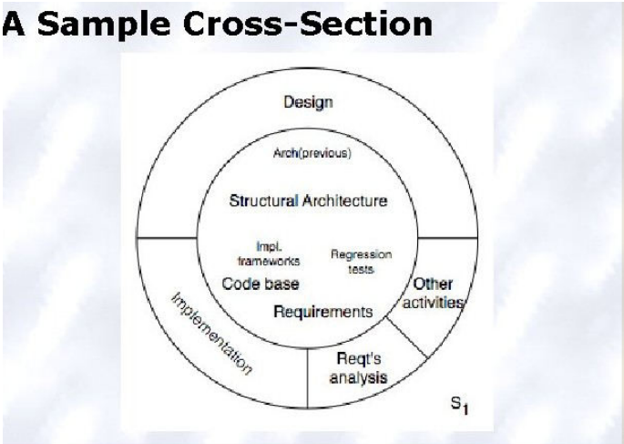
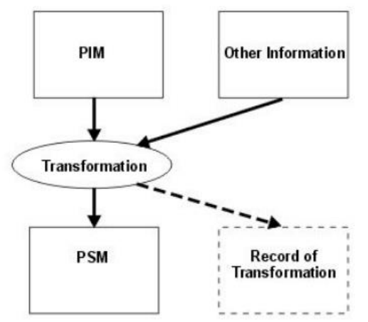

## 8. Role architektury v rámci vývoje software, vztah k dalším disciplínám a modelům vývoje. Principy vývoje software řízeného návrhem (MDA, MDD). [KIV/SAR,KIV/ASWII]
- Okecávací, obrázek vývoje SW doporučuje!

Architektura je množina zásadních rozhodnutí o softwarovém systému.
1. Každá aplikace má architekturu
2. Každá aplikace má alespoň jednoho architekta
3. Architektura není fáze vývoje
   - Zpracování architektury jako fáze popírá její základní roli při vývoji software.

Architektura je více než “vysokoúrovňový design”. Spíše je chápána jako centrální prvek návrhu a vývoje software.

**Turbínová vizualizace**
- Zobrazuje aktivity v daném čase
- tělo turbíny představuje množství projektových artefaktů
- rotor turbíny představuje úroveň a druh aktivit v daném čase
- pokud chceme získat pohled v daném čase t, provedeme řez turbínou
- Rostoucí tělo artefaktů, které se nabalují na architekturu
- Efektivní pro indikaci časů, mezer, trvání aktivit.
- poskytuje:
  - intuitivní náhled na projektové aktivity v průběhu času
  - rostoucí množství artefaktů (informační prostor projektu)
- Kontext softwarové architektury:
  - Požadavky
  - Návrh
  - Implementace
  - Analýza a testování
  - Vývoj (Evolution),
  - Vývojový proces

**Analýza požadavků**
- Nové produkty vycházejí ze sledování existujících řešení a jejich omezení.
- Poznatky z existujících řešení (architektur) pomáhají k představě toho, co
  může fungovat a pomáhá odhadnout vývojový čas a cenu vývoje.
- !! Analýza požadavků a zohlednění návrhu musí být prováděny ve stejnou dobu.
- Problém: před návrhem architektury je potřeba definice požadavku X požadavky mohou být odvozeny, když je známá
  architektura
- V praxi to často vede k klasickému modelu vodopádu: Nejprve jsou specifikovány požadavky, na základě kterých je
  architektura vytvořena. Tento postup vede k požadavkům, které například nelze s existující technologií realizovat;
  nebo na špatně výkonnou architekturu, která je sestavena z jednotlivých komponent a nedosahuje očekávání
  zúčastněných stran -> týká se asi hlavně mimofunkčních požadavků

Řešení v **Twin Peaks** modelu, který se zabývá vývojem architektury a požadavků softwarového systému.
- architektura a požadavky jako dva vrcholy
- iterativně se vzájemně rozvíjí
- vrcholy jsou výchozí body a postupuje se směrem dolů
- viz KIV/VS #4

**Design a architektura**
- Návrh je aktivita, která prostupuje softwarovým vývojem a vytváří část architektury systému.
- Obvykle se jedná o tradiční rozhodnutí o fázi návrhu, které zahrnují:
  - strukturu systému
  - identifikaci jeho primárních komponent
  - jejich propojenní
- Architektura označuje soubor hlavních návrhových rozhodnutí o systému ⇒ více než jen struktura
- **Architecture-Centric design**
  - Klade větší důraz na architekturu. Zaměření na věcný, věrný architektonický model
  - Tradiční fáze návrhu navrhuje převedení požadavků na algoritmy, takže programátor je může implementovat
  - Architecture-centric design:
    - problémy stakeholderů
    - rozhodnutí ohledně použití COTS komponent (Commercial off-the-shelf)
    - zastřešující styl a struktura
    - struktura balíčku a primárních tříd
    - problémy při vývoji
    - problémy po vývoji / implementaci
- Základní techniky: Separation of concerns, Abstrakce, Modularita
- Návrh může ovlivňovat i doména jako např. DDSA (Domain-specific software architecture):

**Implementace**
- Cílem je vytvořit spustitelný zdrojový kód.
  - všechny prvky struktury nalezené v architektuře jsou implementovány ve zdrojovém kódu
  - zdrojový kód nesmí používat významné nové výpočetní prvky, které nejsou definovány v architektuře
  - zdrojový kód nesmí obsahovat nové vazby mezi architektonickými prvky, které se v architektuře nenacházejí
- Alternativně se může do určitě míry adaptovat architektura (otázka jak moc, relevantní / nerelevantní)
- Strategie:
  - Generativní techniky - parser generators
  - Frameworky - převzetí typických problémů dané oblasti, čímž se usnadní vývoj tak, aby se návrháři a vývojáři
    mohli soustředit pouze na své zadání
  - Middleware - CORBA, DCOM, RPC
  - Reuse-base techniky - COTS, open-source
  - Psaní celého kód manuálně
  - V poslední době i Outsourcing

**Analýza a testování**
- analýzy a testování jsou činnosti prováděné za účelem zhodnocení kvality artefaktu
- čím dříve odhalím chybu tím je levnější ji odstranit
- Analýza modelů architektury
  - formální architektonický model může být zkoušen pro vnitřní konzistenci a správnost
  - tato analýza může odhalit:
    - component mismatch (nesoulad komponent)
    - nekompletní specifikace
    - nepotřebné komunikační vzorce
    - deadlocks / bezpečnostní nedostatky
  - může být použita pro odhad velikosti a časového rozvrhu
- např. Proof of Concept, Proof of Technology

**Evoluce a údržba**
- všechny činnosti, které chronologicky sledují vydání aplikace
- software se bude vyvíjet (bez ohledu na to, zda se jedná o vývojový proces orientovaný na architekturu či nikoliv)
- tradiční přístup k údržbě softwarového inženýrství je z velké části ad hoc ⇒ riziko architektonického úpadku a celková
  degradace kvality
- architecture-centric přístup =Trvalé zaměření na explicitní, věcný, modifikovatelný, věrný architektonický model

**Degradace architektury**
- Architektura může být
  - preskriptivní 
    - návrhová rozhodnutí učiněná před konstrukcí systému (as-intended, as-conceived) - jak to bylo zamýšleno že se to udělá 
    - zachycuje to, jak byl systém navržen před jeho konstrukcí
  - deskriptivní 
    - popisuje, jak byl systém skutečně konstruován (as-implemented, as-realized) tzn. popisuje jak
      systém ve skutečnosti existuje (jak je naprogramován)
    - zachycuje to, jak by systém ve skutečnosti implementován
- Degradace architektury
  - Architektonický drift - Zavedení zásadních designových rozhodnutí do deskriptivní architektury, které nejsou
    zahrnuty (nejsou součástí) preskriptivní architektury, ale které ji neporušují.
  - Architektonická eroze 
    - v systému je něco co je v rozporu v návrhu
    - Zavedení designových rozhodnutí do deskriptivní architektury, které ale porušují
    preskriptivní.

**Principy vývoje software řízeného návrhem**
- Model Driven Development (MDD)
  - MDD je vývojové paradigma, která používá modely jako primární artefakt vývoje. Obvykle je v MDD
    implementace (semi) automaticky generována z modelů do takové míry, do jaké to umožňuje použitá sada
    nástrojů.
- Model Driven Architecture (MDA)
  - důležité je rozdělit implementaci a business logiky
  - Hlavní myšlenkou je oddělit business a aplikační logiku od technologické platformy
  - To, co MDA přináší nového, jsou postupy a způsoby, jak tyto modely správně transformovat.
  - Primárními cíli tohoto přístupu jsou zajištění přenosnosti, interoperability (součinnosti) a znovupoužitelnosti díky oddělené architektuře.
  - Celkově MDA přináší výhodu v podobě snadné přenositelnosti aplikace mezi jednotlivými platformami a
    dokonce umožňuje křížit jednotlivé platformy, pokud to architektura aplikace dovoluje nebo vyžaduje.
- PIM (Platform Independent Model)
  - reprezentuje business funkcionalitu a chování, přenositelná, nezávislá na technologiích a prostředcích
- PSM (Platform Specific Model)
  - model specifikace MDA, který je závislý na cílové platformě. Kombinuje PIM s konkrétním technologickým
    řešením (.NET, Java EE, Corba..).
  - Odráží strukturu kódu a je dostatečným podkladem pro implementaci - vizualizace kódu na stejné úrovni
    abstrakce. Např. třídy specifické pro danou platformu, které dovolují komunikovat s balíkem běžně
    dodávaných vývojovou platformou.

**Transformace**
1. začíná se s PIM
2. MDA tool aplikuje standardní mapování k vygenerování PSM z PIM
3. kód je částečně automatický, částečně ručně psaný
4. MDA tool generuje celý nebo většinu implementačního kódu v technologii zvolené programátorem

**Rozdíly od “klasických” architektur:**
- Vývoj MDA se zaměřuje na funkčnost a chování systému
- Odstíněná od platformy nebo platforem, na kterých bude implementována
- Odděluje podrobnosti o implementaci z business funkcí
- Ostatní architektury jsou obecně vázány na konkrétní technologii
- S MDA jsou funkce a chování modelovány pouze jednou
- Mapování z PIM přes PSM na podporované platformy MDA je implementováno pomocí nástrojů
- Stručně, zjednodušeně: “V podstatě z UML umí vytvořit spustitelný kód”
- 