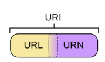
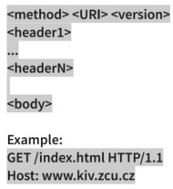
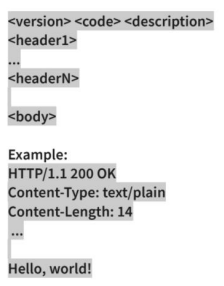

## 9. Architektonické principy, standardy a technologie tvořící technický základ WWW, vývoj v této oblasti, důsledky pro tvorbu webových aplikací. [KIV/PIA]
- méně pravděpodobné - Co je to web? Na čem je založený, URI, hypertextové odkazy, HTTP, HTTPS

**World Wide Web**
- označení pro množinu webových stránek/dokumentů, ke kterým se přistupuje většinou pomocí webových prohlížečů v
  rámci internetu
- architektura klient-server, decentralizace
  - backend × frontend
  - server = přijímá požadavky, generuje odpovědi
  - klient = generuje požadavky, přijímá odpovědi
  - jako klient a server se může chovat i jedno zařízení
  - musí spolu umět komunikovat - používat stejný komunikační protokol
  - různý SW používá různé protokoly
    - WebServer - HTTP(S)
    - MySQL - binárka přes TCP/IP
    - webová aplikace - SOAP přes HTTP(S)
- použití 3 základních technologií
  - hypertext = provázání textů skrze odkazy
  - URI (URN + URL) = jedinečná identifikace zdroje
    - příklad:
      - URL - Uniform resource locator
        - identifikace serveru v rámci internetu
        - https://github.com
      - URN - Uniform resource name
        - identifikace zdroje v rámci serveru 
        - /silhavyj/KIV-Final-State-Exams/blob/main/SA/09.md
      - URI
        - jednoznačná identifikace zdroje v rámci internetu
        - https://github.com/silhavyj/KIV-Final-State-Exams/blob/main/SA/09.md
    - klíčový prvek vyjadřující architekturu webu
    - unikátní adresa
    - struktura: scheme = přístupový mechanismus (http, file, ftp, mailto,data)
      - scheme:[//[user:password@]host[:port]][/]path[?query][#fragment]
        - URL = Uniform Resource Locator = spec. případ URI - konkrétní reprezentace (např.
          /neco.html místo /neco)
        - URI VS URL
          - URI je nejobecnější z několika příbuzných typů identifikátorů
          - URL primárně způsob, jakým se lze ke zdroji dostat
  - HTTP protokol pro přístup ke zdrojům
- 

**Technologie tvořící základ WWW**
- spolehlivý přenos dat - TCP
- dodací protokoly - HTTP
- obsahové formáty - HTML, XML, …
  - HTML – od roku 2013 
    - důležitá verze: HTML5 – sémantické elementy (header, footer, article, nav...)
    - správně by v HTML dokumentu měl řešit pouze obsah a v CSS jeho vzhled (viz SoC)
  - CSS – vzhled HTML dokumentu
  - XML, JSON
- indikace formátu - MIME
- zabezpečení, šifrování - SSL, TLS
- dynamický obsah – JavaScript, WebAssembly, SOAP, flash…
- Web APIs – Web Storage API (local storage), Geolocation API, Web Workers API…

**HTTP - Hypertext Transfer Protocol**
- textový protokol pro přenos html souborů
- je bezstavový - pořadí požadavků by na sebe nemělo mít vliv
- je starý
  - díky tomu není vhodný pro dnešní výkon
  - nemusí se řešit hromada věcí
- jak funguje?
  1. klient pošle požadavek na server
  2. server mu odpoví s odpovědí
- HTTP v1.1
  - vytváří se jedno TCP spojení pro každý soubor, který je potřeba stáhnout
- HTTP v2
  - v rámci jednoho TCP spojení dokáže stáhnout více souborů najednou
  - problém je, že TCP musí kontrolovat, jestli došlo k přijetí všech souborů
- HTTP v3
  - řeší tento problém tak, že se místo TCP spojení použije UDP
  - problém je zde už přímo v protokolu UDP, který nekontroluje úspěšnost přenosu

**HTTP požadavek**
- textová zpráva, která je odeslána na server
- obsahuje hlavičku, tělo, cookies
- klient a server musí podporovat stejné protokoly
- Metody HTTP
  - GET 
    - Požadavek na uvedený objekt se zasláním případných dat (proměnné
      prohlížeče, session id, …)
    - výchozí metoda při požadavku na zobrazení hypertextových stránek, RSS feedů aj.
    - celkově nejpoužívanější.
  - HEAD 
    - Metoda podobná GET, avšak nepředává data a nezískává obsah stránek
    - poskytne pouze metadata o požadovaném cíli (velikost, typ, datum změny, typ obsahu, datum a čas vytvoření).
  - POST 
    - Odesílá uživatelská data na server
    - opětovné posílání požadavku může mít odlišné výsledky (není idempotentní)
    - Používá se například při odesílání formuláře na webu
    - S předaným objektem se pak zachází podobně jako při metodě GET
    - Data může odesílat i metoda GET
    - metoda POST se však používá pro příliš velký objem dat (víc než 512 bajtů, což je velikost požadavku GET), nebo pokud není
      vhodné přenášená data zobrazit jako součást URL (data předávaná metodou POST jsou obsažena v HTTP požadavku).
  - PUT 
    - pro aktualizaci nebo vytvoření nového zdroje pokud neexistuje
    - opakované posílání by nemělo mít žádný dodatečný efekt (je idempotentní)
    - Nahraje data na server
    - Objekt je jméno vytvářeného souboru
    - používá se velmi zřídka, pro nahrávání dat na server se běžně používá FTP nebo SCP/SSH.
  - DELETE 
    - Smaže uvedený objekt ze serveru. K tomu je zapotřebí jistých oprávnění stejně jako u metody PUT.
  - TRACE 
    - Odešle kopii obdrženého požadavku zpět odesílateli, takže klient může zjistit, co na požadavku mění nebo přidávají servery, kterými požadavek prochází.
    - používá se pro diagnostické účely
  - OPTIONS 
    - Dotaz na server, jaké podporuje metody, možnosti a vlastnosti komunikace s daným zdrojem a další metadata (povolené hlavičky např.)
    - zjistí např. konfigurace CORS (Cross-Origin Resource Sharing)
  - CONNECT 
    - Spojí se s uvedeným objektem přes uvedený port. Používá se při průchodu skrze proxy pro ustanovení kanálu SSL.
- nejčastěji používané hlavičky jsou
  - host - (povinný) hostname dotazovaného serveru a klidně i port
  - origin - hostname serveru, ze kterého se posílá požadavek
  - content-type - typ média (text/html, application/json, image/jpeg)
  - accept - typy médií, které klient může zpracovat
  - authorization - autentizační údaje pro přístup ke chráněným zdrojům
  - content-lenght - délka obsahu těla
  - Cookie - Obsahuje HTTP cookies, které byly předchozím požadavkem odeslány klientovi a které by měl klient při dalších požadavcích odeslat zpět serveru.
  - 

  
**HTTP odpověď**
- Stavy - jednotlivá čísla se používají pro konkrétní případ
  - 1xx - informační
  - 2xx – úspěšné vyřízení požadavku - 200 OK, 201 Created
  - 3xx – přesměrování (např. problémy) - 301 Moved permanently, 304 not modified
  - 4xx – chyby související s vyřízením požadavku (stránka není dostupná, apod.)
    - 401 Unauthorized, 403 Forbidden, 404 Not Found
  - 5xx – interní chyby serveru
    - 500 Internal Server Error, 501 Not Implemented, 502 Bad Gateway
- Hlavičky
  - Location - používá se v odpovědích s kódem přesměrování (např. 301 nebo 302) a obsahuje URL, na kterou by měl klient přesměrovat svůj požadavek
  - Content-Type
  - Content-Length
  - 

  
**HTTPS**
- Šifruje obsah komunikace včetně URL
- Zvenčí je vidět pouze IP a může být vidět i doména/server name (protože na jednom serveru může být více webů – virtual hosts)
- Používá SSL (nebo novější TLS)
- Pomocí asymetrické kryptografie je ověřena identita webového serveru. Poté následuje dohoda na klíči pro symetrické
  šifrování samotné komunikace
- Pro SSL a TLS je zásadní infrastruktura veřejného klíče a X.509 certifikáty, díky nimž probíhá autentizace.
- Většina certifikačních autorit vystavuje certifikáty na komerční bázi, avšak existují i certifikační autority vystavující
  certifikáty bezplatně jako například Let's Encrypt

**Historický vývoj**
  - 1962 – ARPANET - síť ministerstva obrany USA
  - 1970s – vytvoření TCP/IP
  - 1980s – ARPANET přechází na TCP/IP, je rozdělen na vojenskou část a část pro vědecké účely (univerzity a firmy) a
    později vzniká pojem Internet
  - 1990 – vytvoření WWW – Tim Berners-Lee, který jej vytvořil při svém působení v CERNu. Navrhl jazyk HTML a protokol
    HTTP, napsal první webový prohlížeč World Wide Web a spustil první webový server
  - 1994 založeno World Wide Web Consortium (W3C), které dohlíží na další vývoj Webu

**Důsledky pro vývoj webových aplikací**
- Webová aplikace = aplikace přístupná pomocí webového prohlížeče (model klient server)
- Vývoj web. aplikací omezovaly:
  1. Dostupné technologie (nejprve jen HTML -- pouze značkovací jazyk)
  2. Webové prohlížeče a jejich podpora
  3. Platforma (původně jen PC, nyní smartphone, tablet, notebook, televize)
- Původně se web stavil jen na statických HTML stránkách (v podstatě dokumenty)
- postupně se přetvářel v novou platformu pro vývoj aplikací:
  - HTML formuláře
  - ASP, PHP, … (generování dynamického obsahu)
  - interaktivita - Javascript, DHTML, Java applety, ActiveX
  - Propojení s databází (kvůli perzistentnímu ukládání)
- Přišla nutnost oddělení obsahu webové stránky a vzhledu (použití CSS)
- S vývojem se musela vyvíjet současně i bezpečnost (šifrování, autentizace, přihlašování uživatelů, …)
- Postupně se stále více a více funkcionality (kontrola formuláře před odesláním na server, atp.) přenáší na
  stranu klienta do prohlížečů
- S příchodem různých Javascriptových knihoven (AJAX, JQuery, …) se zvýšila interaktivita (asynchronní
  zpracování bez nutnosti reloadu či tvorba uživatelského rozhraní)
- Díky chytrým telefonům se vyvinula potřeba psát webové aplikace responzivní
- Nyní je možné pomocí HTML5 např. vkládat do stránky i multimédia
- Vyvinuly se i moderní javascriptové frameworky či platformy pro tvorbu aplikací (AngularJS, React)
- S přístupem sociálních sítí se vyvinul i web 2.0 a mashupy, kdy je statický obsah webových stránek nahrazen
  dynamickým, který vkládají sami uživatelé.