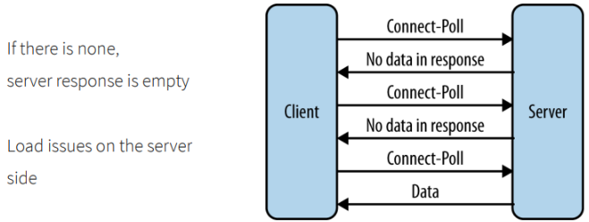
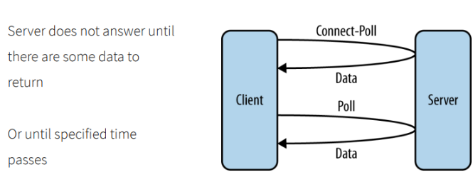
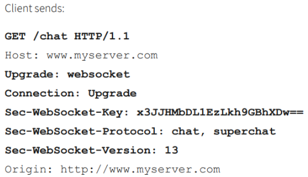
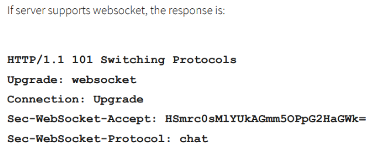
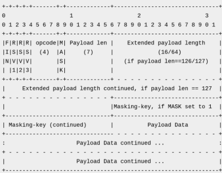
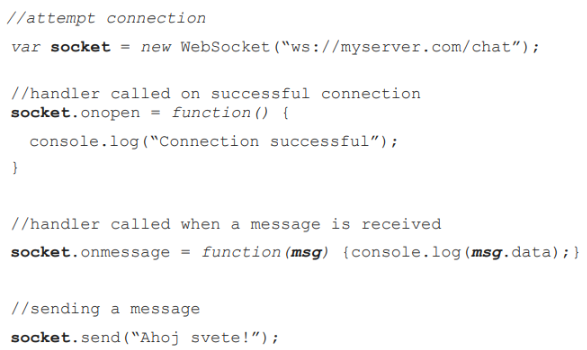

## 10. Protokoly pro komunikaci a přenos dat mezi klientskou a serverovou částí webu, řešení zabezpečení a udržování sezení (session), základní funkčnost webového serveru. [KIV/PIA, (KIV/UPS, KIV/WEB)]
- Hodně pravděpodobný
- Co je session a k čemu je, HTTP bezstavovost, jak se stav řeší pomocí cookie a session, co to je a jak souvisí s session ID,
  že se cookie dá manipulovat na klientovi (že musí ty informace být na serveru aby s tím nešlo manipulovat), stavové
  kódy
- viz. [9# HTTP/S](09.md)

**Session**
- session řeší problém bezstavovost protokolu HTTP
- drží informace o stavu aplikace a o uživateli
- session umožňuje předávání parametrů, které bychom jinak museli zobrazovat v URL
- data v session jsou fyzicky uložena na serveru a nepřenášejí se ke klientovi - na rozdíl od cookies


**Předávání session**
- Session je v HTTP předáváno dvěma nejrozšířenějšími způsoby:
  - v URL cílové stránky – jako její proměnná
  - jako HTTP cookie
- Z hlediska skriptovacích jazyků pro programování internetových aplikací, session představuje množinu proměnných
  (někde přístupnou přes sadu funkcí, jinde přes globální proměnnou), které dovolují uchovávat hodnoty, které jim byly
  nastaveny, po dobu připojení (tj. se znovunačtením stránky se neztratí).
- Například, v jazycích ASP a ASP.NET jsou přístupné automaticky jako jednotlivé prvky pole Session("klíč"), v PHP pak
  pod tzv. superglobálním polem $_SESSION["klíč"]
- V obou příkladech lze do session ukládat „jednoduché“ typy (celá čísla, racionální čísla, řetězce, null) i z nich 
  složená pole (teoreticky libovolné složitosti)
- Hodnoty se ukládají tzv. serializované (převedené na řetězec podle formátu, ze kterého jej lze zpětně načíst (přibližně jako třeba JSON)).


**Cookies**
- zavadeji stavovost do jinak bezstavoveho protokolu
- klient odesila cookie spolu s requestem 
  - server vi ze se jedna o daneho klienta a nacte jeho session (napr z distribuovane cache v pripade horizontalniho skalovani)
- cookie obsahuje session ID
- způsob, jakým se dají ukládat data na straně klienta
- hlavní použití
  - správa relací
  - sledování uživatelů
  - personalizace stránek
- obvykle se používá ve spojení se stavovými aplikacemi - např. identifikátor relace
  - server přijme Session ID skrz Cookies
  - použije ho k vyhledání uživatelských dat
- bezpečnostní riziko (ukradení cookie) a jen v případě HTTP a ne HTTPS
- pokud jsou nastaveny, automaticky se přikládají do hlavičky
- jsou nastavovány přes HTTP hlavičku


**Cookies - princip**
- pro vytvoření session server vygeneruje session id. Spravuje si tabulku/mapu aktivních sessions a jejich ids. Pomocí
  nich bude identifikovat uživatele.
- Set-Cookie: name=value [;EXPIRES=dateValue] [;DOMAIN=domainName] [;PATH=pathName][;SECURE]
- name např. sessionID, value náhodné id…
- klient je uloží v prohlížeči a pak při přístupu na stránku…
- klient v požadavku posílá všechna cookie, která
  - jsou určena pro doménu požadovaného serveru
  - mají cestu, která souhlasí s URI požadavku (konkrétnější před obecnějším)
  - maximální velikost všech cookie 4 KB


**Cookies - atributy:**
- Expires - jak dlouho je cookies platná
- Domain - doménové jméno, pro které je platná (např pro zcu.cz se nepoužije když půjdu na FB)
- Path - podprostor URN pro který je platná (cesta pro kterou se cookie má odesílat)
- Secure - při nastavení posílá cookie jen zabezpečeným kanálem (odesli pouze pokud se jedna o HTTPS)
- Max-Age - počet sekund po kterých je cookie expired
- HttpOnly - zakazuje JavaScriptu přístup k cookie a její hodnotě
- klient posle vsechny cookie pokud sedi domena, cesta, nevyprsela doba platnosti a pripadne se jedna o HTTPS (ne jen HTTP)
- klient odesílá cookies pokud:
  - jsem nastaveny pro doménu serveru 
  - jejich cesta se shoduje s požadovanou cestou
  - požadavek je přenášen bezpečným kanálem (cookie nastavena jako SECURE)


**HTML WebStorage API**
- alternativa místo cookies
- dovoluje ukládat data uvnitř prohlížeče
- oproti cookies, data nejsou poslána na server při každém požadavku
- je přístupné přes API JavaScriptu
- **Session storage:**
  - ukládá data pro jednu sessionu - dokud není karta prohlížeče uzavřena
  - dovoluje využít větší úložiště než cookies (alespoň 5 MB)
- **Local storage:**
  - ukládá data, dokud nejsou smazána (JavaScript, Clean Browser Cache/Local Data)
  - většinou větší úložiště než Session storage
  ```
        Window.localStorage
        sessionStorage.setItem('key', 'value');
        let data = sessionStorage.getItem('key');
        sessionStorage.removeItem('key');
        sessionStorage.clear();
  ```


**WebSocket**
- server jinak posílá zprávu klientovi jen pokud od něj přijde požadavek
- klient se jinak musí periodicky ptát na nové info - při více uživatelů se může zahltit server
  - Polling
    - klient často posílá požadavek na data a server hned odpoví zda má nebo ne
    - 
  - Long-Polling
    - odpoví pokd bude mít co poslat klientovi nebo vyprší timeout a pošle že nic nemá co by poslal
    - neýhoda že spojení drží než odpoví klientovi
    - 
- komunikační protokol pro obousměrnou komunikaci
  - zprávy mohou být zasílány oběma směry zároveň

- Založen na TCP - Podporován většinou moderních prohlížečů (HTML5)
- navázání spojení pomocí HTTP protokolu (ws:// nebo wss:// (secure))
- používá stejný port jako HTTP (80 a 443 pro HTTPS)
  - není potřeba mít otevřené extra porty na firewallu
- Client
  - 
- Server
  - 
- HTTP handshake successfull - změní se spojení z HTTP na WebSocket (na stejném TCP spojení)
- jediný vztah k HTTP je, že jeho handshake (navázání spojení) je interpretovaný jako HTTP
  1. Klient pošle GET /chat HTTP/1.1 na známého hosta s websocket key a protokolem (explicitně definován např.
     chat)
  2. Když server podporuje tento websocket posílá zpět HTTP/1.1 101 Switching Protocols s accept key a daným
     protokolem
  3. Tím pádem bylo spojení navázáno pomocí HTTP handshake a protokol je přepnut z HTTP do WebSocket
     (obousměrně)
- **Ukázka zprávy**
   
  - FIN (1 bit) - indikuje zda je to poslední zpráva a může celou zprávu zpracovat nebo čeká až dojde celá
  - RSVx (1 bit) - rezerovaný pro rozšíření protokolu (defaultně nastavený na 0)
  - opcode (4 bity) - typ framu
    - 0x01 – UTF-8 data
    - 0x02 – binary data
    - 0x00 – continued payload
  - mask (1 bit) - zpráva může být zamaskovaná
  - Payload length
    - 0 - 125 indikuje délku payloadu
    - 126 - hodnota ukazuje zda následujcí 2 byte indikují délku (při posílaní více dat)
    - 123 - hodnota ukazuje zda následujcí 8 byte indikují délku (při posílaní ještě více dat)
  - Payload data - skutečná poslaná data
- **Průběh komunikace**
  - první rámec pošle typ dat (binárka, text) obsah v opcode
  - dále přijmá rámce a ukládá do cache dokud nepřijde poslední (FIN == 1) a celou zprávu zpracuje

- **Heartbeat**
  - obě strany se musí ptát, jestli tam ta druhá strana ještě je (ping - pong)
  - nejlépe ještě předtím než dojde k odeslání dat
  - obsahuje aplikační data
  - při odpovědi je odeslána zpráva pong (opcode 0xA), která musí obsahovat stejná data jako zpráva ping
  - posílají se periodicky nebo před odesláním zprávy
- **Ukončení spojení**
  - při ukončení spojení je dobré informovat druhou stranu že ukončuji spojení
  - obě strany mohou ukončit spojení (opcode 0x08)
    - může obsahovat i důvod
- ukázka
- 


**RESTful WebService - Representational State Transfer**
- sada pravidel jak navrhovat API aby se dobře používalo
- architektonický vzor pro webové služby (není to protokol jako SOAP)
- cílem je vytvořit rozhraní (API), které se snadno používá
- orientovaný na zdroje
  - koncové body jako /posts, /users, /categories, …
- explicitní použití HTTP metod - GET, PUT, DELETE, …
- pro odesílání lze použít jakýkoliv standardní serializovatelný formát, - XML, JSON (zabírá méně místa než XML), YAML
- bezstavový
- identifikace pomocí URI (běžné odkaz na webu)
  - http://ww.blogysek.com/authors
- struktura podobná adresáři
  - http://ww.blogysek.com/authors
  - http://ww.blogysek.com/authors/{id}
  - http://ww.blogysek.com/authors/{id}/articles
- Operace
  - GET (čtení, dotazování)
  - DELETE (odstraňování)
  - POST (vytvoření, aktualizace dat)
  - PUT (vytvoření, aktualizace dat)
  - OPTIONS (seznam všech povolených metod)
  - PATCH (částečná úprava zdroje - např. pouze jméno)
  - **POST vs. PUT**
    - obě metody mohou být použity pro vytvoření nebo aktualizaci zdroje
    - POST
      - když neznáme přesné umístění zdroje (POST /posts/ HTTP/1.1)
      - při opakovaném odesílání stejného požadavku, není zaručen stejný výsledek
    - PUT
      - když známe přesné umístění zdroje (PUT /posts/12 HTTP/1.1)
      - při opakovaném odesílání je zaručen vždy stejný výsledek


**HTTP Proxy**
- requesty skoro vzdy jdou skrze nejakou proxi
- Forward
  - requesty do externi site
  - nahrazuje IP addr zroje svoji IP
  - dovoluje restrikci kam se uzivatel pripojuje (napr z firemni site)
  - client → proxy → internet
- Reverse
  - requesty z externi site
  - slouzi napr jako load balancer
  - jeden vstupni bod pro celou sit
  - client → internet → proxy → content server
- proxy nahrazuje IP odesilatele svoji vlastni IP adresou
  - nechtene napriklad pri debuggovani
  - nebo napri kdyz je proxy v jinem state a my chceme obsah pro CR
- informace o odesilateli se predavaji v HTTP hlavicce
```
  Forwarded: by=<identifier>;for=<identifier>;host=<host>;proto=<http|https>

  X-Forwarded-For   - puvodni IP klienta
  X-Forwarded-Host  - puvodni IP kam se klient chtel pripojit
  X-Forwarded-Proto - protokol
```

**Webový server**
[detailněji viz. #12](12.md)
- pojmem webový server se rozumí počítač, na kterém běží tvz. démon (případně jen program samotný)
- je odpovědný za vyřizování požadavků HTTP od klientů (webových prohlížečů, desktopových aplikací, mobilních
  aplikací, …)
  - vyřízením požadavku se rozumí odeslání cíle specifikovaného URI (typicky webová stránka u “server side
    render” technologií).
- Webový server může obsluhovat služby typu REST, SOAP, WebSocket, atd…
- Web server je obvykle implementován pomocí tzv. pool (více vláken), který umožňuje zpracovávat více požadavků ve
  více vláknech. Pokud bude víc requestů než je server schopen obsloužit, budou zařazeny do fronty
