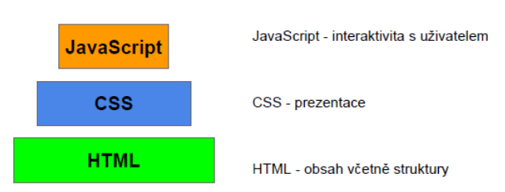

## 11. Struktura klientské části webových systémů, technologie webových stránek pro prezentační a aplikační weby. Zásady pro tvorbu stránek (přístupnost, SEO, ...). [KIV/PIA , (KIV/WEB)]
- HTML5, XHTML, PHP, NodeJS, PHP na serveru, JavaScript na klientovy, nodeJS asi na serveru, ale typicky je to primárně
  JS na klientovi a backend na serveru, proč chyták - úspora trafficu (lepší když si jen dotahuje data z serveru a klientská
  appka běží celá na klientovi).

- struktura klientské části závisí na tom, v čem jsou napsaný
- pokud se jedná o jednoduchý prezentační webík, nemá většinou žádnou strukturu
- pokud se však jedná o složitou aplikaci v Reactu, má často velkou strukturu a logiku
  - Například React se skládá z jednotlivých komponent, které spolu případně komunikují pomocí tzv. props si
    předávají data a mají vlastní stav (state)

**Základní rozdělení**
- Server Side Render
  - render probíhá na serveru a posílá klientu celou HTML stránku včetně dat
  - když uživatel něco provede, musí se celá stránky znovu na serveru vyrenderovat ⇒ horší odezva na vstupy
  - historicky
- Client Side Render
  - HTML se generuje až u klienta, data získává pomocí asynchronního JS (AJAX) – React, Vue, Angular, …
  - lepší odezva na vstupy uživatele
  - může v nějakém režimu fungovat offline
  - trend
- kombinace obou
- 

**Prezentační weby**
- jsou jednoduché typy webů, které zobrazují statické informace a jsou neměnné. Například různé prezentace životopis,
  portfolia, atd…
- technologie: HTML 5 + CSS, jednoduché funkce z JS pro hezčí vizuální podobu (menu, atd…)
- pro statický web může stačit hotový web server jako nginx
- nejčastěji => Server-Side render

**Aplikační (dynamické weby) – webové aplikace**
- obsah dynamicky měněn – častěji proto client side render nebo kombinace
- často nutné zabezpečení – session, složitější logika
- technologie: HTML, CSS, PHP, JS, JAVA… 

**HTML, XHTML a HTML 5**
- HTML - textový dokument s html značkami
- XHTML - vychází z xml a přináší řadu omezení oproti html - např. uzavírání značek
- HTML 5 - nejnovější verze html přidávající mnoho různých “vychytávek”
- …. pouze různé verze značkovacího jazyka

**HTML5**
- standardní značkovací jazyk používaný ke strukturování a prezentaci obsahu
- jedná se o revizi předchozích standardů HTML a zavádí několik nových funkcí a vylepšení.
- mezi klíčové vlastnosti HTML5 patří:
  - sémantické prvky - \<head>, \<nav>, \<footer>, …
  - podpora multimédií - nativní podpora zvukových a video prvků
    - umožňuje vkládat multimediální obsah přímo do web. stránek bez závislosti např. na flashi
  - zavedení canvasu - možnost kreslení grafiky, animací, …
  - vylepšené formuláře - datum, email, číselné pole, lepší validace, …
  - možnost pracovat offline - zavedením cache paměť dovoluje pracovat offline
  - možnosti ukládání dat do localStorage a sessionStorage

**CSS (Cascading Style Sheets)**
- stylovací jazyk používaný k popisu prezentace dokumentu napsaného v jazyce HTML
- umožňuje vývojářům webových stránek definovat vizuální vzhled a rozvržení webových stránek
- oddělení obsahu (html) od jeho vzhledu (css)
- 1 css soubor může popisovat vzhled celého webu
- Kaskádové styly - styly se kaskádovitě přepisují
  - obecná pravidla lze přepsat přesnějšími pravidly

**PHP**
- Interpretovaný programovací jazyk
- Určený především pro programování dynamických internetových stránek.
- Kód lze vložit přímo do HTML.
- dynamicky typový, tzn. že datový typ proměnné se určí v okamžiku přiřazení hodnoty
- PHP skripty jsou prováděny na straně serveru.
- K uživateli je přenášen až výsledek jejich činnosti. = např. HTML
- Nezávislý na platformě, skripty fungují bez úprav na různých operačních systémech
- Rozsáhlé knihovny funkcí pro zpracování textu, grafiky, práci se soubory
- Přístup k většině databázových serverů např. přes PDO
- Podpora celé řady protokolů (HTTP, SMTP, SNMP, FTP, IMAP, POP3, LDAP)
- Kombinace LAMP – Linux + Apache + MySQL + PHP – často používána k tvorbě webových aplikací

Zásady pro tvorbu stránek (přístupnost, SEO, ...)
  - Navigace – cílený postup stránkami za účelem dosažení (konkrétního nebo postupně vytvářeného) místa nebo cíle
  (dobrá navigace ⇒ opakovaná návštěvnost)
  - **Přístupnost** 
    - na stránce je možné se navigovat i na malých obrazovkách (responzivnost), pomocí klávesnice a čtečky
      obrazovky (nutno zajistit alternativní text pro všechny netextové prvky, pořadí procházení prvků kurzorem/focusem...),
      vhodné barvy (barvoslepí)...
  - Použitelnost
    - srozumitelné uspořádání, jasný text
    - přehledné dialogy, formuláře vyhledávání
    - responzivnost – dříve varianty pro cílová zařízení (optimalizace pro telefony...)
    - textové alternativy k netextovým informacím (obrázky, mapy, média, skripty; prvky formulářů; samostatná txt
      stránka)
    - změny obsahu a zobrazení jen na vyžádání uživatele (pop-up okna, navigace, reload, pohyblivé obrázky, flash,
      spusť animaci)
    - navigace je jasná a logická – pravidlo 3 vteřin (název stránky, menu, odkazy (title), formuláře, tabulky)
    - odkazy podtržené, odkazy na ne-HTML zdroje jasně označeny
    - text je srozumitelný, krátký, tématický, strukturovaný
    - HTML je validní, přednost má HTML + CSS vzhled
- **Seo - Search Engine Optimization**
  - označení metody pro vytváření a upravování webových stránek tak, aby jejich forma a obsah byly vhodné pro
    automatizované zpracování v internetovém vyhledávači
  - cílem SEO je získat ve vyhledávačích lepší pozici (lepší návštěvnost)
  - internetový vyhledávač za pomoci botů (nebo též crawlerů, robotů) stahuje v různých časových periodách
    obsah webových stránek a dalších dokumentů, které pak analyzuje, indexuje a ukládá do databáze.
  - Metody SEO
    - kvalitní a unikátní obsah
    - používání (X)HTML značek (tagů) podle normových předpisů
    - používání titulku, nadpisů a popisů (title, h1, alt)
    - krátká a neměnná URL adresa
    - kanonizační problémy
      - Například adresa s www a adresa bez www, nebo URL s parametry za otazníkem, které mají
        sloužit k sledování kampaní.
    - budování zpětných odkazů, správné používání nofollow atd…
    - správné používání souboru robots.txt
    - sitemap
    - používání description, keywords a dalších metadat
    - aktivity na sociálních sítích
  - Neetické metody SEO
    - Spam - budu spamovat odkaz na svůj web všude kde to půjde - třeba diskuzní fóra
    - Oklamání robotů -
      - Tvůrce stránky se může pokusit o to, aby zobrazoval vyhledávacím robotům jiný obsah než
        ostatním návštěvníkům, a tím se dostal na přední pozice i se stránkami, se kterými by bez
        tohoto podvodu neuspěl.
    - Skrytý text
      - Vyhledávače berou v potaz při řazení výsledku i frekvenci klíčových slov/frází
      - Tvůrce stránky si tuto frekvenci může uměle zvýšit tím, že na stránku umístí text, který obsahuje několikrát
        různá klíčová slova
      - Ten následně skryje pomocí CSS, nebo ho nechá zobrazit velice malým písmem, aby normálního návštěvníka stránky nerušil
      - Na tuto skutečnost vyhledávače dříve či později přijdou, protože stahují i kaskádové styly a snaží se podívat na stránku "lidskýma očima". 
