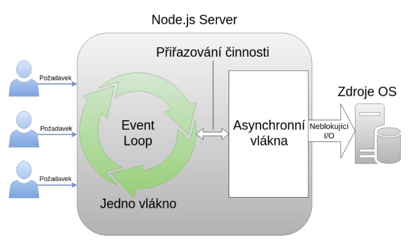

## 12. Zpracování klientských požadavků na webovém serveru, základní mechanismus a varianty řešení (statický a dynamický obsah). Realizace v různých jazycích a technologiích. [KIV/PIA,(KIV/WEB, KIV/NET)]
- Co je statický a dynamický obsah? Nějaké technologie jako PHP apod. bez okatých chyb

**Webový server**
- program, který reaguje na požadavky klientů na webové zdroje.
- nejznámější - Apache, IIS od Microsoftu, Nginx
- může obsluhovat služby typu REST, SOAP, WebSocket, atd…
- Web server je obvykle implementován pomocí tzv. pool (více vláken), který umožňuje zpracovávat více požadavků ve
  více vláknech
- Pokud bude víc requestů než je server schopen obsloužit, budou zařazeny do fronty.

**Zpracování požadavku**
- Klient vytvoří požadavek (HTTP request)
- V prohlížeči – přístup na stránku / resources (scripty, CSS, obrázky…) / AJAX
- Jinak – wget / knihovna / HTTP client… 
- příklad
  - Odkaz: http://www.example.com/path/file.html je klientem převeden na HTTP 1.1 požadavek ve tvaru:
    - GET /path/file.html HTTP/1.1
    - Host: www.example.com
- Server ho zpracuje a odpoví
  - Parsování requestu klienta
  - Autorizace - ověření práva přístupu
  - Navázání požadovaného URN na cílový soubor
  - Příprava výstupu - buď pošle přímo soubor nebo výstup (vygeneruje např. z DB)
  - Odeslání výstupu klientovi

**Statický obsah**
- předem připravené datové soubory (HTML stránky, obrázky, soubory...), které webový server bez změny poskytne
  klientovi (tzv. statický obsah)
- transfer probíhá prostřednictvím HTTP protokolu
- Kromě HTML kódu se (většinou) přenáší i soubor kaskádových stylů
  (CSS) - což už je ale další request prohlížeče

**LAMP**
- zkratka, která v informatice označuje sadu svobodného softwaru používaného jako platforma pro implementaci
dynamických webových stránek
- Zahrnuje tyto technologie:
  - Linux – operační systém,
  - Apache – webový server,
  - MariaDB nebo MySQL – databázový systém,
  - PHP, Perl, nebo Python – skriptovací programovací jazyky

**Apache vs Nginx**
- dohromady obsluhují až 50% trafficu na internetu
- hlavní rozdíl spočívá v přístupu k obsluze požadavků
- Apache si vytváří nové vlákno pro každé spojení zatímco nginx používá jedno vlákno (workera) pro obsluhu většího
  množství uživatelů

**Nginx**
- asynchronní událostmi řízená architektura
- asynchronous, non-blocking, event-driven connection, handling algorithm
- ideální pro přístup ke statickým souborům
- přístup k dynamickým datům často přesměrovává jinam a používá se jako load balancer
- server je jedno-vláknový a jeden "worker" ve smyčce obsluhuje klienty
- zpracování např. Php není zabudováno do vlastního workera jako u Apache, ale je využíván externí interpret

**Java Servlets**
- Servlet = Java třída která umí obsloužit HTTP požadavek
- Servlet container = Java web server, který podporuje Servlety (např. Apache Tomcat)
- V konfiguraci se servlety namapují na určité cesty (servlet mapping)
- **Životní cyklus servletu**
  1. HTTP request je přijat webovým serverem a předán servlet kontejneru.
     - a. Kontejner namapuje požadavek na konkrétní servlet.
     - b. Servlet je dynamicky načten a uložen do adresního prostoru kontejneru.
  2. Kontejner zavolá metodu init() příslušného servletu.
     - a. Tato metoda je volána pouze při prvním načtení servletu do paměti.
     - b. Je možné nastavit inicializační parametry pro prvotní konfiguraci servletu.
  3. Kontejner zavolá metodu service() příslušného servletu.
     - a. Tato metoda se volá pro zpracování HTTP requestu – ta defaultně zavolá doGet atd… rozhodí to do
     dalších metod…
     - b. Servlet může číst data poskytovaná HTTP requestem.
     - c. Servlet může vygenerovat HTTP response (odpověď) pro klienta.
  4. Kontejner se v určitém okamžiku rozhodne odebrat servlet z paměti.
     - a. Algoritmus pro rozhodování o smazání servletu se u jednotlivých kontejnerů liší.
  5. Kontejner zavolá metodu destroy() a ta mu odebere všechny zdroje, které má servlet přiděleny.
  6. Paměť alokovaná pro servlet a jeho objekty pak může být uvolněna garbage collectorem.
- **Šablony**
  - Servlet nemusí přímo generovat HTML, ale jen provést business logiku, připravit data a poté je předat
    template enginu
  - Odpovídá to MVP
  - Template engines: JSP, FreeMarker, Velocity, Thymeleaf

**JSP (Java Server Pages)**
- Template engine, ve kterém se do speciálních tagů vkládá Java kód
- JSTL (Standard Tag Library) 
  - rozšíření o další JSP tagy (if, forEach…)

**Java Spring MVC**
- Už nevytváříme Servlety, ale kontrollery (@Controller), které na rozdíl od servletů obsahují i mapování.
- Spring Web MVC je původní webový framework postavený na rozhraní Servlet API a je součástí frameworku Spring
  Framework od samého počátku.
- Spring MVC je stejně jako mnoho dalších webových frameworků navržen na základě vzoru front controller, kde
  centrální servlet, DispatcherServlet, poskytuje sdílený algoritmus pro zpracování požadavků, zatímco skutečnou práci
  vykonávají konfigurovatelné delegované komponenty. Tento model je flexibilní a podporuje různorodé pracovní
  postupy.
- DispatcherServlet, stejně jako každý Servlet, musí být deklarován a mapován podle specifikace Servletů pomocí
  konfigurace Java nebo v souboru web.xml.

**Node.JS**
- prostředí umožňující spouštět JavaScript kód mimo webový prohlížeč
- Je postaveno na JavaScript enginu Chrome V8, takže základ tohoto JS prostředí je stejný jako ve webovém prohlížeči
  Google Chrome.
- Důležité je říci, že byť v tomto prostředí lze psát ledacos, jeho návrh a primární účel je tvorba serverové části
  webových aplikací.
- Toto má společné např. s jazykem PHP, který má stejné
  zaměření
- JavaScript se tedy díky tomuto prostředí dá používat i na
  serveru a ne jen na druhém konci, u klienta.
- Avšak na rozdíl od zmíněného PHP je v Node.js kladen důraz
  na vysokou škálovatelnost, tzn. schopnost obsloužit mnoho
  připojených klientů současně.
- Pro tuto vlastnost a vysokou výkonnost je dnes Node.js velmi
  oblíbený pro tvorbu tzv. API serverů pro klientské single page
  aplikace rovněž v JavaScriptu.
- 

**Common Gateway Interface (CGI)**
- Protokol pro propojení externích aplikací s webovým serverem. To serveru umožňuje delegovat požadavek od klienta
  na externí aplikaci, která dle požadavku vrátí výstup. Taková aplikace typicky zpracuje nějaký skript ve webové stránce
  a webovému serveru navrátí statickou stránku, která je následně zaslána klientovi jako výstup jeho požadavku.
- Rozhraní Common Gateway Interface bylo v prostředí internetu přítomno již od počátku 90. let a ve své době
  představovalo jediný způsob dynamického zpracování obsahu. Postupně vznikla efektivnější řešení (FastCGI, integrace
  jazyků jako modulu WWW serveru) a CGI bylo vytlačeno do ústraní.
- Výhody
  - flexibilita, integrace legacy aplikací
- Nevýhody
  - runtime náklady, netransparentnost, bezpečnost
  - Aby byl program použitelný jako CGI musí splňovat:
  - schopnost přebírat parametry předané pomocí rozhraní CGI
  - odpověď ve formě HTML zapsaná na stdout