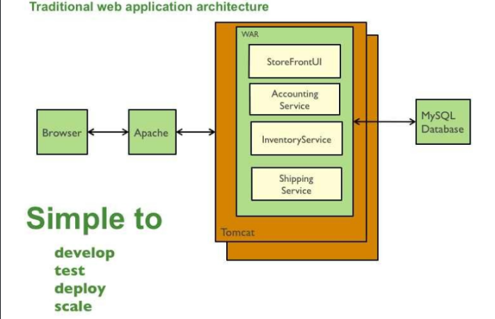
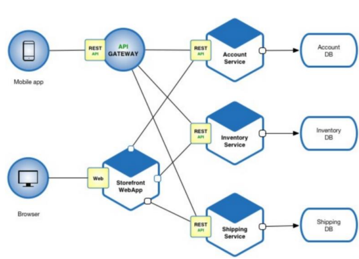
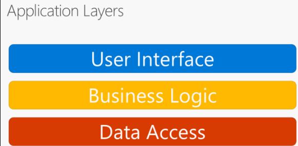
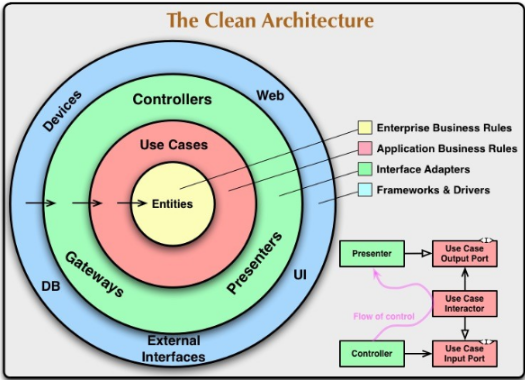
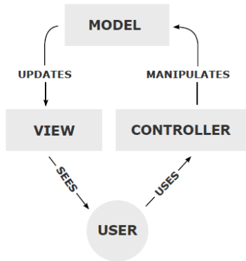
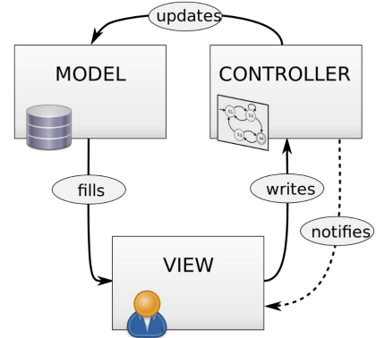
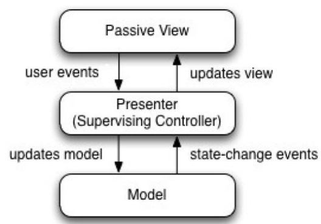
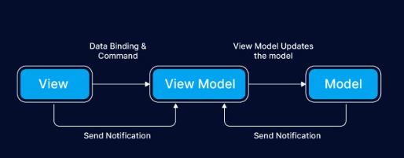
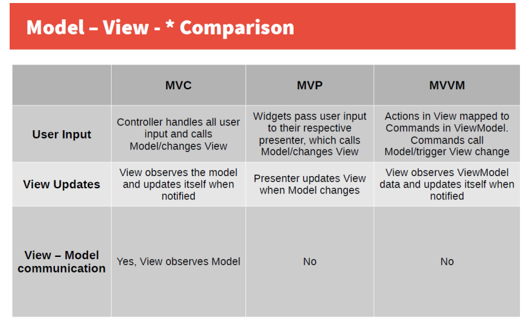

## 13. Struktura (architektura) serverové části webové aplikace, související návrhové a architektonické vzory. Předávání dat mezi vrstvami aplikace, techniky pro oddělení  obsahu a prezentace. [KIV/PIA (KIV/WEB)]
- Povídat o těch vrstvách a architekturách, že jsou oddělený aby se dobře programovala a udržovala, že když zaměním
  databázi, abych nemusel měnit všechno

**Důležité aspekty**
- Jak tu aplikaci budeme nasazovat?
  - budete jeden nebo více procesů / více serverů
  - ovlivňuje to jak moc ji horizontálně škálovat
  - ovlivňuje postup v nasazování nové verzi
- Jak ji vidí okolní svět?
- V čem to naprogramovat? Na co to nasadit (Linux, Win, …)? Jaký bude tým?

**Common Web Application Architectures**
- **Monolitická webová aplikace**
  - Typická aplikace
    - V popředí: UI komponenty - HTML + CSS + JS běžící v prohlížeči
    - Serverová aplikace s nějakým API
      - spravuje všechnu funkcionalitu
    - V pozadí typicky nějaká databáze (MongoDB, MySQL atd.)
  - Příklad:
    - Aplikace pro správu uživatelů
      - Server spravuje:
        - autentizaci, platy, tisk dokumentů, vrácení daní, ...
        - jednoduchá na vývoj, pokud moc nenaroste
      - Hlavní výhody:
        - je to pouze jeden projekt v IDE
        - jednoduché na vývoj - jeden archiv nebo složka, která bude nahrána na server
        - jednoduché škálování - prostě se pustí druhá aplikace
      - Platí dokud ale nejde o moc rozsáhlé aplikace
      - Nevýhody:
        - jeden projekt => hrozně moc kódu (špatně se mu rozumí - speciálně pro nové zaměstnance)
        - dlouhotrvající testy, vývojářům se nechce čekat, nepouští se
          - postupně klesá kvalita kódu
        - systémy s dynamickým typováním daleko více “trpí”
        - dlouho startuje
          - stěžuje vývoj, musí se to pořád otáčet při opravě chyby, ….
        - škálování již není tak jednoduché
        - nepracujeme na ní sami - jeden repozitář pro hodně lidí
          - merge a code review pak skončí na jednom člověku, který pouze kontroluje jestli se
            branche jednotlivě neovlivňují atd.
        - celý je to napsaný v jedný technologii
          - celá ta aplikace by se musela přepsat do jiné aplikace pokud by bylo potřeba
        
- **Service-Oriented Architecture**
  - Pokus o překonání problémů s monolitickou aplikací
  - V dnešní době zbytečný termín
  - Služba by měla být aplikace, která je pro ostatní černou skříňkou
    - nepotřebujeme znát jak se to uvnitř chová
    - pokud mi jedna služba nebude vyhovovat, mohu jít lehce vyměnit jinou, která má sice jinou implementaci, ale
      poskytuje stejný kontrakt/rozhraní
    - je jasně definováno, jak se službou komunikovat
    - je bezstavová
      - mělo by být jedno, na kterou instanci běžícího programu přijde požadavek, měli bychom dostat stejný
        výsledek
  - Služby komunikují pomocí zasílání zpráv
    - přímé volání - klient volá službu, ta mu odpoví
    - Message Broker - pošle to na frontu Brokerovi a dále už nečeká ale vybere si odpověď z fronty zpět
      - předá zprávu službě
      - asynchronní komunikace
      - je dobrá, pokud těch požadavků bude chodit více za jednotku času, klient nemusí stále čekat
    - Více rozdílných protokolů
      - HTTP, WebSocket, SOAP, AMQP, MQTT, Stomp, ….
    - Zvyšuje složitost kvůli integracím
      - vzdálená volání mění pravidla zapojení
      - ve veřejném prostředí musíme zařídit, že víme s kým aplikace komunikuje (navázání důvěry, šifrování)
      - iterace přes nějaké volání bude pomalejší než iterace přes nějaké pole v procesoru
        - služby se musí umět zotavit, pokud nějaké jejich závislost vypadne
        - musí se řešit nějaké dávkové zpracování,
        - nebudu posílat 1000 požadavků pro každý objekt, ale pošlu jedne požadavek se všemi objekty

- **Mikroslužby**
  - Jedna aplikace rozdělena do několika malých služeb
  - Založeno na konceptu Unixu - “Dělám jednu věc a dělám ji dobře.”
    - Každý služba obsluhuje jednu malou dobře definovat oblast funkcionality.
  - Hlavní výhody:
    - Každý služba je relativně malá
      - lehké na vývoj a testování jednotlivých funkcionalit
    - rychlé nasazení
      - malé služby se spouští rychleji
    - jednoduché na škálování
      - týmy berou zodpovědnost za funkcionalitu služby
    - každá služba může být implementována pomocí rozdílné technologie
    - relativně jednoduše se vylepšují technologie a refaktoring díky limitovanému scopu služby
  - Hlavní nevýhody:
    - hodně integračních problémů
    - náročnější na provoz než monolit, zároveň potřebujeme chytřejší lidi
    - více integračních testů - jsou drahé, musí něco simulovat, musí mít všechny závislosti, …
    - některé use-case vyžadují spolupráci různých služeb, musíme to nějak koordinovat
      - velký problém je správa transakcí
    - možnost růstu nákladů
      - každá služba by měla mít vlastní datastore
      - každá proces služby většinou běží ve vlastním virtuálním stroji
        

- **Monolit vs. Mikroslužby**
  - obě se dají použít
  - monolit je jednodušší na vývoj a na jeho správu dokud je aplikace poměrně malá
  - mikroslužby se nevyplatí používat pro malé služby
  - pro velké projekty mikroslužby dovolují větší škálovatelnost, testování a snižují komplexitu individuálních balíčků

**Common Web Application Principles**
- **Aplikační vrstvy**
  - Aplikace je rozdělena do několika vrstev
    - každá vrstva má svou odpovědnost
    - vrstvy komunikují pomocí nějakého rozhraní
    - jednoduchá správa a nahrazování
      - MySQL nahradíme za MongoDB
    - jednoduché testování
      - vyměníme opravdovou databázi za nějaké mocky pro jednotkové testování
        
- **Aplikační vrstvy - Clean architecture**
  - Jiné schéma ale stejný princip
  - Hlavní pravidlo - závislosti jsou vždy zvenčí dovnitř
  - Entity - obecná pravidla sdílená v celém systému
  - Případy užití - pravidla specifická pro aplikace, řízení toku dat do/z entit a volání jejich funkcí
  - Adaptéry rozhraní - převádějí data z entit/případů užití do formátu pro externí systémy (UI, webové služby, …)
  - Frameworky a ovladače - externí frameworky a nástroje, databáze (pouze se k nim připojujeme)
  - Více vrstev podle potřeby. Důležitý je koncept!
  - Př. Knihovna diskuzí
    - Neúplná implementace Clean Architecture
      - entity a případy užití jsou v jednom modulu
      - databázové moduly závisí na implementaci logiky
    - Lepší
      - samostatný modul pro entity a rozhraní
      - vždy zvážit dodatečné náklady
      - dobré strukturování a separace odpovědností umožňuje snazší extrakci na oddělené moduly až bude
        potřeba
        
      
- **Aplikační vrstvy**
  - Realizace principu oddělení odpovědnosti a zapouzdření na úrovni kódu
  - Závislosti jdou z horních/vnějších vrstev do nižších/vnitřních
    - běžně implementováno pomocí principu inverze závislostí
  - Umožňuje opětovné použití vnitřních částí na více vnějších místech

- **Běžné vrstvy** - prezentační, aplikační, datová
- **Běžné cross-cutting obavy** (Na co si dát pozor) - zabezpečení, transakce, logování

- **Datová vrstva**
  - Odpovědnosti:
    - JAK jsou data uloženy (formát)
    - Mapování mezi formátem vnitřní aplikace (DTO, entity) a formátem v úložišti (SQL, BSON)
    - READ/WRITE funkcionalita
    
- **Aplikační vrstva** 
  - Odpovědnosti
    - realizuje funkcionalitu aplikace
    - mění stavy entit
    - spuštění přístup k datovému úložišti
    
- **Prezentační vrstva** 
  - Odpovědnosti
    - přijímá uživatelský vstup
    - volá aplikační funkce
    - prezentuje výsledky uživateli

**Common Web Application Design Patterns**
- běžně používané návrhové vzory ve webových aplikací
- přesné definice se liší podle zdroje, technologie, …
- pamatujte na princip oddělení odpovědnosti
- vždy uvažovat nejlepší přístup k řešení

- **Model - View - Controller**
  
  
  - terminologie
    - model - data a aplikační logiky
    - view - zobrazuje data uživateli
    - controller - zpracovává uživatelské události
  - Java JSP: celé MVC na serveru
  - rozdíly oproti klasickému MVC schématem
    - model neinformuje přímo view o změnách, to dělá controller
      - místo toho je generováno nové view pro každý nový požadavek ve formě HTML stránky
      - změny ohledně modelu nejsou nutné
  - AJAX/SPA - část/celá aplikace v prohlížeči
    - terminologie
      - tyto termíny nejsou omezeny na MVC
      - AJAX - Advanced JavaScript and XML
        - technologie která dovoluje aktualizovat HTML přímo z prohlížeče bez nutnosti získání celé
          stránky ze serveru
      - SPA - Single Page Application
        - aplikace, která běží naplno v prohlížeči a změny ve view jsou zpracovávány pomocí JavaScriptu
        - data jsou přijata ze serveru, ale HTML se generuje až v prohlížeči
          
- **Model - View - Presenter**
  
  - rozbíjí spojení mezi modelem a view
  - presenter je controller, které slouží také jako přímý prostředník mezi view
    a modelem
  - view se skládá z individuálních widgetů
    - tlačítko, text field, formulář, …
  - každý widget má vlastního přednášejícího, který pracuje s událostin
    daného widgetu a nastavují data, která jsou zobrazena

- **Model - View - ViewModel**
  - ViewModel poskytuje:
    - data pro view
      - transformuje data z interního modelu do formátu, který je vhodný pro zobrazení
    - příkazy
      - reakce k uživatelskému vstupu
      - příkazy jsou mapované ke stisku tlačítka, změně vstupu, …
    - komunikace s View
      - s Data Bindingem a notifikacemi
      - view je notifikováno o změnách dat ve ViewModelu přes událost a aktualizuje se sám
    - komunikace s Modelem
      - ViewModel volá funkce Modelu ke spuštění aplikační logiky
    - viewModel tvoří data a funkcionální rozhraní
    - 
    
- **Porovnání modelů**
-   

**Další techniky**
- IoC, DI – [viz. #KIV/SA #1](01.md)
- AOP (Aspect-oriented programming)
  - některé funkce se rozprostírají po celé aplikaci (cross-cutting concerns)
  - logování, transakce, bezpečnost cachování
  - umožňuje oddělit záležitosti, které se rozkládají po celé aplikaci od objektů, které ovlivňují
  - klíčovou jednotkou je aspekt

**Předávání dat na úrovni controlleru**
- Např. mezi requesty – session
- Proměnné mohou mít různý scope – request, session, application

**Předávání dat mezi controller a view**
- View (template engine) vidí properties controlleru nastavené způsobem výše uvedeným
- Z view se data mohou dostat jako: části URL, parametry URL, POST/aj. data, cookies

**Předávání dat mezi modelem a DB**
- Data Transfer Object (DTO)
  - DTO je pouze objekt, který uchovává data.
  - JavaBean s proměnnými instance a setter a getters
  - Obvykle je to DTO, který je předán metodě uložení DAO
- Data Access Object Pattern (DAO)
  - oddělení kódu přistupujícího do databáze od zpracování dat
  - delegování odpovědnost za přístup do DB na DAO, jenž pak komunikuje prostřednictvím DTO
  - obsahuje metody jako insert, update, delete, select By…
  - vnitřně používá např.
    - Java Database Connectivity (JDBC) – standard for Database Access
    - Java Persistence API (JPA) – standard for ORM
      - implementuje ho např. Hibernate