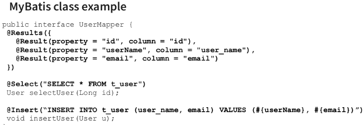

## 15. Řešení persistence dat, základní mechanismy. ORM, jeho výhody a nedostatky. Související standardy a technologie. [KIV/PIA]
- ORM - hibernate, doctrine (PHP ORM framework), nemusíme sypat dotazy přímo, šetří čas programátora, Není efektivnější, komplikovanost přes tabulky dokáže programátor napsat sám líp
- Perzistentní uložení = trvalé (v podstatě DB, ale třeba i do souboru - to je v případě webu asi zbytečné)
- Vyšší programovací jazyky mívají rozhraní, které standartizuje práci s databází a jednotlivé databáze/databázové
  drivery toto rozhraní implementují. → Relační databáze, NoSQL databáze, souborové systémy


**Perzistence dat**
- Vrstva perzistence dat je v architektuře vícevrstvých aplikací zodpovědná za poskytování dat aplikační vrstvě a zajištění jejich perzistence
- Nejčastěji bývá realizována pomocí relační databáze, může jít však i o jiný zdroj dat (např. CRM nebo ERP systém, či jiný informační systém).
- Implementace má dopad na mnoho nefunkčních požadavků
  - výkon (performance)
  - bezpečnost (security)
    - nachází se vetšinou na jiném místě než aplikace
    - nechceme aby je někdo získal (velká hodnota dat)
  - Trvanlivost
    - nutnost se zotavit i z HW nehod
- Možnosti uložení dat
  - Relační databáze
    - MariaDB, MySQL, PostgreSQL, OracleSQL, Derby, H2, Microsoft SQL Server
    - pro ukládání dat u kterých existuje vazba (tabulky - relace)
    - Relace potřebujeme protože v aplikacích potřebujeme znát vazby mezi nimi
  - NoSQL
    - databázové enginy se specifickým použitím:
      - Document-based: MongoDB, CouchDD
      - struktura podobná JSON
      - pro data s fixní nebo stromovou strukturou
      - nehodí se pokud je potřeba znát vazba mezi daty
      - naopak se hodí pokud jednotlivé záznamy nepotřebují odkazovat na jiný
    - Key-Value: Redis
      - pro Cache
      - rychlý (klíč - indexy)
    - Wide-Column: Cassandra, DynamoDb
      - organizují data podle sloupců namísto řádků
      - použití pro případy kde je více zápisu než čtení a nedělají se aktulizace
    - Grahp: Neo4J, Giraph
      - pro grafy (mapy, ontologie)
      - rozpoznávání obrazu, medicínské softy (zadají se příznaky a výsledek je např. styl léčba)
    - Shared features
      - lépe škálují než relační DB, dobře replikují
      - špatná podpora transakcí
  - **Souborový systém**
    - tam kde běží aplikace
    - při více instancí je problém se sdílení dat
    - těžké škálování, přístup, zvětšení GB při runtime
    - omezené indexování, cachování, dotazování
  - **Další možnosti**
    - Alfresco - souborové úložiště
      - metadata k souborům, dotazování, škálování
    - Elastic Search - storage engine pro vyhledávání dat, analýzy, skvělý pro indexaci logů nebo big dat
    - Amazon S3 - objektové úložiště, dobrý pro data ke kterým se moc často nepřistupuje (backupy)
    - Object databases - ObjectDB, pro ukládání objektů, dědičnost, metody pro práci s objekty


**Základní mechanismy**
- přímé spojení s databází
- např. JDBC – Java Database Connectivity
  - API v programovacím jazyku Java, které definuje jednotné rozhraní pro přístup k relačním databázím
  - JDBC priklad
      ```
      Statement psmt = new PreparedStatement(“SELECT * FROM Users”);

      ResultSet set = psmt.execute();
      List<User> users = new ArrayList();

      while(set.next()) {
          String name = set.get(“name”);
          String email = set.get(“email”);
          User u = new User(name, email);
          users.add(u);
      }
      ```
  - ORM priklad napr JPA = javovska specifikace pro ORM
      ```
      List<User> users = repository.findAll(User.class);
      ```

**ORM** (Objektově-Relační Mapování)
- premosteni mezi objektovym a relacnim svetem
  - tridy = tabulky
  - atributy = sloupce
  - nejsou stejny! (dedicnost, public/private)
- Prostředí relačních databází je ideově nekompatibilní s objektově orientovaným přístupem
- ORM řeší mapování mezi logickými objekty v relační databázi a jejich ekvivalentními reprezentacemi v objektech
  - Obvykle řádek v tabulce ⇔ objekt
- Zbytek aplikace tak může pracovat s objekty a relační povaha dat je skryta
- Z druhého pohledu: chceme uložit objekt 
  - díky ORM ho nemusíme rozdělovat na primitivní dat. typy
- **Výhody**
  - Oproti relační databázi by toto mělo redukovat množství kódu → přehlednější
  - Jednoduchost - rychlejší a efektivnější vývoj (některé ORM nástroje vám budou tvrdit, že „odstraní nutnost
    znát SQL“.)
  - Generování kódu -> Skryje rozdíly mezi různými SQL implementacemi
  - Efektivita je „good enough“: Upřednostňují jednodušší kód před výkonem. A když náhodou začne být výkon
    nedostatečný, může se pomalé volání ORM nahradit ručně napsaným SQL
    - Na druhou stranu caching může někdy i výkon zlepšit
  - reseni problemu SELECT N+1
    - LAZY loading = nacti mi jen zakladni atributy a nenacitej asociativni objekty (vzdy kdyz mame relaci *-to-many)
      - nevyhoda: kdyz pote zavolame getter -> vyusti v dodatecne SQL (donacteni)
      - v pripade relace *-to-one je lepsi pouzit LEFT JOIN nez vice selectu
      ```
      SELECT * FROM user WHERE;
      //For all users
      SELECT * FROM address a WHERE = a.user_id = :userId
      ```
      ```
      SELECT u.username, a.city FROM user u LEFT JOIN address a ON u.id = a.user_id;
      ```
      - mame pouze jeden SQL dotaz ale zas muzeme prenaset duplicitni data v pripade ze jeden uzivatel ma vice adres (obecne u *to-many)
- **Nevýhody**
  - někdy až příliš vysoká úroveň abstrakce → nemusí se úplně vědět, co se děje v implementačním kódu
  - pokud se použije špatně (např. stále eager místo lazy načítání), tak pomalé a neefektivní – načítá se i to co není
    potřeba
  - když se nesprávně a hodně spoléhám na ORM, tak to může vést ke špatně navrženým databázím.
    
- Ukázka manuálního ORM
  - 


**Problem mezi relacnim a objektovym svetem**

- v relacni DB neexistuje koncept private atributu -> vsechno je public -> kdokoliv se k DB pripoji si muze precist jaky sloupecky chce
- abychom mohli tridu ulozit do DB pouzijem gettery/settery -> poruseni OOP navrhu
  - dalsi moznosti je napr pouzit DTO (data transfer object) -> ulozime jen cast tridy do DB, po nacteni namapujeme DTO na reaalny objekt -> casove pomalejsi
- **Dědičnost**
  - realcni DB neumi vyjadrit dedicnost
  - moznosti reseni:
    - kazda trida v dane hirearchii = 1 tabulka
      - duplicitni atributy
      - pri prochazeni hierarchii musime volat vice dotazu nad danou DB
    - jedna tabulka ktera obsahuje vsechny tridy z dane hirearchie
      - hodne "blank" policek
      - neefektivni zpusob uchovavani dat
      - jednoduchy SQL query
    - jedna tabulka pro rodicovskou tridu
      - samostatne tabulky pro potomky
      - propojeni pres cizi klice
      - nejsou duplicitni sloupce
      - pri vyhledavani musime delat join
      - efektivni ulozeni
  - prijdeme o typ vztahu (pompozice? agregace?)
    - v pripade tridy je prochazeni jeho komponent jednodussi nez kdyz musime v DB "skakat" pres vice tabulek
  - -> vsechny tyto nedostatky = leaky abstraction
  
**JPA** (Java Persistence API)
- API/standard programovacího jazyka Java, pro ORM
  - JDBC je oproti němu jako low-level standard
- Entita je objekt, který reprezentuje data v databázi
- Typicky entitní třída reprezentuje tabulku v relační databázi a každá instance této třídy pak koresponduje k jedné řádce tabulky.
  - Aby mohly být entity ukládány, musí mít entitní třída následující vlastnosti:
    - Musí být anotována anotací javax.persistence.Entity
    - Musí mít public nebo protected konstruktor bez parametrů. Může ale mít i další konstruktory.
    - Nesmí být deklarována jako final. To platí i pro její metody.
    - Pokud session beana bude pracovat s instancemi této třídy a bude typu Remote, potom tato entitní
      třída musí implementovat interface Serializable
    - Její atributy musí být deklarovány jako private, protected nebo package-private a lze k nim přistupovat
      pouze přes metody (gettery a settery).
- S entitami se manipuluje pomocí třídy EntityManager, která má metody:
  - persist(entita): uloží objekt entita do databáze (operace INSERT)
  - remove(entita): smaže objekt entita z databáze (operace DELETE)
  - merge(entita): entita byla persistována, ale následně byla změněna. Po operaci merge se tyto změny projeví v
    databázi (operace UPDATE).
  - find(class,id): vrátí objekt v tabulce, která koresponduje s class a má primární klíč id (operace SELECT)

**Hibernate**
- framework napsaný v jazyce Java, který umožňuje tzv. objektověrelační mapování (ORM).
- Je jednou z implementací JPA. Vnitřně používá JDBC - Tj. používáme
  anotace z JPA…
- V Hibernate se tedy pracuje s běžnými business objekty, přičemž
  mohou být sloupce tabulky spojeny přímo s atributy objektu, nebo
  mohou být připojeny skrze metody get/set
- nelze použít EJB (viz Java Bean), ale pouze klasické objekty - tzv. POJO
  (Plain Old Java Object).
- Poté co jsou objekty uložené v databázi se na ně lze dotazovat
  jazykem HQL (Hibernate Query Language), který je odvozen z SQL a je
  mu tedy velice podobný.
- Konfigurační soubor pro Hibernate by měl v základní formě obsahovat:
  - JDBC driver
  - generátor SQL dotazů (dialect)
  - connection string do databáze
  - přihlašovací údaje k databázi
  - automaticky vytvořit prázdné tabulky v databázi
  - cesty k mapovacím souborům

**Doctrine**
- V rámci Symfony frameworku je Doctrine standardním ORM nástrojem a poskytuje integraci s dalšími součástmi
  Symfony, jako je například generování formulářů a validace dat. Doctrine je oblíbený pro svou flexibilitu, výkonnost a
  rozšiřitelnost, a často se používá ve větších PHP projektech.

**Entity Framework**
- ORM framework vyvinutý společností Microsoft pro platformu .NET. Podporuje různé relační databáze a nabízí
  možnosti mapování objektů, dotazování a správu transakcí.
- LINQ!

Pak záleží dost na typu databáze
- NoSQL má MongoDB Driver
- Apache Cassandra má Apache Cassandra Java Driver atd