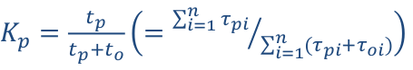

## 17. Základní pojmy a modely v oblasti spolehlivosti a výkonnosti softwarových systémů, jejich příklady a souvislost se specifikací požadavků, návrhem architektury a implementaci. [KIV/VSS,(KIV/ASWI)]

**Spolehlivost systémů**
- Spolehlivost je obecná vlastnost objektu spočívající ve schopnosti plnit požadované funkce při zachování hodnot
  stanovených provozních ukazatelů v daných mezích a v čase podle stanovených technických podmínek.
- Spolehlivost je komplexní vlastnost - zahrnuje několik převážně kvalitativních hledisek:
  - Pravděpodobnost, se kterou bude sw danou dobu fungovat bez chyby
  - Dostupnost – pravděpodobnost, že systém je funkční v daný čas
  - Odolnost proti poruchám, bezpečnost, …
- Máme metriky, které o spolehlivosti něco mohou říci (např. MTBF, dostupnost v %...)

**Stav systému**
  - poruchový - systém neposkytuje požadovanou službu
  - bezporuchový - systém funguje

**Provoz systému**
  - obnovovaný (= opravovaný): obnova = přechod z poruchového do bezporuchového stavu - systém lze opravit
  - neobnovovaný - poruchou jsou zničeny (neopravitelný HW, nedostupný systém, příliš nákladná oprava,...)

**Poruchy**
  - systematické - chyby v návrhu systému (zapomenuté kontroly, chyby operátora, přehřívání,...) - v SW
- náhodné- vnější vlivy mimo kontrolu (nárazy, počasí, záření,...) - v HW

**Vznik a propagace chyby (různé terminologie)**
  - Mistake – chyba operátora
  - Fault – domnělá příčina chyby (vnější vlivy, chyba v návrhu systému, …)
    - Byzantine fault – vede ke špatnému výsledku
  - Error – rozdíl mezi správným a získaným výsledkem
  - Failure – selhání systému – nedodržení specifikace

**Kategorie spolehlivosti**
  - Nezabezpečené systémy - spoleh na dobrý chod systému
  - Zabezpečené systémy (Fail safe) - Mechanismy pro vypořádání se s poruchami (redundantní komponenty,
    přepnou se v případě chyby)
  - Systémy odolné proti poruchám (Fail tolerant) - při chybě dokáží poskytovat službu alespoň v degradovaném
    stavu (delší odezva).

**Výkonnost systému**
- Kvalitativní parametr odrážející schopnost sw systému splňovat požadované požadavky na výkon a zároveň
  minimalizovat využívání zdrojů
- Ukazatele:
- Průchodnost – počet požadavků za jednotku času
- Koeficient zatížení – doba strávená obsluhou požadavku
- Doba odezvy, délka front, …

**Modely**
- = zjednodušení systému pro jeho analýzu.
- Modely (formální i neformální) se zavádí, protože je realita moc složitá a neuchopitelná. Model poskytuje
  zjednodušení a obsahuje chyby. Otázka je jakou míru zjednodušení můžeme připustit, aby se dal model využít a
  zároveň aby nebyl příliš složitý na výpočet.
  - verifikace - ověření že je model správně implementován
  - validace - ověření že model odpovídá modelované realitě
  - zjednodušení - bereme v úvahu jen významné vlastnosti originálu vzhledem k účelu konstrukce modelu
  - zobecnění - nemodeluje se jeden konkrétní objekt (instance) ale celá třída podobných reálných objektů

**Analytický model**
- Model má “uzavřený tvar” - systém je popsán vzorcem (soustavou rovnic).
- Jejich vyřešením je možno vypočítat stav systému v libovolně vzdálené budoucnosti (otázkou zůstává jak je to přesné).
- U tohoto modelu je obtížné nalezení potřebných vztahů pro nestacionární systémy.
- Výhody
  - rychle získaný výsledek
  - známé modely pro řadu problémů
- Nevýhody
  - pro složité systémy je obtížně sestavení / řešení (snaží je simulovat)
  
**Simulační model**
- Soustava entit napodobující fungování reálného světa (podmínkou je rozumět dílčím vztahům a mezi nimi povoleným
  operacím).
- Výsledky jsou “změřené” v simulovaném prostředí. Není možné “vidět do budoucna” jako u analytického - je potřeba
  počkat až simulace doběhne (výrazně náročnější na výpočetní čas).
- Výhody
  - funguje dobře i pro složité systémy
  - snadná nestacionarita
- Nevýhody
  - složitější příprava, delší výpočet (spouštěno opakovaně, různá data)

**Souvislosti s požadavky, architekturou a implementací**
- Mimofunkční požadavky se netýkají přímo konkrétních služeb, které systém poskytuje uživatelům. Vztahují se na
  vlastnosti systému jako je výkon, spolehlivost, doba odezvy, vytíženost (také použitelnost, přenositelnost, integrita…).
  Jsou nutným doplňkem požadavků na funkce.
  - Mohou významně ovlivnit architekturu a implementaci. Např. uspořádání systému tak, aby se minimalizovala
    komunikace mezi jednotlivými komponentami, volba HW na serveru, volba norem, způsobu testování a
    měření, volba počtu a typu záloh (horká, studená)...
- Mimofunkční požadavky jsou i součástí SLA (Service Level Agreement - z ITIL)
  - Garantovaná časová dostupnost
  - Garantovaná spolehlivost (MTBF)
  - Garantovaný výkon (rychlost zpracování při daném HW vybavení)
  - Revize a metriky služby (způsob měření)    

    - 

**Spolehlivost** 
- urceni spolehlivosti HW slozeneho ze znamych modulu
  - za jak dlouho se neco rozbije?
- urceni velikosti zaloh (pocet nahradnich komponent)
- jake existuji techniky pro psani spolehliveho SW?
  - oeverene metodity viz V model, odsroubovane srouby z druzice, ...
  - SW nema nahodne poruchy; existuji pouze systematicke chyby
- matematicky model je zalozen na tom ze mame HW ktery 100% funguje a vlivem nahodnych jevu muze selhat, po dostatecne dlouhe dobe je ppst poruchy 100%
  - veli obecny model
  - dulezite je si uvedomit ze vysledek je jen ppst + rozdeleni

- zakladni ulohy
  - mereni spolehlivosti (jaka je MTTF)
  - odhadovani / predvidani spolehlivosti
    - system poskladany z vice prvku
    - vydrzi ridi system letadla bez poruchy vice jak 10h?
    - analyza / simulace
  - zlepsovani spolehlivosti
    - opatreni systemu sadou zaloh

- kazdy senzor ma meze mezi kterymy dava spravne vysledky
  - => nutnost kontrolovat
  - problem napriklad zasakavani ADC prevodniku

- problem v testovatelnosti SW
  - SW bychom museli testovat 2x tak dlouho co je jeho provozni doba
    - viz kumulace chyby v obrannych raketach
- GUI by se si vzdycky mela cist hodnoty primo z HW (reflexe realneho stavu)
- existuji spolehlivostni normy (napr MISRA, AUTOSAR)

- zakladni pojmy
  - poruchy
    - systematicke: SW
    - nahodne (radiace, pocasi, ...): HW
  - stavy
    - bezporuchovy: system pracuje jak ma
    - poruchovy: system neposkytuje pozadaovanou sluzbu
  - systemy
    - obnovovani (mohou se nejak opravit)
    - neobnovovane (po poruse jsou zniceny)

- klasifikace chyb
  - mistake: chyba operatora
  - fault: vnejsi vlivy, chyba navrhu systemu
  - error: rozdil mezi ocekavanym a realnym vysledkem
  - failure: selhani systemu

- kategorie spolehlivosti
  - nezabezpecene systemy (faul avoidance)
    - "delam vse co nejlepe" (vlaky v japonsku)
  - bezpecny stav
    - fail safe
    - po poruse prejdu do bezpecneho stavu (napr zastavim auto)
  - systemy odolne proti chybam
    - fault tolerance
    - napr letadla (NESMI dojit k poruse; redundance HW i SW)

- zajisteni odolnosti proti chybam
  - spolehlivostni normy
  - redundance (HW i SW)
    - typy zaloh
      - studena: vypnuta, zapne se az pri vypadku
        - vyhoda je ze nezere energii
        - neopotrebi se
      - tepla: zpnuta ale neaktivni (po vypadku zacne zpracovavat vstup)
      - horka: zaloha bezi paralelne s hlavnim vypoctem
  - abychom mohli vyzuzit zalohy musime byt schopny detekovat ze doslo k chybe! (jak?)
    - napr u horke zalohy musi replika davat stejny vysledek (resp shoda vetsiny)
    - u studene zalohy musime byt schopny detekovat ze nasatala chyba (pridavny obvod)
  - musim byt schopny systemy prepnout
    - zvysuje slozitost systemu => vic veci => vic veci se muze rozbit
    - zapinani zalozniho systemu muze trvat nejaky cas (kriticke u safety-critical systemu)
      - tepla zaloha toto muze omezit (ale zas zere energii)

- priklad horke zalohy (rizeni vlaku)

    

- ukazatele spolehlivosti

  - `MTTF` - stredni doba do poruchy
    - v modelech se casto udava jako intenzita `λ = 1 / MTTF`
    - nahodny jev => exponencialni rozdeleni
    - za jak dlouho se zapnuty system rozbije
  - `MTTR` - stredni doba do opravy
    - v modelech se casto udava jako intenzita `μ = 1 / MTTR`
    - jak dlouho mi zabere cele to znovu spustit (doba jakou potrebujeme na restart - u SW, u HW - jak dlouho mi trva neco vymenit)
  - `MTBF` - stredni doba mezi poruchama
    - jak casto dochazi k vypadkum
    - stredni doba cyklu

    

- vsechny analyticke modely predpokladaji ze je `λ` (frekvence poruch) konstantni v case

    

  - hodnota `t2` se odhaduje sptane (museli bychom pockat kdy se rozbije)

  - na zacatky jsou poruchy z vyroby a na konci poruchy opotrebovanim
  - bez tohohle predpokladu nemuzeme analyzu delat statisticky
  - existuje kritika toho ze takovyhle prubeh frekvence poruch v case neodpovida realite
  - to ze frekvence poruch odpovida exp rozdeleni bylo overeno empriricky
  - ppst poruchy (distribucne fce): `Q(t)`
  - ppst bezporuchove stavu (distribucni fce): `R(t) = 1 - Q(t)`
  - => rikaji s jakou ppst bude system v danem case zit nebo bude rozbity

  - exponencialita poruch

      

      

  - v praxi mamte tabulky ktere rikaji jaka bude `λ` napr pro integrovany obvod
    - pomoci tabudek pouzijeme vzoredek k vypoctu `λ` celeho cystemu
      - na zaklade poctu hradel, poctu obvodu, vlivu teploty atd.
    - tento postup je dost kritizovan protoze se nejedna o fyzikalni model ale jen statisticky model; zaroven nic lepsiho zatim nemame

- neobnovovane objekty
  - system na zacatku zije a na koneci je rozbity se 100% ppsti

    

    

  - `MTTF = 1 / λ`
  - vezmu distribucni funci bezporuchoveho stavu a spocitam stredni hodnotu => dostanu stredni dobu do poruchy
  - jen pro konstantni `λ` (`<t1; t2>`)

- obnovovane objekty
  - vyneseme casovou radu toho kdy system fungoval / nefungoval

    

  - soucinitel pohotovosti

    - pomer doby kdy system postytuje sluzby ku celkove dobre provozu

      

    - plati pro stacionarni rezim (kdy cas se blizi nekonecnu)

    

  - `To = 1 / μ`

    

  - koeficient prostoje: `Kn(t) = 1 - Kp(t)`

- systemy se zavislymi udalostmi
  - typicky studena zaloha
    - muze se porouchat az po zapnuti (podminena ppst)
  - muzeme pouzit markovske modely
    - poruchy maji exponencialni rozdeleni
  - neobnovovane systemy
    - mame absopcni stavy (system se 100% rozbije)

        

      - reseni linearni soustavy DIFERENCIALNICH rovnic (neni ustaleny stav resp 100% skocime v rozbitem stavu)

        

      - zalohy prodluzuji dobu nez se dostanu do stavu 5 (system je rozbity) ze to jsou jen 2 uzle s dvama hranama (`λ1` a `λ2`)
        - napri rizeni letadla po dobu co je ve vzduchu

      - TRICK JAK OBEJIT DIFERENCIALNI ROVNICE
        - najdeme vsechny cesty ze zdroje do stoku a spocitame jejich ppsti
        - celkem mame 4 cesty
          - pro kazdou z nich muzeme urcit dilci dobu `Tci` jak dlouho ta cesta trvala a jeji ppst `Pci` (ppst ze tou cestou mam projit)

        - spocitame stredni dobu (prumer) jako vazeny prumer jejich delek

            

          

        - doba setrvani ve stavu je 1 / soucet intenzit vystupnich hran
        - ppst odchodu ze stavu po hrane ja intenzita dane hrany / soucet intenzit vystupnich hran

  - obnovitelne systemy
    - graf obsahuje cykly (rozbite prvky mohu opravovat)
    - diferencialni rovnice odpadnou
      - zbydou nam linearni rovnice (nemame absopcni stav -> silne souvisly graf)

        
  