## 18. Způsoby zajištění spolehlivosti systému na úrovni hw a sw, spolehlivostní modely. Normy související s tvorbou spolehlivých softwarových systémů. [KIV/VSS]
- spolehlivost viz. [#17](17.md)

**Způsoby zajištění spolehlivosti**
1. Redundance
   - HW navíc (zálohy, redundantní výpočet (+ hlasování o výsledku))
   - SW navíc (více implementací – dražší než HW redundance, ale HW redundance moc nepomůže u SW chyb –
   taky se mohou vyskytnout všude...)
   - data navíc (duplicitní zprávy, Hammingův kód...)
   - čas navíc
2. Spolehlivostní normy, testování a analýza systému
   - aby se nic neopomenulo v procesu vývoje

**Redundance**
- Bezpečnost, výměnou za vyšší cenu.
- Dva základní předpoklady pro použití záloh
  - dokáži detekovat problém
  - systém lze přepnout
- Tři základní typy záloh
  - Studená (cold)
    - záloha vypnutá, po výpadku se aktivuje
    - potřebuje detekci chyb, potřebuje dobu na aktivaci
    - po nějakou dobu nic nefunguje a je zde riziko že nenaběhne
    - nespotřebovává zdroje ⇒ delší doba do celkového selhání, občasné výpadky, neopotřebovává se
  - Teplá (warm)
    - záloha zapnutá ale neaktivní, po výpadku začne zpracovávat vstup
  - Horká (hot)
    - záloha běží paralelně s hlavním výpočtem
    - může sloužit jako detekce chyb, aktivní po celou dobu
    - může kdykoliv převzít řízení, spotřebovává zdroje,
    - může se rozbít dřív než na ni dojde ⇒ celkové selhání přijde dřív, ale bez výpadků

**Spolehlivostní normy, testování a analýza systému**
- Spolehlivostní normy zaměřené na
  - Metriky
    - řádky kódu, cyklomatická složitost, Halsteadova složitost, pokrytí testy, hustota komentářů, parametry
      na metodu, proměnné na metodu, provázanost, …
  - Metodiky práce
    - rigidní RUP × agilní SCRUM
    - důraz na dokumentaci rozhodnutí, sledovatelnost vývoje, pochopení důvodů problémů
  - Formální modely
    - lze dokazovat jejich správnost a následně generovat program (Petriho sítě…)
- Důkladné testování
  - Existují různé druhy testů
  - Code review zkušenými programátory
- Formální normy
  - Dá se zakázat třeba práce s dynamickou pamětí – malloc; dá se zakázat například programy s GC; dají se
    zakázat například systémy s AI…
  - **MIL-HDBK-217x** 
    - (military handbook poslední F –notice2)
    - vojenská příručka, dá se stáhnout
    - výrazně orientovaná na HW
    - konkrétní tabulky, co kde za jaká hradla a komponenty mají být použity
      - různé prvky HW + další informace o těchto prvcích
    - koeficienty a odhady pro použití na zemi a ve vzduchu
    - založena na nasbíraných datech a měření
  - **IEEE 1633 –2008** 
    - (Recommended Practice on Software Reliability)
    - Analýza a sledování SW procesu
    - Predikce spolehlivosti SW na základě dat měřených při vývoji SW, testování i po nasazení
- **CENELEC EN-50128, IEC 62279, IEC 61508**
  - Normy pro drážní řídící systémy (bezpečnost a spolehlivost řídících systémů)
  - Např. programy s cyklomatickou složitostí 1, žádné metody AI, …
- **MISRA-C**
  - Podmnožina jazyka C a sada pravidel pro vývoj SW pro kritické aplikace (původně automobilů – je od
    Motor Industry Software Reliability Association)
  - 100+ pravidel, některé povinné, jiné doporučené
  - existují na ni validátory
  - příklady:
    - Výrazy s && nebo || v if (…) se povinně závorkují pro logické operace použít typ BOOL
      definovaný pomocí typedef (statické analyzátory chybu odhalí)
    - Lokální proměnné se nesmí jmenovat stejně jako globální proměnné
    - Operátor čárka se nepoužívá (pouze ve for (…))
    - Nesmí se používat continue, goto, break (kromě switch)
    - Každý switch má default část, každý case má break
    - Nepoužívat rekurzivní funkce
    
    
**Spolehlivostní modely**
- obvykle založené na statistice
- reálně proto nemáme jistotu, jak dlouho konkrétní systém vydrží, ale pokud bychom jich provozovali více, tak by
  reálná spolehlivost měla konvergovat k předpovědím modelu
- mohou být analytické i simulační

**Rozdělení jako jednoduchý model**
- **Poissonovo rozdělení**
  - počet výskytů jevů v určitém intervalu, když jevy nastávají nezávisle na sobě a mají stejnou
    pravděpodobnost (diskrétní rozdělení)
  - počet jevů v určitém časovém intervalu
  - všechny jevy mají stejnou pravděpodobnost
  - parametr λ = střední počet událostí za jednotku času
  - význam má Poissonovo rozdělení v teorii hromadné obsluhy, kde popisuje náhodné jevy, jako jsou příchody
   zákazníků
- **Exponenciální rozdělení** 
  - délka intervalu mezi událostmi (spojité rozdělení – čas)
  - jako délka intervalu než dojde k selhání
  - markovské modely mají exponenciální rozdělení přechodu ze stavu do stavu
  - parametr λ = střední počet událostí za jednotku času
  - střední doba mezi událostmi = 1 / λ

**Systémy s nezávislými prvky**
- Systém složený z více prvků se známými vlastnostmi (hradla, CPU a RAM / počítače…)
- Můžeme je chápat jako nezávislé (i když realita může být složitější)
- **Sériové zapojení**
   - Porucha jednoho prvku rozbije celý systém
   - λ je intenzita poruchy; Ts - střední doba životnosti
- **Paralelní zapojení**
   - Porucha všech prvků rozbije celý systém (stačí aby jeden
     fungoval)
   - modelování horké zálohy (všechny prvky fungují, ale stačí pouze jeden)
- **Kombinované zapojení**
   - Kombinace sériového a paralelního

   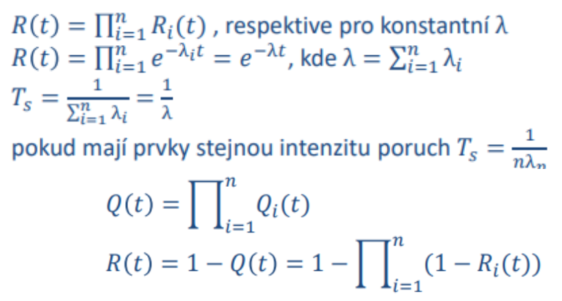
   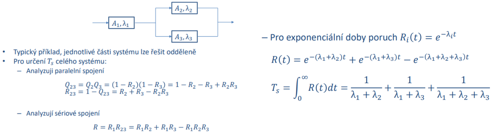
- napr CPU, RAM, BUS
   - nejjednodussi pripad zavislych prvku je studena zaloha
      - musime pouzit podminenou ppst pri urcovani ppst poruchy zalohy
   - pokud jsou prvky nezavisle, muzeme poruchy chapat jako nezavisle nahodne jevy
   - pouze modelujeme zapojeni jednotlivych prvku
   - seriove zapojeni
      - porucha jednoh prvku rozbije cely system

        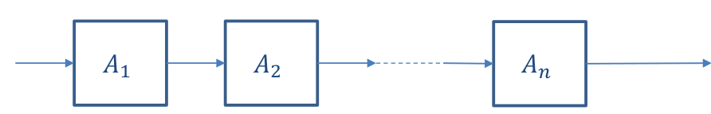

      - mame `n` nezavislych jevu jaka je ppst ze rozbije jeden z nich?
         - nasobime funkce `R(t)`

        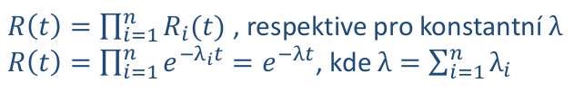

   - paralelni zapojeni
      - system se rozbije az potom co se rozbiji vsechny prvky (staci alespon jeden aby fungoval)

        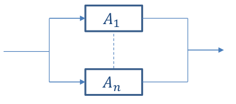

        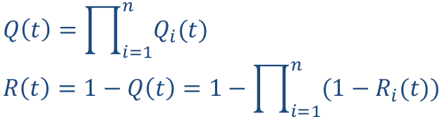

      - pokud zname napr `R1(1)` => `Q1(t) = 1 - R1(t)`
      - nasobime funkce `Q(t)`

   - kombinovane modely

       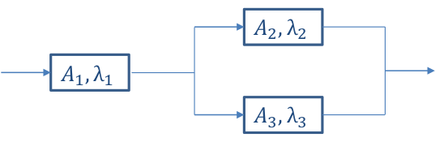

      - `Q23 = Q2 * Q3 = (1 - R2)(1 - R3)`
      - `R23 = 1 - Q23`
      - `R = R1 * R23` (ppst ze se system rozbije)

      - pro exponencialni doby poruch je `Ri(t) = e^(-λit)`

          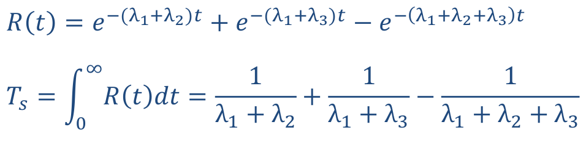

         - `Ts` je stredni doba do poruchy celeho systemu

   - toto vse funguje pro systemy ktere jsou
      - neobnovovane
      - konstantni `λ`
      - nezavisle poruchy

**Stavový graf**
- Obsahuje 𝑛 prvků označených 𝐴𝑛, každý může být v provozu nebo porouchaný
- Přechod – 1 porucha nebo 1 oprava
- vhodný pro model situací, které nelze převést na sériové ani paralelní propojení
- Výpočet R:
  - sečteme pravděpodobnosti jednotlivých stavů, při kterých platí, že systém funguje.
  - Za R lze opět dosadit odpovídající distribuční funkci (obvykle exponenciální rozdělení).
  
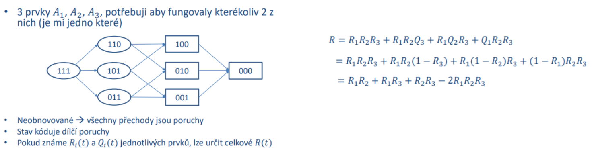

- problem predhozich prikladu je ze se system nachazi bud v paralelnim nebo seriovym zapojeni (+ kompinace)
   - co kdyz mame system ktery se chova nekde mezi
   - priklad
      - mam 3 prvky `A1`, `A2`, `A3` a potrebuju aby fungovali kterykoliv 2
         - kdyby mi staci 1 bylo by to paralelni zapojeni
         - pro zapojeni 2 ze 3 uz papralelni vzorecek nebude fungovat
      - nakreslim stavovy graf (na zacatku vse funguje)

          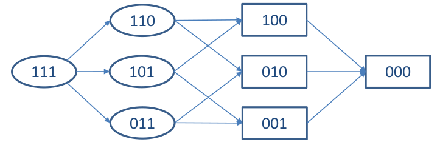

         - ppst napriklad prostredniho stavu ve tretim sloupci je `R1(t)*Q2(t)*Q3(t)`
         - => pokud zname funkce `R(t)` a `Q(t)` pro kazdy prvek -> dokazeme popsat ppst jednotlivych stavu modelu
         - celkova funkce je soucet vsech ppst stavu ve kterem system funguje

             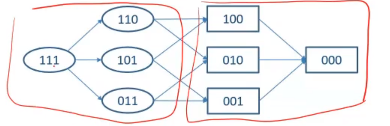

             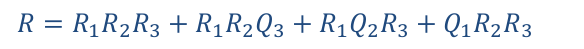

**Strom poruch**
- Klasický model založený na množině událostí (často
  poruch), které se se systémem mohou stát
- znám události a jejich pravděpodobnosti (funkce v
  čase / konstanty)
- zadány operátory („hradla“ – obvykle AND a OR).
- mame poruchy a jejich ppst
   - muzeme sestavit strom-like strukturu ktera byde vystihovat co musi nastat soucasne a jake poruchy na sebe navazuji
   - zaciname od shora (system je rozbity), co mohlo nastat?
      - mohla se napr rozbit RAM nebo CPU atd
      - pak pokracujeme dal stromem napr proc se rozbila RAM
   - pokud mame dilci ppsti muzeme nad tim udelat nejakou analytiku
      - problem je ale jak zjistit konkretni ppst
   - pouziti napriklad v root-cause analysis
      - napr porucha raketoplanu

  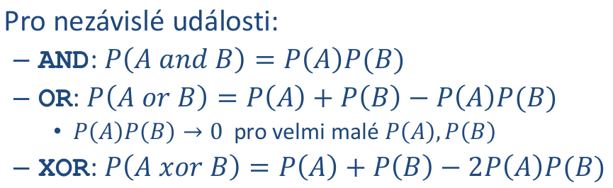

   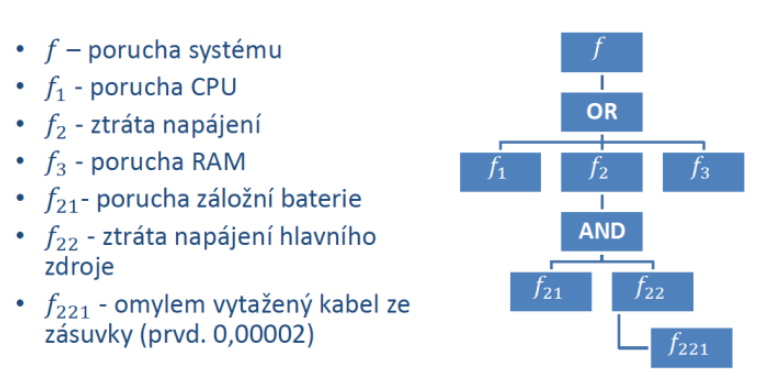

**Systémy se závislými prvky**
- **Příklady:**
  - Je větší šance na poruchu když odejdou 2 ze 3 disků a poslední je tak maximálně využíván
  - Studená záloha se může porouchat až po zapnutí ⇒ její porucha závislá na poruše primárního systému.
- **Simulace**
  - Jedu na iterace a při každé si hodím kostkou jestli se prvek rozbije
  - Lze naprogramovat i složité vztahy mezi prvky
- **Markovské modely**
  - Modelování systémů s jasně určenými
    - stavy (jako u KA – ve stavu všechny vlastnosti systému, nemusím vědět jak jsem se tam dostal)
    - přechody (u kterých známe intenzitu / četnost)
  - Markovská vlastnost: pravděpodobnost přechodu má exponenciální rozdělení (= model pracuje se spojitým
    časem)
    - Pravděpodobnost stavu závisí jen na předchozím stavu a ne na cestě do něj
  - Absorpční stavy – stav kde model končí – nevede z něj žádná hrana
- **Neobnovované systémy** 
  - model s absorpčními stavy, bez cyklů ⇒ snadné řešení
  - Po poruše se už systém nevrátí do provozuschopného stavu
  - Řešení soustavy lineárních diferenciálních rovnic (neexistují ustálené pravděpodobnosti)
- **Obnovované systémy**
  - grafy obsahují cykly (rozbite prvky mohu opravovat)
  - diferencialni rovnice odpadnou
    - zbydou nam linearni rovnice (nemame absopcni stav -> silne souvisly graf)
    - 

  - Poruchy jedním směrem, opravy druhým
  - Stále mohou obsahovat absorpční stavy (něco opravit nejde)
  - Model pro nekonečně dlouhou dobu života pokud jde vše opravit, lze pracovat s ustálenými
    pravděpodobnostmi ⇒ místo diferenciálních rovnic dostanu lineární ⇒ snadné řešení

  - priklad
    - mam jednu horkou zalohu
    - mohu si dovolit opravovat oba prvky najednou? (`2μ`)

    - 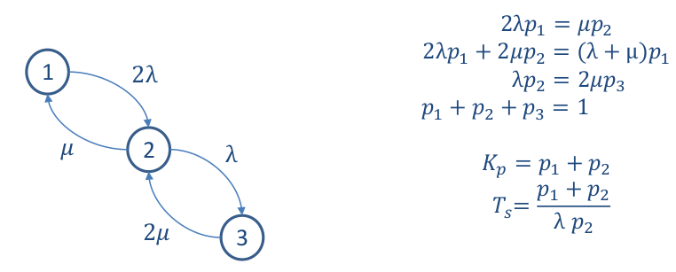

        - `Kp = p1 + p2` (soucet ppsti stavu kdy system funguje)
        - `Ts = (p1 + p2) / (λ * p2)` (MTTF) ppst toho ze to funguje lomeno ppsti ze ty stavy opustime

  - take se daji na vsechny vyuzit simulace
      - napriklad system ma 2 prvky a kazdy ma studenou zalohu a chci vedet jestli se system proucha do casu `t`
          - zname intenzitu poruch (exp rozdeleni)
          - vygenerujeme 4 rand cisla z daneho rozdeleni

            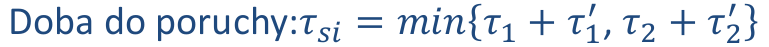

            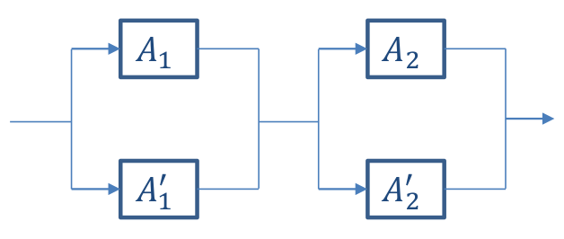

          - vyslednou hodnotu testujem oproti nasi zvolene kriticke hranici `t`
          - pokud nekolikrat opakujeme a pocitame vysledky
              - defakto monte carlo simulace

  - spolehlivy SW
      - metriky (pokrity kodu testatma, pocet radku na metodu, cyklomaticka slozitost, ...)
          - 100% pokryti testy != 100% spolehlivost
          - doszeni metriky normy nerika nic o spolehlivosti (lide se prilis zameruji na dany standard a ne na to proc se to takhle ma delat)
      - metodiky praci (RUP, SCRUM, ...)
      - formalni metody dokazovani spravnosti (temporalni logika)
          - lze jen na urcite druhy programu (napr na MS Word to neumime)
      - code review zkusenymi programatory