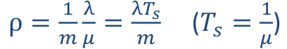

## 20. Modely systémů pro analýzu výkonnosti – sítě front, markovské modely. Abstraktní (formální) reprezentace, možnosti programové realizace. Způsoby využití. [KIV/VSS]

**Markovské modely**
- hodi se kdyz neumime popsat system deterministicky (obsahuje nahodu)
- umoznuje modelovat slozite systemy ve kterych se deji ruzne udalosti a umi predpovidat jak se cely system bude chovat
- nezalezi na minulosti
    - na zaklade aktualniho stavu umi predpovedet jaka situace muze nastat
    - analogie aktualniho bodu a vektoru => umime predpovedet kam se budeme pohybovat

- priklady pouziti
    - modelovani systemu s nahodnymi prichody pozadavku
        - lide ve fronte, telefonni linka, doprava, router, nemocnice, ...
    - vedecke modely
        - page rank (google hodnoceni stranek)
        - generovani reci
            - s urcitou ppsti muzeme rict jake pismeno bude nasledovat pokud jsme detekovali pismeno `t` => graf markovskeho modelu
            - bigramy, trigramy
        - OCR systemy
        - bilogie (SIR modely)
            - s jakou ppsti prejdu mezi stavy mezi
            - Susceptible, Infected, Recovered

            

- vlastnosti
    - stavy (stejne jako u KA)
        - staci mi znat soucasnou konfiguraci (ne vsechny jak jsem se do aktualniho stavu dostal)
        - system bez pameti
    - prechody (zname intenzitu / cetnost)
    - markovska vlastnost
        - ppst prechodu ma exponencialni rozdeleni
        - ppst stavu zavisi jen na predchozim stavu a na ceste (hranach) do nej

- Poissonovo & exponencialni rozdeleni
    - poisson
        - = pocet jevu v danem casovem okamziku (napr. 5 pozadavku za hodinu)
        - parametr λ = stredni pocet udalosti za jednotku casu
        - vsechny jevy maji stejnou ppst
        - diskretni rozdeleni
    - exponencialni
        - = prumerna delka intervalu mezi 2 udalostmi (napr. doba mezi prujezdem dvou aut)
        - spojite rozdeleni (cas ne pocet udalosti)
        - parametr λ = stredni pocet udalosti za jednotkucasu
            - => 1 / λ je prumerna doba mezi dvema udalostmi

        

- zakladni priklad - prochazka opileho namornika

    - zacal jsem ve stavu `S`. Jak dlouho bude trvat nez se dostanu na konec ulice?

    

- mozne pohledy na markovsky model

    

    - matice ppsti prechodu

        

        - podminene ppsti prechodu v pevne dane dobe
        - ze stavu 0 se muzu dostat do stavu 1 (`p0,1`) ALE za predpokladu ze uz jsem ve stavu 0!
        - soucet jednotlivych radku musi byt 1 (jinak to nejsou ppsti)

    - matice intenzit prechodu

        

        - soucet radku muzi byt roven 0 (to co vytece = to co pritece; zakon zachovani)
            - na diagonalu se da minus souctu zbytku radku

- obecny model

    

    - intenzita prechodu = λ [1/s]
        - frekvence prechodu za jednotku casu
        - MUSI BYT KONSTANTNI V CASE (jinak to nejde resit analyticky ale jen simulaci)
    - ppst prechodu v danem case
        - `pij = λ * dt (dt -> 0)` (podminena - jiz musim byt ve stavu `i`)
        - "cim dele na to koukame" tim je vetsi ppst ze se to stane (`dt`)
        - cim je vetsi intenzita tim rychleji se to stane (`λ`)

    

    - pokud znam ppst ze jsem ve stavu `i`
        - => `pij = λ * pi(t) * dt`
        - nepodminena ppst prechodu v case (musim znat ppst ze jsem ve stavu `pi`)

    - pokud znam nepodmineny ppsti prechodu => muzu sestavit matici ppst prechodu

- odvozeni (analyticka matematika)
    - dva zakladni predpoklady
        - `λij` je konstantni v case (jinak musime pouzit simulaci)
        - proces musi byt homogenni (= ppst ze jsem ve stavu `pi` je stejna v kazdem okamziku systemu)

    

    - ppst setrvani ve stavu `i` ma tvar funkce hustoty exponencialniho rozdeleni
        - => "nahoda" ze to vyslo zrovna na exponencialni rozdelni
        - => muzu pouzit statistiku pro reseni markovskych modelu
        - s pouzitim teto funkce lze zodpovedet napr otazku:
            - jaka je ppst ze system bude fungovat po 10h letu?

    

    - ppst setrvani ve stavu `i`
        - => musim odecist 2 veci (mam dva prechody jak se ze stavu mohu dostat)
        - nezajima me po jake hrane odejdu (kdyz se ptam na ppst setrvani ve stavu)

    - `Ti = 1 / λi` - prevracena hodnota souctu intenzit odchodu z daneho stavu

- Kolmogorovy rovnice
    - pokud spojime predchozi dvoje odvozeni
    - = popsani celeho systemu (markovskeho modelu)
    - ppst zmena stavu v case je ppst toho ze v tech stavech jsem krat matice intezit prechodu

        

    - `p(0)` - pocatecni podminky (vektor) kde zacnu
    - vysledkem je linearni differencialni soustava prvniho radu
    - to jestli reseni bude jednoduche nebo ne zalezi jestli v systemu existuje absorpcni stav nebo ne
        - z dlouhodobeho pohledu v tom stavu skoncime vzdycky
        - nema smysl modelovat ppst setrvavani ze stavu (v dlouhodobem horizontu) ale jen ZMENY prechodu v case (ve finale budou ppst vsech stavu 0 a absorpcni stav bude mit ppst 1)

        

        - zmena ppst setrvani ve stavu B v case

            

        - muzeme si klast otazky napr v jakem case my system selze (preleze hranici 95%); ve stavu C je vsechno rozbite
        - z dlouhodobeho pophledu tam skoncim 100%
        - z reseni diferencialni rovnice vyjde ze tento prubeh bude odpovidat distribucni fce exponencialniho rozdeleni

            

- absorpcni stavy - rovnice

    

    

    - => markovske modely se daji pouzit tam kde se vyskytuje exponencialni rozdeleni (charakteristika)

    - zase vychazi se stredni hodnota doby ze jsem v nejakem stavu je `E(X) = 1 / λ`

    - sestaveni rovnic
        - leva stana je derivace zmena `pi'(t)`
        - prava stana jsou "prispevky"
            - `+ pk(t) * λki`
            - `- pk(t) * λik`

        

    - nahodna doba setrvani v libovolnem stavu ma exp. rozdeleni

        

- markovske modely bez absorpcnich stavu
    - graf musi byt silne souvisly (z kazdeho stavu se musim dostat do kazdeho stavu)
        - nesmi existovat podgraf ze ktereho bych se "nedostal ven"
    - markovsky model (graf) ktery neni silne souvisly!

        

    - neexstuje stav ve kterem bych skoncil s ppsti 1
        - => ppst setrvani v jednotlivych stavech se nakonec ustali (= jsou KONSTANTNI -> derivace konstanty = 0)
            - zmena ppst v case (prava strana rovnice) je 0
        - tzv limitni ppsti
        - ppst setrvani ve stavech uz nejsou funkce casu ale jen konstanty
        - vysledna soustava rovnic je ale LINEARNE ZAVISLA => existuje nekonecne mnoho reseni (0 = 0)
            - nekde hrana vede ven -> nekde ta sama hrana musi vest dovnitr
            - => odectou se
            - resenim je ze pridame dalsi rovnici ktera musi platit v libovolne case `p(0) + p(1) + ... + p(n) = 1`
            - pote muzeme libovlnou jednu z preddchozich rovnic skrtnout a nahradit ji touhle ktera jiz neni linearne zavisla
            - resenim teto nove soustavy rovnic dostanu ustalene ppsti

        

- priklad synchronizace procesu

    

    - sestavime rovnice

    

    - graf je silne souvisly -> po "nekonecne dlouhem" pozorovani se ppsti setrvani ve stavu ustali => muzeme rovnice upravit

    

    - zajimavy je napriklad stav 2 (jak dlouho system travi cekani na barieru)
    - jednotlive ppst = % STRAVENEHO CASU (z dlouhodobeho pohledu)
    - cim vetsi p2 -> tim mensi efektivita programu
    - porad plati ze stredni doba setrvani ve stavu `Ti = 1 / λi`

    - dej je cyklicky -> lze urcovat frekvence prechodu mezi stavy
        - `fij = pi * λij` (stredni frekvence prechodu po dane hrane z `i` do `j`)
    - stredni fekvence pruchodu stavem
        - `fi = pi * λi` (to same akorat secteme vsechny vystupni hrany a ne jen tu jednu)
            - musi byt stejne i kdyz pouzijeme vstupni hrany (misto vystupnich) => zakon zachovani
    - stredni doba cyklu pruchodu stavem `i`
        - `Tci = 1 / fi`
        - jak casto se stav opakuje

- Pagerank
    - jadro hodnoceni stranek Google
    - co stranka to uzel (stranka obsahuje URL linky na dalsi stranky)
    - nahodna prochazka grafem (= markovsky system)
    - problem s absorpncnimi stavy => random teleportace
    - ustalene ppst = ohodnoceni dulezitosti

        

- modelovani synchronizacnich primitiv (dalsi priklad vyuziti markovskych modelu)
    - bariera

        

    - bariera s KS (rendez-vous Ada)
        - typicky model farmer-worker

        

    - vlakno s KS (monitor)

        

    - producent-konzument

        

        - pocet stavu je velikost bufferu + 2
            - +2 protoze na zacatku je buffer prazdny a kdyz producent vygeneruje prvni item tak je zpracovan primo konzumentem (nevklada se do bufferu)
            - defakto pocet stavu = maximalni pocet pozadavku v systemu + 1 (zadny pozadavek)
        - stav 0 = "nikdo nic nedela"
        - stav 1 = konzument zpracovava data
        - stav 2 = v bufferu je 1 polozka
        - stav 3 = v bufferu jsou 2 polozky

    - producent s vice konzumenty

        

        - makrovsky model je defakto stejny
        - vice konzumentu se da realizovat pomoci dvojnasobku intenzity hrazny zpracovani pozadavku
        - stav 0 = "nikdo nic nedela"
        - stav 1 = 1. konzument zpracovava data
        - stav 2 = 1. a 2. konzument zpracovava data
        - stav 3 = v bufferu jeden pozadavek
        - stav 4 = v bufferu dva pozadavky

**Systémy hromadné obsluhy**
- Systém je realizován pomocí front a kanálů obsluhy
- Generované požadavky jsou bud' rovnou obsluhovány a nebo čekají ve frontě/frontách
- Modelování systémů, které obsluhují větší množství požadavků
- prvni prakticka aplikace markovskych modelu
- modelovani systemu ktere obsluhuji vetsi mnozstvi pozadavku
    - rizeni dopravy
    - telekomunikace
    - navrh vyrobnich linek
    - nemocnice, urady, ...
    - plánování procesů v OS
- pozadvky prichazeji do systemu, nejakou doby tam stravi a pak ho zase opousti
- aplikace ppsti a statistiky => vysledky plati pouze pri dlouhodobym pozorovani systemu (dlouhodoby pocet pozadavku)
- jedna se o odhad!
- stav systému = počet požadavků v něm
- zakladni koncept
    - kanal obsluhy = mame prvek v systemu ktery realizuje sluzbu (napr server)
    - klienti posilaji pozadavky
    - pozadavky jsou bud hned oblouzeny nebo cekaji ve frontach

    

- pokud mame model jednoduchy -> lze nalezt vzorecky (napr kolik bude prumerna delka fronty pozadavku)
    - pokud je model prilis slozity -> musime pouzit simulaci

- zakladni problemy
    - 1) prilis mnoho pozadavku na system
        - lide mohou napr z fronty odejit (typicky fronty lidi lze modelovat jako nekonecny fronty viz vidani noveho iPhonu)
        - nebo muze dochazet k zahazovani pozadavku (packety v routeru)
        - => potrebujeme navisit kapacitu (popularni cloudove resni -> lze dimenzovat sluzbu dle zateze)
    - 2) malo pozadavku na system
        - system vetsinu casu nic nedela (napr zapis predmetu)
        - vyuziti nepoziteho vykonu napr SETI@HOME
            - nevyhoda ze defakto nevime co komu pocitame
        - => mohu zdroje vyuzit nejak jinak nebo je treba zrusit?

- elementarni SHO

    

    - elementarni system hromadne obsluhy ma celkem 5 polozek
        - vstupni proud (vnejsi svet co po nas neco chce)
        - fronta
        - pocet kanalu obsluhy co sdili jednu frontu (vice front = vice elementarnich SHO)
        - vystupni proud
    - na zaklade popisu techto polozek muzeme odhadnout jak se bude chovat vystupni proud

    - abychom toto mohli analyzovat analyticky musime predpokladat STACIONARNI REZIM CINNOSTI
        - charakteristiky se nemeni v case
        - jinak musime pouzit simulace
        - napriklad lide na prepazce mohou byt na konci dne unaveny -> zmena parametru rychlosti obsluhy

    - zdroje pozadavku
        - modelovani vnejsiho sveta
        - v nejakych situacich mame nejakeho producenta (lepsi situace -> muzeme ho analyzovat = vim kolik cca pozadavku bude chodit)
        - v horsim pripade nemame co analyzovat a musime jen odmerit jak se vnejsi svet chova (kolik chodi pozadavku atd)
        - omezeny zdroj
            - predem znama mnozina pozadavku
            - napr procesy v KS (vim kolik vlaken mam v programu) nebo pool vlaken v DB serveru
        - neomezene zdroje
            - napriklad webovy server

    - jmenne konvence

        
- K modelování SHO je třeba znát
1. charakteristiku vstupního a proudu – λ, a (arrival)
   - a. omezený či neomezený, případně frekvenci s jakou se generují požadavky
   - b. Ta = 1 / λ = střední doba příchodu požadavků
2. chování fronty – w (waiting)
   - a. omezená či neomezená
   - b. FIFO / LIFO / prioritní / náhodné / něco jiného
   - c. reakce na překročení kapacity
     - i. Zahazování požadavků při naplnění
     - ii. Opuštění fronty při dlouhém čekání
     - iii. Střídání front
3. charakteristiku obsluhy požadavků – μ, s (service)
   - Ts = 1 / μ = střední doba obsluhy požadavku (při max zatížení)

      - vstupni proud
          - da se na nej koukat jako na posloupnost casu mezi pozadavkama
          - doby lze brat jako nahodnou velicinu => muzeme hledat rozdeleni ktere je charakterizuje
          - nejcastejsi popis je distribucni fci nebo hustotou ppsti

              

              - poissonovsky - exponencialni rozdeleni pro doby mezi prichody pozadavku
              - gaussovsky - neni typicke pro lidi - nebudo chodit kazdou minutu (typicke napr pro nejaky PC system)
              - rovnomerny - BEZ NAHODY (stejna doba mezi pozadavky)

          - abychom mohli pouzit markovske modely musi byt vstupni proud
              - 1) homogenni = chovani v case se nemeni
                  - ne vzdycky realni viz zatez Netflixu pres den (meni se od hodiny) => rozdelit interval na "konstantni" podintervaly => modelujeme system vicekrat

                      

              - 2) ordinalni = nikdy neprijde vice nez 1 pozadavek na jednou
                  - jeden pozadavek bude drive nez druhy
                  - v realu muze byt predrazeno neco co zajisti usporadani
              - pokud tyto podminky nejsou splneny => pouzit simulaci

          - vstupni proud lze popsat parametry odpovidajiciho rozdeleni
              - napr. stredni doba mezi prichody `Ta = 1 / λ`
              - `λ` = frekvence prichodu pozadavku

          - pokud nemame na vstupu poissonovsky proud
              - musime pouzit koeficient variace `Ca = σ / Ta`
              - = pomer mezi smerodatnou odchylkou a stredni dobou mezi prichody pozadavku
              - "jak moc je proud nahodny"
                  - pro exp nebo poisson je `Ca = 1`
                  - prlne deterministicky system `Ca = 0`
                  - pokud `Ca > 1` => objevuji se shluky pozadavku (nic horsiho mit nemuzeme viz menza)

                  

      - fronta pozadavku
          - maximalni delka (omezena / nekonecna)
          - prioritni / FIFO?
              - prioritni fronta typicky v OS nebo akutni urazy v nemocnici
          - co se deje s pozadavky?
              - opousti frontu (co to znamena? zahozeni packetu vs umrti)
          - analyticke vypocty jsou snadne pro fronty FIFO, bez omezeni, bez priorit
              - jinak => pouzit simulaci
          - charakteristiky fronty
              - `w` - aktualni (okamzity) pocet pozadavku ve fronte (nah. velicina)
              - `E(w) = Lw` - stredni pocet pozadavku ve fronte
              - `t(w)` - doba cekani jednoho konkretniho pozadavku ve fronte (nah. velicina)
              - `E(tw) = Tw` - stredni doba cekani pozadavku ve fronte

      - kanal obsluhy
          - elementarni SHO muze mit `n` kanalu obsluhy (napr pocet jader CPU)
          - potrebujeme charakterizovat dobu obsluhy jedhono pozadavku = nahodna velicina
              - idealne chceme aby se v case nemenila
              - v realu napr obsluhy na prepazkach jsou ke konci smeny unaveny -> jde jim to pomalu nez na zacatku
              - zase predpokladame exp rozdeleni
              - sterdni doba obsluhy pozadavku `Ts = 1 / μ`
              - rika nam dve veci
                  - jak rychle dokazeme odbavovat pozadavky
                  - dava nam informaci o tom ze vstupni pozadavky jsou stejny
                      - ze nejsou jinak narocny (viz triska vs amputace v nemocnici)
          - koeficient variace ("jak moc jsou doby obsluhy nahodne")
              - `Cs = σ / Ts`
          - v realnem svete je doba obsluhy spise gaussovo rozdeleni (trva +- stejnou dobu)

      - celkove charakteristiky SHO

          - `ρ` zatizeni systemu (`m` = pocet kanalu obsluhy)

              - = PPST OBSAZENOSTI KANALU

              

              - `ρ = 0` system nic nedela
              - `ρ = 1` system je plne vytizeny
              - `ρ >= 1` system nestiha, neni ve stacionarnim rezimu
                  - fronta neustale narusta

          - `Lq` = stredni pocet pozadavku v systemu SHO
          - `Tq` = stredni doba odezvy (soucet stredni doby cekan ve fronte + stredni doba obsluhy)
              - pozadavek musi projit jak frontou tak obsluhou

      - vystupni proud
          - sizne zavisly na rezimu prace kanalu
          - pokud je system ve stationarnim stavu (`ρ < 1`)
              - stejna perioda a frekvence jako vstupni proud
              - jinak by se pozadavky hromadily (zakon zachovani)
              - pokud je `ρ` blizke `0` -> vstup = vystup (pozadavky system jen "protecou")
                  - pozadavek odejde driv nez prijde dalsi pozadavek
                  - casy prichodu pozadavku jsou jen posunute o cas obsluhy
                      - ale charakteristiky proudu jako takoveho jsou zachovany
          - nestacionarni rezim (`ρ >= 1`)
              - vsechny kanaly pracuji
              - frekvence vystupu musi byt `m * μ`
              - rozdeleni stejne jako rozdeleni kanalu obsluhy

          - jaktoze pri `ρ < 1` vznika fronta kdyz system stiha?
              - zpozdovani je dano nahodou (cim vetsi nahota tim je vetsi ppst mi vznikne fronta)
              - je to dano tim jak neni system synchronizovany (nejsou stejne doby mezi prichody pozadavku)
              - pokud system stiha a je synchronizovany => fronty nevznikaji

- zakladni vztahy strednich hodnot (Littlovy vzorce)

    - stacionarni rezim, FIFO, zadna preemce

        

        - doba obsluhy ze je `1 / μ` neni az tak prekvapive
        - `m * (λ / μ)` je stredni pocet prvku kanalu obsluhy (pocet kanalu `m` krat vytizeni)

        

    - provazuji spolu dobu a pocet (vyazeji ze zakonu zachovani)
    - neni zavisle na ppstnim rozdelenim vtupniho proudu

        

    - za dobu `Tq` mi prijde `λ` pozadavku, ale za za dobu `Tq` mi take musi odejit `λ` pozadavku jinak by se v systemu hromadily (SHO by nebyl stacionarni)

- zakladni uloha teorie hromadnych systemu
    - pokud zname chrakteristiku vstupniho proudu `Fa(t)` a kanalu obshuhy `Fs(t)` chceme urcit `Lq, Tq, Lw, Tw`

- Kendallova klasifikace

    

    

    - podle typu systemu muzeme v tabulkach dohledat prislusne vzorecky

- nejjednodussi priklad M/M/1
    - poissonovsky vstupni proud `λ`
    - stredni pocet obslouzenych pozadavku za jednotku casu `μ` (ZA PREDPOKLADU ZE `ρ = 1`)
        - pokud je `ρ < 1` -> skutecna frekvence bude nizsi tim jak system po nejakou dobu nic nedela
    - `ρ = λ / μ` (stacinoarni rezim pokud `λ < μ`)
    - lze modelovat jako markovsky proces
        - NUTNO OVERIT ZE JE PROCES STACIONARNI!!

    

    - jak urcim ppst ze se nachazim ve stavu `pk`?
    - neni zadny absorpcni stav => muzu system popsat rovnicemi (na leve strane je 0)

    - odvodim rovnice pro stav 0 a stav 1 ktere muzu nasledne secist

    

    - `ρ = λ / μ` to vim to je zadane
    - `p0` neznam...ale `p0` je ppst ze jsme ve stavu 0 (v systemu nejsou zadne pozadavky; system neni zatizeny) => ve vsech ostatnich stavech je system nejak zatizeny
        - => `ρ = 1 - p0` => `p0 = 1 - ρ`
    - jaky je ale stredni pocet pozadavsku v systemu `Lq`? (pro `ρ < 1` jinak cely ten model "poroste" doprava)
        - soucet pres geometrickou radu: `Lq = ρ / (1 - ρ)`
        - `Tq`, `Lw`, `Tw` vypoctu s pouzitim Littlovo vzorcu

- priklad M/M/m

    

    

    - vzdycky pocet pozadavku muze obslouzit `x` kanalu (`x <= m`)
    - pomerne jednoduche urcit vzorecky pro konkretni M/M/m system (napr M/M/5) ale je tezke je urcit obecne pro `m` kanalu
    - pokud je ale `m = 1` nebo `m = 2`, existuje PRIBLIZNY odhad:

        

- priklady: M/M/m s omezenou delkou fronty
    - neomezenost fronty => markovsky model je nekonecny
    - konecne fronty -> nektere pozadavky jsou zahozeny
    - napr M/M/2/2/FIFO

        

    - `p4 * λ` je intenzita zahazovani pozadavku
    - system se nemuze pretizit (kdy bude `λ > μ` tak cast pozadavku zahodim => tim se snizi tok pozadavku na system)
    - stredni pocet pozadavku v systemu `Lq = ` pocet pozodavku v danem stavu * prislusna ppst

    

    - REALNE ZATIZENI SYSTEMU: `ρ = p1 / 2 + p2 + p3 + p4`
        - `p1 / 2` protoze je system vytizeny na pul (jedna obsluha pracuje a druha ne)
    - `Lw = p3 + 1 * p4` protoze ve stavu `p3` je ve fronte jeden pozadavek a ve stavu `p4` dva
    - REALNA FREKCENCE VSTUPNICH POZADAVKU
        - neni to `λ` (protoze je zahazuji)
        - ale `λ(1 - p4)`, ve stavu `p4` pozadavky zahazuji

- priklad M/G/1
    - v ralite se doby obluh chovaji jinak nez exponencialne (napr gaussovsky)
        - napriklad smerovac v pocitacove siti
    - musime znat
        - `λ` frekvence prichodu pozadavku
        - `Fs(t)` nebo `fs(t)` popisujici doby obsluhy a prislusne parametry
    - lze urcit `ρ = λ * Ts` kde `Ts` je stredni doba obsluhy pozadavku
    - pro dalsi musime  vypocty urcit koeficient variace `Cs`
        - rika jak daleko jsem od exponencialniho rozdeleni
        - pro exponencialni rozdeleni (markovsky system) `Cs = 1`

        

        - muzu pouzit markovsky `Lw` a prenasobit ho koeficientem `(1 + Cs^2) / 2` (jak moc jsme "daleko" od exponencialniho rozdeleni)

- priklad GI/G/1

     

    - pro D/D/1 je `Lw = 0` protoze `ρ < 1` a prichody jsou deterministicky
        - stiham obsluhovat a neni zadna nahoda co by zapricina vznik fronty

- **Sítě front** 
  - (vice propojenych elementarnich SHO)
  - Požadavky postupně prochází skrz několik systémů
    - např.: uživatel → aplikační server → databáze → aplikační server → uživatel
    - obvykle bližší realitě než elementární SHO
    - dokážu-li charakterizovat dílčí subsystémy, jak se bude chovat celý systém?
  - Model lze stále sestavit z jednotlivých SHO
    - někdy je možné ho rozložit a řešit SHO samostatně
    - někdy je nutné řešit model jako celek (zpětné vazby – požadavky se vrací do systému)
  
  -  

  - obvyjle blizssi realize (pozadavek prochazi skrz nekolik systemu)
      - LB -> aplikacni server -> DB
  - orientovany graf
      - uzly = elementarni SHO systemy
      - hrany = propojeni mezi systemy (toky)
        - Váha hrany (pokud se síť větví): pravděpodobnost přechodu požadavku z uzlu do uzlu – pk,n
        - Mohou tvořit i zpětnou vazbu – síť může být i uzavřený systém
  - pokud nmam zpetne hrany lze resit "trivialne"
      - jednotlive SHO muzeme resit oddelene

     

  - pokud mame zpetne vazby musime system resit jako celek
      - zakladem je urcit charakteristiky vnitrnich toku

     

  - system lze popsat jako orientovany graf
      - hrany jsou vahy prechodu mezi jednotlivymi systemy

           

  - site mohou byt
      - uzavrene existuje cesta z kazdeho uzlu do kazdeho (nema absorpcni stavy)
      - otevrena
          - prevedeni na uzavreny system pridanim uzlu pro okolni prostredi

  - dulezite je jetli mam omezeny pocet pozadavku nebo nekonecny

- obecne vlastnosti siti SHO
    - musi platit zakon zachovani
    - musi platit ze soucet vystupnich ppst z kazdeho uzlu = 1
    - spojeni dvou toku ktere maji exp rozdeleni da zase exp rozdeleni
    - "jacksonuv zakon"
        - pokud jsou toky exponencialni a sit je stacionarni (neni pretizena) pak vystupni toky budou take exponencialni
    - Zákon zachování toků 
      - „co do uzlu nebo křížení vteče, musí vytéct“, Σn pk,n = 1
      - Kromě okrajových prvků, pokud systém není uzavřený
    - pozadavky v SHO (abychom mohli resit analyticky)
        - pozadavky (naroky na obsluhu) se nemeni v case
        - napr ppst vyplneni spatne formulare na poste se zmensuje s poctem pokusu
        - problem je kdyz mame treba ruzne tridy pozadavku

- zakladni charakteristiky site SHO
    - zatizeni
      - poměrná doba, po kterou je síť využívána
      - Většinou sleduji po uzlech – hledám „úzká místa“
    - prutok (kolik pozadavku projde za jednotku casu)
      - Je mi jedno kudy, dokud jsou uvnitř, nejsou obslouženy
    - stredni delka front
      - kolik požadavků čeká
      - hlavně pro jednotlivé uzly, mohou mít různé vlastnosti
      - Nezbytné pro dimenzování bufferů / čekacích míst
    - stredni doba odezvy (za jak dlouho pozadavek projde siti)
        - kriticke napr v safety-critical systemech
        - Za jak dlouho dostane uživatel odpověď

- **otevrene site front**
    - muze vstoupit libovolne mnozstvi pozadavku
    - Požadavky vstupují z vnějšího prostředí
    - příchody nezávisí na stavu systému
    - system neni zahlceny (`ρ < 1` pro kazdy elementarni SHO)
    - matematicky model nehodi se k modelovani extremnich stavu (lepsi je pouzit simulaci)
    - Prochází mezi jednotlivými SHO, i cyklicky
    - Pro analytické řešení je třeba splnit Jacksonovy podmínky

- Littleuv zakon

    

- rovnice toku

    

    - plati jen za predpokladu ze je system stacionarni
        - pro kazdy system musime znat
            - pocet kanalu
            - stredni dobu oblsuhy kanalu

                

            - pote co tohle plati muzu o systemu neco rict (analyzovat ho)

- priklad financni urad

    

     

    

- **uzavrene site front SHO**
    - Žádné vstupy požadavků z okolí
    - Pevná množina požadavků „krouží“ sítí, fronty nemohou růst do nekonečna
    - Analytické řešení jen pro poissonovské sítě
    - pevna konecna mnozina prvku (pozadavku) ktere v systemu koluji
        - => fronty nemohou rust do nekonecna
    - otevrene site front = "mechanicka zalezitost dosazeni do vzorecku"
    - uzavrene site front musime pro kazdy pripad postavit vlastni model (analyza / vypocet se lisi s kazdym prikladem)

    - jednoduchy priklad

         

         

        - stredni delka fronty je soucet pocet prvku v jednotlivych frontach krat ppst daneho stavu
            - ve stavu 0 je ve fronte 1 jeden prvek
            - ve stavu 2 je ve fronte 2 jeden prvek

        - pruchodnost = s jakou intenzitou pozadavek dokonci cyklus (projde obema obsluhama)
            - problem je ze v odpovidajicim markovskem modelu neni zadna jedna hrana ktera by odpovidala hrane `x` (dokonceni cyklu)
                - => vysledna pruchodnost je soucet frekvenci pruchodnosti po obou hranach
        - => tato analyza plati jen pro tento konkretni pripad

    - priklad interaktivni system

         

        - server + n terminalu
        - jednovlaknove zpracovani `μ`
        - uzivatele se pripojuji z intenzitou `λ`

         

        - zajima nas pruchodnost systemem (hrana zpetny vazby)
            - hranou muzu projit jen v pripade ze budu neco obsluhovat
            - => `x = (1 / Ts) * (1 - p0)`
            - ve stavu `p0` nic neobsluhuju (doplnek je ze neco obsluhuju)

    - priklad OS s vice procesy

         

         

        - stav 0 je ze vsechny procesy cekaji na pamet
        - v markovskem modelu by take mohly byt u stavu 1, 2, 3 smycky ktere naznacuji prechod pres hranu `p` do toho sameho stavu
        - pruchodnost systemem
            - `x = μ * p * (p1 + p2 + p3)`
            - k ukonceni procesu muze dojit pouze v pripade ze jdu po hrane `p` (intenzita prechodu -> `μ * p`) a tato hrana se vystytuje (i kdyz to v tom obrazku neni) ve stavech `p1`, `p2` a `p3`
        - stredni doba obsluhy `Tq = n / x = 3 / x`

- Neopoissonovske site front (priblizne reseni)

     

    - `Cout^2` rika to jak rozdelit koeficient variace v zavislosti na zatizeni a koeficientech variace vstupnihou proudu a kanalu obsluhy
    - nevyhoda je ze nemuzeme snadno scitat toky (tak jako kdyz mame exp rozdeleni)
    - muze byt vhodne misto analytickeho reseni sahnout po simulaci

- **Abstraktní (formální) reprezentace, možnosti programové realizace**
  - Způsoby matematického popisu modelů
    - Konečný automat, Petriho sítě
    - Algebraické rovnice, Diferenciální rce
    - Markovské procesy, …
  - Formální verifikace/validace – důkaz správnosti pomocí matematického aparátu (vlastnosti matematického důkazu)
  - Formální popis – má jednoznačně definovanou sémantiku (význam), což umožňuje použít matematický aparát
  - Programová realizace - JSim (SHO), Markov2 (Markovské modely)
  - Markovův řetězec - vektorem, maticí, soustavou rovnic