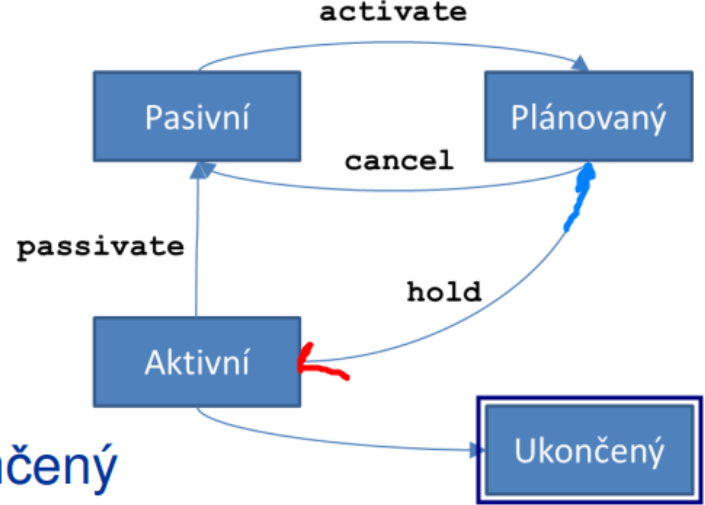

## 22 - Tvorba a parametrizace simulačního modelu, simulace paralelních systémů, okolí simulovaného systému. [KIV/VSS]

**Tvorba modelu**
- Více úrovní modelování (podobně jako třeba při návrhu DB nebo objektovém návrhu):
  - **Konceptuální model**
    - Vysokoúrovňový popis systému
    - Určení stavových proměnných, dynamiky
    - Určení požadované úrovně detailu
  - **Specifikační model**
    - V podstatě obecný návrh programu
    - Určení a chování entit
    - Definice vstupů a výstupů
  - **Výpočetní /implementovaný model**
    - Implementace v konkrétním prostředí (obecný jazyk nebo simulační nástroj)
 
**Ověření modelu**
- **Verifikace**
  - Je implementovaný model konzistentní s specifikačním (tj. je správně implementovaný)?
  - Používá standardní SWI techniky?
  - Nalezena chyba = bug -> snadná oprava
- **Validace**
  - Je implementovaný model konzistentní s zkoumaným systémem (tj. je implementovaný správný model?)
  - Nalezená chyba = model v něčem neodpovídá skutečnosti => jak moc to vadí?
  - Součástí validace je citlivostní analýza:
  - Jaká je citlivost na změny vstupů, Vedou malé změny k diametrálně jiným výstupům?
  - nemusí to být chyba modelu, dává jen vodítko jak moc lze výsledkům věřit
- **Kalibrace**
  - Nastavení atributů entit tak, aby odpovídaly realitě
  - Nastavení invariant, parametrů a aktualizovatelných parametrů
  - Při následné validaci nepoužívat kalibrační data! -> Něco jako při SU se pak nepoužijí ta trénovací
    
**Parametrizace**
- Je potřeba vhodně zvolit:
  - distribuci a dobu zpracování požadavků
  - velikost front
  - intenzity požadavků a obsluh
  - Pravděpodobnosti odbočení (jsou-li v modelu křižovatky)
  - Charakter náhodné veličiny (rozdělení)
  - Trvání simulace (počet požadavků)

**Metoda (pseudo) paralelních procesů**
- Varianta metody interpretace událostí – využití deterministického paralelismu
- Založena na objektové dekompozici simulačního modelu
- Jednotlivé části jsou zapouzdřeny ve vybraných třídách objektů, jejich spouštění zajistí framework (např. v JS to taky
  vypadá, že kód běží paralelně, ale je to jen sekvenční event-based pseudo paralelismus)
- **Objekty**
  - Pasivní – poskytují služby ostatním
  - Aktivní – pracují podle vlastních programů
    - Aktivita procesů se dělí do sekvencí, každá sekvence probíhá v jednom bodě simulačního času
    - Mezi nimi úseky nečinnosti
  - Kalendář pro řízení běhu simulace (jako v OS)
    
**Základní objekty pro simulaci**
- Koncept vychází z jazyka SIMULA
- Procesy je možné zařadit do front
- Obousměrný cyklický seznam
- **Link** 
  - prvek seznamu
  - Objekt, který lze zařadit do seznamu (maximálně v jednom)
  - Into(seznam), follow(prvek),precede(prvek) – vloží prvek do seznamu
  - Out() – vyjme prvek seznamu
- **Head** 
  - hlava seznamu
  - Objekt reprezentující seznam (frontu)
  - Empty, cardinal (délka seznamu), first (získání prvního prvku), clear
- **Proces**
  - Aktivní prvek může vykonávat činnost + obsahuje operační část
  - Potomek Link
  - Generátory – vkládají požadavky do systému
  - Kanál obsluhy – zpracovávají požadavky v systému (zátěž, zpoždění)
  - Operační části vykonávány pseudoparalelně (korutiny)
    - Předávání řízení voláním resume(next), výpočet pokračuje po návratu řízení za resume
    - Předávání dobrovolné, žádná preempce
  - Potom dědí operační část předka – po spuštění dělá nejdřív to, co by dělal i předek
  - Stavy:
    - Aktivní – právě provádí činnost, nemá záznam v kalendáři
    - Pasivní – není určen čas provedení, nemá záznam v kalendáři
    - Plánovaný – určen čas provedení, záznam v kalendáři
    - Ukončený – dokončeny všechny fáze (nelze ho znova naplánovat)
  - Operace: passivate, activate, hold, cancel
  - 
- **Okolí systému**
  - vnější prostředí, do kterého je zkoumaný systém zasazen a se kterým komunikuje prostřednictvím vstupních a
    výstupních vazeb
  - většinou nechceme zatěžovat skutečné prostředí
  - může být simulovaný nějakým mockem nebo náhodným generátorem
    
**Simulace SHO**
- Když to nejde analyticky
- Skutečně požadavky přesouváme mezi buffery atd…
- Aktivní prvky v síti
  - Generátor – Vytváří externí požadavky (přicházející do sítě)
  - Kanál obsluhy (server) – Zpožďuje požadavky v cestě sítí
  - Aktivní měření – Sleduje měřené veličiny v síti – Nepřijímá požadavky
- Pasivní prvky v síti
  - Fronta – Hromadí požadavky
  - Křižovatka – Rozděluje procházející požadavky
  - Výstup – Shromažďuje vystupující požadavky a statistiky
- Pasivní měření – Sleduje procházející požadavky
  - Např. uložit timestamp do požadavku a při opuštění sítě ho porovnat s aktuálním časem ⇒ doba průchodu
    
- **Př.: křižovatka**
  - Procesy: generátor vozidel, semafor
  - Fronty: fronta na semaforu
  - Prvky fronty: vozidla (nejsou aktivní)

**Simulace markovských modelů**
- Markovské modely použitelné
- Nejen pro kanály obsluhy (to je jen jedno z možných použití)
- Náhodný pohyb molekul
- Synchronizace vláken/procesů (bariéra, monitor, producent-konzument)
- Modelování počasí
- Teorie her
