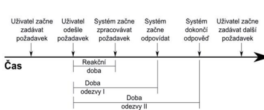
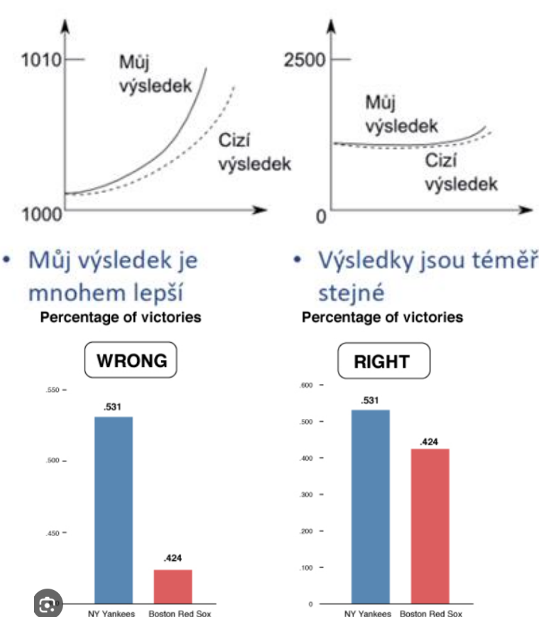

## 23 - Hodnocení a metriky výkonnosti, dostupnosti a spolehlivosti softwarových systémů, způsoby získání hodnot, jejich analýza a prezentace. [KIV/VSS, (KIV/VID)]
viz [#17](17.md) a [#18](18.md)

**Metriky**
- Standardní test = benchmark (viz #23), dále také profiling
- 

**Čas**
- Reakční doba - jak dlouho trvá, než systém začne reagovat
- Doba odezvy I - jak dlouho trvá, než systém začne odpovídat
- Doba odezvy II - jak dlouho trvá, než systém dokončí odpověď

**Výkon**
- **Doba zpracování (obrátky)**
  - pro dávkové úlohy – jak dlouho trvá výpočet od zadání do vrácení výsledku
- **Zrychlení**
  - pro paralelismus – poměr doby odezvy paralelizované úlohy a neparalelizované
  - \+ další metriky (Amdahlův a Gustafsonův zákon, Karp-Flattova metrika)
- **Průtok**
  - počet požadavků za jednotku času
  - úlohy (transakce, dávky …) za vteřinu
  - MIPS (Millions of Instructions Per Second)
  - FLOPS (Floating-Point Operation Per Seconds)
  - pakety za vteřinu
  - Pozor: nemusí nutně korelovat např. s dobou odezvy! Můžeme mít hodně paralelních vláken (=> průtok++), ale
    zpracování jednoho může trvat dlouho…
- **Kapacita**
- U některých systémů je maximální kapacita, kterou když překročíme tak už se průtok požadavků nezvýší, ale
  naopak sníží (zahlcení)
- Případně se přesáhne maximální přijatelná doba odezvy
- **Efektivita**
- poměr využitelné a nominální kapacity
- poměr zpracování výkonu na n procesorech proti výkonu na jednom
- **Využitelnost**
- podíl času kdy jsou zdroje využity ke zpracování úlohy (něco jako zatížení v SHO)

**Paměťová náročnost**
- Profiling, heap dump, monitoring

**Spolehlivost & dostupnost**
- Uvědomit si že to nejsou exaktní čísla, ale jen statistika – i když je střední doba do poruchy rok, neznamená to že to
  nemůže nastat za hodinu
- Střední doba mezi poruchami (MTBF) a střední doba do obnovy (MTTR)
- Střední doba do poruchy (MTTF)
- % dostupnost lze měřit také opakovaným periodickým zkoušením a průměrováním…
- Víc v ASWI a spolehlivost software a procesů

**Analýza a prezentace výsledků**
- závisí na cílovém publiku / zákaznících – většinou nejde o statistiky!
- pokud možno v grafické podobě
  - grafy, tabulky, schémata
  - jasně označit, co je lepší hodnota (nejvyšší, nejnižší, střední?)
  - grafy:
    - nemíchat příliš věcí do jednoho grafu
    - zobrazení spolehlivostních intervalů
    - používání různě velkých piktogramů
    - pozor na přerušené stupnice
    - nevhodný počet buněk histogramu
    - nezávislá proměnná na ose x
    - pozor na švindlování u grafů (počátek os či měřítko)
    - koláčové grafy - součet hodnot jiný než 100% ?
    - zohlednit typ zobrazované veličiny
      - diskrétní - nepřidávat spojnice
      - spojité - pozor na extrapolace,je rozdíl mezi regresí a interpolací, pozor na vhodnost funkce
- popsat, pro co byly výsledky naměřeny
  - typ a konfigurace počítače
  - použitý paralelismus (pokud nějaký je)
  - druh zátěže
- 