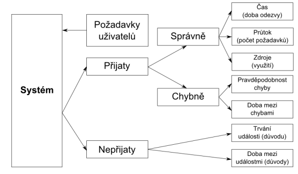
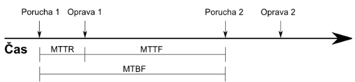

## 24 - Techniky měření výkonnostních a zátěžových parametrů software, zajištění opakovatelnosti testů, benchmarking. [KIV/VSS, (KIV/ASWI, KIV/OKS)]

**Základní pojmy**
- systém = souhrn veškerého použitého HW a SW
- uživatel = entita, která systém využívá (ne nutně člověk)
- metrika = kritérium zvolené pro hodnocení kvality nebo porovnání systémů
- zátěž = požadavky zasílané uživatelem systému
- benchmark = standardní test (program) sloužící k hodnocení výkonu počítačového systému

**Měření v kontextu**
- postupy pro experiment určený k získání informací pro hodnocení výkonu systému:
  - meření
  - analytický model
  - simulace
- Nevěřte ničemu, dokud nemáte alespoň odhad i jinou metodou!
- jestli to co zmerime dava smysl nebo kdyz nam neco nabizi co to vlasnte znamena

- **k cemu je to dobre?**
    - porovnani systemu
    - vhodne nastaveni systemu
    - nalezeni uzkych mist (spise profiling nez benchmark)
        - uzke misto nemusi byt tam kde jsme naprogramovali nejaky slozity algoritmus ale muze to byt napriklad volani knihovni funkce
    - popis systemu
        - nalezeni klicovych vlastosti (nalezeni napr skutecneho `λ` a `μ`)
    - planovani kapacity
    - predpovidani
        - kdy system selze?

- **co se da merit?**
    - rychlost
        - doba odezvy („za jak dlouho je úloha zpracována?“)
          - napr odpoved ze serveru nebo FPS
        - MIPS = pocet instukce za jednotku casu
        - FLOPS = to same ale obsahuje i floating-point instrukce
        - počet operací potřebných k získání výsledku
      - spolehlivost
        - ppst chyby (nema vyznam u SW - nema nahodne chyby)
        - MTTF (mean time to failure)
        - u SW je dulezita metrika MTTR (= restart serveru)
    - dostupnot / pruchodnost
        - napriklad pocet packetu za sekundu
    - cena
        - nakaldy na transakci (napr banky)
          - 
        - spotreba, tepelny vykon (dulezite u Low power zarizenich)

- **zatez**
    - v markovskem modlu je dana hodnotami `λ` a `μ`
    - u benchmarku zalezi na tom co vlastne merime

- **zakladni vlastnosti**
    - opakovatelnost
      - dobře definovaný výchozí stav a podmínky experimentu
      - schopnost reprodukovat všechny potřebné vstupy a interakce (nemusí být snadné)
      - eliminace vnějších (náhodných) vlivů
      - nekdo jiny ho dokaze provest a dojde ke stejnym cislum (vysledku)
      - musime definovat vychozi stav a podminky experimentu (pomerne tezke viz HW vybaveni PC)
      - pokud mame virtual mame nad nim kontrolu? (viz sdilena sbernice)
      - pozor na benchmarkovani externich API (DOS)
    - meritelny vysledek
        - pozor na to co vlasnte merime (aktualizace, preemce, garbage kolekce)
        - pozor na optimaliztor (volatile, `-O0`)
        - hodne mereni prevadime na mereni vzdalenosti (viz teplota)
        - Na čem závisí výsledek?

- **zakladni deleni benchmarku**
    1)  program kvuli kteremu testujeme (realne programy)
        - nejlepsi co muzeme udelat = odpovida tomu co chceme delat
            - kdyz chci vedet jak mi nejaka hra dobre pobezi -> nejlepsi je to vyzkouset na te samotne hre
        - problem srovnavani vice testovatelnych sytemu (nelze opakovatelne stejne nastavit)
    2) specializované (reálné) programy
        - 3D mark
        - "napodobenina" realneho programu
        - vysledek je trochu zkresleny, da se dobre opakovat
        - delate to same jako realny program (chce ho napodobit)
        - existuji dle zamereni (banky, veda, rezervacni systemy, ...)
    3) synteticke benchamrky
        - definovana sada instrukci / operaci ktere nedelaji nic uzitecneho
        - nekdo zmeril kolik % instrukci je scitani, kolik je pristupu do pameti atd nad realnym programem
        - riziko prizpusobenych optimalizaci prekladace (vsichni ten benchmark znaji)
          - viz mereni emisii volkswagen
        - \+ velké množství srovnávacích dat
        - \+ přesná představa o tom, co se vlastně testuje
        - \- nemusejí odpovídat realitě (záleží na zdroji pro statistiku)
        - \- riziko optimalizací překladače
    4) specificke algoritmy
       - neco co dostatecne zatizi PC
       - hlavne testovani CPU (vliv cache pameti a PREKLADACE!!)
         - mohou testovat překladač místo HW, na kterém program běží
    5) jádra
       - klíčové části reálných programů
       - zvláštní aplikace - bankovní databáze, rezervační systémy, vědecké výpočty
       - testy HW - I/O operace, síť, paměť
       - vysokoúrovňová definice - je snadné je konfigurovat a aplikovat na různé architektury

Zaměřeno na testování HW⇒ Pro SW se dají obecné benchmarky vytvořit jen obtížně.

- prehled oblibenych benchmarku
    - zamereno hlavne na HW
        - pro SW se tezko navrhne OBECNY benchmark
    - Erastothenovo sito
        - hladani prvocisel
        - testuje (rychlost pristupu do pameti; jak efektivne mame implementovane pole)
    - Ackermanova funkce
        - testovani efektivity rekurze a zobrazeni velkych cisel na obrazovce
        - jednoduche podminky => ale vytari velice velky strom volani (rekurznivni)
        - A(1,1) = 3; A(2,1) = 5; A(3, 1) = 13; A(4, 1) = 65533 A(4,2) se nevejde na obrazovku
        - test schopnosti překladače optimalizovat rekurzi⇒ nelze převést na jednoduchý cyklus (jako faktoriál) – není primitivně rekurzivní
    - Whetstone & Dhrystone
        - sada instrukci podle statistiky pro vedecke programy
        - muze byt ovlivnen prekladacem
        - aritmetika v plovoucí řádové čárce
        - Řada výsledků pro srovnávání počítačů (zejména starších)
        - metrika:
        - M(W)IPS- počet instrukcí za sekundu
        - MFLOPS- počet floatových instrukcí za sekundu
    - Dhrystone
      - „realističtější než Whetstone“ ,
      - sada instrukcí
        - Operace s celými čísly
        - Instrukce skoku, volání procedur
      - počet proběhnutých cyklů za vteřinu nebo (D)MIPS
    - CoreMark (moderni nahrada za Dhrystone)
    - LINPACK
        - knihovna pro reseni soustav linearnich rovnic
    - Debit/Credit
        - benchmark pro DB (bankovni system)
        - definovane DB schema + sada transakci
        - definice pouze high-level (podle popisu si musime udelat sami implementaci)
        - testování využití celého PC (testy: komprese videa, výkon disků, apod.)
    - TPC-C V5
        - zohlednuje velikost DB (pocet zaznamu)
        - meti pocet transakci za sekundu
        - musme dotazy dynamicky generovat jinak hrozi ze se nacachesuje
    - SPEC Suite
        - sada ruznych realnych programu
        - testovani ruznych komponent PC (CPU, GPU, RAM, ...)
        - existuje i test co meri vykon JRE
    - 3DMark
      - testování GPU a CPU pro PC hry
    - existuje hromada dalsich benchmarku

- navrh experimentu
    - cilem: s minimalnim usilim zistkat maximum informace
    - potrebujeme presne definovat co na danem systemu pobezi
        - musime definovat i posloupnost kroku (tak aby byl experiment opakovatelny)
    - je nutne si urcit hranice
        - co vsechno je nas system
        - co vsechno je vnejsi svet okolo (nemame pod kontrolu, jsme na tom zavisly)
    - volba metriky
        - co nas doopravdy zajima v nasem systemu (spotreba? cena? dostupnost?)

            

        - musime si definovat co to je doba odezvy
            - system zacne odpovidat? nebo posle vsechna data? nebo jen cast? (koukani na film na Netflixu)
        - nominalni (maximalni) kapacita
            - maximum dosazitelne v idealnich podminkach
        - vyuzitelna kapacita
            - maximum dosazene se zachovanim pozadaovane doby odezvy
        - efektivita, vyuzitelnost
        - spolehlivost
            - MTTR, MTTF, MTBF

                

    - definice toho co / kdo je uzivatel
    - definice zateze
        - realna: zatez zachycena nebo odvozena od behu skutecneho systemu
        - synteticka: snadna modifikace, prenositelnost, podobna realne zatezi
        - popis zateze
            - prumer, orchylka, rozeleni, histogramy (napr casy kdy lidi koukaji ja Netflix)
            - muzeme si napsat random generator zateze dle daneho ppstniho rozdeleni
            - muzeme byt take popsan stavovym automatem (chovani uzivatele)
    - muzeme udelat analyticky model a odhadnout jak se system chova abychom dokazali overit ze vysledky davaji smysl
        - nebo muzem odhad udelat ze simulace
    - urceni cilu: interpreteace vysledku (napr jake ze dvou CPU chci pouzit)
    - parametry vs faktory
        - parametry: charkterizuji system (vlasnosti) a nemeni se behem prace
        - faktor: parametr v systemu ktery se muze menit v case
            - defakto si zvolime jeden parameter jako faktor ktery pak menime v case a koukame jak to ovlivnuje cely system
            - napr velikost RAM, pocet uzivatelu, atd
    - pozor pokud benchmark bude generovat velke mnozstvi dat aby je bylo kam ulozit
        - je lepsi ukladat surova data a az pak delat analyzu
    - pro jeden benchmark muzu mit vice konfiguraci (ruzne typy zateze)
    - analyza vysledku (stredni hodnota, vazeny prumer, median, rozptyl, graf, histogram)
        - median lepe "ignorue" outliery (extermy)
        - prumer je extremama ovliveny
        - aritmeticky prumer
            - pro hodnoty ktere jsme merili primo (napr doby trvani)
        - harmonicky prumer
            - pokud mame metriky v prevracene hodnote (napr MIPS; v Hz) => musime pouzit harmonicky prumer
        - KORELACE NENI KAUZALITA!!!

            - to ze jsou data korelovane neznamena ze je mezi nimy nejaka zavislost (muze to byt jen nahoda; maji podobny tvar)

            

        - podminena ppst
            - senzitivita testu: ppst ze vysledek bude TRUE pokud je osoba fakt nakazena
            - specificita testu: ppst ze je vysledek FALSE pokud neni osoba nakazena
            - prevalence jevu: procento vyskytu chodoby (kolik lidi je nakazeno)
    