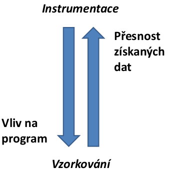
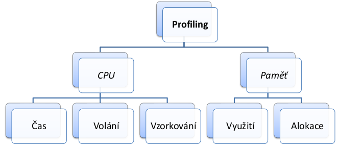
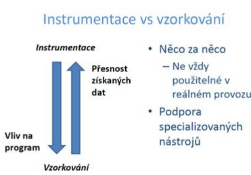

## 25 -  Metody, modely a nástroje pro statickou a pro dynamickou analýzu software. Použití pro ověření spolehlivosti, výhody a omezení. [KIV/VSS]

**Statická analýza SW**
- určení vlastností SW za využití metod, které jsou aplikovány bez spuštění analyzovaného programu
- analýza zdrojového kódu, popř. objektového kódu
- snaha odhalit nedostatky kódu a snížit tím náklady na opravu chyb
  - hledání chyb, které by se mohly vyskytnout při běhu(NRE, přetečení / podtečení zásobníku, dělení nulou…)
- napomáhá k udržování kvality kódu během vývoje - varování překladače

**Metody**
1) Manuální
   - Technická oponentura (Faganovská inspekce)
     - někdo prezentuje kód, oponenti vznáší připomínky a hledají problémy moderátor usměrňuje diskusi
     - cílem je odhalit chyby a zároveň sledovat dodržování standardů, případně vzdělávání nováčků
   - Strukturované procházení
     - podobné technické oponentuře, menší důraz na formálnost
   - Peer review
     - kontrola nezaujatým člověkem
     - autor prochází kód a vysvětluje
   - Párové programování
     - Na kódu pracují společně dva programátoři. Zatímco jeden píše kód (řidič), druhý (navigátor) přemýšlí
       o souvislostech přidávaného kódu, zda je to optimální řešení a podobně.
     - Oba programátoři spolu neustále komunikují a vzniká tak rychlá zpětná vazba.
     - Programátoři si své role v páru střídají.
2) Automatické
   - Data flow analysis
     - jak data procházejí kódem - možné výsledky (hodnoty) proměnných a jejich šíření dále kódem
   - Cyklomatická složitost
     - podmínková složitost - komplikovanost metody (větvení)
     - počet lineárně nezávislých (možných) cest skrz zdrojový kód
     - výsledkem je kladné celé číslo, čím větší, tím horší
   - Dodržování standardů -> zda se v kódu nevyskytují nebezpečné notace

**Nástroje**
- lint - statická analýza C/C++, odhalení potenciálně nebezpečných částí kódu
- cppcheck - statická analýza C/C++
- pmd - nejen pro Javu,
- Misra C- standard psaní kódu pro C, existuje i Misra C++
   
**Výhody**
- včasná detekce chyb - označí přímo řádek výskytu chyby, člověku by mohlo trvat dlouho nalézt (např. if(x = 5) místo if(x
  == 5))
- dodržování standardů, kvality kódu
- může odhalit něco, co se testováním přehlédne - např. neotestované větve
  
**Nevýhody**
- falešná pozitiva - generují mnoho varování, která nejsou relevantní
- u velkých projektů mohou trvat dlouho

**Dynamická analýza SW**
- Účel dynamické analýzy je pozorování a hodnocení chování aplikace (většinou za běhu)
- Dynamická analýza aplikací zprostředkovává důležité informace během pozdějších fází vývoje
- Napomáhá při ladění, výkonnostní optimalizaci nebo při detekci bezpečnostních chyb – při vývoji i v produkci
- Formy:
  - Profilování – hledá co spotřebovává zdroje (viz dále)
  - Benchmarking
  - Ukazatele výkonnosti a spolehlivosti systému
    - Většinou měření (to je ta dyn. analýza) → model → výpočet ukazatelů
  - Metriky založené na chybách
    - dělení chyb dle severity a dle příslušnosti ke komponentám + další info
  - Metriky založené na testech -> počet testů/počet spadlých testů
  - Metriky založené na pokrytí kódu
    - jedna z nejpřesnějších metrik, nemusí však přesně vypovídat o funkčnosti aplikace
    - Druhy pokrytí: řádků, metod, cest, cyklů atd.

**Profilování**
- benchmark: blackbox
    - typicky porovnavani nejakych variant
- profiling: whitebox (mame plny pristup)
    - analyza vlastniho programu
    - mame mnohem vice dat
    - zakladnim cisel je optimalizace
        - zjistit co zabyra nejvic casu, zdroju (pameti), ...

            

    - profiler se diva do nasi aplikace a jeji pameti (externi nastroj)
        - pozor na antivirus
    - casto integrovane v IDE (pro vyvoji)
    - sledovani bezici applikace (za behu; pozor abychom nerozbili produkcni prostredi)
- Vyhledávání míst v programu, které jsou vhodné pro optimalizaci – co spotřebovává zdroje
- Pomocí profilerů, za běhu programu
- Možnosti: doba běhu jednotlivých metod, četnost volání metod, paměťové statistiky, memory/heap dump
  - Hledání úzkého hrdla
  - Hledání memory leaků
  - Hledání velkých objektů
- Java nástroje: JProfiler, Java Flight Recorder, jconsole, VisualVM…
- Profiling vs Benchmarking
  - Není to totéž
    - Benchmarking – porovnání variant, blackbox ⇒ užitečné pro HW i cizí SW
    - Profiling – analýza, proč se program nějak chová, whitebox ⇒ užitečné pro vlastní SW
      
**Pozice profilování**
- Ve vývojářském prostředí
  - během vývoje (často přímo v IDE)
  - stack, který má vliv na výkon nemusí odpovídat realitě
    - plná kontrola nad činností
    - lze zkoušet cokoliv
- Po nasazení
  - sledování nasazené a běžící aplikace ⇒ je třeba postupovat opatrně a nenarušit běh aplikace pro klienty
  - realističtější provoz, ale obtížnější na zvládnutí
    - obtížné zajištění opakování podmínek testu
    - sbírání chybových dat, optimalizace – Windows, Eclipse, … (žádosti při instalaci)
      
**Technické podoby profilování**
            

    
- **Instrumentace**
  - pred spustenim se kouknem do binarky a pridame do nej sledovaci metody (pridame instrukce)
  - Založena na přidání instrukcí, které se starají o měření
  - Obvykle před spuštěním, případně za běhu u (polo)interpretovaných jazyků
  - Typy instrumentace:
    - Manuální (programátor si ji tvoří sám – „log“)
    - Zdrojové texty (automaticky doplněná na sledované body, aspektové programování...)
    - Překladačem doplněná (např. v gcc)
      - Binární instrumentace
        - Vložení nových instrukcí do spustitelného souboru / mezijazyka (bytecode)
          - Před spuštěním překladačem / profilerem
          - Za běhu, před provedením instrukcí
        - Využití
          - Řízený běh
            - s programem běží celý profiler
            - doplněné instrukce jako sondy
          - Injekce
            - jen doplnění speciálních volání
            - méně náročné na výkon
- Výhody
  - přesnost
- Nevýhody
  - modifikuje program – může skrýt / způsobit některé bugy (naruší časování vláken, souběhy v úzkých místech)
  - ovlivňuje výkon programu – zátěž navíc

- **Vzorkování**
  - za běhu
  - memory dump, stack trace, instrukce v CPU, ...
    - napr JRE ma API pres ktere se muzeme doptavat co prave dela
  - Metoda statistické profilace
  - V určitých intervalech se zaznamenává stav programu
    - Podobně vzorkování paměti
  - Horší přesnost × méně náročné
  - Program proběhne příliš rychle ⇒ nestihnu odebrat reprezentativní vzorky
  - programek `jstack <pid>`
    - `jmap <pid>` vytvori dump
    - presnost zalezi na periode vzorkovani (muze nam neco uniknout)
    
    - 

    - 

- **Událostní**
  - Interpret má nějaké API a podporuje hooky – lze vytvořit vlastní profiler
    - Snazší u interpretovaných jazyků, jedna z jejich výhod
  - Může vykazovat podobné vlastnosti jako instrumentace
- 

- **Výstupy z profileru**
    - profil
        - staticky popis (souhr) informace o behu aplikace
        - napr kolik metod bezelo, jak dlouho kazda metoda bezela atd
    - trasovani
        - posloupnost sledovanych udalosti
        - defakto log soubor
        - dulezite pro vicevlaknove aplikace
    - pametove statistiky
        - struktury a jejich cetnost
    - memody dump
        - kopie cele pameti nekam ven kde ji pak muzeme dal analyzovat

- podobny problem jako bencmarkovani
    - izolace experimentu, stanoveni cilu, soustredeni na dulezite veci (viz komplikovane algoritmy vs pristup do DB)
- slouzi k nalezeni uzkych mist
- best practices
    - dusledne vsechno verzovat (zmeny, testy, konfigurace)
    - porad testovat (unit testy)
- uzivatele a vykon
    - uzivatele nemaji radi kdyz se jen toci kolecko, chteji videt progressbar
- mozna urychleni Javy
    - zpracovani vyhjimek je drahe
    - cteni / zapisy ze souboru
    - optimalizace pristupu do DB
        - urychleni napr pomoci cache, indexy nad sloupci (implementace pomoci B stromu), ...
        - dobre je take timeoutovat sessions (problem hlavne po nasazeni aplikace)
    - uvedomit si casove / pametove slozitosti pouzitych datovych struktur
    - frameworky jsou vetsinou postavene nad reflexi -> bottleneck
- existuji loggovaci nastroje ktere umoznuji monotirovani Java serveru