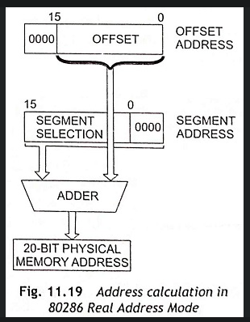

### 01 - Jádro operačního systému a uživatelský režim procesu, zavedení vybraného typu jádra a uživatelského procesu. [KIV/OS, (KIV/ZOS)]

- Jadro (kernel) OS
  - = cast OS ktera pri spusteni pocitace jako prvni zavedena do operacni pameti (= RAM)
    - predpoklada se klasicka Von-Neumannova architecktur
    - mikrokontrolery jsou typicky Harvardska architektura kde ne vsechnen kod bezi z RAM ale typicky z flash pameti (= ROM)
  - po zavedeni jadra je mu predano rizeni (kontrola nad CPU)
    - pokrauje dal v inicializaci (zavedeni ovladaci HW atd.)
  - jadro OS ma dva hlavni ukoly - planovani procesu a rizeni pristupu ke zdrojum (pamet, drivery, ...)
  - uzivatelske procesy komunikuji s jadrem pres systemove volani
    - implementace napr pomoci preruseni
    - `EAX` = cislo sluzby (co po jadru chceme)
    - dalsi registry = parametry spojene s danym volanim
    - `INT 0x80` = syscall (0x80 je specificky pro Linux, obecne muze byt libovolne cislo)
      - volani pres INT je legacy kod (zpetna kompatibilita); x86-64 pouziva defaultne instrukci `syscall`
  - jadro kernelu je pokud je to mozne oddena od pameti uzivatelskych procesu (bezpecnost)
    - pokud reseno pres strankovani => pri pokusu o pristup do kernelovskeho adresniho prostoru z uzivatelskeho procesu vyhodi procesor vyjimku (page fault + cislo chyby)
  - jadra jako MS-DOS ktera nepodrporuji preemtivni planovani pak predaji kontrolu nad HW jinemu procesu
  - typy jadra OS
    - monoliticka (napr. Linux)
      - kernel i ovladace bezi v CPL0 (= Current Privilege level)
      - => spatne napsany driver muze shodit cely system
      - typicky obsahuje i souborovy system
    - mikrokernel (napr. Mach mikrokernel pro Apple MacOS)
      - cilem je minimalizovat mnozstvi kodu ktere bezi v CPL0
      - kernel obsahuje pouze: planovac, memory management a IPC (Interprocess Communication)
      - systemove volani vyzuje vice prepinani CPL
        - uzivatelskyc proces (=> CPL3) zavola sluzbu kernelu (=> CPL0), kernel deleguje pozadavek na prislusny server (=> CPL1/2), server odpovi kernelu (=> CPL0), kernel odpovi uzivatelskemu procesu (=> CPL3)
        - lze optimalizovat pres coalescing = pozadavky budeme ukladat do buffereru a potom je obslouzime vsechny najednou
    - hybridni (napr. Windows)
      - kombinace preschozich dvou
      - postupne sesnazime odebirat nekriticke veci z kernelu

- protected rezim CPU
  - od Intelu 80286 vsechny CPU podporuji dva rezimy behu - real-mode (legacy) a protected
  - real-mode (16 bitovy rezim)
    - neposkytuje zadnou izolaci kernelu a procesu
    - vsechny x86 CPU startuji v real-modu (zpetna kompatibilita)
      - dnes asi pomerne zbytecne, stejne hned prepneme do protected modu nebo long modu
      - UEFI muze prepnuti provest sam, ale bootloader OS s tim musi pocitat (aby nebyl napsany pro 16 bitovy rezim nebo tak neco)
    - umoznuje adresovat pouze pomoci 20b (2^20 = 1MB pameti)
    - adresace: `segment:index` (segment i offset maji 16b)
    - `addr = (segment << 4) + index`

      

  - protected mode (32 bitovy rezim)
    - CPU (80386+, 80286) ma 24 bitovou adresni sbernici (2^24 = 16MB)
    - jine CPU ktere maji 32 bitovou adresni sbernici => adresace az 4GB
    - PAE (= Physical Address Extension)
      - predchudce 64 bitoveho rezimu
      - zapina se extra
      - umozuje adresaci > 4GB rozsirenim adresy o 3 bity
    - prepnuti do protected modu vyzaduje nastaveni GDT (pro kernel) a LDT (pro proces)
      - pro adresaci pouzivame segmentove registry (= segment selector)
        - odkazuje na segment descriptor ktery obsahuje info o danem segmentu pameti: base, limit, typ (kod, data, ...), ACL prava, DPL (2 bity urcujici uroven opravneni = CPL)
      - CS (code), DS (data), SS (stack), ES (extra)
      - adresace napr. : `CS:IP`, `SS:SP`
      - pote co mame vytvorene tyto dve tabulky nastavime bit `PE` (= Protected Mode Enable) v `CR0` (Control Register) na 1 a jsme v protected modu :)
  - long mode (64 bitovy rezim)
    - x86-64 vyuziva k adresaci pouze spodnich 48 bitu (i tak dost GB)
  - unreal mode
    - neni oficialne dokumentovany
    - spusteni programu v protected modu vyzaduje nastaveni GDT a LDT (globalni a lokalni tabulka deskriptoru) => rozdeli pamet na segmenty
    - prepneme se do proteced modu a nastavim limity na max (cely adresni prostor bez strankovani)
    - po prepnuti zpatky do real modu (nyni unreal mod) se zachovavaji limity pameti => muzeme pouzivat 32 bitove indexove registry pro adresaci
      - `SI` (source), `DI` (destination), `BP` (base pointer), `SP` (stack pointer)

- uzivatelsky rezim CPU
  - proces typicky bezi v uzivatelskem rezimu CPU (pokud OS podporuje protected mode) => ma vlastni adresni prostor (mysli si ze ma k dispozici 4GB)
    - typicky reseno pres strankovani (virtualni adresni prostor) => adresa 0x0 v danem procesu neni fyzicka adresa 0x0
    - pri pokusu o zapis/cteni stranek kernelu vyhodi page fault s cislem chyby = neopravneny pristup
      - kernel se musi mapovat do adresniho prostoru kazdeho procesu jinak bychom ho pri prvnotim prepnuti do usespacu ztratili protoze se pouziva CR3 (adresa tabulky stranek) daneho procesu
  - v uzivatelskem modu nejsou privilegovane instrukce povoleny
    - napr. `CLI/STI` (clear-set insterrupts), `IN`, `OUT`, `HLT`, `LLDT` (load local descriptor table) atd.
    - pri pokusu o exekuci se vyhodi vyjimka
    - => uzivatelsky proces nema primy pristup k HW a je odkazan ciste na systemove volani nebo drivery v userspacu, ktere nasledne pouzivaji systemova volani
  - zavedeni uzivatelskeho procesu
    - z disku se nacte binarka (napr ELF na Linuxu)
    - pripravy se novy adresni prostor
      - nakopirujou se stranky kernelu
      - nastavi se opravneni jednotlivych stranek
      - z ELFu se prekopiruje `.text` sekce a data (na adresy defonovane v ELF souboru)
    - nastavi se registry - `SS:SP`, `CS:IP`
      - prvni instrukce je z `CRT0` (`.init`)

- zavadeni MS-DOS
  - po zapnuti je 80286 v real modu => muze adresovat pouze 1MB
  - `CS:IP` registry jsou nastavene na `F000:FFF0` = prvni instrukce ROM-BIOSu
  - zacnou se vykonavat instrukce BIOSu ktery zacne hledat disky
  - pro kazdy detekovany disk v systemu nacte jeho prvnich 512B (= MBR - Master Boot Record) na nejakou adresu v operacni pameti
    - prvnich 440B je bootstrap
  - provede se skok na prvni instrukci MBR bootstrapu ten prohleda jednotlivy oddily (partitions) a pokusi se najit bootovatelny oddil
  - az ho najde, nacte zbytek bootloaderu => to muze byt OS loader nebo treba GRUB pro vyber OS
    - nacitat se muze napr z VBR (Volume Boot Record)
    - MS-DOS vyzaduje aby byl pouzit FS FAT
  - nacteny bootlaoder zacne nacitat kernel MS-DOS (tvoren soubory IO.SYS a MSDOS.SYS) ktere jsou ulozeny hned za sebou v prvnim sektoru daneho oddilu protoze je loader moc pomaly na to aby implementoval nejaky FS
  - jakmile jsou oba soubory nactene do operacni pameti skoci se na prvni instrukci IO.SYS
  - IO.SYS zajisti inizializaci I/O a preda rizeni MSDOS.SYS
  - MSDOS.SYS nacte CONFIG.SYS (pokud existuje) aby mohl nacist dalsi ovladace (mys, CDROM, zvykova karta, ...)
  - pote spusti COMMAND.COM (interpreter), ktery spusti AUTOEXEC.BAT
    - BAT obsahuje davkove prikazy
  - C:\> DONE
  
  - Jak ale zavedeme kernel > 1MB kdyz jsme v real modu? => viz unreal mode
    - drive pokud byly programy > 1M se pouzivaly memory managery jako XMS a EMS ktere prepnou CPU do 32 bitoveho rezimu a zustanou tam
    - poskytuji API pogramum v real modu pro kopirovani 64kB bloku pameti nad 1MB
    - take se pouzivaly overlays
      - program se dekomponuje do stromove struktury (volani funkci)
      - moduly se pak postupne nacitaji do pameti dle potreby (musi explicitne zajistit programator)
      - uchovava co nejmene kodu v operacni pameti abychom nepresahli 1MB!!

- UEFI
  - nastupne BIOSu
  - funguje v podstate stejne jako BIOS => najde disk s OS, nacte a spusti soubor z disku
  - umoznuje zajistit integritu spusteneho souboru
  - vyuziva GPT (= GUID Partition Table - nastupce MBR)
    - MBR ma limit 2TB, GPT ne
  - pouziva EFI binarky pro nacteni OS
    - nahrazuje treba bootloader => vic bezpecne
