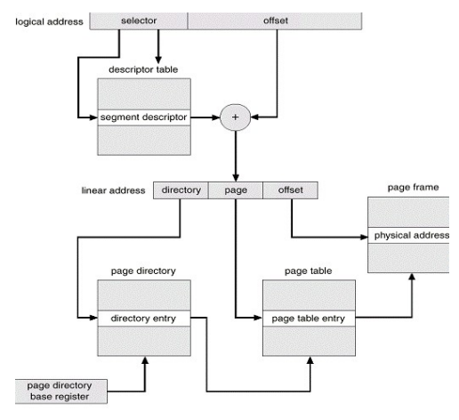
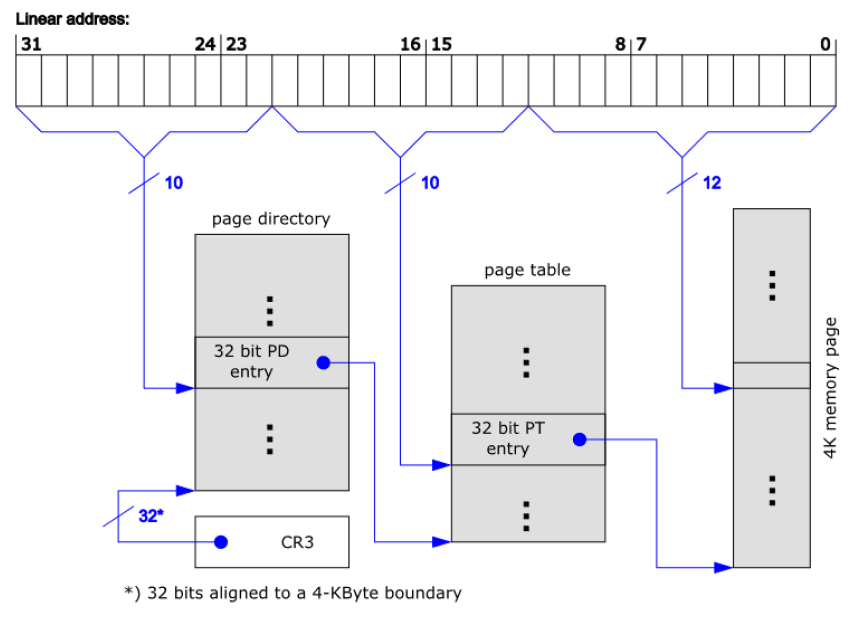
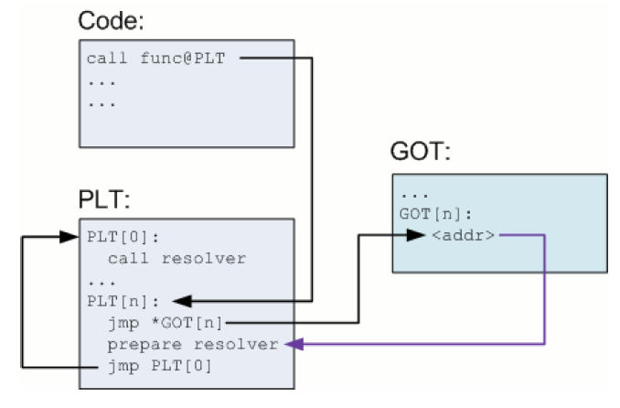

### 02 - Virtuální adresový prostor – implementace sdílené paměti, sdílených knihoven a copy-on-write. [KIV/OS, (KIV/ZOS)]

- virtualni adresni prostor
  - umoznuje kazdemu procesu byt umisten na arbitrarnim miste ve fyzicke pameti (= realokace)
  - pro proces existuje jeden adresni prostor - virtualni pamet ("mysli si ze ho ma cely pro sebe" a muze pocitat s tim, ze zacina na adrese 0x0 - nastaveno pomoci linkeru)
  - mapovani adresniho prostoru zajistuje MMU (Memory Management Unit)
    - SW preklad by byl prilis pomaly protoze se deje s kazdou R/W operaci (=> zavedeny optimalizace jako cachovani pres TLB)

- segmentace
  - segment = virtualni adresni prostor (block) ruzne velikosti
  - rozdeleni na segmenty respektuje logickou strukturu programu/OS
  - kazdy segment muze mit ruzne pristupova prava (RWX)
  - pokud jsme v protected modu, pouzivame segmentove selektory
  - selektor segmentu urcuje jakou tabulku pouzit - jestli GDT (adresa ulozena v GDTR) nebo LDT, index do tabulky (dle typu segmentu) a request privilege level
  - selektor v tabulce ukazuje na deskriptor segmentu ktery obsahuje vice informaci - bazi, limit, privilege level (DPL)
  - pristup do pameti je pak realizovan pomoci kombinace selektor + offset
  - v x86 jsou nasledujici registry segmentovych selektoru - `CS`, `DS`, `SS`, `ES`, `FS`, `GS`
  - adresa v pometi je pak prefixovana selektorem napr `CS:IP`
  - vyhodou segmentace je HW izolace kernelu a procesu
  - take to umoznuje sdilet segmenty mezi procesy (napr read-only sdilene knihovny)
  - long-mod defaktor segmentaci nepodporuje (baze vsech segmentu je nastavena na 0 a limit na 2^64 => prekryvaji se a pokryvaji cely adresni prostor)
    - FS pak pouziva OS - napriklad `GS` ve Windows muze ukazovat na TEB (= Thread Environment Block)
  - nevyhody segmentace
    - obecne problemy s alokaci segmentu pri zmenach velikosti a mozna fragmentace
      - algoritmy pridelovani volneho bloku: first-fit, last-fit, best-fit
    - rezije pri pristupu do pameti (preklad adres)

- strankovani
  - strankovani se snazi eliminovat problemy segmentace
  - rozdeluje celou pamet na bloky stejne velikosti - typicky 4kB, 2MB, 4MB, 1GB
  - zavadi pojmy page a frame
    - maji stejnou velikost
    - page je logicky (virtualni) blok pameti ktery je mapovan na fyzicky frame (ramec) dle tabulky stranek kterou vytvari kternel a muze se tudiz lisit dle OS (viz x86 a KIV-RTOS - napr mapovani BCM2835 periferii)
  - na x86 tabulka stranke je ulozena v operacni pameti a ukacuje na ni register `CR3`
    - menit ji muze pouze kernel (CPL0)
  - na ARMu je ulozena take v RAM a ukazuje na ni register TTBR0 (= Translation Table Base Register 0), ktery je ulozeny v CP15 ( = System Control Coprocesoru)
    - ukladat tabulku stranek do ROM (napr flash) nedava moc smysl protoze se napr u mikrokontroleru flashky zamikaji a take maji omezenou zivotnost co se tyce poctu zapisu
  - kazdy zaznam v tabulce stranek obsahuje
    - privilege level (user/kernel), pristupove flagy (R,W,X), stavove bity (dirty, acceesed, present) a adresu samotneho fyzickeho ramce kam je namapovana
      - dirty a acceesed bity se pouzivaji pri swapovani (jakou stranku odlozit napr. na disk) - Round Robit, LRU (least recently used), MRU (most recently used), ...
  - strankovani muze byt vice urovnove - v praxi potrebujeme tabulku stranek nacist do MMU a 4kB tabulka stranek muze obsahovat pouze 1024 stranek => proto potrebujeme vice uroven strankovani
    - adresa ramce odkazuje na vnorenou tabulku stranek
    - je rozumne vybalancovat uroven zanoreni a velikost stranky
      - cim mensi velikost stranky => tim vic levelu potrebujeme (vetsi rezije)
      - vime vetsi velikost stranky => tim mene levelu potrebujeme (nemame takovou granularitu)
    - pro frame = 4kB => virtualni adresa = 32 bitu
      - 10 bitu = page table
      - 10 bitu = page
      - 12 bitu = offset v ramci stranky
    - pro frame = 4MB => virtualni adresa = 32 bitu
      - 10 bitu = page table
      - 22 bitu = offset v ramci stranky

- procesy typicky pracuji s omezenou mnozinou stranek = working set ktery muzeme cachovat pro zrychleni
- TLB (= Translation Lookaside Buffer)
  - po vypoctu fyzicke adresy ulozit do cache (u dalsiho pristupu uz nemusime preklad provadet znova)
  - pri prpnuti kontextu je nutny flush (adresy jsou neplatne v adresnim prosotu kam prepiname)
- page fault
  - proces se snazi pristoupit ke strance, ktera neni ve fyzicke pameti
  - => MMU vyhodi vyjimku, kernel ji zachyti, pokusi se najit volny frame (pokud neni pouzije RR/LRU/MRU pro swap jine stranky na disk aby se uvolnilo misto pro stranku kterou aktualne adresujeme) a nacte do nej stranku
  - proces je opet naplanovan a pokracuje v exekuci jako by se nic nestalo
- swapping
  - pokud chceme data ulozit nekde jinde nez v pameti - typicky na disk nebo na nejake sitove uloziste
  - fyzicka pamet je omezena (napr. Rpi Zero ma jen 512 MB operacni pameti) => chceme v ni mit jen working set
  - to jestli je stranka dostupna v RAM nebo odlozena na disku je ulozenovo v page table entry - present bit
  - to jake stranky presuneme na disk resi replacement algoritmy

- segmentace se strankovanim
  - kombinace obou principu kde nejdriv dojde k prekladu adresy pres segmentaci -> ta nam da linerani adresu kterou pouzijeme jako vstup pro mechanismus strankovani
  - v soucasne dobe se od segmentace spise opousti

- sdilena pamet a knihovny
  - sdilena pamet je efektivni zpusob jak sdilet pamet mezi procesy
  - v pripade strankovani kernel pouze namapuje stejny ramec do adresnich prostoru dvou ruznych procesu a samotnout konzistenci uz si pak hlidaji procesy sami
  - sdilene knihovny lze resit podobnym zpusobem
    - staticky knihovny (`.lib`/`.a`) jsou nedilnou soucasti exe
    - dynamicke knihovny (`.dll`/`.so`) jsou samostatne doubory
      - nacitany dynamicky na zadost procesu
      - OS si pamatuje kolikrat je knihovna nactena (odebrani z pameti je az pote co ji posledni proces unloadne - `dllclose()`/`FreeLibrary()`)
  - kvuli tomu jak je ve Windows implementovany resolving dynamickych knihoven podle cesty muze dojit k hijakingu
  - pri inicializaci DLL se provede `dllmain()` (ve Windows)
  - protoze knihovna muze byt zavedena na ruznych mistech, je potreba kod ktery ji pouziva nebyl zavisly na pozici knihovny ve virtualni pameti (fixed function address) => PIC (Position Independent Code)
  - Jakmile je knihovna nactena, je potrebova resolvovat adresy jednotlivych funkci/symbolu
    - programator potrebuje znat signaturu funkci (pouzije se mangling a dle toho se vyhleda prislusny symbol v ELF? (Linux))
    - ve Windows `GetProcAddress()` - jako jeden z parametru bere nazev funkce/symbolu
  - programator deklaruje funkce jako imporovane pokud pochazi z DLL (`__declspec(dllimport)`)
    - knihovny k sobe maji typicky header file ktery uzivatel includuje ve svem build systemu ktere tyhle signatury jsou oznacene jako import
    - vyvojar knihovny je zase musi oznacit jako `__declspec(dllexport)` protoze na Windows nejsou symboly exportovany implicitne (jako tomu je napr. na Linuxu kde se tohle resit nemusi)
    - jednotlivy symboly jsou timto oznacenim pridane do PLT (Procedure Linkage Table)
    - `GetProcAddress()` zajisti resolvovani adresy symbolu
    - program pak dynamicky resolvuje importovane symboly na fixni adresu
    - PLT typicky odkazuje na GOT tabulku (= Global Offset Table) ktera obsahuje realne adresy
    - timto zpusobem je vlastne adresa dereferencovana 2x (neco jako `vtable` u virtualnich funci v C++)
  - adresu symbolu/funkce neni treba resolvovat okamzite => lze to udelat az kdyz je potreba = Lazy binding

  

  1) proces zavola funkci `n` dane DLL knihovny, tedy funci na adrese `PLT[n]`
  2) `PLT[n]` odkazuje na zaznam v GOT tabulce - `GOT[n]`
  3) adresa funkce je zatim neznama => `GOT[n]` obsahuje skok zpet do `PLT[n]` aby se inicializoval a aktivoval resolver daneho symbolu se spravnymi parametry
  4) resolver najde adresu daneho symbolu, zapise ji do `GOT[n]` a rovnou provede skok do dane funkce (protoze to je co programator pozadoval)
  5) pri pristim volani uz neni treba resolvovat -> provede se skok do `PLT[n]` odtamtut se skoci do `GOT[n]` kde uz ale je ulozene adresa funkce => neskocime zpet do `PLT[n]` ale rovnou do dane funkce

  - GOT je privatni pro proces v datovem segmentu => to umoznuje provest ASLR = randomizaci adresniho prostoru aby nebylo mozne vyuzit apriori znamych adres k utoku

- Copy-on-Write
  - pokud procesy sdili data (napr pres sdileny ramec) ale udelaji privatni zajisti se vytvoreni kopie pro dany proces
  - kernel oznaci stranku jako read-only
  - dokud proces jenom cte => vse OK
  - jakmile se pokusi zapsat, CPU vyhodi vyjimku, kernel vytvori RW kopii stranky pro dany proces a namapuje ji do jeho adresniho prostoru misto stranky ktera byla sdilena => proces zapise data jakoby se snic nestalo
  - pouziti: pokud nekolik procesu sdili stejna data ale jen nektere je muzou i modifikovat
    - naivni pristup by bylo data duplicitne nakopirovat do jednotlivych adresnich prostoru => neefektivni z pohledu vyuziti pameti
    - technikou copy-on-write se data naklonuji jen kdyz to je potreba
