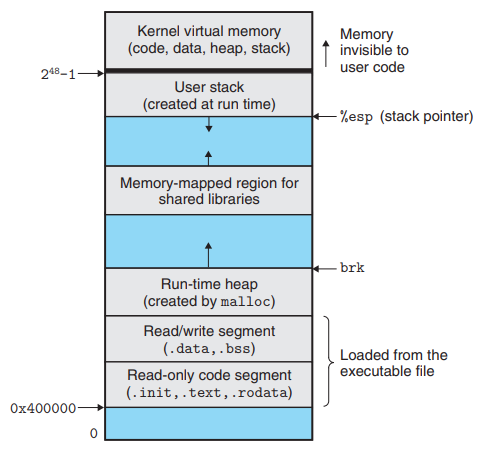
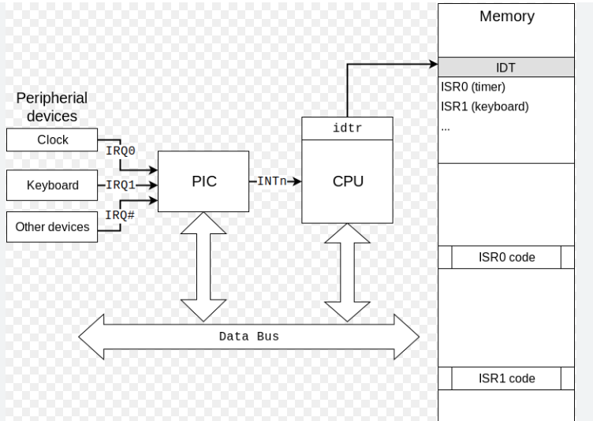
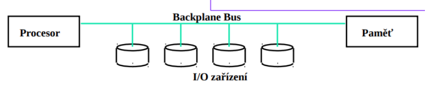

### 03 - Přerušení, systémová volání, výjimky, V/V zařízení – jejich implementace a obsluha. [KIV/OS, (KIV/ZOS)]

- preruseni
  - = mechanismus ktery umoznuje vyvolavat asynchronni udalosti a reagovat na ne (stitk klavesy, tik timeru, dokonceni DMA prenosu, ...)
  - SW preruseni se pouziva pro implementaci systemoveho volani
    - instrukce `INT` na Intelu
    - instrukce `SWI` na ARMu
  - obsluhu presuseni zajisti prislusna rutina => je treba vedet jakou zavolat => presuseni jsou cislovana a slouzi jako index do IDT (= Interrupt Descriptor Table)
    - v real-modu (a defaultne ne ARMu) je umistena na zacatku operacni pameti 256 x 4B (2B segment, 2B offset) = 1kB
    - v protected-modu je tam kde na ni ukazuje IDTR
  - presuseni lze vola vicero zpusoby
    - SW preruseni
    - HW preruseni IRQ
    - exceptions jsou defakto forma presuseni (= vnitrni preruseni)
      - deleni 0, page fault, chyba HW
      - trap, breakpoint, fault/recoverable error, abort/unrecoverable error
      - double fault je kdyz se ma zavolat obsluzna rutina, ktera neni implementovana/dostupna
      - triple fault = chybi handler pro double fault
  - preruseni muze menit CPL => hodi se pro implementaci sycallu
  - pokud dojde k preruseni => skoci se na adresu dle IDT (pouzita jako lookup tabulka)
    - na ARMu je v tabulce vektoru preruseni primo vykony kod (typicky instrukce skoku) => "dvojity skok" => pomalejsi nez Intel?
    - nektere obsluhy musi byt rychle - napr obsluha timeru - planovac (CPU je pozastaven od kodu ktery vykonaval nez nastalo preruseni => muze cely proces zamrznout)
    - lze proto obsluhu rozdelit na top-half and bottom-half
      - top-half = obslouzime jen nutne minimum (co zbyva zpracovat je zarazeno do fronty pro pozdejsi zpracovani)
      - bottom-half = demoni (vlakna/servery/procesy) ktere periodicky vykonavaji odlozene tasky
        - napr proce nedostane UDP datagram hned pote co byl prijat od sitove karty ale pote co ho zpracuje bottom-half demon
        - dva typy bottom-half
          - kriticke (staticky vytvorene pro jeden konretni task)
          - tasklet (soft, dynamicky i staticky vytvarene pro obecny typ tasku)
  - proces zpracovani preruseni
    1) prijde preruseni
    2) dokonci se prave provadena instrukce
    3) ulozi se obsah registru FLAGS na zasobnik (obsahuje aktualni stav CPU vcetne flagu kde jsou povolena preruseni)
    4) zakaze se preruseni (`CLI` instrukce)
    5) na zasobnik se ulozi adresa nasledujici instrukce (kde bude exekuce pokkracovat pote co se dokonci obsluha preruseni)
    6) provede se skok na prvni instrukci obsluhy preruseni (dle offsetu v IDT)
    7) provede se top-half obsluha preruseni
    8) provede se `IRET` instrukce (pop navratove adresy + obnoveni FLAGS registru ze zasobniku => znovu povoleni preruseni)

  - na jinych architekturach, napr ARM se to muze lisit viz `LR` (link register), `CPSR` (Current Program Save register), `RET` instrukce atd.
  - drive bylo potreba napojit nekolik preruseni na jeden zaznam v IDT
    - reseni pomoci tzv. interrupt chainingu
    - proces nastavil novou adresu do IDT a ve sve obsluze pak volal tu puvodni pote, co svuj kod dokoncil
    - odregistrovani obsluh preruseni bylo komplikovanejsi a casto problematicke
    - jednosmerne retezeny seznam handleru
    - odstrneni handleru se typicky delalo tak, ze se handler nahradil stubem, ktery pouze provedl skok na dalsi handler v retezu
  - maskovatelna preruseni
    - AND hradlo mezi IRQ dratem a CPU pro povoleni/zakaz daneho preruseni
    - SW preruseni jsou nemaskovatelna

- systemova volani
  - systemova volani lze realizovat pomoci SW preruseni (instrukce `INT`)
    - instrukce `INT`/`IRET` je spise legacy pristup => existuji lepsi reseni jako napr instrukce `syscall`/`sysret` resp `sysenter`/`sysexit`
    - cilem je se prepnout do kernelovkseho CPL
    - na ARMu a jinych architekturach muze tohle samozrejme byt reseno jinak
  - `sysenter`/`sysexit` jsou typicke pro x86 => vyzaduji protected mod nebo compatibility mode plus TSS (= Task state Segment)
    - TSS se pouzival pro ukladani contextu CPU (dnes se to spise uklada do PCB = Process Control Block)
      - musi se vytvorit deskriptor v GDT
      - drzi adresu kernelovskeho stacku
      - jedna se HW task swithing (dnes se to resi SW)
  - `syscall`/`sysret` se pouzivaji v long modu a jsou rychlejsi nez volani ciste pres preruseni
  - aby procesy mohly volat funkce rozhrani kernelu musi byt kernel nakopirovan do adresniho prostoru jednotlivych procesu jinak bychom pri prepnuti prvniho procesu ztratily adresy kernelovskych funkci/strukctur
  - RTL (Runtime Library) = napr libc; knihovna ktera se linkuje k uzivatelskym programum; implementuje systemova volani => vola funkce kternelu
  - STL (Standard Library/Standard Template Library v C++) => implementuje ruzne algoritmy a datove struktury, praci se stringy, atd

  

- vyjimky
  - vyjimky jsou druh preruseni (vnitrni preruseni) ktere generuje sam CPU
    - ma tri druhy
      - Trap (brakpoint)
      - Fault (zotavitalna chyba - napr page fault)
      - Abort (nezotavitelna chyba napr double fault)
  - kazde vlakno/proces muze ve svem TCB/PCB mit seznam custom handleru pro danou vyjimku
  - pokud takovy handler neexistuje muzeme
    - pouzije se kernelovsky z IDT
    - dany proces/vlakno ukoncit (takhle to dela Java, napr deleni 0 pokud neni odchycene zabije dane vlakno)

- V/V zarizeni
  - V/V = "vstupni/vystupni"?
  - I/O zarizeni take volaji preruseni - v jejich pripade to oznacujeme jako IRQ signal
  - kazdy IRQ signal ma svou prioritu IRQL
  - obsuha probiha stejne jako u ostatnich druhu preruseni
  - je potreba PIC (= Programmable Interrupt Controller)
    - dela preklad IRQ signalu na IDT index
    - obsahuje 8x IRQ => jsou pouzity dva cipy v kaskadovem zapojeni (master, slave)

   

  - prikladem I/R zarizeni je napriklad timer (IRQ0)
    - IRQ0 je nemaskovatelne a fixni (preklada se na index 0x08)
    - je potreba aby obsluha byla co nejrychlejsi (preruseni se opakuje casto a zavisi na nem kriticke cinnosti napr planovani - obzvlaste dulezite v real-time kritickych systemech)
  - I/O zarizeni mohou byt mapovany na porty
    - PMIO = port-mapped IO
    - vyuzivaji se instrukce `in` a `out` pro presun dat
    - adresni prostor IO zarizeni je oddeleny od operacni pameti
  - I/O zarizeni mohou byt mapovany do pameti (viz ARM - BCM2835 periferie)
    - MMIO = memory-mapped IO
    - pamet a registry IO zarizeni jsou mapovany na adresy jako by byly v operacni pameti (ale nejsou)
    - IO zarizeni pak monitoruje adresni sbernici CPU a reaguji na pristupy k temto adresam
    - typicky je potreba rezervovat cast adresni sbernice pro MMIO
    - viz backplane bus

    

  - pokud zarizeni vyvola signalizaci preruseni pak
    1) IO zarizeni informuje radic (PIC) ze potrebuje preruseni (pres IRQ drat)
    2) PIC oznami CPU ze je pending preruseni
    3) CPU oznami PIC ze ceka na index do IDT
    4) PIC preda CPU index do IDT
    5) CPU obslouzi preruseni klasickym zpusobem

  - obecne ale existuje kolik schema pro komunikaci mezi CPU a IO
    - prime
      - CPU ridi primo periferii
      - napriklad zapinani/vypinani motoru pres PWM
    - s radicem
      - CPU komunikuje s radicem, ktery obsahuje datove, prikazove a stavove registry
      - CPU tam muze neco nechat na radici ale porad ceka na dokonceni IO operace
        - napr aktivnim cekanim pokud vime ze nebudeme cekat prilis dlouho
        - viz cteni nahodneho cisla z TRNG (blokujici operace)
      - viz BCM2835 (cteni/zapis z MMIO registru)
    - radic + preruseni
      - po dokonceni operace vyvola radic preruseni a CPU tak nemusi aktivne cekat
      - vyhodne pokud operace trva delsi dobu => CPU muze tak mezi tim pokracovat v tom co delal (asynchronni operace)
    - radic s DMA pristupem
      - CPU informuje radic aby neco udelal
      - radic obejce CPU pri pristupu do pameti (nepotrebuje ho pro cteni/zapis dat) => CPU muze pokracovat ve sve praci
      - misto toho si radic inicializuje DMA pro prenos dat, ten pak vyvola preruseni az se prenos dokonci (notifikace CPU)
    - dalsi
      - IO modul muze mit vlastni vypocetni vykon a umi interpretovat program v pameti
      - v podstate samostatny pocitac s programem v RAM
        - napr HSM s firmwarem ve flash?
  - typicky komunikaci s IO zarizenimi zajistuje ovladac, ktery bezi v privilegovanym rezimu
  - v Linuxu je VFS ktery poskytuje pristup k IO zarizenim uzivatelskym procesum v porobe souboru ze kterych mohou cist/zapisovat
    - viz KIV-RTOS
