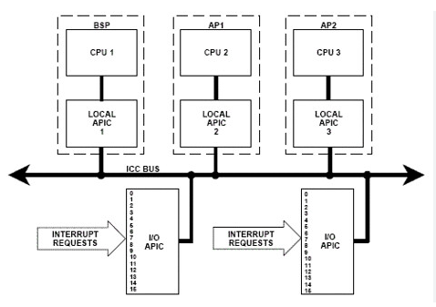

### 04 - Vlákna na symetrickém multiprocesoru, jejich synchronizace a implementace. [KIV/OS]

- vlakna
  - pokud chceme vykonavat vicero paralelnich cinnosti na jednom CPU (vice jadrovym) potrebujeme koncept procesu/vlaken
  - z pohledu kernelu vlakno = jednotka planovani
  - z pohledu programatora = kod ktery se provede paralelne
  - proces = neprazdna dynamicka mnozina vlaken (muzou vznikat/zanikat)
    - kazdy proces je spusten s jednim defaulnim vlaknem main

- concurrency vs parallelism
  - concurrency = vlakna se deli o cas na CPU (time-slicing)
    - na uniprocesoru
    - z pohledu programora se exekuce provadi paralelne
    - v realu je v dany cas na CPU pouze jedno vlakno
  - parallelism
    - mame vicera jader CPU ktere provadi skutecnou paralelni exekuci

- kooperativni multitasking (non-preemptive)
  - jak velke ma byt casove kvantum?
  - jedeno z moznych reseni je nechat vlakno bezet tak dlouho dokud samo nezavola `yield` (vzda se CPU)
    - viz napr MS-DOS?
  - vyhoda: prepinani kontextu neni casove narocne protoze se nedeje s kadym interruptem (timer)
  - nevyhody: vlakno muze zabrat CPU na dlouhou dobu => vypada to jakoby cely system zamrzl
  - pouzitelne napr. pro davkove systemy, nevhodne pro interaktivni systemy

- preemptivni multitasking
  - timer generuje IRQ0 interrupt jehoz handler (obsuha) provede planovani
  - provede se preemce na urovni CPU ktery ulozi kontext beziciho vlakna do PCB a nahraje kontext dalsiho naplanovaneho vlakna = context switch => musi byt rychly
  - historicky se pro context switch pouzival TSS (= Task State Segment) -> HW context switch

- SMP = symetricky multiprocesor
  - bootovaci standard BIOSu rika ze musi byt vybran jeden CPU jako BSP (= Bootstrap Processor) a ostatni jadra (AP = Application Processor) jsou v halt state
  - OS loader musi zkontrolovat ze existuje vice jader a aktivovat je
  - jinak nacte uniprocesorovy kernel (pokud je dostupne treba jen jedno jadro)
  - je na kernelu OS aby detekoval ostatni jadra a inicializoval je
  - kvuli tomu specifikace rika ze BIOS nebo firmware musi vytvorit dve tabulky ve fyzicke pameti ktere popisuji konfiguraci systemu
    - MP Floating Point Structure (MPFPS)
      - zacina s _MP_signature
      - popisuje dostupna jadra CPU
      - je ulozena bud v prvnim kB Extented BIOS Data Area nebo napr. v ROM-BIOSu
      - pokud tato struktura existuje => indikace toho ze je CPU vicejadrovy
    - MP Config
      - MP Floating Point Structure obsahuje MP Config pointer
      - obsahuje seznam dostupnych jader CPU + dalsi informace jako APIC (= Advanced Programmable Interrupt Controller), informace o sbernicich atd. => na zaklade toho lze provest dalsi inicializaci
  - SMP Bootstrap x86
    1) po zapnuti jsou vsechna jadra v real-modu
    2) BIOS vybere BSP a haltne ostatni AP jadra
    3) BSP vykonava kod a hleda MPFPS
    4) pokud nenajde => jedna se o uniprocesor (nacte uniprocesor kernel)
    5) pokud BSP nasel hledanou datovou strukturu, inicializuje APIC daneho BSP
        - to se provadi v protected nebo long modu
    6) BSP vykonavajici kod "vzbudi" ostatni AP jadra pomoci Ini-IPI (= Inter-Processor Interrupt)
    7) AP provede kod ktery jej prepne do protected nebo long modu a synchronizuje ho s BSP
    8) Az se vsechny AP synchronizuji, BSP prepne I/O APIC do symetrickeho I/O modu - routovaci tabulka presmerovava IRQ to local APIC
    9) Pote se inicializuje SMP kernel

    

- synchronizace vlaken na SMP
  - u SMP predpokladame ze jsou si vsechna jadra rovnocena => jakekoliv jadro muze provadet jakykoliv kod
    - v praxi to tak nefunguje protoze kazde jadro ma vlasni cache kam si postupne uklada data/instrukce kodu ktery vykonava
    - presun kodu na jine nadro znamena vyprazdneni cache => snizeni vykonu
  - obecne co se tyce synchronizace muzeme teoreticky pouzit
    - atomicke instrukce odpovidajici delce strovojeho slova, uzamceni sbernice, ...
    - strojove slovo = fixni pocet bitu ktere dokaze CPU zpracovat najednou jako jednu datovou jednotku (odpovida napriklad velikosti PC registru dle daneho CPU modu)
  - realne ma kazde jadro jen jeden zpusob synchronizace = spinlock (pomoci instrukce TLS = Test and Set)
    - umoznuje aktivne cekat na odemceni zamku
    - pokud jadro vstoupi do kriticke sekce, nastavi zamek na uzamceno
    - pokud tam prijde dalsi zkontroluje zamek a zacne cekat dokud se neuvolni

    - <https://wiki.osdev.org/Spinlock>

    ```python
    
    # 0 - odemceno
    # 1 - zamceno

    # uint32 lock;

    #-------------------------
    # spinlock_init(&lock)
    #-------------------------
    spinlock_init:
        jmp spinlock_release

    #-------------------------
    # pinlock_release(&lock)
    #-------------------------
    spinlock_release:
        mov eax, [esp + 4]  # Nacti adresu spinlocku
        mov dword [eax], 0  # Uloz 0 na danou adresu v pameti
        ret
        
    #-------------------------
    # spinlock_asquire(&lock)
    #-------------------------
    spinlock_asquire:
        mov eax, [esp + 4]      # Nacti adresu spinlocku
    spin_wait:             
        pause                   # "Be CPU-friendly"
        test dword [eax], 1     # Otestuj jestli je spinlock uzamceny (obsahuje hodnotu 1)
        jnz  spin_wait          # Pokud je uzamceny goto spin_wait

        lock bts dword [eax], 0 # Pokus uzamknout spinlock
        jc spin_wait            # Pokud to nevyslo (nekdo jiny byl rychlejsi, cekej dal)
        ret                     # Spinlock asquired! :)
    ```
  
  - dalsi verze:
  
    ```python
    mov edx, dword(-1)

    spin:
        mov eax, [lock_state]
        test eax, eax
        jnz spin

        lock cmpxchng [lock_state], edx # Zkus zamknout s -1
        test eax, eax                   # Zkontroluj ze ziskani zamku bylo uspesne
        jnz spin                        # Pokud ne, proces opakuj
    ```

  - odemceni je pak akorat nastaveni zamku
  - instrukce `pause` je ekvivalent `nop`
  - `cmpxchng` vezme hodnotu v `eax` registru a porovna ji s hodnotou na adrese prvniho operandu - `lock_state` a pokud jsou stejne, tak nastavi `lock_state` na druhy operand - `edx`
    - pokud nejsou stejne, v `eax` se nachazi hodnota `lock_state`

- implementace vlaken v OS
  - po bootstrapu procesu vytvori OS virtualni adresni prostor
    - rozdeli ho na stack, heap, data, nakopiruje kernelovske stranky a nakopiruje sem `.text` sekci z napriklad `ELF` souboru (muzou byt i jine binarni formaty)
    - PC hodnotu nastavi na prvni instrukci crt0 (`.init` sekce)
  - crt0 zajistuje RTL - provede bootstrap a inicializace RTL
    - nataha veci jako argv a argc
    - zavola globalni konstruktory
    - vynuluje bss sekci
    - zavola main
    - po skonceni mainu zavola destruktory
    - a nakonec syscall `exit()` - ukonceni procesu
    - OS pote uvolni a vycisti (security) stranky jiz ukonceneho procesu

    ```c++
    // Simplified CRT0
    extern "C" void __crt0_run() 
    {
      __crt0_init_bss();
      _cpp_startup();

      int exit_code = main();

      _cpp_shutdown();
      exit(exit_code);
    }
    ```

    - CRT0 muzu take rezervovat misto pro stack (jako jedna z prvnich instrukci nez se skoci do `C/C++` - pro volani funkci musime mit stack)
    - nebo to pro nas muze pripravit samotny kernel
  - Vytvoreni noveho procesu je mozne pres systemove volani
    - UNIX - `fork()` (vytvoreni noveho procesu se stejnym kodem; potomek ma novy PID) + `exec()` (nacteni noveho kodu)
    - Windows - jen jeden API call - `CreateProcess()`
    - v obou pripadech se ale vytvori novy TCB (= Thread Control Block)/PCB (= Process Control Block) zaznam
    - `fork()` vyzuziva CoW (= Copy on Write)
      - drive nebyla podporovana => bylo zapotrebi kopirovat cely addresni prostor rodice
        - brutalne pomale viz DELOS
      - `clone()` je jen `fork()` s vicero parametry kde definujeme co vse chceme nakopirovat (zasobnik, haldu, ...)
  - kernel si udrzuje informaci o stavech procesu/vlaken = State Queue
    - pro kazdy stav (blokovany + nad cim konretne, pripraveny, atd.) si udrzuje samostatny seznam ukazatelu na PCB/TCB
    - pri zmene stavu vlakna/procesu se jen presune pointer na PCB/TCB do jineho listu
      - kazdy PCB/TCB obsahuje: PID, PID rodice, CPU kontext, stav, alokovane zdroje (otevrene soubory na Linuxu), prioritu, ACL, prostredi, ve kterem byl spusten, atd.
  - zombie != sirotek
    - sirotek = rodicovsky proces skoncil driv nez potomek -> adoptace initem
    - zombie = existujici PCB presto ze proces davno skoncil
  - pote co se ukonci proces ktery byl vytvoren pomoci `fork()`, porad ma zaznam v PCB a ceka dokud si jeho navratovou hodnotu neprecte rodic (proces ze ktereho jsme zavolali `fork()`) => stal se z nej zombie => out of memory denial of service?
    - existuje vicero reseni
      - na strane rodice v UNIXU se muze navratovy kod potomka ignorovat pomoci SIGCHLD => potomek se nikdy nestane zombie
      - dalsi moznsoti je pokud si rodic odmita precist navratovy proces potomka, OS ho zabije a potomek je adaptovan init procesem
  - na UNIXu neexistuje koncem procesu - jsou to tasky

- kernelova vs userspace vlakna
  - kernelova vlakna spravuje kernel - veci typu planovani, prepinani kontextu, synchronizace
  - userspace vlakna se mapuji na kernelovska vlakna
    - 1:1 -> neni co resit
    - 1:N
      - je treba implementovat vetsinu funkcionality v userspacu aby se redukoval pocet CPL switchu
      - kernelovsky planovac potom komunikuje s RTL planovacem aby nedochazelo ke ztrate vykonu
        - kernelovsky planovac o tom RTL nic nevi a naopak
      - napr. Java si vlakna spravuje sama
