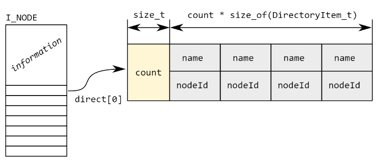

### 07 - Souborový systém - Virtual File System, Installable File System, FAT, Ext2, NTFS. [KIV/OS, (KIV/ZOS)]

- souborovy system
  - obecne plati (v Linuxu) ze implementace file systemu je slozena ze tri urovni - VFS, konrketni file system (ext4, FAT, ...) a ovladacu daneho ulozneho zarizeni (SSD, HDD, flash, ...)

- VFS (= Virtual File System)
  - = obecna abstrakce souboroveho systemu ze sveta UNIXu (rozhrani)
  - programator nepracuje primo s HW ale vola API OS
  - jednotlive file systemy (NTFS, FAT, atd.) musi implementovat toto rozhrani
  - obsahuje ukazatele na funkce (obdoba C rozhrani)
    - v podstate se v terminologii OOP jedna o dedicnost (superclass CFile_System od ktere dedime a prepisujeme metody tupu `open`, `read`, `write` a `close`)
  - hlavni komponenty VFS
    - suberblock (aktualne namountovany disk)
    - inode (konkretni soubor/slozka)
    - file (aktualne otevreny soubor)
    - dentry (informace o directory)

    

  - prace se soubory
    - kazdy proces ma svuj pracovni adresar (ulozeno v PCB)
    - `fs_struct` - otevrejne soubory daneho procesu
      - `uint32 open()` vraci index do pole = file handler
      - `pcb->files[0] = stdin`
      - `pcb->files[1] = stdout`
      - `pcb->files[2] = stderr`
    - pri zavolani `close()` a pak hned `open()` se vrati prvni prazdny index (fd)
      - moznost takhle napriklad presmerovat stdio
        - `close(fd[0]); open('my_file.txt');` -> dostane index 0

- IFS (= Installable File System)
  - Windows obdoba VFS
  - ma 3 mody operaci
    - neni pozadavek na to implementovat vsechny
      1) File system - spravuje souborovy system na disku (image)
      2) MiniFilter - napriklad pro indexovani souboru antivirem
          - filtry umoznuji zachytit a modifikovat IO packety
      3) FilterDriver - modifikace existujicich FS
    - FilterDriver a MiniFilter  jsou obdobne mechanismy ktere umoznuji modifikovat chovani FS nebo oddilu
      - napriklad logovani nebo modifikace operaci
      - FilterDriver je legacy zpusob iplementace filteru (pro antivirus) - depricated by Microsoft => mel by se spise pouzivat MiniFilter
    - MiniFilter je mozne pripojit k oddilu disku tim ze se zaregistruje k FilterManageru pro dany disk a oddil
    - kazdy disk a oddil ma pak vlastni stack filtru ktery je zpracovan kernelem
    - filter ma danou "altitude" ktera urcuje jeho prioritu
      - FilerManager pak vola callbacky filtru s nejvyssi prioritou drive
  - pro komunikaci se pouziva IORP (= I/O Request Packet)
    - struktura pouzita pro komunikaci mezi ovladacem zarizeni a kernelem
    - popisuje pozadovane I/O operace
    - ukladaji se do fronty
      - OS je muze preusporadat => optimalizace napr aby HDD nekmital sem a tam
    - vetsinou jsou vytvorene IO managerem jako odpoved na volani IO OS
    - nemusi byt limitovane pouze na souborovy system
      - napriklad se muze jednat o uspani disku
    1) usermode vola API OS (RTL)
    2) v kernelu (CPL0) IO Manager prijme pozadavek a vytvori IRP ktery posle danemu zarizeni (napr. driveru disku)
    3) tenhle pozadavek zachyti FilterManager a prozene jej prislusnymi filtry (=> antivirus)
    4) az pote udela driver prislusne operace nad diskem
    5) az zarizeni odpovi, posle vysledek danemu procesu v userspace (napr pres EAX - navratova hodnota)

  - Fast IO
    - IRP je nastroj pro vsechno
      - synchronni i asynchronni presuny dat
      - data pro presun z/do cache, page faulty, ...
    - fast IO se snazi zrychlit synchronni operace nad daty ktere jsou pritomny v cache daneho disku
      - v takovem pripade je presun dat process-to-process primo pres systemovou cache
      - => vynecha FS a HW stack (neco jako loopback na localhost)
    - pokud fast IO selze => provede se IRP (klasika)

    

- obecny princip funkce IO
    1) aplikace vola OS API, OS vytvori IO pozadavek a posle ho IO subsystemu
    2) volajici vlakno je blokovano dokud se pozadavek nedokonci
    3) IO pozadavek se da do fronty dokud si ho driver neprevezme
    4) driver bud sam vykona pozadavek nebo ho posle jinemu driveru
        - nejaky HW vykona pozadavek hned: sitovka, zvukovka
        - nejake si ho jen da do fronty a pres IRQ (disk, GPU) oznami, ze ho prijal
    5) po dokonceni pozadavku je vlakno opet porobuzeno a muze se planovat
        - => nemusi byt hned => co kdyz je vlakno blokovane jeste nad necim jinym?

- obsluha IRQ
  - IRQ = signal generovany HW je poslan do CPU
  - udalost oznamujici OS ze se ma dany HW obslouzit (neco se stalo = udalost)
    - zmacknuta klavesnice, prisel packet, tick casovace, atd.
  - IRQ je premapovana na index do IDT (reseno pres PIC = Programmable Interrupt Controller)
    - obsahuje 8 IRQ -> jsou pouzity 2 cipy (master-slave v kaskadovem zapojeni)
  - jadro CPU prestane vykonavat aktualne vykonavany kod a zacne vykonavat obslusu preruseni (dle IRQ)
  - sdileni jednoho IRQ (=> konflikty)
    - co by se stalo kdyby 2 zarizeni sdilely stejny IRQ?
      - pokud nejsou pouzivany ve stejny cas => OK (napr v DOSu hrani her - zvukovka a tiskarka se nebudou nejspis pouzivat ve stejny cas)
    - musime preruseni obslouzit spravne nebo muze cely system zamrznout...
    - systematicke reseni => MSI (= Message-Signaled Interrupts)
      - zarizeni prespoklada ze sdili IRQ drat s jinymi zarizenimi
      - zarizeni ma navic pridelene ID, ktere posle PICu aby je mohl rozlisit
      - => muzeme rozlisit vicero zarizeni pomoci jednoho IRQ -> Advanced PIC (= APIC)
        - umi preposilat mnohem vice IRQ nez obycejny PIC
        - dovoluje koexistenci vicero jader CPU (SMP)
          - kazde jazdro ma svuj APIC spolu s lokalni tabulkou na premapovani udalosti (IRQ -> IDT)
        - take se jim rika virtualni IRQ
        - v systemu je pak jeden centralni IO APIC, ktery routuje pozadavky mezi jednotliva jadra CPU -> APIC bus
  - pro rychlost a responzivnost se IRQ deli na top-half a bottom-half
    - top-half dela jen nutne minimum => klicem je rychla obsluha
      - = prace ktera se vykona v obsluze IRQ
      - muze jen vytvorit bottom-half task?
    - bottom-half dela to co tvrva dele (nestihlo se udelat v top-half)
      - v kernelu existuje nekolik demonu (service) ktere periodicky vykonavaji botttom-half ulohy
      - bottom-half ma dva typy - SoftIRQ (kriticke) a Tasklet (planovane)
        - SoftIRQ
          - je jich jen par
          - staticka alokace na konkretnim jadre
          - obsluhuje time-critical udalosti (na Linuxu treba sit, presuseni casovacu, ...)
          - SoftIRQ stejneho typu se mohou vykonavat soucasne na ruznych jadrech
          - jeden SoftIRQ provadi Tasklety
        - Tasklet
          - staticka i dynamicka alokace
          - tasklety ruzneho typu se mohou vykonavat soucasne na ruznych jadrech
            - pouze jeden tasklet stejneho typu se muze vykonavat v jeden okamzik => zjednoduseni uzamykani -> zlepsuje propustnost (co nejvice uloh zajednotu casu)
          - musi byt dokoncen atomicky (nemuzeme ho suspendovat)
          - vykonava se na stejnem jadre ktere ho naplanovalo
    - alternativne Linux ma WorkQueue - dalsi zpusob odkladani prace ktera neni urgentni
  - ne vzdy musime vyuzivat presuseni
    - velke mnozstvi IRQ => velka rezije (overhead)
    - reseni je IRQ coalescing kdy zarizeni signalizuje IRQ az kdyz ma nejake mnozstvi prace hotove
      - bufferovani pozadavku dokud jich nemame napr. 10 a pak je vykoname vsechny naraz
    - polling
      - typicky aktivni cekani (blokace) na zmenu stavoveho bitu (napr. cteni z TRNG)
      - vyplati se pokud vime ze nebudeme cekat prilis dlouho (obejdeme rezii spojenou s IRQ)
  - IO_uring
    - IO pozadavky se radi do fronty v userspacu
    - kernel pak muze precist celou frontu a preunout ji do sveho IO subsystemu s jednim CPL switchem
    - kernel provede pozadavky a udela "balik" vysledku ktere pak userspace proces precte nejednou
  - Userspace NIC
    - uzivatelske procesy nemohou primu pristupovat k HW
    - v Linuxu ale existuje zpusob jak vytvaret user-space ovladace
    - linux ma userspace IO = zpusob jak vystavit rozhrani pro primy pristup k HW v userspace
    - pro kazde takto vystavene zarizeni UIO vytvori 3 memory-mapped soubory
      - cteni & zapis
      - konfigurace
      - interakce s registry IO zarizeni

- FAT (= File Allocation Table)
  - standard v DOS, dnes pouzit prevazne pro flash zarizeni
  - formatovany disk je rozdelen na clustery
  - boot sector | FAT_1 | FAT_2 | Root dir | clusters
  - soubor muze byt fragmentovany => nevyhoda ze pak hybame hlavickou disku
  - FAT je defakto tabulka indexu odkazujici na nasledujici cluster ktery je soucasti souboru
    - `fat[i]` obsahuje bud index dalsiho clusteru nebo `EOF` (konec souboru)
    - specialni cislo pro konec souboru, volny blok a chybny blok
    - soubor = "linked list" clusteru
  - varianty: FAT12, FAT16, FAT32 (cislo udava pocet bitu pouzity pro indexaci ve FAT tabulce)
    - FAT12 a FAT16 pouzivaly root folder fixni velikosti
    - FAT32 uklada root v data section (=> root folder je na zacatku data section)
  - boot sector obsahuje
    - fixni struktura: typ FAT, velikost FAT, velikost root directory
  - directory zaznam obsahuje: nazev souboru, index 1. clusteru, + metadata (napr jestli se jedna o soubor nebo slozku)
    - velikost potrebujeme znat pro urceni velikosti posledniho clusteru (size % CLUSTER_SIZE)
  - typicky pozivame 2 FAT tabulky (kopie ktera je pouzita v pripade nekonzistence/korupce 1. FAT tabulky)

  

  

- Ext2
  - zalozen na i-nodech = datove struktury reprezentujici adresare a soubory
    - nepobsahuje nazev a obsah souboru/adresare!
  - superblock obsahuje metadata o disku a adresy zacatku jednotlivych sekci (celkova velikost, bitmapa, i-nody, clustery, volume description, atd)
  - bitmapa obahuje flag jestli je dany cluster volny nebo ne
    - stejna bitmapa muze/nemusi byt i pro inody (muze to byt ulozene primo v inodu)
  - inode obsahuje metadata
    - velikost souboru
    - parent inode (adresar)
    - prime odkazy, neprime odkazy, dvojite neprime odkazy
    - typ: file, directory, symlink, ...
      - adresare obsahuje dvojici: nazev souboru, cislo inodu
    - muze obsahovat prava, jestli je soubor prave otevren, atd
  - clusters: bloky pamety k ulozeni obsahu souboru
  - ext2 nepodporuje ACL (ty jsou az v ext4); obsahuje jen owner:group - R/W/X (Linux)
    - ACL: R/W/X pro kazdeho uzivatele
  - rychle pro male soubor (vyuziti primych odkazu)
    - ext2 umoznuje az 3 urovne zanoreni
    - neprimy odkaz: v poli je ulozene cislo clusteru ktery obsahuje cisla i-nodu ktere obsahuji data

  

  

  

  - ext2 se sklada z nekolika velkych bloku - boot bloku a pak N block group => kazda ma vlastni superblock, bitmapy a clustery (datove bloky)
    - snaha o optimalizaci co se tyce prostorove lokace na disku?
    - redukce fragmentace?

  
  
  - symlink
    - obdoba shortcut ve windows
    - soubor ukazujici na jiny soubor (pointer)
    - cislo inodu je jine nez cislo inodu originalniho souboru
    - smazani originalni souboru => symlinky jsou nepouzitelne
    - oddeleny soubor (jiny inode) ktery ma v metadatech oznaceno ze se jedna o symlink a jehoz obsahem (clusters) je pak cesta k danemu souboru

  - hardlink
    - stejny inode jako originalni soubor
    - inode originalniho souboru si drzi citac poctu hardlinku
      - smazani souboru = dekrementace citace
      - if counter == 0 then delete the contents of the file
    - v directoru existuje soubor 2x s jinym jmenem ale STEJNYM INODEM

- NTFS
  - nastupce FAT
  - nativni FS pro Windows NT
  - podporuje zurnalovani (= zaznam akci co se chystam udelat nez je udelam), ACL, kompresi, sifrovani, kvoty (= omezeni obsazeneho mista ve FS ktery nastavi administrator), hard a symlinky (shortcuts)
  - clustery jsou adresovany 64 bity od zacatku partition (oddilu) -> logicka cisla
  - v MFT (= Master File Table) jsou ulozeny seznamy fragmentu = soubory
    - MFT je zalohovana (jednou uprosted/na konci a jednou na zacatku)
    - zaznam je `filename, start_cluster, size, cluster_count`
    - `size` kvuli poslednimu clusteru

  

  - VBR (= Volume Boot Record) obsahuje primarni boot code a nacita bootloader ulozeny v sekci $BOOT ktery nacte OS
  - adresare jsou implementovany jako specialni soubory s B-stromem odkazdu na MFT
  - NTFS pouziva kodovani delkou behu -> soubor je ulozen po fragmentech = dvoice index bloku a pocet bloku
  - uloziste az 4TB
