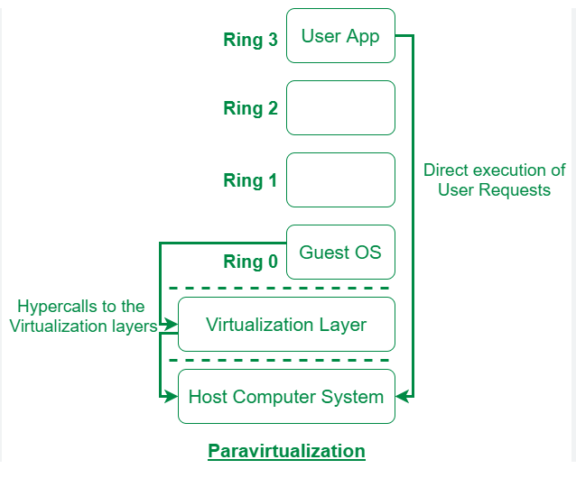
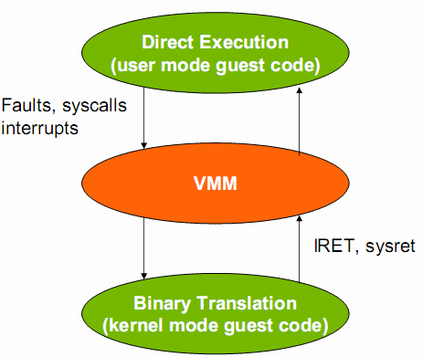
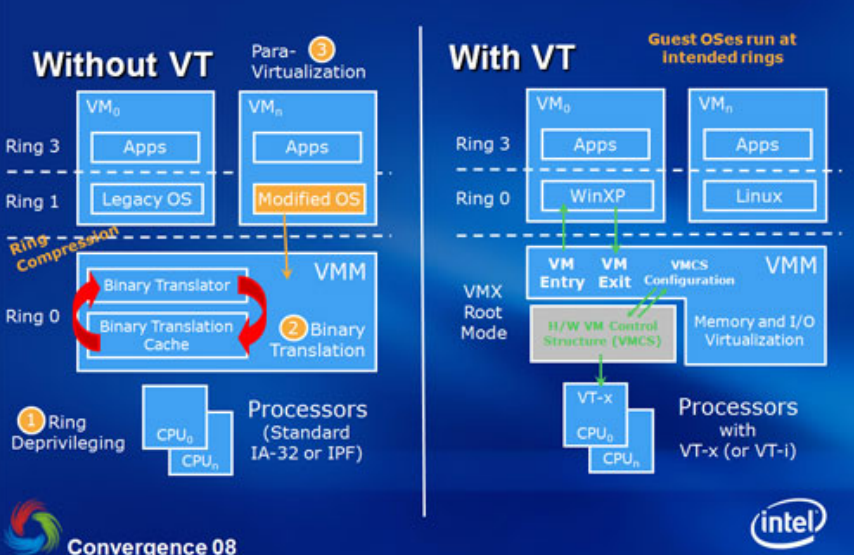
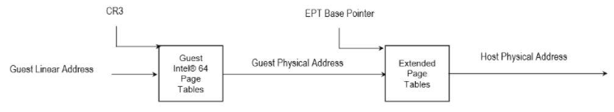

### 08 - Emulace, paravirtualizace, binární překlad, hardwarová virtualizace (Intel VT-x), Virtualization for aggregation. [KIV/OS]

- k cemu to vsechno je?
  - prepokladame ze mame specificky OS a CPU (s danou architekturou)
  - co kdyz potrebujeme spustit program, ktery je zkompilovany pro jiny mod CPU (real/protected) nebo jiny CPU (ARM, AMD, Intel)?
  - => potrebujeme emulaci nebo virtualizaci

- simulace (jen pro info)
  - nespada sem
  - = modelovani matematickeho problemu pro ktery nezname elegantni analyticke reseni
  - dorpavni problemy, sireni chorob, zaplneni nemocnic, atd.

- emulace
  - pomoci SW vytvarime iluzi realneho HW
  - napr spustit DOSBox na ARMu
  - priklady emulatoru: DOSBox, qemu, Bochs, atd.
  - jedna se o unverzalni ale vypocetne narocne reseni
  - umoznuje nam to spusit SW na ktery potrebujeme jisty HW ktery ale nemame
  - jedna se o preklad instrukci z jedne instrukcni sady (emulovane) do instrukcni sady (ISA) ktery implementuje HW ktery fyzicky pouzivame
    - typicky se nejedena o 1:1 preklad instrukci => emulace jedne instrukce vyzaduje >= instrukci pouziteho HW => pomaly
  - emulace muze podporovat virtualizaci

- virtualizace
  - nedela emulati HW ale pouziva realny HW
  - je vykonejsi nez emulace ale vyzaduje aby byl program kompilovany pro dany HW narozdil od emulace
  - pouziva SW pro vytvoreni abstrakcni vrstvy nad HW - VMM (= Virtual Machine Monitor) coz umoznuje vice systemu sdilet HW prostredky aniz by jeden o druhem vedeli

- hypervizor (VVM)
  - VMM vyrvari a spravuje virtualni stroje
  - umoznuje vic virtualnim strojum bezet na jednom systemu
  - typ1
    - bezi primo na HW systemu na kterem je spusten (napr. proxmox, hyper-v, xen)
    - integruje primo s jeho pameti a CPU
    - v podstate nahrazuje OS
  - typ2
    - nebezi primo na HW ale bezi jako aplikace nad danym OS (napr. VirtualBox nebo WMVare Player)
    - mene vykonny nez typ1 hypervizor

- V86
  - kdyz byl zaveden protected mode, liho ho zacali pouizavat kvuli vetsimu adresnimu prostoru (mohli adresovat vice pameti)
  - existujici aplikace ale pocitali (byly napsane) pro real-mod (16 bit)
  - BIOS poskytuje rutiny pro interakci s HW (typicky jsou vyuzivany ovladaci)
  - moderni aplikace v protected modu tyto rutiny vyuzivali protoze je to snadnejsi nez si psat tu rutinu znovu ve 32 bitovym modu
    - kvuli velkym rozdilum mezi real modem a protected modem nemuzeme spustit real-mode program primo v protected-modu -> x86 se musi prepnout do virtualniho modu V86
  - V86 = virtualizace 86
    - dostupne od CPU 80386
    - kdybychom prepnulu z protected modu do realneho modu, ztratili bychom vsechnu pamet a OS by selhal
    - reseni
      - vytvorime virtualni adresni prostor o velikosti 1MB pro real-mode programy s CPL=3
        - 1MB protoze v real-mod se adresuje 20b
      - pro nej vytvorime monitor (protected-mode task s CPL=0)
      - pouzity privilegovane instrukce real-modu programu vyhodi vyjimku
        - pote jadro vykona ISR (= Interrupt Service Routine) poskytnute monitorem
      - kdyz real-mode program zavola legacy OS API, pouziva INT (viz sycally v DOSu)
      - monitor volani odchytne zkrze ISR a pretransformuje ho na OS API call hostu
      - vysledkem je to ze kernel muze vykonat real-mod privilegovane instrukce tak jak si preje bez toho aby real-mod program o tom neco vedel
    - => tento zpusob emulace neni narocny -> jediny overhead je volani privilegovanych instrukci
    - neni nutne pravda ze real-mod program nema zadne prostredky na to zjistit ze je virtualizovany
      - nejake instrukce mohou proflaknout nejake info, pokud tedy neni pouzivt VT-x nebo jsou instrukce vymazany z kodu pred jeho exekuci
      - starsi programy by nic nezjistili protoze takove isntrukce jeste ani neexistovali
        - => viz CISC architekture a vyvoj/pridavani novych instrukci

- Two-OS Problem
  - jeden hostovany OS nemuze "ublizit" jinemu hostovanemu OS
  - privilegovane instrukce - CPU vyhodi vyjimku pokud instrukci vyzadovane CPL neodpovida CPL virtualizaovanemu OS
    - napr `IN`, `OUT`
  - citlive instrukce meni HW konfiguraci a jejich vysledek zalezi na aktualni HW konfiguraci
    - napr `PUSHF`, `POPF` (flags)
    - => mohou tedy prolomit iluzi toho ze je OS virtualizovany pripadne ovlivnit fungovani hypervizora

- privilegovane vs citlive instrukce
  - citlive -> mohou proflaknout to ze je SW virtualizovany
  - efektivni a bezpecna virtualizace vyzaduje ze kazda citliva instrukce je zaroven privilegovana
    - napr mnozine citlivych instrukci je podmnozina privilegovanych
    - dokud neprisel VT-x a AMD-V, x86 nesplnovalo tento pozadavek
  - CPU vykonava neprivilegovane instrukce primo => zadna ztrata vykonu
  - privilegovane (a citlive instrukce vyhodi vyjimku)
    - kernel ISR ji obslouzi
    - tyto instrukce musi byt emulovane - emulace uvnitr virtualizace => ztrata vykonu ale nutna

- paravirtualizace
  - bez HW podpory jako je VT-x musime modifikovat kod virtualizovaneho SW tak aby nepouzival citlive instrukce ale privilegovane instrukce
  - instrukce ktere nejsme schopni virtualizovat (mohou byt citlive i privilegovane) nahradime volanim hypervizora => guest OS musi byt modifikovany aby tato volani pouzival

  

- binarni preklad (Binary Translation)
  - dalsi metoda virtualizace
  - predtim nez spustime guest OS analyzujeme jeho kod
  - nahradime nebezpecne isntrukce bezpecnymi
    - blok `m` nebezpecnych isntrukci muze byt nahrazen blokem `n` bezpecnych instrukci
  - nabizi se take moznost nahradit bloky kodu rychlejsimi
  - napriklad pokud privilegovana instrukce vyhodi vyjimku -> vede to na emulaci
    - => tim padem ji muzeme nahradit primo emuovanym kodem => vyhneme se preruseni
  - nahrazovani isntrukci neni jednoduche
    - nahrazovane bloky kodu mohou mit jinou velikost (delku), mohou pouzivat `JMP` instrukce, adresy promennych, atd.
  - preklad muze byt
    - staticky: pred spustenim programu
    - dynamicky: instrukce nahrazujeme za behu

- priklad binarni preklad `int 10h` (zmena palety obrazovky)

    ```c++
    mov ax, 3 # Index palety
    int 10h   # Syscall BIOSu

    # modifikace:

    mov ax, 3            # Index palety
    pushf                # Uloz flags
    call Emulated_IRS_10 # Zavolej emulovanou rutinu
    ```

  

- HW virtualizace
  - prikladem HW virtualizace je VT-x
  - cilem je eliminovat potrebu paravirtualizace a binarniho prekladu
  - problem je ten ze potrebujeme odchytavat citlive a privilegovane instrukce
    - paravirtualizace neni flexibilni protoze musime modifikovat kod OS
      - OK v pripade Linuxu, horsi v pripade Windows
    - binarni preklad = overhead navic
  - u VT-x CPU bezi ve dvou rezimech - VMX root a VMX non-root
    - pocet prechodu mezi temito mody by mel byt minimalni
  - hypervizor nemusi bezet s CPL=0 a OS s CPL=1
  - VT-x zavadi nove instrukce ktere umoznuji efektivne separovat guest OS a host OS bez potreby prekladat instrukce
    - host OS bezi v VMX root
    - guest OS bezi v VMX non-root
    - => VT-x umoznuje mezi temito mody prechazet
  - hostovany OS bezi bez zadnych dalsich modifikaci (narozdil od paravirtualizace)
    - nema zadny stavovy bit aby zjistil, ze je virtualizovany
  - OS bezi v ring 0 s pouzije citlivou nebo privilegovanou instrukci
  - protoze bezi ve VMX non-root, provede se prepnuti do VMX root kde je mozne provest odpovidajici instrukce

  

  - je tu problem se strankovanim
    - pri kazdem prepnuti do VMX-root by bylo potreba vymazat TLB
    - prvni generace VT-x to tak delala
    - misto hypervizor priradi kazdemu non-root guestovi vygenerovat VPID (= Virtual Processor ID)
      - host ma hodnotu 0
    - jadro nedovoluje guest OS pristoupit k TLB zaznamum ktere neodpovidaji jeho VPID
    - host OS pouziva shadow page table
    - bez VT-x by tabulka stranek guesta byla read-only
      - kazdy guest OS si spravuje vlastni tabulku stranek ktera ale neni realne pouzita v MMU
        - hypervizor spravuje tabulku stranek ktera mapuje virtualni stranky guest OS primo na fyzicke framy => pouzita primo v MMU
      - s pouzitim COW (= Copy on Write) bychom pak zachytili pokusy o zapis a synchronizujeme shadow page table
      - host oblbne guesta ze si bude myslet ze ma kontrolu nad pozici tabulky
      - cele je to pomale tim jak COW princip jde pres ISR
    - reseni, VT-x pouziva zanorenou/rozsirenou tabulku stranek EPT (= Extented Page Tables) -> rychlejsi
      - guest OS pouziva page table jako obvykle
      - CPU preklada adresy na fyzicke pomoci EPT
        - umoznuje efektivni prekladat guest-virtual na host-physical adresy rozsirenim existujici page table
        - je treba akorat rozsirit existujici HW pro prochazeni page-table
        - => jedna se jen o dalsi uroven prekladu
  
    

  - VT-d umoznuje virtualizovat I/O
    - neni pak potreba prechoz mezi VMX root a VMX non-root
    - umoznuje totiz mapovat IRQ a rozsiruje DMA
    - prideleni zarizeni guest OS vyazaduje xAPIC

- VfA (= Virtualization for Aggregation)
  - narozdil od spusteni vice guestu na jednom pocitaci propojime vice pocitacu v jeden pomoci virtualizace => "superpocitac"
  - vytvoreni pocitace s velkou RAM a velkym poctem CPU jader je relativne levne
  - guest OS je jen jeden velky virtual SMP system
  - jak to udelat?
    - na kazdem vSMP uzlu bude VMM (hypervizor) ktery pouziva napr VT-x a komunikuje s ostatnimi VMM
    - kdyz zachytime (prerusime) pristup ke zdroji ktery se nachazi na jinem uzlu, pouzijeme zpravy na presmerovani pozadavku na jiny uzel
