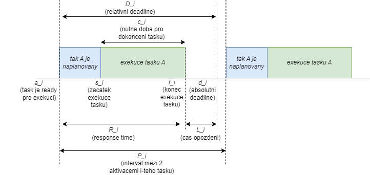
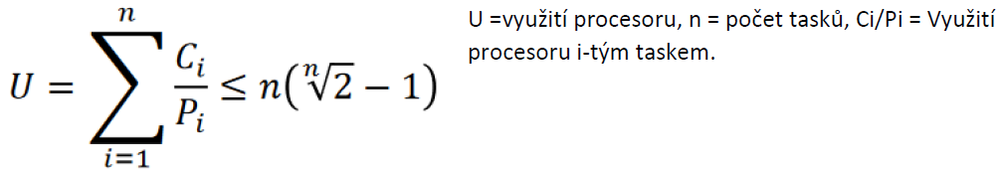
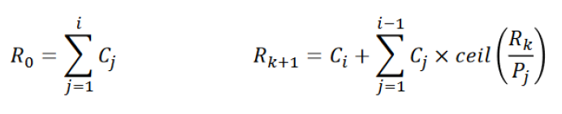
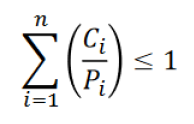

### 09 - Systémy reálného času - typy úloh, plánování a rizika. [KIV/OS]

- non real-time
  - tradicky general-purpose OS kde se vlakna vykonavaji maximalni rychlosti
  - uzivatele zajima nejkradsi cas dokonceni (doba odezvy)

- soft real-time
  - vypocet nemusi probehnout ted hned, ale do urciteho deadlinu
  - nedodrzeni deadline je selhani ale v soft realt-time to neni katastroficke (da se tolerovat)
    - akorat se tomu chceme vyhnout

- hard real-time
  - promeskani deadline vede k neopravitelne chybe
  - katastroficke => muze byt i zivotu ohrozujici (jaderna elektrarna, automobilovy & letecky prumysl, atd)

- terminologie
  - task - sekvencne vykonavana aktivia
  - job - sekvence jednoho nebo vice tasku
  - zdroj - aktivni (CPU) nebo pasivni (mutex, file handler)
  - schedule (plan)
    - = jak se budou vykonavat jednotlive tasky
  - spravny plan je defakto poradi jak se budou vykonavat jednotlive tasky ktery splnuje dane podminky
    - muze byt splnitelny nebo nesplnitelny
  
- parametry
  - cas prichodu `a_i` = cas kdy i-ty task bude pripraven pro vykonavani
  - vypocetni cas `c_i` = cas nutny pro dokonceni i-teho tasku
  - absolutni deadline `d_i` = cas do kdy ma byt task dokonceni
  - cas zacatku, konce a uvolneni `s_i`, `f_i`, `r_i`
  - perioda `p_i` = interval mezi dvemi aktivacemi i-teho tasku

- odvozene parametry
  - relativni deadline `D_i = d_i - a_i` (napr. za 50ms)
  - response time `R_i = f_i - a_i` (za jak dlouho je task dokoncen od doby co byl pripraven pro vykonavani)
  - opozdeni `L_i = f_i - d_i` (o kolik jsme prosvihli deadline)
    - zaporne cislo => OK
    - kladne cislo => prosvihli jsme deadline
  - exceeding time `E_i = max(0, L_i)` (absolutni odchylka oproti deadlinu)
  - slack time `X_i = d_i - a_i - c_i = D_i - c_i` (rozdil relativniho deadlinu napr task musi byt dokoncen za 10ms a casu nutneho pro dokoncni tasku napr 15ms)

  

- typy tasku (task muze byt)
  - periodicky
    - vykonava se periodicky -> fixni inter-arrival time `p_i`
    - vsechny instance maji stejny vypocetni cas
    - napr. "polling" nejakeho vstupu? jako vzorkovani vsechny pinu jednou za 1s?
  - aperiodicky
    - opakovane aktivovany ale ne se stejnou periodou
    - nahodny inter-arrival time `p_i`
    - napr obsluha nejake udalosti?
  - sporadicky (jedinely)
    - aperiodicky s minimalnim casem mezi aktivovanimi `p_i`
    - sporadicke tasky obecne maji hard deadline napr. brzda v aute

- RMA (= Rate Monotonic Analysis)
  - prida priority taskum tak, ze:
    - RMS (= Rate Monotonic Scheduler) najde naplanovane ktere lze provest
    - RMA zkontroluje jestli takove naplanovani je vubec mozne
  - perioda
    - inverzne proporcionalni k periode
      - cim kratsi perioda (velka frekcence = casto se task opakuje) tim vyssi priorita
  - ratio grid `<min_period, max_period>`
    - pomer mezi sousednimi periodami - 1ms, 2ms, 4ms, ...
    - idealne chceme tolik priorit kolik mame tasku -> ne vzdy mozne

- RMS test naplanovatelnosti
  - Lui a Layland (1973) dokazali existenci uskutecnitelneho naplanovani pro mnozinu periodickych tasku jejihz kolektivni vyuziti CPU je vzdy mensi nez 70%

  

  - vyuziti CPU i-tym taskem je pomer doby potrebne pro jeho vykonani ku periode jak casto se task opakuje
  - zbylych 30% vykonu lze pak pouzit pro provadeni bottom-half aperiodickych tasku
  - alternativne lze periodicky planovat obsluhy aperiodickych a sporadickych tasku
  - Lui a Layland uvazovali prilis mnoho restrikci
    - nektere z nich by se daly zanedbat
    - napr uvazovali 0 kernel overhead coz neni realisticke
  - pokud test neprosel, korekni naplanovani stale mohlo existovat ale muselo se to dokazat jinym zpusobem - napr s pouzitim testu dobu odezvy

- Response Time Test (test doby odezvy)
  - seradime tasky podle priority (sestupne)
  - pro kazdy task vypocteme `R_k`

  

  - `R_0` je soucet casu nutny pro vykonani jednotlivych tasku
  - to delame dokud `R_k` neprestane rust
    - udelame sumu tasku s vyssi prioritou nez nejaky task - mensi priorita je vetsi priorita
  - v podstate zvysime `C_i` o casy predchozich tasku
    - zjednodusene: `R_k` je slozene z doby nutne pro dokonceni i-teho taku `c_i` + souctu casu nutnych pro tokonceni vsech predchozich tasku (s vyssi prioritou) kde u kazdeho casu je zapocitane take to jak casto se opakuje (`P_j`)
  - pokud `R_k < d_i`, pak muzeme i-ty task naplanovat
    - pokud tohle plati provsechny taky, existuje splnitelnty plan

- EDF (= Earliest Deadline First)
  - EDF navic pocita s aperiodickymi a sporadickymi tasky
  - dynamicky scheduler zalozeny na priorite
  - pro kazdy task je klicovy jeho deadline
  - planovac provede task, ktery ma nejblizsi deadline
  - splnitelny plan existuje pokud soucet pomeru dob potrebnych pro vykonani jednotlivych tasku ku tomu jak casto se opakuji (perioda prichodu) <= 1
    - jinak nemam k dispozici cas na splneni vsech tasku

    

  - EDF je optimalni vzhledem ke splnitelnosti a minimalizaci maximalni odezvy (`R_i = f_i - a_i`)
  - pri planovani (tick casovace) proiterujeme vsechny tasky a najdeme ten ktery ma nejblizsi deadline vzhledem k aktualnimu timestampu
    - tohle opakujeme s kazdym tikem casovace => prioritizujeme tasky s nejbizsti deadline

- rizika spojene s real-time OS
  - nektere tasky maji opravdu hard deadline (napr brzdy v aute)
  - od RTOS chceme predpovidatelnost - idealne moznost dokazat ze vsechno bude fungovat spravne jak ma (=> determinismus)
  - cache muze byt problematicka
    - nekdy veci trvaji dlouho a nekdy jsou hned hotove
    - => nelze zcela eliminovat vsechny zdroje nedeterminismu ale chceme je minimalizovat
  - u RTOS jsou veci jako IRS problematicke -> nektere tasky jsou podstatnejsi nez obsluha IRQ (napr. dummy stisk tlacitka)
    - => pri vykonavani daneho tasku muzeme IRQ zamaskovat a misto toho pouzit polling a pripadnou nutnost obsluhy dat do nejake workqueue
    - => defakto se jedna o top-half a bottom-half koncept
      - top-half extreme rychle, bottom-half je planovana jako kazdy jiny task se svoji prioritou
  - inverze priorit v kritickych sekcich muze byt problem
    - task s nizkou prioritou vstoupi do kriticke sekce
    - tick casovace zpusobi preplanovani na task s vyssi prioritou, ktery taky chce vsoupit do kriticke sekce
      - => nemuze protoze zamek drzi task s nizsi prioritou
    - mozna reseni?
      1) pokud low-priotity task vstoupi do kriticke sekce muzeme mu docasne nastavit vysokou prioritu aby co nejrychleji vypad
          - zasoven aby po doby co tam je nedoslo k preplanovani
          - => dalsi problem je v tom ze timto zpusobem (pokud jsme low-priority task) muzeme zabrani zpetnemu naplanovani high-priotity tasku (ktery na danou kritickou sekci NEceka) protoze ted jsme my high-priority task
      2) dedelni priority
          - task v KS (= kriticka sekce) dostane nejvyssi prirotitu ze vsech tasku ktere jsou blokovany nad stejnou KS
            - => dovoluje koexistenci tasku s vyssi prioritou ktery neceka na danou KS => nepresusime ho, jen ty co na KS taky cekaji
            - => co kdyz ale do fronty cekajici na KS vstoupi task ktery na ni necekal a ma nejvyssi prioritu ze vsech? My jako low-priority task s docasne pridelenou velkou prioritou (bychom z KS vypadli) ho budeme blokovat => mame porad stejny problem...
      3) priority ceiling
          - pro kazdou KS mame maximalni prioritu (ze vsech tasku co do ni mohou vstoupit)
          - pokud do KS vstoupi task je mu docasne zvysana priorita na danou maximalni prioritu pro danou KS
          - efekt je ten ze task muze uzamknout KS pouze pokud je jeho dynamicka priorita vyssi nez priority ceilings vsech zdroju uzamcenych ostatnimi tasky
          - existuje synchronizacation feasible schedule
            - mame-li `n` periodickych tasku a pro kazdy task nejhorsi mozny cas zablokovani tak pokud je pro kazdy task podminka platna => existuje splnitelny plan
  - dalsim rizikem je memory management
    - page fault = nedeterminismus
    - fragmentace muze zpusobit nedostatek pameti kdyz ho necekame
    - idealne by vsechny tasky mely vyzadovat "podobne" mnozstvi pameti
    - nepouzivat dynamickou alokaci
      - vse staticky alokovat na zacatku pred exekuci
      - => lze pak jednoznacne urcit mnozstvi vyuzite pameti
    - zakaz pouzivani rekurze => tezko se dokazuje pozadovany cas a pamet (zasobnik)
    - => pouzit subset C++ (MISRA, AUTOSAR, ...), pouzivat statickou analyzu kodu, vse pro to abychom umeli dokazat determinismus
  - vyjimky
    - zpusonuji nedeterminismus a zpozdeni vykonu (rezije preruseni)
    - => nepouzivat vyjimky ale navratove ERROR kody
