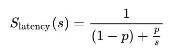
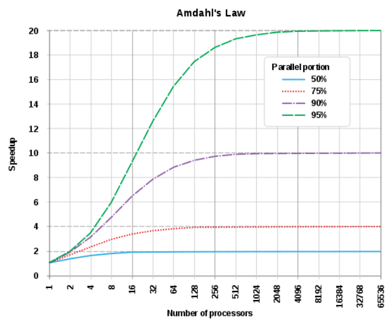
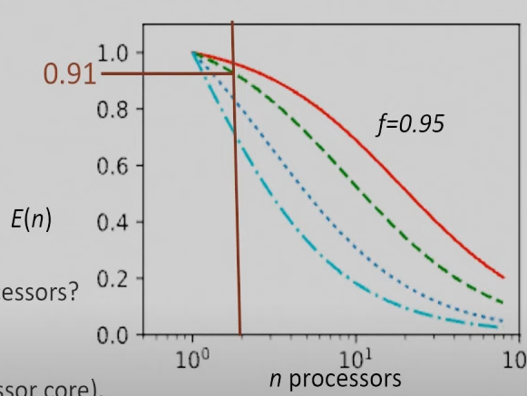
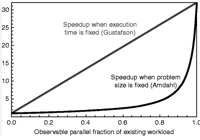
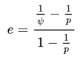
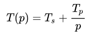
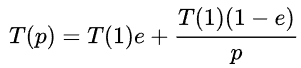
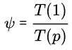
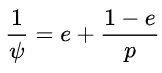

### 10 - Flynnova taxonomie – architektury a jejich urychlení. Amdahlův a Gustafsonův zákon, Karp-Flattova metrika – odvození a jejich limity [KIV/PPR]

- Flynnova taxonomie
  - jedna se o terminologii toho jak jsou data zpracovana v ryznych systemech (kategorizace zpusobu zpracovani dat na jednotlivych architekturach)
  1) SISD (= Single Instruction Single Data)
        - uniprocesor
  2) SIMD (= Single Instruction Multiple Data)
        - vektorizace (zrychleni je linearni dle velikosti vektoru + teoreticky nejaka rezie)
        - napr vektor ktery obsahuje 4 x ui32 -> urychleni 4x
  3) SIMT (= Single Instruction Multiple Threads)
        - ta sama funkce je provadena zaroven na vice procesorovych jadrech (GPGPU - General-Purpose GPU)
  4) MISD (= Multiple Instruction Single Data)
        - zpracovani toho sameho vypoctu na vicero systemech (vypoctenich jednotkach)
        - fault tolerance (viz Byzansky problem = vice nez polovina komponent se shodne nez se provede akce)
            - fail-stop = system NEmuze dal pokracovat - napr. odstaveni auta u krajnice; nemuze nastat napr. v letadle kde musime byt schopni doletet
            - fault-tolerant = system je dale funkci ale ma omezenou funkcionalitu (napr. dovest auto do servisu)
        - celkove mame dve moznosti
            - but vice systemu zpracovava stejna data (fault tolerance)
              - dobre je mit treba i ruzne technologie, ruzne programocaci jazyky, atd.
            - nebo jeden system funguje jako pipeline
        - urychleni roste "skoro" linearni s poctem urovni pipeliny
  5) MIMD (= Multiple instruction Multiple Data)
        - procesorova jadra pracuji asynchronne nezavisle na sobe
        - procesory mohou mit sdilenou pamet (bacha na bottle neck - pristup na sbernici) nebo distribuovanou viz distribuovane systemy
  6) SPMD (= Single program Multiple Streams)
        - vice autonomnich procesoru provadi stejne instrukce nad ruznymi daty
        - v podstate paralelni programovani
        - zpracovani strukturne stejnych (napr. JSON) ale hodnotove odlisnych dat
        - urychleni muze byt liearni s poctem vlaken
  7) MPMD (= Multiple Programs Multiple Data Streams)
        - treba farmer-worker
        - v podstate to znamena ze nad ruznymi daty provadime vice nez jeden program
        - tezko se da urcit urychleni => musime zmerit pomoci ruznych testu

- Ahmdaluv zakon
  - umoznuje vyjadrit maximalni ocekavane zrychleni systemu pote co je jedna z jeho casti vylepsena (paralelizovana)
  - rika nam ze pridavanim CPU se celkove zrychleni bude zvetsovat jen o urcitou dobu ale nakonec se ustali => vertikalni skalovanim nevyresime samotnou podstatu dane ulohy

    

  - `S_latency` je teoreticke zrychleni celeho systemu [1]
  - `s` je zrychleni casti programu [1]
    - nekdy je to take oznacovane jako `n` napriklad kolik CPU jsme pouzili na zrychleni
  - `p` vyjadruje jakou cast celkoveho programu ta dana zrychlena cast tvori [%]
  - ocividne omezeni je to ze pokud `s` jde do nekonecna (urychleni je "nekonecne")
    - => pak lze program urychlit pouze `1/(1-p)` krat
    - lze to chapat jako omezeni velikosti problemu (size-constraint)
    - velikost problemu se nemeni s poctem vlaken
  - `celkove urychleni = puvodni cas / novy cas`
  - `(1-p)` je to co nemuzeme zrychlit (resp. % cast programu kde jsme zadny paralelismus neaplikovali) -> zabere to stejny cas
    - defakto to urcuje limitu grafu urcyhleni s pridavanim poctu CPU
  - `1/s` urcuje urychleni paralelizaci (napr. 1/3 pri pouziti 3 CPU)
    - prenasobenim `p` -> aplikace tohoto urychleni na danou cast celkoveho programu

  

  - zaroven muzeme definovat efektivitu -> jak moc se vyuziti `n` CPU vyplatilo
    - `E(n)` = `S(n) / n = T(1) / (n * T(n))`
      - ocekavane urychleni ku poctu pouzitych CPU
      - `n * T(n)` protoze mame `n` procesoru a kazdy vykona dany program za `T(n)`

      

- Gustafsonuv zakon
  - dava teoreticke zrychleni vypoctu paralelnim zpracovanim pomoci hypotetickeho jednojadroveho behu
  - alternativne se na to lze divat jako na teoreticke zpomaleni optimalizaovaneho programu pokud je spusten jednovlaknove
  - `S = s + p * N = s + (1 - s) * N = s + (N - Ns) = N + (1 - N) * s`
    - `S` je teoreticke zrychleni
    - `N` je pocet pouzitych CPU pro zrychleni
    - `s` je procento serioveho vypoctu
    - `p = (1 - s)` je procento paralelniho vypoctu
  - alternativne: `S = s + p * N = (1 - p) + p * N = 1 + p * N - p = 1 + p * (N - 1)`
  - Gustafsonuv zakon resi omezeni Ahmdalova zakona ktery predpoklada problem fixni velikosti => mnozstvi prace se nemeni s urychlenim
    - v dusledku se seriovy cas nemeni a pouze se snizuje paralelni
  - Gustafsonuv predpoklada ze programatori zvetsuji velikost problemu aby mohl vyuzit nove dostupny vykon
  - problem je pak casove omezen - meni se velikost vstupu ale nemeni se cas straveny paralelnim vypoctem
  - stejne jako Ahmdaluv zakon, Gustafsonuv zakon ignoruje overhead spojeny s paralelizaci
    - napriklad prepinani kontextu, ukladani dat, cekani na vstup do KS atd?
  - mame seriovou a paralelizovatelnou cast
  - rekneme ze celkovy cas vypoctu na paralelnim systemu je `T = 1`
    - paralelni cast `p` a seriova cast `s` jsou takove ze `p + s = 1`
    - pocet CPU je `N`
    - pokud ulohu spustime na jednojadrovem systemu potom cas vypoctu `T' = s + p * N`
      - tedy paralelni cast na jednojadrovem CPU zabere `N`-krat vice casu
    - zrychleni paralelniho systemu je pak `S = T' / T = (s + p * N) / (s + p) = (s + p * N) / 1`, protoze `s + p = 1`

  

  - proc je gustafson linearni? Protoze s paralelizaci (zkracenim casu vypoctu) zaroven zvetsujeme vstup programu (mnozstvi dat)
    - => Gustafson ma konstantni cas vypoctu a promenne mnozstvi vstupnich dat
    - => Ahmdal ma konstantni mnostvi vstupnich dat a menici se celkovyc cas vypoctu  

- Karp-Flattova metrika
  - `e` = experimentalne odvozena seriova frakce
  - bere v potaz paralelni overhead (narozdil od Ahmdalova a Gustafsonova zakona)
  - pokud je metrika konstantni s menicim se `p` => pak je parelelizacni overhead zanedbatelny
    - nakopak pokud neni konstantni => pak parelelizacni overhead dominuje parelelizacni zrychleni

    

  - cim mensi hodnota `e` tim lepsi paralelizace
  - `p` = pocet CPU
  - `vidle` = zrychleni (to jake jsme pro dane `p` namerili)
  - => mame-li benchmarky behu s ruznymi pocty CPU muzeme spocitat jejich zrychleni oproti seriovemu vypoctu a pak pro kazdy pocet procesoru spocitat karp-flatta
    - potom uvidime jestli je problem v paralelizacnim overheadu nebo nekde jinde (coz znamena seriovy kod)

  - odvozeni
    - vychazime z

      

    - tedy cas vypoctu s `p` vlakny odpovida casu vypoctu seriove casti + casu vypoctu paralelni casti delene poctem vlaken - analogicky ke Gustafsonovi
    - `T(1) = T(s) + T(p)`, pak rekneme ze `e = T(s) / T(1)` pokud dosadime do `T(p)`
  
      

    - vytneme `T(1)` na prave strane a udelme z toho zrychleni (ty `vidle`), tedy `T(1) / T(p)`, tak

      

      

    - upravou (odvozenim `e`) dostaneme puvodni rovnici
