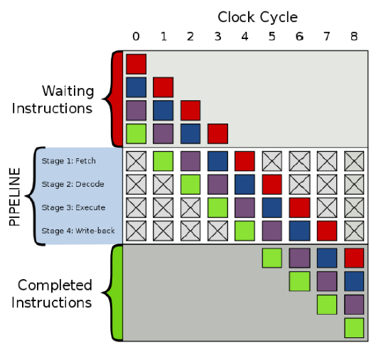
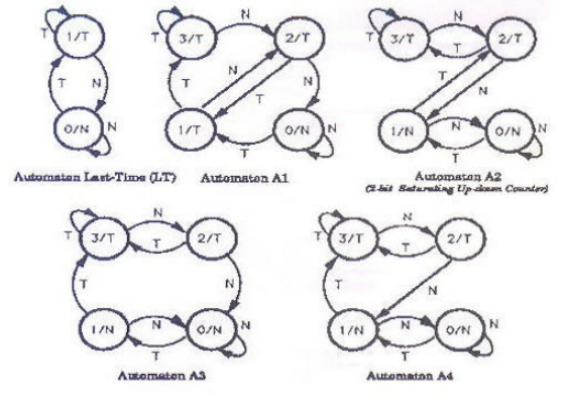
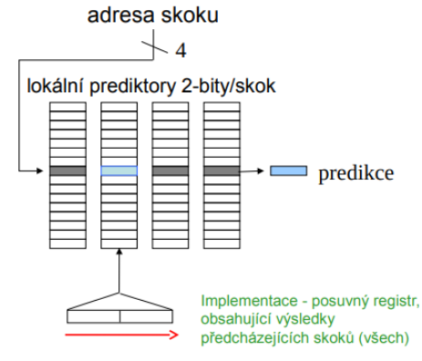
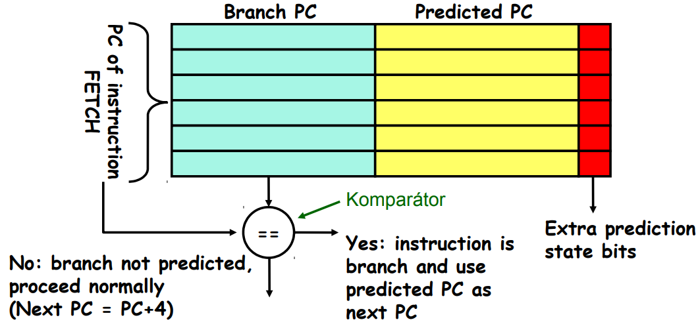
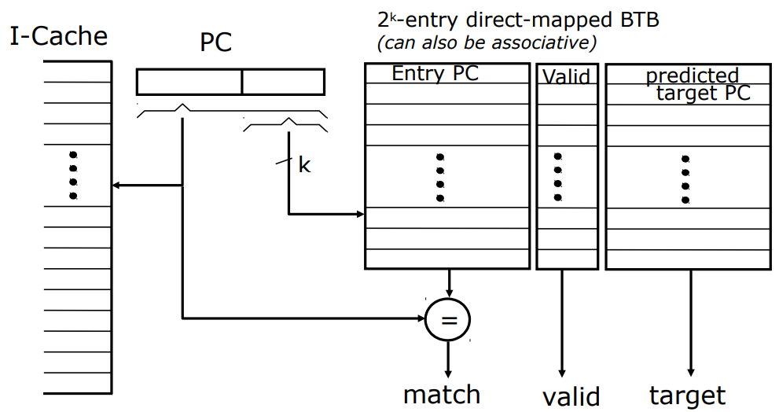
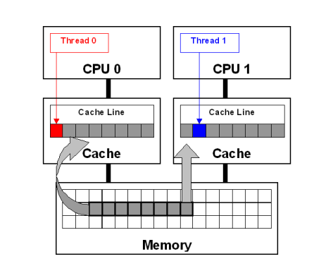
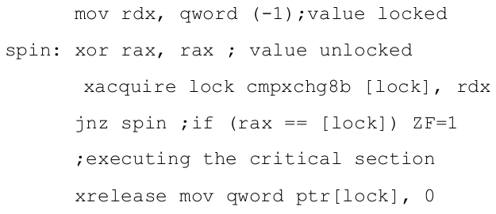
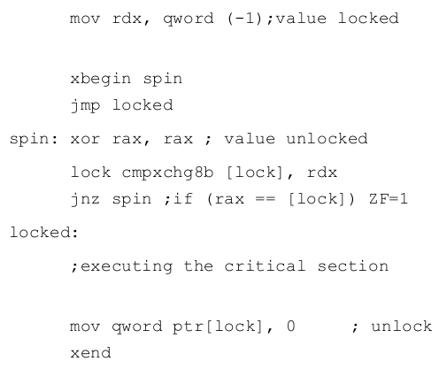
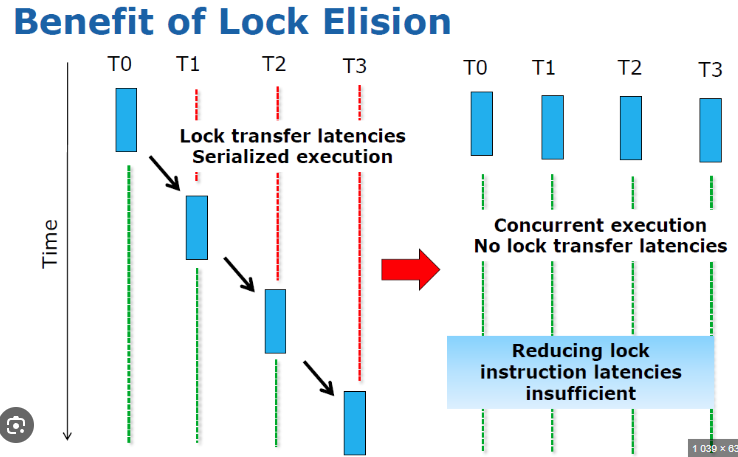

### 11 - Paralelismus na úrovni instrukcí, predikce skoků, paměťová závislost, falešné sdílení a transakční paměť (Intel TSX) – jejich princip a význam pro urychlení sekvenčních a konkurenčních částí algoritmů. [KIV/PPR]

- ILP (= Instruction Level Parallelism)
  - prekryvani instrukci za ucelem zvyseni vykonu
  - dva pristupy
    - zavisi na HW a vyuziva paralelismus dynamicky (napr. scoreboarding)
    - spociva v SW technologiich ktere vyhledavani moznosti paralelismu staticky v dobe prekladu (optimalizace prekladacem)
  - procesorove jadro typicky zpracovava nekolik instrukci najednou -> intruction-level parallelism
  - paralelne muze provadet instrukce, ktere jsou na sobe nezavisle
  - existuje vicero technik a principu ILP
    - pipelining
      - pipeline s `n` stavy (= hloubka pipeliny) `n-krat` urychly vypocet oproti seriovemu zpracovani
    - prejmenovani registru (reseni hazardu)
    - out-of-order execution (vykonani instrukci v prehazenem poradi)
      - musi byt datove nezavisle (napr. necekame na vysledek predchozi isntrukce)
    - predikce skoku

   

- pipelining
  - zpracovani instrukce je rozdeleno do vice po sobe jdoucich stavu jejichz obsluhu lze provadet paralelne (jen za jistych podminek - viz hazardy)
    - typicka 4-urovnova pipeline: Fetch, Decode, Execute, Write-back
  - je mozne provadet vicero isntrukci najednou resp. vice instrukci v ruznych stavech zpracovani
  - CPI pipeline = CPI idelani pipeline + vliv strukturalnich hazardu + vliv datovych hazardu + vliv ridicich hazardu
  - hazardy
    - strukturalni hazardy - omezeni HW (HW neni schopen soucasneho vykonavani dane kombinace instrukci)
      - napr. mame jen jednu ALU
      - memory dependency = load instrukce ceka na dokonceni store isntrukce
    - datove hazardy (= pametove zavislosti) - instrukce zavisi na vysledku predchozi instrukce ktera je stale v pipeline
      - RAW (= Read After Write) je skuteny hazard kde musime pockat navysledek predchozi isntrukce => instrukce nemuzeme prohodit
        - data dependency
        - priklad RAW hazardu: `add r1, r2, r3; sub r4, r1, r5`
      - WAR (= Write After Read) je hazard kde kdybychom instrukce zamenili tak bychom ovlivnily vysledek
        - false dependency
        - priklad WAR hazardu: `sub r4, r1, r3; add r1, r2, r3`
        - reseni: pouziji jiny registr
      - WAW (= Write After Write) vyresime pouzitim jineho registru
        - false dependency
        - priklad WAW hazardu: `add r1, r2, r3; add r1, r4, r5`
        - reseni na urovni prekladace (pouziti jineho registru) nebo HW (napr Scoreboarding - dynamicke resni za runtime)
    - ridici hazardy - zpusobene zpozdenim mezi nactenim instrukce a rozhodnutim o zmene instrukcniho toku (vetveni & skoky)
  - procesory jsou schopny provaded out-of-order execution instrukci
    - udela se prefetch istrukci a hledaji se mezi nimy zavislosti
    - pote se instrukce preskladaji tak aby je bylo mozne provest paralelne (napr. pres Scoreboarding)
  - register renaming
    - v CPU existuji registry ktere jsou nepristupne programatorovi - jsou jen pro internerni pouziti
    - CPU je tim padem schopny zajistit paralelismus a reordering instrukci i kdyz prekladaci registry dosly
    - => cilem je eliminovat zavislosti (= datove hazardy)

    ```c++
    // block 1
    R1 = mem[addr_1]
    R1 += 4
    mem[addr_1] = R1

    // block 2
    R1 = mem[addr_2]
    R1 += 2
    mem[addr_2] = R1

    // => zavislost; resenim je pouzit jiny registr
    ```

  - dle architektury je kazda instrukce implementovana jako serie atomickych mikroinstrukci (= mikroprogram)
  - ruzne CPU maji ruznou sirku/hloubku pipeliny
    - cim hlubsi a sirsi pipelinning => tim vetsi jsou ztraty vznikle chybou predikce skoku -> cela pipeline se musi znevalidovat (= rollback)

- Predikce vetveni/skoku
  - diky pipeline muzeme zpracovavat vicero instrukci najednou ale co jump instrukce? (=> ridici hazardy)
    - jak vime jaka bude dalsi instrukce
    - doted jsme predpokladali sekvencni exekuci tj. `PC += 4` (ARM)
  - mame dve moznosti - bud pozastavit fetchovani dalsich instrukci dokud se neprovede dana instrukce (vyhodnoceni podminky) nebo si typnout vysledek (jestli se bude skakat nebo ne)
  - pokud si typneme spatne => musime udelat rollback instrukci ktere se
  mezitim dostaly do pipeliny
  - spravna predikce = dnes nutna podminka pro dobry vykon
  - jaktoze predikce funguje?
    - algoritmy a zpracovavana data vykazuji regularity
  - staticka vs dynamicka predikce skoku
    - staticka (v dobe prekladu)
      - nejsnazsi je predpokladat ze se skok provede (=> smycky `for`, `while`, ...)
    - dynamicka
      - zda se byt presnejsi nez staticka
      - presnost u modernich CPU > 90%
      - jedobitovy/dvoubitovy prediktor (= stavovy automat)

        

        - vice bitu dovoluje vicekrat se splest
        - uzel = aktualni predikce, hrana = realita
        - nefunguje spravne pokud jsou smycky korelovane napr. `if (d == 0) { d = 1;} if (d == 1) { ... }`
          - => existuje take prediktor vetveni s korelaci
          - myslenka: zaznamenejme `m` naposledy provedenych vetveni jako provedene `T` (= taken) nebo neprovedene `NT` (= not taken) a pouzijme tento vzorek k vyberu spravne n-bitove historie vetveni
      - v realnych systemech casto implementovane vicenasobne prediktory kde jeden "metaprediktor" vybira ktery prediktor se pouzije
        - viceurovnovy prediktor
        - obvykla volba mezi globalnimi a lokalnimi prediktory
          - analyza globalni informace a nasledne i lokalni informace
        - pouziti n-bitovych citacu se saturaci pro vyber mezi prediktor
          - citac se statuaci = citac ktery nepretyka ale zastavi se na maximalni hodnote
          - priklad dvoubitoveho saturacniho citace jako selektor prediktoru
            - oba prediktory jsou vyhodnocovany podle spravnosti vysledku bez ohledu na to ktery byl aktualne pouzit k vyhodnoceni vysledku
            - jsou-li vystupy prediktoru stejne -> selektor prediktoru neni aktualizovan
            - prediktor 1 spravne; prediktor 2 spatne => selektor prediktoru je INKREMENTOVAN (se saturaci)
            - prediktor 1 spatne; prediktor 2 spravne => selektor prediktoru je DEKREMENTOVAN (se saturaci)
            - vyber prediktoru pro aktualni instrukci vetveni se provadi pouze podle hodnoty MSB (= Most Significant Bit) selektoru prediktoru
              - 1 => pouzije se predikce 1
              - 0 => pouzije se predikce 2

        

      - tabulka historie vetveni (BHT = Branch History Table)
        - = lookup tabulka
        - dolni bity `PC` adresuji indexovou tabulku 1-bitovych hodnot:
          - rika zda byl skok od posleniho pruchodu konan
          - bez kontroly adresy (=> muzeme nechtene koukat do historie jineho skoku)
          - problem
            - ve smycce (napr for cyklus) zpusobi 1-bitova BHT dve spatne predikce (prvni a posledni porovnani)

      - BTB (= Branch Target Buffer)
        - vypocet adresy cile skoku je "drahy" a zpozduje nacitani instrukci
        - BTB uklada `PC` stejnym zpusobem jako cache (`PC` podminenho skoku je ulozen bo BTB)
        - je-li nalezena shoda => vraci se odpovidajici predikovana hodnota PC (adresa cile skoku)
        - kona-li se predikovane vetveni, nacitani instrukci pokrauje od adresy kam ukazuje dodana hodnota PC
        - adresa ve stejnou dobu jako predikce
          - adresa - index skoku pro zistkani predikce AND adresy cile skoku (kdyz se kona)
          - shoda se musi overit nyni protoze nesmi pouzit spatnou cilovou adresu

        

        - v BTB je ulozena adresa a cil skoku
        - z adresy PC + 4 se nacita instrukce nenajde-li se shoda
        - v BTB se ukladaji jen provedena vetveni a skoky!

        

  - zajimavou alternacivou k `if (x) { y = z; }` je na x86 instrukce `y = cmov(x, z)`
    - ternarni operator se v C++ preklada primo na instrukci `cmov`
    - provede podmineny `mov` za predpokladu splneni podminku
    - `cmov` nema vliv na control flow a tedy neni potreba spekulovat (predikce)
    - `cmov` ale muze vytvorit nove datove zavislosti
      - `x <- cmov(x, y)`
    - neprijde mi to az  tak zajimave protoze napr. ARM je defakto na podminene exekuci instrukci zalozen :)
      - 4 MSB kazde instrukce obsahuje podminku (flags) za jakych se muze instrukce vykonat ci nikoliv

- False sharing (falesne sdileni)
  - kazde jadro CPU ma svou lokalni cache - typicky L1 a L2
  - je treba zajistit konzistenci mezi jadry (cache-coherency)
  - cache se nacita po blocich (= cach line)
    - takze i pokud jadro potrebuje nacist pamet < cache line, stejne se nacte cache line
  - k falesnemu sdileni dochazi
    - jadro modifikuje promennou ktera sdili stejnou cache line s jinou promennou k niz pristupuje jine jadro
    - oznaci celou cache line jako neplatnou (ackoliv se modifikovala jina promenna) -> druhe jadro je vynuceno ji celou znovu nacist -> zhorseni vykonu
    - v seriovem programu nemuze nastat
    - => proto spatne napsany paralelni program muze byt pomalejsi nez seriovy kvuli nacitani cache pameti
  - lze resit tak ze dana jedna promena = jedna cache line (nic moc reseni)
  - lepsi je mit promennou ulozenou primo v registru
  - falsene sdileni -> data jsou sice sdilena protoze jsou ve stejne cache line ale jsou falesne sdilena protoze se jedna o jine promenne
  - u MMIO to vypada ze pristupujeme k promennym (registrum) ktere jsou hned za sebou a tudiz by pri pouziti paralelniho programu mohlo dochazet k falesnemu sdileni, ale:
    - data nejsou ve skutecnosti v RAM ale pouze se tak tvari (je to adresa na sbernici ktere ale vede do IO prostoru)
    - vetsina takovychto pristupu se resi pouzitim `volatile` promennych => neoptimalizuj to ani je necachuj

    

- Intel TSX – transactional memory
  - dejme tomu ze mame datovou strukturu s 1024 elementy
  - mame take paralelni pristup z vice vlaken
  - pouziti jednoho zamku (mutexu) je nejjednodussi protoze je kod citelny a snizuje riziko vzniku chyby pri synchronizaci
  - nicmene pokud jedno vlakno modifukuje 10. element a druhe 600. jedno z nich musi pockat => snizeni celkoveho vykonu
  - SW reseni
    - rozdeleni pole do vice segmentu kde kazdy segment bude mit vlastni zamek
    - => vetsi komplexita kodu
    - => snizeni ztraty vykonu ale neni uplne odstraneno (mame porad stejny problem, akorat mensi)
  - HW reseni
    - CPU (zatim jen Intel) poskytuje specialni instrukce
    - programator bud pouzije knihovnu ktera je pouziva (GNU libc, Intel one TBB)
    - nebo ji pouzije naprimo `__asm__(...)` v jazycich jako je C++
  - TSX je imeplementace HW transakcni pameti od Intelu
    - cilem je poskytnout vyhodu jednoho zamku spolu s benefitem pri pouziti vicero zamku (ruzne segmenty)
    - HW pouziva L1 cache pro buffering transakcnich zapisu!!
      - nejsou videtelne pro ostatni jadra dokud neni transakce dokoncena
      - konflikty jsou detekovany na urovni cache line
      - v kodu programator oznaci prvni instrukci KS (= kriticka sekce)
        - pokud se transakce nepovede, jadro skoci zpet na tuto instrukci (= Fallback Path)
      - pote co jadro detekuje zacatek KS, vsechny instrukce jsou zapisovany do lokalni pameti
    - ma dva mody
      - HLE (= HW lock elision)
        - kompatibilita se starsim kodem
        - pouziva prefixy instrukci
        - optimisticky predpoklad ze nedojde ke kolizi mezi vice vlakny
        - pokud dojde tak cely proces ukonci a zacne znovu
          - jinak receno: pri prvnim vstupu do KS je takovy ze bere zamek jako odemceny
        - fallback path zacina isntrukci `cmpxchg` kvuli `xacquire` (protoze se pri prvnim spusteni provede jako kdyby byla KS odemcena)
          - konec KS je oznacen `xrelease`

        

      - RTM (= Restricted Transaction Mode)
        - pouziva nove instrukce
        - `xbegin` a `xend` pro oznaceni KS
          - tu procesor pak bere jako atomickou cast
          - `xbegin` take oznacuje fallback path pokud transakce selze
        - vsechny zmeny provedene v KS jdou tedy thread-local dokud transakce uspesne nedobehne nebo neselze
          - pak se pouziva fallback a klasicke zamykani
        - oproti HLE usetrime jeden `cmpxchg` a mame take k dispozici `xabort` pro abort transakce

        

    - TSX je defakto HW podpora pro to abychom meli oddeleny zamek pro kazdou bunku v poli, coz by SW bylo nefektivni reseni?
      - kdybychom v SW pouzili jeden zamek tak tim nas paralelni program degraduje na seriovou exekuci tim jak vlakna na sebe musi cekat (predane zamku = bottle neck)

      
