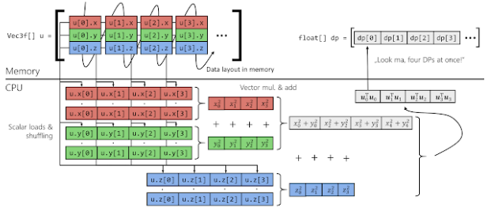

### 12 - Paralelizace cyklů, typy proměnných a paralelizace výpočtu součtů prefixů – charakteristika a řešení. [KIV/PPR]

- pokud mame cyklus muze tu byt moznsot vykonavat vice jeho iteraci paralelne
- pro paralelizaci cyklu je potreba urcit
  - lokalni promenne
    - inicializovany uvnitr smycky
    - pokud to jsou netrivialni promenne tak se na konci kazde iterace zavola desctuktor
  - sdilene promenne
    - ty co se prenaseji mezi iteracemi
    - ty mohou byt zavisle
      - takove jsou pouzite jenom pro cteni nebo se jedna o prvek v poli se kterym se pracuje pouze v ramci jedne iterace
    - nebo nezavisle
      - redukcni
        - promena je nejdrive prectena a pak zapsana (oboji v jedne iteraci)
      - usporadane
        - pro spravny vysledek je nutne iteraci vykonat v danem poradi => NElze trivialne rozdelit mezi vice vlaken a pak agregovat vysledeky
      - zamykane
        - promenna muze byt ctena i zapisovana v nekolika iteracich
        - klidne nekolikrat po sobe v jedne iteraci
        - pokud by se iterace provadely v nahodnem poradi, vysledek by byl stejny (napr. `min` v cyklu)

- parallel prefix sum
  - resi problem usporadane promenne
  - da se aplikovat napriklad na: razeni, lexikalni analyzu, histogramy, teorii grafu, stringy, ...
  - jedna se o "stavebni kamen" ruznych paralelnich algoritmu
    - vyuzivaji modifikaci pareleniho prefixoveho souctu
  - usporadana promenna (= poradi) zabranuje neusporadane paralelizace (= nezavislost na datech)
    - `items[i] = items[i] + items[i-1]`
  - v sekvencnim postupu kazda suma produkuje jeden prefix
    - pocitani `n` prefixu vyzacuje `n` sum
  - abychom to mohly paralelizovat -> musime problem reformulovat
  - strom
    - itemy jsou listy stromu
    - nody jsou mezivysledky => lze pocitat paralelne
      - => dekompozice stromu na paralelni nodu (vypocet po vrstvach/v krocich)

    

  - vytvorime kopii vstupniho pole (v kazde iteraci) -> tim se zbavime usporadane promenne ve forme vstupniho pole
    - => misto toho vytvorime `d` usporadanych promennych (jednu pro kazdou iteraci)

    ```c++
    #include <vector>
    #include <iostream>

    int main()
    {
        // Vstupni pole
        std::vector<int> data{ 0, 1, 2, 3, 4, 5, 6 };

        // Iterace pres jednotlive kroky: 1, 2, 4, 8, 16, ...
        //
        // teoreticky d < std::floor(std::log2(data.size()))
        // 2^d = data.size() => d = log2(data.size())
        //   - dva na kolikatou nam tvori velikost pole?
        for (std::size_t d = 1; d < data.size(); d *= 2)
        {
            // Vytvor kopii vstupnich dat
            std::vector<int> tmp = data;

            // Proved iteraci (jedna uroven mezivysledku stromu)
            for (std::size_t i = 0; i < data.size(); ++i)
            {
                // Test na podtecteni pri indexaci pole (i-d >= 0)
                if (i >= d)
                {
                    tmp[i] = data[i] + data[i - d];
                }

                // TODO: Vypis mezivysledek tmp[i]
            }

            // Aktualizuj vstupni pole (vstup do dalsi iterace)
            data = tmp;
        }
    }
    ```

    - `tmp` se stalo novou usporadanou promennou
    - transformace jednoho cyklu do dvou cyklu kde ten vnitrni muze byt paralelizovan
    - naivni pristup (jedra budou postupne nevyuzivana)
      - tohle chceme paralelizov napr. pres farmer-worker `tmp[i] = data[i] + data[i - d];`
      - v kazde dalsi iteraci je min a min polozek ktere je treba secist
        - na obrazku je v poslednim kroku udelat pouze 4 soucty
      - => neefektivni kvuli tomu jak se jadra postupne prestanou vyuzivat
    - urychleni
      - seriovy pristup: `O(n)`
      - paralelni pristup (1 vlakno): `O(0.5 * n*log2(n))`
      - paralelni pristup (`m` vlaken): `O((0.5 * n*log2(n)) / m)`

    

    

    

    - efektivita silne zavisy na dvou faktorech
      - velikost vstupnich dat
      - pocet CPU jader pouzitych k paralelizaci vnitrniho vyklu
      - tento zpusob je vhodny spise pro masivne paralelni zpracovani (treba GPGPU s omezenou velikosti vstupnich dat)
    - => jak se to da resit jinak?

  - first-stop
    - redukova od spoda nahoru

    

    - tomhle kroku si ulozime celkovou sumu (pokud ji potrebujeme)
    - pote celkovou sumu nastavime na 0 a projedeme cisla smerem dolu

    

    - dve varianty
      - inkluzivni - typicky jako pri naivnim reseni (vsechny sumy)
      - exkluzivni - zacina s 0 a posledni suma tam neni (elementy jsou posunute o 1 pozici)
    - tento algorimus ma podporu v mnoho frameworcich a knihovnach
      - MPI (= Message Passing Interface), OpenCL, one TBB, STL (= Standard Template Library)
    - zaver je takovy ze pokud ma algoritmus usporadanou promennou => neznamena to, ze nelze paralelizovat
      - vyzaduje to jen trochu jiny zpusob premysleni

- SIMD instrukce
  - umoznuji pomoci jedne instrukce operovat nad vice elementy najednou
    - umoznujeme nam do dosahnout az `n`-nasobneho zrychleni (linearni) - pouze teoreticky!!
      - => je zde i nejaka pridana HW rezije?
      - je treba brat v potaz to ze SIMD instrukce mohou vyzadovat vicero cyklu CPU nez "obycejne" instrukce
  - moderni prekladace provadeji vektorizaci kodu automaticky (pouze kde to je mozne -> omezeni)
    - reportuje co se mu povedlo/nepovedlo vektorizovat
  - vektorizovat kod lze i rucne pomoci SIMD intrinsics instrukci
    - napr `extern __m128 _mm_add_ps( __m128 _A, __m128 _B );`
  - AVX-512 je defaultne vypnuty (zere hodne energie)

- vektorizace cyklu
  - kompilator muze v nekterych pripadech automaticky vektorizovat cykly
    - je potreba znat pocet iteraci (SIMD instrukce operuji nad pevnym poctem operandu) -> poslednich par cyklu muze nechat seriovemu kodu
    - muze tam take vlozit kod ktery za runtime zjisti pocet cyklu a podle toho vypocet bud provede vektorizovane nebo ne (runtime evaluace)
  - automaticke vektorizace take musi resit datove zavislosti
    - pokud jsou jednotlive iterace zavisle => neni mozne cyklus vektorizovat
  - dalsim problemem jsou exit pointy - `break`, `return`, `continue`
    - vektorizator nevi kdy cyklus skonci => nemuze ho vektorizovat
  - dalsi problem je prace s pointery do pameti
    - automaticka vektorizace se provede jen pokud je jiste ze se vyprodukuje spravny vysledek
    - pokud v cyklu pracuji s poli v pameti, vektorizator nevi, jestli se pole navzajem prekryvaji nebo ne
      - tedy jestli neexistuji datove zavislost (= Aliasing)
      - prekladac muze vlozit runtime kontrolu pro aliasing -> pak bud provede vektorizovany kod nebo ne
  - vektorizator se musi ujistit ze vsechny operace v cyklu jsou vektorizovane
    - pouziti skalaru uvnitr muze vyzadovat expanzi skalaru
      - `0.5 -> [0.5, 0.5, 0.5, 0.5]`
    - to neni pozne pokud je dany skalar pouzit i nekde jinde mimo cyklus
    - podobny problem muze byt i redukce - vektorizator muze odmitnout vektorizovat cyklus ktery provadi redukci pole na sumu
  - dalsim problemem jsou podminky
    - ty jsou v ramci SIMD resene pomoci maskovaneho nacteni a ulozeni ale autovektorizator s tim muze mit problem
    - `x = y * cond + z * !cond` -> zbaveni se podminky
    - zadna ukoncovaci podminka co by byla zavisla na datech

    

    - porovna dva vektory, vysledek je 0/1 => pouzije jako masku
    - pokud `mask[i] == true` -> nacti `arr1[i]`
    - pokud `mask[i] == false` -> nacti `arr2[i]`
      - => nacti `(arr1[i] * mask[i]) + (arr2[i] * !mask[i])`
      - => neni zde zadne porovnavani

    

    - `simd_if (mask, true_vector, false_vector)`
    - muze vest k velkemu overheadu

  - pokud cheme prekladaci naznacit ze chceme aby udelal vektorizaci muzeme provest loop unrolling nebo pouzit direktivy prekladace (`#pragma`)
    - rozbalovani smycek
      - muze vest k narustu velikosti kodu
      - potencialni nedostatek registru
      - je dobre vzit v potaz Amhdaluv zakon (jake % celkoveho programu vubec zrychlujeme, vyplati se to?)
  - pokud operujeme se strukturami a chceme provest SIMD vypocet, je lepsi mit strukturu poli nez pole struktur => usetri nam to shuffle operandy a loady a umozni aplikovat vice vektorovych instrukci
    - chceme spocitat `x^2 + y^2 + z^2`
    - AoS (= Array of Structures)

        ```c++
        struct TVector {double x, y, z };
        std::array<TVector, n> u;
        ```

        

    - SoA (= Structure of Arrays)

        ```c++
        struct TVector { std::array<double, N> x, y, z; };
        TVector u;
        ```

        

    - zaver: zalezi hodne na tom jak mame data take ulozena v pameti

- segmented scan
  - dejme tomu ze chceme aplikovat prefix sum na vicero sekvenci (vicero vektoru)
    - pri sekvencnim spousteni paralelnich algoritmu nedochazi k amortizaci
    - je mnohem lepsi spustit jeden paralelni scan a konkatovat (spojit) jednotliva pole
  - budeme mit priznak (flag)
    - 1 = restartuj scan
    - 0 = pokracuj v cinnosti
  - paralelismus se nijak nemeni, jen potrebujeme jiny operator
    - max, addition

    

    
