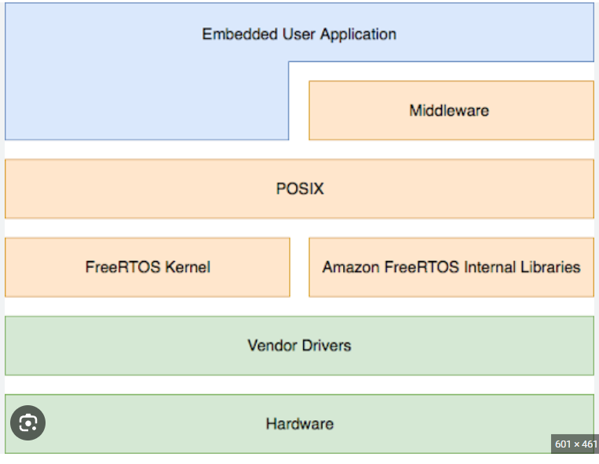
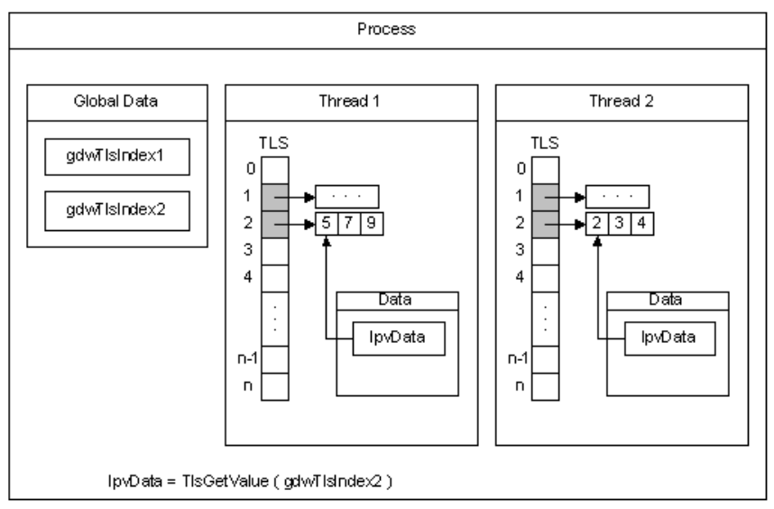
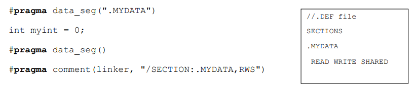

### 13 - Programové prostředky pro multithreading – POSIX, WinAPI, C++11 (s využitím STL a RAII). [KIV/PPR]

- POSIX (= Portable Operating System Interface)
  - = rozhrani OS kompatibilni s UNIX-like operacnimi systemy
  - navrh rozhrani s cilem prenositelnosti (aplikovatelnost na vicero zarizenich)
  - mozne implementovat v jakemkoliv OS
  - sklada se ze tri casti
    - rozhrani API pro operacni system a jadro (realny cas, vlakna, zapezpeceni, IPC)
    - CLI (prikazovy radek) a utilities
    - validace
  - `pthreads` je implementace vlaken podle POSIX standardu
    - obsahuje
      - definice datovych typu (napr. `pthread_t`)
      - funkce pro rizeni vlaken (napr. `pthread_create(...)`)
      - synchronizacni funkce (napr. `pthread_join(...)`)
  - POSIX definuje pouze prototypy funkci
  - objekty POSIX
    - nejsou to OOP objekty
    - nepruhledne (opaque) struktury identifikovane pomoci handleru
      - `pthread_t`, `pthread_mutex_t`, `pthread_cond_t`
    - jeden objekt ma vice atributu, ktere lze menit
      - `pthread_attr_t`, `pthread_mutexattr_t`, ...
      - pri zmene vraci manipulacni funkce bud 0 (pri uspechu) nebo kod chyby
  - POSIX vs WinAPI
    - POSIX definuje prototypy funkci
    - jeden `.h` subor muze mapovat POSIX na WinAPI

    

- WinAPI
  - nase aplikace bezi nad OS tak ma smysl vedet jake prostredky nam OS poskytuje
  - operuje s procesy a vlakny
  - = rozhrani OS Windows ktere poskytuje sycnhronizacni prostredky
  - WinAPI Job object
    - sdruzuje (agreguje) vice procesu do skupiny
    - jedna skupina = jeden spravovany object
      - jedna operace se vztahuje na vsechny obsazene procesy
    - nekdy je potreba vytvorit ulohu s jedinym procesem pro nastaveni a vynuceni pametovych limitu
  - WinAPI Thread
    - = planovaci jednotka OS (entita vlastnena procesem)
    - jedinecne ID
    - vsechna vlakna sdileji adresni prostor a prostredky sveho procesu
    - vyhrazeny exception handler
    - ma kontext, zasobnik, afinitu (omezeni exekuce jen na urcita jadra CPU), prioritu a dalsi veci
    - impersonating
      - spusteni pod jinym uzivatelem nebo s jinymi opravnenimi nez ostatni vlakna teze procesu
    - ma take TLS (= Thread Local Storage)
      - data specificka pro loklani vlakno
        - `__declspec(thread) int number`;
          - pristup k tehle promenne je unikatni pro kazde vlakno
        - vlakno ji muze pouzit k izolaci svych dat
      - omezeny pocet TLS slotu pro dany proces (max 64)
        - kazde vlakno ma kopii sve promenne v TLS kterou muze menit bez globalnich/statickych implikaci

        

      - typy promennych ve vlakne
        - globalni - sdilena mezi vsemi vlakny
        - lokalni - kazde vlakno ma svou kopii (implementovani pomoci TLS)
        - zasobnik - kazde volani dane funkce vytvori kopii promenne na zasobniku
  - WinAPI Thread pool
    - farmer-worker model
    - pool vlaken pro zpracovani asynchronnich udalosti procesu
    - spojeno s frontou eventu ke zpracovani
    - lze pridavat callbacky do fronty
      - callback funkce jsou pak zpracovany workery
    - pool si sam spravuje (vytvari) vlakna
      - po zpracovani callback nejsou znicena -> ale pouzita znova
    - kdyz neni nic na praci => vlakna jsou uspana
      - implementace napriklad pomoci podminkove promenne
    - vyuziti v distribuovanych a sitovych aplikaci
      - nejjednodussi pripad je zpracovani HTTP pozadavku
      - => mame `N` vlaken (asynchronnich workeru) ktere zpracovavaji pozdavky ktere prichazi na server

  - WinAPI Fiber
    - = vlakno ktere se planuje v userspacu
    - cilem je vyrazne snizeni prepinani kontextu (kernel <-> userspace)
    - FLS (= Fiber Local Storage)
      - analogie TLS
      - ma pristup i k TLS vlakna (ktere ho naplanovalo)
      - fiber ma velmi maly kontext ve srovnani s vlaknem pod ktere spada
        - uklada se pouze jeho redukovany kontext jako je jeho zasobnik nebo subset registru
    - jedno vlakno muze vytvorit vice fibers
    - nejprve se vytvori nove vlakno (Thread) a pak se prekonvertuje na Fiber pomoci `ConvertThreadToFiber()`
      - jakmile je vlakno fiberem, muze vytvaret dalsi fibery pomoci `CreateFiber()`
    - Fibery jsou planovane kooperativne
      - jeden fiber muze predat rizeni jinemu fiberu pres `SwitchToFiber()`
    - Fiber je planovany v ramci daneho vlakna ktere ho vytvorilo => pokud vlakno stoji, fiber taky
    - Nema prioritu

  - WinAPI UMS (User-Mode Scheduling)
    - trochu podobne jako fibers
    - "nenarocny" zpusob jak si aplikace muze planovat vlastni vlakna v userspace (viz napr Java? - ta si vlakna planuje sama)
    - narozdil od fibers, kazda UMS ma vlastni kontext vlakna
    - programator musi dodat scheduler ktery vytvari vlakna a planuje kdy budou spustena
    - vyhrazeny planovac UMS
      - jeden pro kazdy CPU
      - prevadi normal/kernel vlakna na UMS vlakna
      - udrzuje frontu vlaken UMS ktera dokoncila exekuci kernelu
      - OS notifikuje up-call vlakna planovaci aby je bylo mozne efektivne planovat -> nikoliv oproti kernel planovaci
      - vlakno UMS by nemelo vytvaret zadne prepoklady o svem planovaci

  - WinAPI synchronizace
    - implementovano pomoci synchronizacnich objektu
      - event, mutex, pipe, waitable timer, change notification, standardni vstup, job, memory resource information, process, thread, file, komunikacni handle
    - cteni stavu objektu -> pomoci wait funkce
    - Single object (synchronizace nad jednim objektem)
      - `SignalObjectAndWait()`
      - `WaitForSingleObject/Ex`
        - Ex = execute predany callback?
    - Multiple objects (synchronizace nad vicero objekty)
      - `WaitForMultipleObjects()`
      - `MsgWaitForMultipleObjects/Ex`
    - Registered wait
      - obsahuje i callback ktery se zavole po tom co nastane dana udalost
      - navrzen pro thread pool
    - Wait funkce
      - vrati se okamzite
        - precetla si pouze stav objektu a necekala na nej
        - funkce cekala az bude objekt signalizovan
      - nebylo treba na nic cekat (mohlo byt jiz signalizovano)
      - timeout (muze byt predan parametr pro cekani do nekonecna)
  - APC (= Asynchronous Procedure Call)
    - rutina ktera je provedena v kontextu aktualniho vlakna
    - kazde vlakno ma vlastni APC frontu
      - provadeni zajistuje OS planovac
      - pokud neni prazda => tak se naplanuje APC pred naplanovanim vlakna
    - User-Mode APC
      - vlakno musi byt ve stavu alertable
        - napriklad pomoci volani `WaitForSingleObjectEx` => po zavolani se vlakno nastavi na alertable
      - nelze prejit do stavu alertable kdyz je v APC
      - callback se provede striktne v userspace
    - Special User-Mode APC
      - callback preemptne user code
    - Normal Kernel APC
      - vlakno nemusi byt ve stavu alteratble
      - preemptne User-Mode APC i kod
    - Special Kernel APC
      - vlakno nemusi byt ve stavu altertable
      - preemptne Normal Kernel APC, User-Mode APC i kod vlakna
  - dalsi zpusoby sycnhronizace
    - KS (= Kriticka Sekce)
      - `Enter`, `TryEnter`, `Leave`
    - podminkova promenna
      - defakto se jedna o frontu do ktere se vlakno zaradi a ceka na to az nastane nejaka udalost
        - napr. prijde HTTP pozadavek na server (viz thread pool)
      - tim ze nastane nejaka udalost se pak vlakno/vlakna presune z fronty k vypoctu
      - vyuziti ve farmer-worker scheme
        - kdyz neni zadna prace (podminka == false) => uspime vsechna vlakna (workery) => resource-friendly
    - SWR (= Slim Read/Write Lock)
      - optimalizovano pro pripady kdy kriticka sekce (pouziti mutexu) vyvolaji prilis velkou rezii
      - pri vstupu do bezne KS je k dispozici informace proc do ni vstupujeme
        - => dve metody `acquire` (R/W) => OS muze optimalizovat
      - vyhodne pri castejsim cteni dat nez pri jejich zapisu
      - SWR ma velikost ukazatele (pointeru) => nenese zadne dalsi informace
    - One-Time instantiation
      - o inicializaci struktury se muze pokusit vice vlaken
      - nicmene jen jedno vlakno muze inicializovat strukturu prave jednou
      - synchronne: `InitOnceBeginInitialize()`, `InitOnceCompleted()`, `InitOnceExecuteOnce()`, ...
      - asynchronne: `INIT_ONCE_ASYNC`
    - Atomicke operace
      - velikost promenne musi byt <= strovoje slovo
        - strojove slovo = pocet bitu se kterou dokaze CPU pracovat jako s jednou datovou jednotkou (muze odpovidat treba velikosi registru nebo sirce sbernice)
        - jinak nebude atomicka
      - Increment, Decrement, Exchange (swap), CompareExchange, ...
    - SMP fetching
      - funguje obdobne jako fence u OpenCL
      - garantuje ze budou vykonany vsechny load/store instrukce pred fence
        - resp. ze instrukce po fence bude provedena az se konci vsechny load/store isntrukce pred fence
      - v principu klade reordering pametovych operaci
        - nemuzeme je jen tak prehazet protoze SMP fetching implicitne vynucuje poradi
      - acquire
        - load/store/execute dokonceno predtim, nez se provede FETCH nasledujici instrukce z pameti
        - => zabranuje reorderingu read instrukci pred acquire s read/store instrukcemi po acquire
      - release
        - load/store/execute dokonceno predtim nez se EXEKUCE provede nasledujici instrukce
        - => zabranuje reorderingu read/store instrukci pred release s read instrukcemi po release
      - fence
        - data jsou pripravena pred provedenim instrukce
        - kombinace dvou => read/store pred a read/store po
    - Posilani zprav
      - `PostMessage()` - neblokujici; assynchronni posilani zprav
      - `SendMessage()` - blokujici; synchronni posilani zprav
      - `PeekMessage()/GetMessage()` - "nahledne" a ziska zpravu z fronty
      - `WaitMessage()` - vlakno se zablokuje dokud neprijde zprava
      - `PostThreadMessage()` - doruci zpravu konretnimu vlaknu (dle TID)
      - WM_COPYDATA - specialni kod zpravy
        - IParam je ukazatel na block read-only pameti
        - pokud chce prijemce tyto data modifikovat -> musi si udelat kopii
    - IPC (= Inter-process Communication)
      - DuplicateHandle
        - duplikuje handle objectu jinemu procesu (napr. pojmenovany semafor)
        - vytvori pojmenovany objekt a preda cestu k danymu souboru jinemu procesu
          - po otevreni souboru (pojmenovaneho objektu) druhym procesem => sdileni stejneho stavu objetu
        - obecne to znamena pouzit sdilenou pamet, pojmenovane objekty nebo pipe
    - DLL shared section
      - segment ktery je vytvoren po zavedeni DLL do pameti
      - v danem DLL vytvorime specialni sekci (mimo jeste .txt, .bss, atd.)
        - na zaklade flagu (krom RW jeste S = shared) OS pozna ze ma vytvorit sdileny segment
      - vsechny procesy sdili tento segment
        - ale synchronizace je na programatorovi

        

- C++11
  - C++11 a vis se take oznacuje jako moderni C++
    - (C++14 je jen fix-up C++11)
  - poskytuje zazemi pro multithreading
  - definuje API pro vlakna a primitiva pro synchronizaci
    - muze byt wrapper WinAPI/POSIX => jednotny zpusob programovani
  - nezavisle na platforme
  - vyssi abstrakce nez pthreads
  - neimplementuje vsechna synchronizacni primitiva
    - napr semafory, read-only zamky je furt porteba implementovat na urovni API OS (WinAPI/POSIX)
  - podporuje
    - `std::thread`, `std::mutex`, `std::condition_variable`, `std::atomic<T>`, ...
    - a s nimi spojene metody/funkce
    - `std::async` - asynchroni volani funkce
      - na nizssi urovni neco jako zahajeni DMA prenosu
      - navratova hodnota `std::future`
        - metoda `get` je pak blokujici (cekani na dokonceni operace)
  - RAII ( = Resource Acquisition Is Initialization)
    - v podstate jde o to ze mame konstruktory a destruktory
    - opusteni scope = volani destruktoru
      - => C++ ma dobre definovany (deterministicky) object life-time coz je dulezite v mission-critical systemech
    - myslenka je takova ze bychom nemeli sami spravovat zdroje
      - volat funkce jako `fopen()` & `fclose()`
      - => to by automaticky mely resit konstruktory a destruktory
      - => zamezeni chyb programatora (uvolneni pameti, zavreni souboru, atd)
      - muzeme treba resit wrapper tridou
    - v miltithreadingu se RAII pouziva v `std::lock_guard` - zmknuti mutexu na urovni scope
      - je to lepsi nez vsude davat runce `lock()` & `release()`
    - praci nam take usnadnuji smart pointery
      - `std::unique_ptr` -> vynuceni exkluzivniho vlastnictvi zdroje
        - preneseni vlastnictvi je pak pomoci `std::move` (move semantika)
      - `std::shared_ptr` -> obsahuje atomicky citac referenci
        - pokud se dekrementuje na 0, zavola se destruktor (uvolneni zdroje)
      - `std::weak_ptr` -> umoznuje vytvoreni cyklicke zavislosti mezi zdroji
    - STL (= Standard Template Library)
      - poskytuje RAII struktury ktere se alokuji na hlade
        - omezene vyuziti napr v embedded zarizenich
        - nemusime ale resit jejich uvolnovani
      - od C++17 jsou pro algoritmy v `#include <algorithm>` pridany navic execution policy ktere pres ktere je mozno specifikovat paralelizaci/vektorizaci (=> jejich kombinace napr. `std::execution::par`)
