### 14 - Intel Threading Building Blocks – task-stealing plánovač, dekompozice úloh, redukční operace, flow-graph. [KIV/PPR]

- Intel TBB (= Intel Thread Building Blocks)
  - knihovna spravovana Intelem
  - predchudce SYCL a PSTL (= Parallel Standard Template Library)
  - poskytuje efektivni SMP algoritmy
    - muze byt kombinovan s OpenCL/SYCL
  - poskytuje dekompozici tasku
    - programator uz nepracuje s vlakny naprimo => abstrakce
    - obsahuje paralelni implementace operaci jako je `parallel_for`, `parallel_reduce` nebo `parallel_pipeline`
    - task-stealing planovac snizuje cache-cooling efekt

- cache-cooling
  - dejme tomu ze mame `m` kernelovskych vlaken a `n` procesorovych jader (`m > n`)
  - jak se vlakno vykonava tak se jeho kod a data ukladaji do instrukcni a datove cache
    - temto datum se rika hot data (hot in cache)
  - jak se prepinaji vlakna tak vic vlaken zaplni cache svymi daty
  - cache ma omezenou velikost => data ktera byla nejdele nepouzita se prepisou
    - poznamka
      - u pameti jsou hlavni dva parametry - vylikost a rychlost
      - tyto parametry jsou proti sobe => proto mame v PC vice druhu pameti (registry, cache, RAM, disk, EEPROM, ...) kde kazda pamet ma sve specificke use-casy
    - kdyz se drivejsi vlakno zacne zase vykonavat jeho data nemusi uz byt v cache a tim se zdrzi na stovky cyklu nez se data nactou znova z RAM (nebo dalsi uroven cache - napr. L3) do cache
    - detekovani s cache-miss HW citatem
  - TBB programator se presouva od vlaken k taskum
  - TBB podporuje rozhlad na tasky (=> grafova struktura)
    - TBB chce aby jedno vlakno pracovalo na jedinem tasku dokud se task nedokonci
    - pote TBB pokracuje s dalsim taskem ktery nasleduje a idealne pouziva vysledky z predchoziho tasku
    - => timto zpusobem se snizuje cache-cooling efekt
    - => pouziti jiz nactenych dat pro jiny task
  - klasicke thread / thread-pool / farmer-worker takhle neefunguji
    - ty se hodi napriklad pro GUI nebo IO
    - v pripade vypocetne narocnych uloh jsou horsi nez tasky a TBB

- task-stealing scheduler
  - resi problem cache-coolingu

    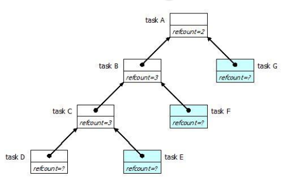

  - tasky A, B a C vytvorily podtasky na ktere nasledne cekaji
  - vykonava se task D; tasky E, F, G se jeste nevykonavaji
    - potrebuji se vyresit zavislosti

    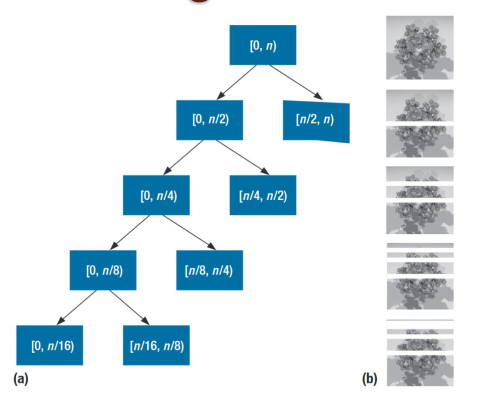

  - rekurzivni deleni rozsahu -> generovani tasku
  - kazdy blok predstavuje task, ktery provede vypocet nad danym rozsahem
  - listy predstavuji tasky ktere se jeste nevykonaly
  - interni uzly predstavuji tasky ktere se jiz vykonaly ale rozhodly dale rozsah rozdelit
  - nejvice zanorene tasky jsou nejvice cache-hot
    - prace je provadena depth-first (nove vytvoreny task je nejvice cache-hot)
    - staling tasku je provaden breadth-first
    - => v praxi musime kompromisovat (HW zdroje - pocet jader)
  - kazde jadro CPU ma vlastni zasobnik tasku
    - time padem nejnovejsi task je nejvice cache-hot
    - implementovano pomoci double-ended queue
  - kdyz se zpracuje cela fronta (=> stava se povytizenym jadrem), pokusi se jadro "ukrast" cool data jineho jadra ktere je aktualne vytizine
    - "krade" z vrcholku zasobniku, kde jsou nejvice cool tasky (nejstarsi)
    - => tim lze eliminovat potrebu presouvat vlakna mezi jadry
  - TBB je optimalizovan pro zname procesory a jejich HW subsystemy

    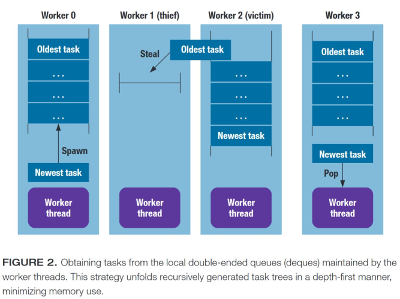

    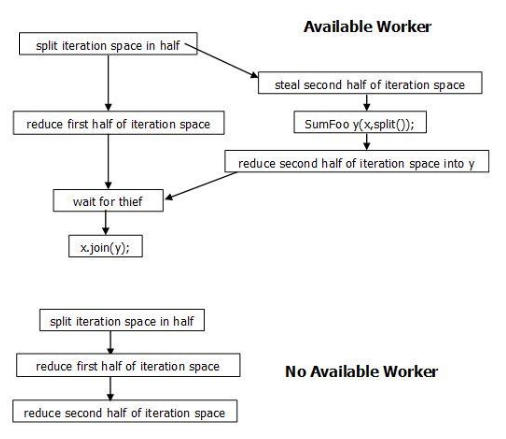

- dekompozice uloh
  - TBB vyzaduje dekompozici uloh na tasky ktere pak planuje
  - to umozuje pouziti task-stealing planovace
    - tasky lze migrovat mezi jadry CPU
    - vlakno se muze tocit na jadre CPU a provadet tasky (nemusi se migrovat)
  - pridelovani tasku jadrum je tak v rezii TBB => vi jak rozdeleni optimalizovat

- `tbb:task`
  - zakladni pracovni jednotka pro TBB planovac
  - `tbb:task` muze
    - vytvorit podtasky
    - pockat na jine tasky az se dokonci
    - nastavit callback task po dokonceni
  - runtime vytvoreni precedencniho grafu paralniho vypoctu

- redukcni operace
  - `tbb::parallel_for`
    - vola paralelne stejnou funkci nad jednotlivymi prvky pole
    - funkce muze byt but lamba nebo funktor (`std::size_t operator()() const { ... }`)
    - v obou pripadech musi byt operator `const`
      - => nemeni vnitrni promenne tridy s pretizenym funkcim operatorem
      - (no side-effects)

    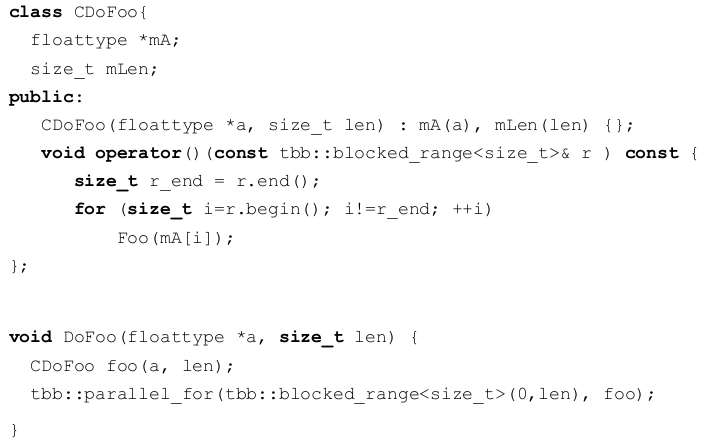

  - `tbb::parallel_reduce`
    - pracuje podobne jako `tbb::parallel_for` ale funkci operator uz nemuze byt `const` protoze updatuje mezivysledky (napr. hledani minima - `int m_min` je clenska promenna ktera je modifikovana)
    - trida musi mit 2 konstruktory
      - defaulni konstruktor pro vytvoreni prvni instance kterou predame algoritmu
      - split konstruktor ktery vola TBB a ktery bere data z existujici instance
      - potom je jeste potreba metoda pro join => spojeni dvou vysledku (instanci)
      - funkcni operator musi updatovat mezivysledky dane instance

    - seriovy pristup pro hledani minima:

        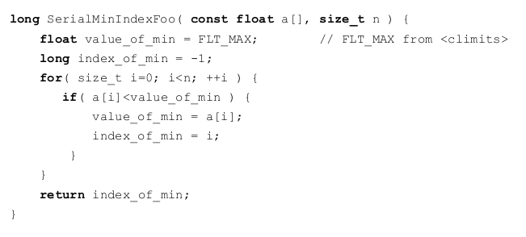

    - paralelni pristup (TBB) pro hledani minima

        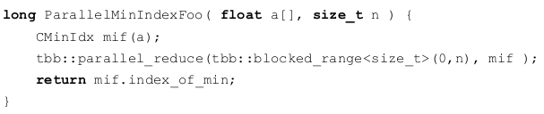

        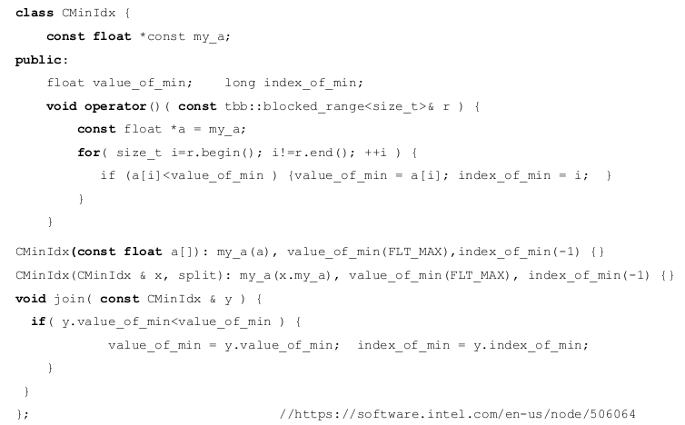

  - `tbb::parallel_deterministic_reduce`
    - deterministika verze `tbb::parallel_reduce`
    - prochazeni pole pokazde ve stejnem poradi
    - zpomaleni (limituje planovac)

  - `tbb::parallel_do`
    - `tbb::parallel_for` a `tbb::parallel_reduce` se daji pouzit na kontejnery s pevnou velikosti
    - `tbb::parallel_do` umi zpracovat dynamicky se menici pocet elementu
      - muzeme pridat dalsi prvny v prubehu zpracovani
      - napriklad pri prochazeni gragu (napr. hledani cyklu)
    - je vhodne kdyz vstupni stream ma iteratory s nahodnym pristupem a pridavame vic nez jeden prvek najednou

      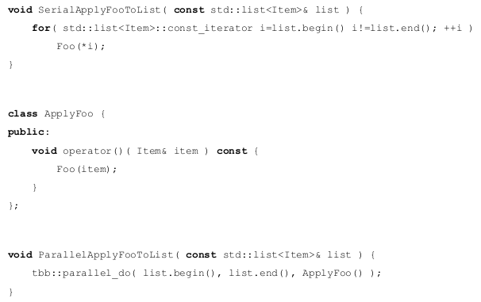

      - `tbb::parallel_do_feeder` zajistuje pridavani prvku

      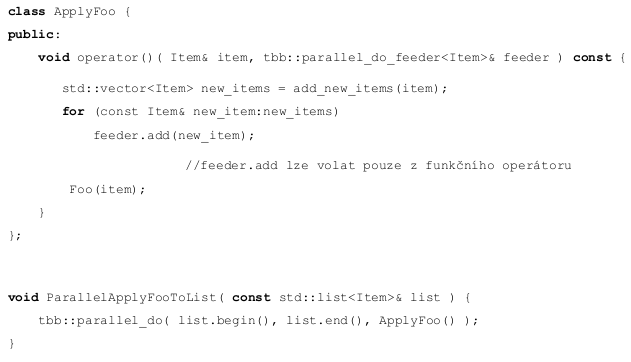

  - `tbb::flow_graph`
    - `tbb::task::execute()` vytvori precedencni graf za runtimu
    - tento graf nemusi byt pri dalsim spusteni stejny
      - pusobeno cekanim na navratove hodnoty funkci a `tbb::task_group::run/wait`
    - oproti tomu, flow graf popisuje vsechny uzle a hrany pred spustenim (priste zustanou stejne)
      - umoznuje aplikaci pouzit bufferovani, agregaci a pomocne uzle

    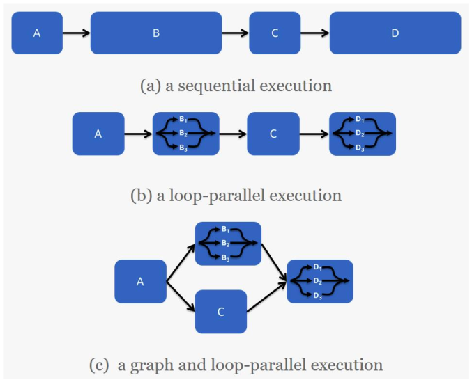

    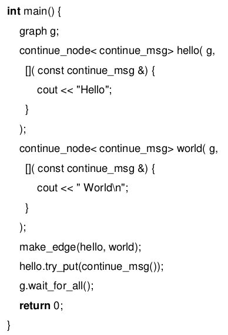

    - uzel (node) predstavuje vypocet ktery se spusti jakmile dany uzel prijme po hrane `continue_msg`
    - specialni uzle duplikuji zpravu
      - jedna zprava jde nekolika sousedum daneho uzlu
    - nekolik uzlu muze cekat na zpravu od nekolik bezprostrednich uzlu (sousedu) aby odeslali jednu zpravu

    - `tbb::flow::opencl_node`
      - umoznuje provest kod na OpenCL zarizeni (nemusi byt jen CPU)
      - primarne se kazdy uzel vykonava na CPU
        - nicmene CPU muze ridit periferii (napr GPGPU)
      - TBB implementuje `graph_async_node`
        - umoznuje provest exekuci jinde nez na CPU (CPU pouze ceka na vysledek)
      - TBB poskytuje OpenCL node pro OpenCL zarizeni
        - nemusi to byt naprimo `.cl` source code ale muze to byt napriklad SYCL
      - CPU ridi GPGPU pomoci DMA

  - `tbb::parallel_pipeline`
    - implementace pipeline vzoru
    - filter implementuje jednu fazi pipeliny
    - filtery jsou postupne aplikovany na vstupni data
    - typy filtru
      - `serial_in_order` - filter probehne pouze nad jednim elementem v poradi v jakem byly vlozeny do pipeliny (FIFO)
      - `serial_out_of_order`
      - `parallel` -  zpracuje nekolik elementu paralelne v libovolnem poradi

      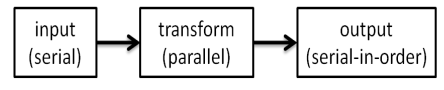

    - `tbb::parallel_pipeline` instancuje `n` stejnych pipeline aby se vykonaly paralelne
      - `n` je pocet tokenu (povoleni k exekuci)
        - logicky bychom chteli mit `n` nekonecno, ale porad jsme omezeni poctem jader CPU
      - pocet vstupnich hodnot je neznamy

      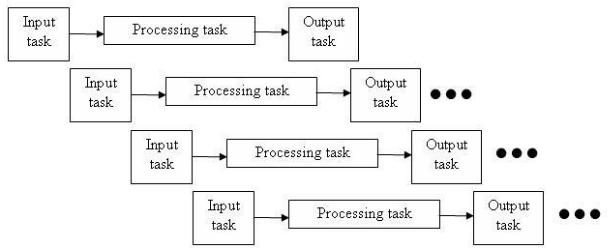

      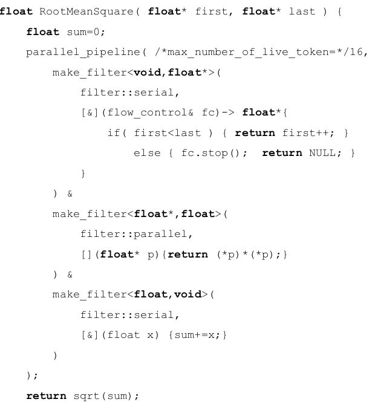

- flow graph
  - viz `tbb:flow_graph`
  - existuji dva typy grafu
    - data-flow grafy
      - data jsou predavana po hranach a vrcholy nad nimi provadi operace
    - dependency-grafy
      - popisuji zavislosti mezi tasky a data jsou ziskana ze sdilene pameti
      - hrany zajistuji spusteni operaci (posilaji `continue_msg`)
      - => jedna se tedy o specialni pripad data-flow grafu

  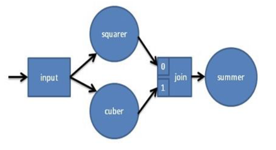
