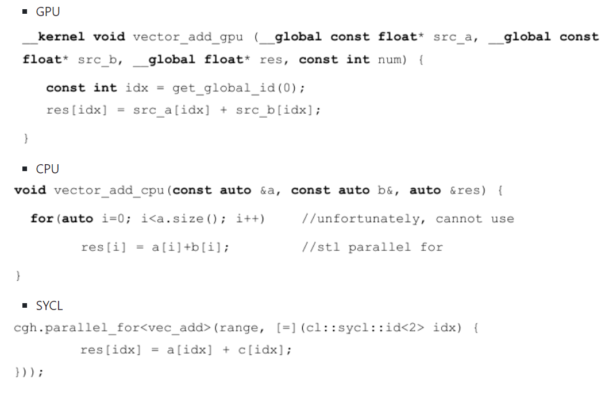

### 15 - Práce s GPGPU – princip, faktory ovlivňující výsledné urychlení, přesun dat, redukční operace, využití OpenCL a C++ AMP. [KIV/PPR]

- GPGPU (= General-Purpose Graphics Processing Unit)
  - task paralelismus (CPU)
    - nekolik komplexnich uloh s vetvenim na nekolika datovych tocich
    - optimalizovano pro latency (= cas dokonceni)
    - typicke vyuziti SMP
  - data paralelismus (GPU)
    - mnoho jednoduchych uloh na mnoha datovych tocich
    - optimalizovano na propustnost (= pocet dokoncenych uloh za jednotku casu)
  - GPGPU je vyuziti specifickeho HW (grafickych karet) pro obecne vypocty
    - graficke karty spolehaji na masovy paralelismus => je vyuzitelny i pro jine vypocty nez renderovani pixelu a aplikovani shaderu
    - proto existuji zpusoby jak graficke karty vyuzit pro obecne vypocty
  - priklad
    - `A=B+C` paralelne s `D=E+F` je v poradku
    - `A=B+C; if (A<C) { D=E+F; }` vede na podmineny skok => v rosporu s filozofii navrhu GPGPU
    - zpracovana data musi byt proto co nejvic nezavisle
    - CPU ridi DMA ktere prenasi data z/do externi GPGPU
  - SIMD vs SIMT
    - SIMD - vektorova instrukce (datovy paralelismus)
    - SIMT (Thread) - nekolik jednoduchych procesoru GPU ktere jsou uzamceny pri provadeni stejneho programu na vice datovych tocich (chova se jako SIMD?)
      - lock-stepped fashion

- presuny dat (pristup do pameti)
  - memory coalescaling = kombinace nekolika pametovych pristupu do jedne transakce
  - word size = mnozstvi bitu ktere CPU dokaze zpracovat najednou (v dnesni dobe typicky 64b = 8B)
    - data aligment urcuje jak jsou data zarovnana v pameti => typicky chceme nasobky strojoveho slova/sirky sbernice => nemusime data nacitat na vicekrat
    - priklad unaligned pristupu (read + read + merge (bit shift + OR))

        

  - prednacitani pameti (memory prefetching)
    - sekvencni pristup podporuje prokladani vypoctu s prednacitanim data (v pameti "jdeme" linearne)
    - nahorny pristup (random access) tuto vyhodu kazi
    - pokud vime ze velkou cast pameti budeme potrebovat dopredu lze data prefetchnout a budou rovnou pripravena => aplikovatelne jen na sekvencni cteni!!

    

  - volny pristup do pameti (sparse memory access)
    - spatne => vyuzije se opet jenom cast dat a zbytek se zahodi
    - priklad: word size = 4B, chceme nacist pouze cisla 0 a 4
      - => vysledek je ten ze musime stejne nacist 2 cele bloky (2x word size)
      - cteni jednoho bloku radku mezipameti (cache) plytva sirkou pasma (sbernice)

      

      - 1/4 vyuzitelne sirky pasma; 3/4 promarnene sirky pasma

- GPGPU zarizeni typicky operauje nad vetsim mnozstvi dat - je zde rezie kernelu a obsluhy zarizeni v nasem kodu
- muzeme paralelne nacitat data a zpracovavat je
  - zatimco GPGPU provadi kernel, SMP kod muze nacitat dalsi bloky dat

- OpenCL (= Open Computing Language)
  - = prumyslovy standard pro paralelni programovani heterogenich pocitacovych systemu
  - zarizeni (device) vykonava kod GPU, muze se vratit k CPU
  - kernel = funkce GPU ktera se vykonava v zarizeni
  - jeden system (host) muze mit nekolik platforem (napr. Invidia, Intel, ...)
    - jedna plaforma muze mit nekolik zarizeni
    - napr. CPU, CPU s integrovanou GPU, externi GPU, atd.

  - priklad: soucet vektoru na CPU vs GPU (OpenCL)
    - kernel musi vracet void a byt deklarovan jako `__kernel`
    - ukazatel do pameti musi byt deklarovan jako `__global`
    - vektorovy prvek se nazyva work item (work item = jedno vlakno na GPU)
    - work-group obsahuje work itemy
      - provedeni jednotlivych work-itemu ve wavefronte na danou instrukci
      - local work group size
        - velikost lokalni workgroup
      - global work group size
        - celkova velikost work group (itemy v teto workgroupe se nemusi provest na stejne vypocetni jednotce)
    - ND-range obsahuje work-groupy
    - kernel se spusti jednou pro kazdy work item

    - CPU soucet dvou vektoru:

        

    - GPU soucet dvou vektoru:

        

  - ND-range
    - work-group mapa na vypocetni jednotce
    - work-item se mapuje na zpracovavany prvek (element)

      

  - Wavefront
    - idalne bychom chteli spustit vsechny work-itemy najednou
      - => ale bohuzel jsem omezeni HW ktery definuje max povet work itemu ve work groupe
      - => work groupa se posila na HW po castech = wavefront
      - `|wavefront| <= work-group`
    - zahrnuje radu work-itemu
    - spousti se na jedne vypocetni jednotce
      - work-itemy provadi zpracovani paralelnim zpusobem s uzamcenym krokem (lock-stepped prallel fashion)
    - programator nema kontrolu nad wavefront
      - runtime OpenCL postupne posila praci vypocetnim jednotkam v blocich jednotlivych wavefront

      

      

  - OpenCL pouziva buffery pro operace nad daty
    - buffer je potreba vytvorit pres `clCreateBuffer()`; lze take specifikovat jeho chovani (parametry)
      - RW, read-only, write-only
      - `CL_MEM_USE_HOST_PTR` - OpenCL pouzije pamet referencovanou u hosta jako uloziste
      - `CL_MEM_ALLOC_HOST_PTR` - OpenCL alokuje pamet u hosta a ulozi do ni data
      - `CL_MEM_COPY_HOST_PTR` - OpenCL zkopiruje data z host pameti na device
      - flagy se daji kobinovat
        - `cl::Buffer out_min_buff(opencl.context, CL_MEM_WRITE_ONLY | CL_MEM_HOST_READ_ONLY, work_groups_count * sizeof(double));`
    - nejprve je zapotrebi definovat kontext (zarizeni)
    - pote muzeme vytvorit `CommandQueue` frontu kam posilame prikazy typu `clEnqueueKernel` nebo `clEnqueueWriteBuffer` ktere pak zarizeni zpracuje
    - OpenCL kernely typicky kombiluje za behu (runtime hostu)

- redukcni operace
  - vektorova suma
    - na CPU je to obycejny for cyklus
    - na GPU vice moznosti
      - pokud nechceme resit synchronizaci v ramci WG, muzeme kazdemu work-itemu pridelit hodne dat a nechat ho udelat vlastni sumu
      - potom vezmeme sumy vsech work-itemu a secteme je na CPU
    - pokud chceme resit synchronizaci, muzeme udelat redukci na jednu sumu pro kazdou WG (= work-group)

    

    ```c++
    __kernel void sumGPU (__global const double *input, 
                          __global double *partialSums,
                          __local double *localSums)
    {
      const uint local_id = get_local_id(0);     // ID within the WG
      const uint group_size = get_local_size(0); // WG size
      const uint global_id = get_global_id(0);   // global unique ID
      const uint group_id = get_group_id(0);     // WG ID

      // Copy from global to local memory
      localSums[local_id] = input[global_id];

      // Loop for computing localSums : divide WorkGroup into 2 parts
      for (uint stride = group_size/2; stride>0; stride /=2)
      {
        // Waiting for each 2x2 addition into given workgroup
        barrier(CLK_LOCAL_MEM_FENCE);

        // Add elements 2 by 2 between local_id and local_id + stride
        if (local_id < stride)
        {
            localSums[local_id] += localSums[local_id + stride];
        }
      }

      // Write result into partialSums[nWorkGroups]
      if (local_id == 0)
      {
        partialSums[group_id] = localSums[0];
      }
    }                                      
    ```

  - OpenCL poskytuje volani
    - global id - globalni id work itemu (z pohledu globalni pameti)
    - local id - lokalni id work itemu (relativni k WG)
    - group id - id workgroupy ve ktere se work-item nachazi
    - global size - celkova velikost vstupu
    - local size - pocet lokalnich work itemu ve WG

    

  - OpenCL memory

    

    - globalni pamet
      - nejpomalejsi ze vsech
      - vykon zavisi na pristupu do pameti podle patternu
      - snazit se omezit soubezny pristup z vice work-itemu do jedne globalni adresy
        - => snizeni vykonu
        - mohlo by vest k bankovnimu konfliktu (dve vlakna modifikuji tu samou adresu => UB - Undefined Behavior)
      - typicky chceme read-only access
    - privatni pamet
      - rychla pro jeden work-item
      - zadna norma nedefinuje jeji velikost!
      - nadmerny objem privatne deklarovane pameti bude implicitne namapovan na lokalni (a nasledne na globalni) pamet
        - to muze vest k vyznamnemu snizeni vykonu
        - pouzivat co nejmene (napr. jen pro lokalni promenne)
    - lokalni pamet a konstanty
      - rychlejsi nez globalni pamet
      - rozdelena do N banku
        - pokud work-itemy pristupuji k jinym bankum neni problem
        - pokud pristupuji ke stejnemu banku je pristup serializovan => snizeni vykonu
      - work-groupy sdili data
      - konstanty
        - pouze pro cteni
        - optimalizovane pro soubezny pristup do pameti (vyhyba se bankovnimu konfliktu)

  - OpenCL rekurze
    - limitovana velikosti stacku
    - velke registry GPU
    - => zdrzet se rekurze a uprednostnit iterativni pristup

  - incorrect branching
    - nejlepsi pripad - plne PARALELNI if-else
    - nejhorsi pripad - plne SERIOVY if-else
    - work-itemy provadeji lock-stepped - SIMT
    - poud nektere work itemy maji podminku `true` a jine `false` -> musi je work-groupa provest 2x
      - nebo vyuzit trik vynechani bloku else (pokud je prazdny)
    - navzdory pokrokum zustava vetveni vykonostnim problemem!

  - OpenCL barrier a fence
    - fence
      - zarucuje ze vsechny read-write isntrukce instrukce budou dokonceny pred fence
      - tj. dokonci se pred jakoukoliv jinou read-write instrukci za fence v danem work itemu
    - barrier
      - synchronizuje work itemy v jedne work groupe
      - je pomala kvuli wavefrontam
        - dulezity postih => nepouzivat bariery pokud existuje jina moznost
      - bariera NEmuze synchronizovat work groupy
    - work groupy lze synchronizovat pouze rozdelenim jader
      - tj. spustenim samostanych jader
      - ztraceji se registry, lokalni a privatni pameti
      - pretrvava pouze globalni pamet

- faktory pro urychleni
  - chceme se vyhnout vetveni -> jadra GPU pracuji v lock-stepped modu tudiz pokud nektery work item ma podminku jako `true` a jiny jako `false` => musi se provest 2x
    - nektera jadra mohou defaulte pouzit no-op
    - nebo muze byt potreba aby se vyhodnotlity obe vetve
  - dalsim problemem mohou byt race-conditions v pameti
  - synchronizace muze byt draha
    - zase jsou problem wavefronty -> synchronizace pro work itemy provadime uvnitr work groupy ale ta muze byt rozdelena na nekolik wavefront
    - problem s wavefronty lze rezit ze `|work group| == |wave front|`
    - lze to vycist z `device.get_info()`
  - dalsim faktorem je mnozstvi dat
    - pro male bloky dat muze byt rezie spojena s kernelem a OpenCL velka v porovnani se vyslednym urychlenim
  - jak velka data mame a kolik pameti potrebujeme na vysledky je taky faktor
    - pristup do globalni pameti je drazsi nez do lokalni pameti
    - synchronizace nad globalni pameti je draha -> lepsi je pouzit lokalni
  - bank konflikty mohou byt problem
  - overprovisioning
    - = vytvoreni vice work-groups nez je kapacita GPU
    - muze byt v pohode (typicky i je viz SP)
      - `const auto work_groups_count = data_block.count / opencl.work_group_size;`
    - GPU umi chytre skryvat latenci pokud wavefronta pristupuje do pameti tim ze zacne vykonavat jinou

- C++ AMP (= C++ Accelerated Massive Parallelism)
  - OpenCL a CUDA jsou jazyky podobne jazyku C ale jsou odlisne od C++
    - => nelze udrzovat jednotnou codebase
  - C++ AMP rozsiruje jazyk C++ o klicove slovo `restrict`
    - lze tim specifikovat kde se bude kod vykonavat
    - `restrict(cpu)` - exekuce na CPU
    - `restrict(amp)` - exekuce na grafice
    - `restrict(cpu, amp)` - kombinace obou
  - C++ AMP implicitne klade omezeni co se tyce toho co funkce (kod) oznaceny klicovym slovem `restrict` muze obsahovat
    - nepodporuje rekurzi, volatile, OOP, pointery, vyjimky, globalni a staticke promenne, atd.
    - musi zajistit kompatibilitu napric zarizenimi...
  - C++ AMP je predchudce DPC++ a SYCL
  - SYCL
    - vysokourovnovy programovy model pro zlepseni produktivity programovani na ruznych HW akceleratorech
    - single-souce code base!
    - programovaci model zalozeny na C++17
    - myslenka je mit jeden kod ktery je mozne kompilovat pro FPGA, CPU, akceleratory nebo GPGPU
      - prelozeni pro odlisne ISA v jednom executable
    - komplxni paralelni abstrakce
    - poskytuje planovani tasku a synchronizaci

    

    

  - DPC++ (= Data Parallel C++)
    - implementace SYCL od Intelu
    - jedna se jazyk pro heterogeni vypocty
      - heterogeni -> muze bezet na ryznych HW zarizenich
    - soucast oneAPI toolkitu ktery zahrnuje i TBB

    

    
