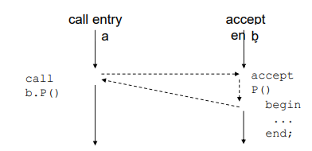
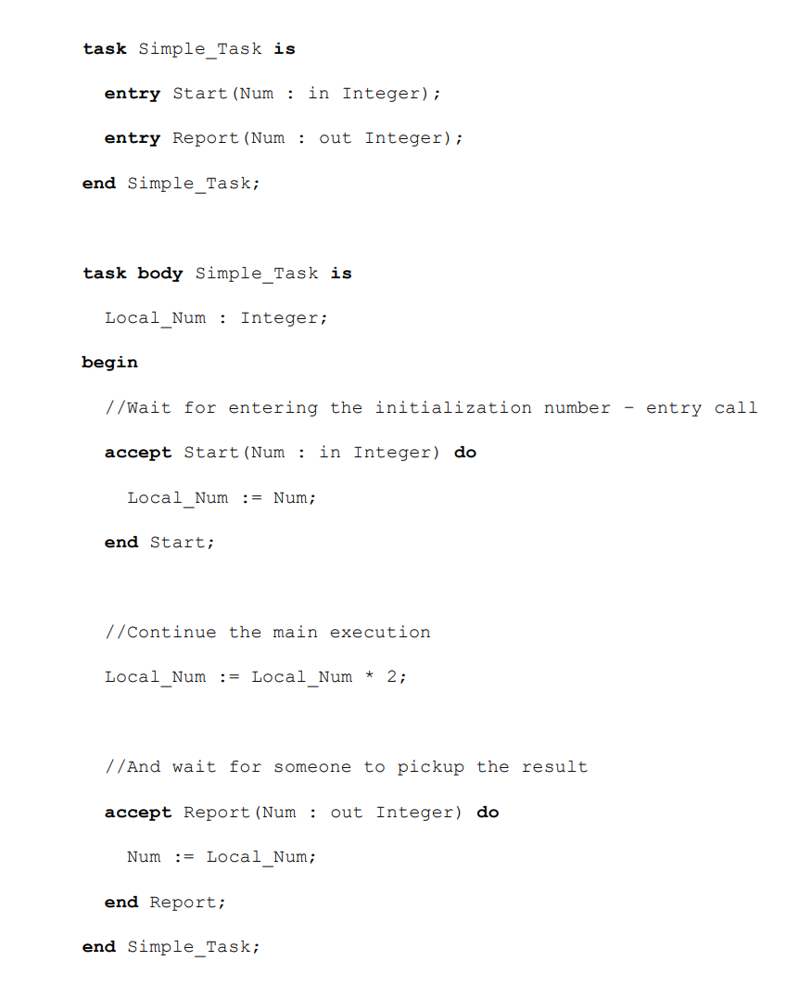
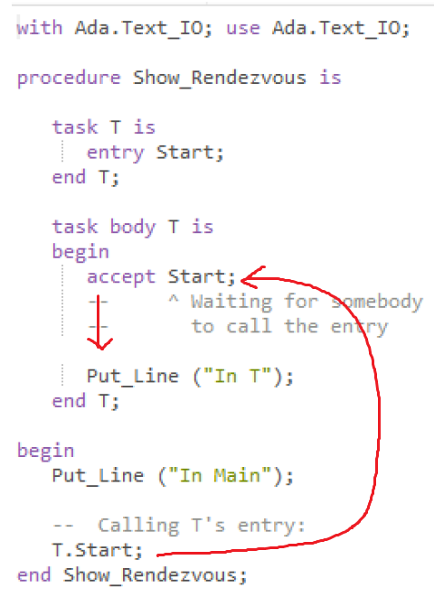
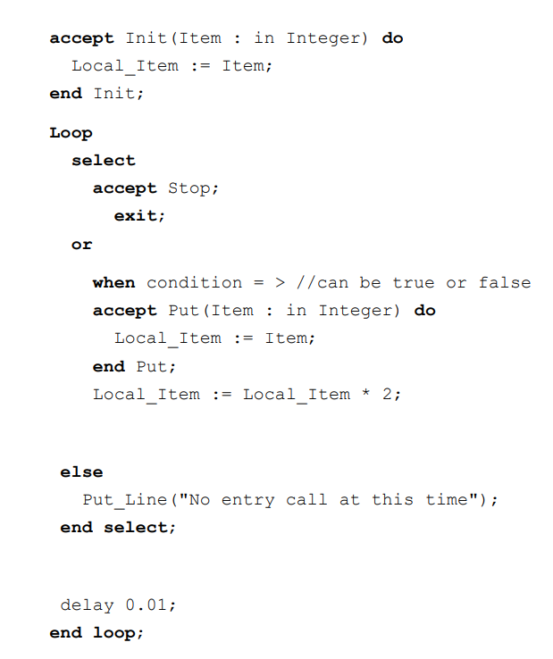
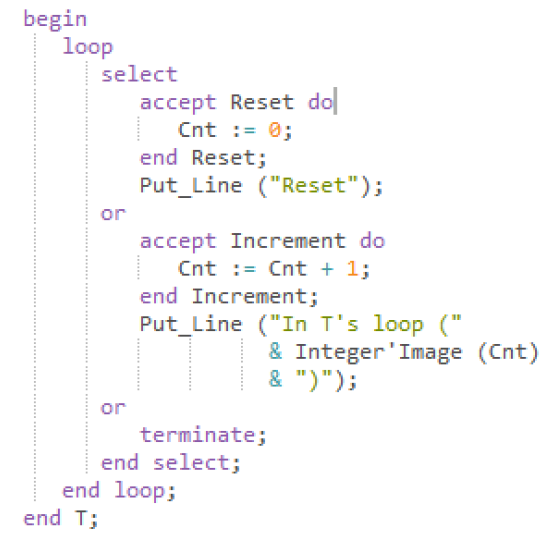
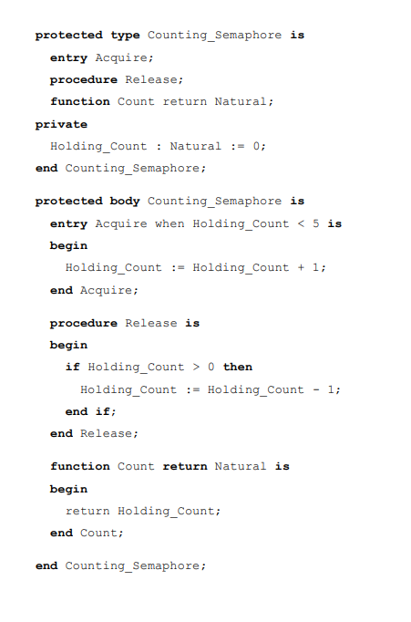
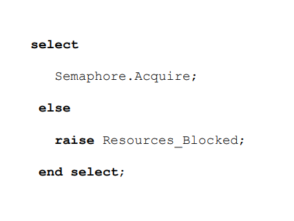
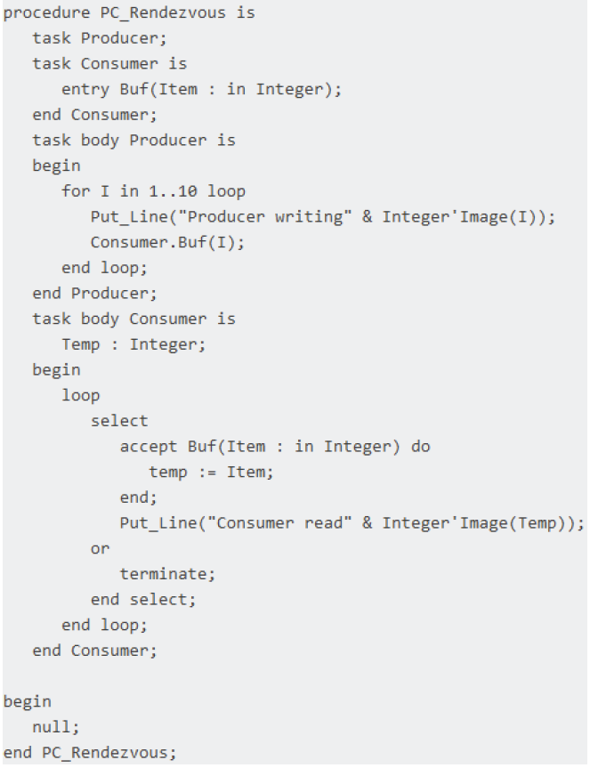

### 16 - Spurious wakeup – charakteristika a ošetření. Rendez-Vous, vč. konstrukce “select” v jazyce Ada a jejího porovnání s Java monitorem. [KIV/PPR]

- spurious wakeup (falsne vzbuzeni)
  - situace kdy vlakno ceka na splneni nejake podminky (`wait` nad podminkovou promennou), je vzbuzeno (`notify`), ale podminka neni splnena
  - klicem je planovani
    - kdyz se signalizuje podminkova promenna (`notifyAll`) tak se probudi vsechna vlakna
      - => presun TCB ze stavu blocked do stavu ready
    - potom je naplanovaci ktere vlakno pusti jako prvni (race condition)
      - muze byt dano napr. prioritou - stacicka + dynamicka (bacha na inverzi priorit!!)
      - ostatni vlakna jsou spusteny az kdyz podminka uz neni splnena a musi znova cekat
  - napriklad
    - mame thread pool vlaken ktere obsluhuju prichozi pozadavky na server
    - vsechny jsou uspane nad podminkovou promennou (neprisel zadny pozadavek)
    - projde pozadavek => `notifyall` => pouze jeden worker ho obslouzi a zbytek se znovu uspi
  - v dusledku jde o zbytecnou rezii vzbuzeni `n` vlaken ktere se v podstate hned zase uspi
  - tomuto problemu lze castecne predejit volanim `notifyOne` (nebudit vsechny)
    - ani to ale neni stroprocentni protoze napr. Windows v nekterych pripadech kdy je `notifyOne` volano prilis mnohokrat v kratke dobe probudi vsechna vlakna
    - zaroven zustava otazka jak vybrat vlakno ktere vzbudime?
      - FIFO?
      - co kdyz je vlakno blokovane jeste nad jinym zdrojem?
      - => `notifyAll` je asi nejjednodussi reseni?
  - alternativne v Linuxu
    - `wait` implementovan funkci `pthread_condition_wait()`, ktera je implementovana systemovym volanim futex (= Fast User-Space Mutex) kde je fronta cekajicich vlaken na urovni jadra ale citac mutexu je v userspace
    - blokujici syscall je prerusen pokud proces obdrzi signal - vlakno prestane cekat a bylo by ho potreba znovu uspat pomoci `pthread_condition_wait()`
    - to ale nemuzeme udelat protoze v dobe mezi jeho probuzenim a pripadnym opetovnym uspanim mohlo dojit k udalosti `notify` ktera by vlakno probudila
      - => pokud bychom ho znovu uspali nemame jistotu ze bude vlakno jeste nekdy probudezeno
      - => proto je vlakno proste vzbuzeno (znovu se neuspava) a problem neni resen na urovni kernelu => proto musime vsude rucne psat `while` misto `if` -> kernel to neresi -> musime to resit my v userspacu!
  - resenim je provaded cekani na podminkovou promennou v cyklu a pokazde kontrolovat jestli je podminka splnena
    - pokud je, z cyklu vystoupime
    - jinak se znovu uspime

- Randez-vous v Ade
  - = bod setkani (synchronizace)
  - Ada
    - objektove orientovany
    - silny typovy system (stejne jako C++)
    - pro vojenske a kriticke systemy
    - synchronizace na vysoke urovni (randez-vous)
    - prekladac se musi testovat na shodu/kompatibilitu s jazykem
    - syntaxe je silne ovlivnena Pascalem (=> citelnost kodu)
    - puvod: Pentagon/DARPA (= Defense Advanced Research Projects Agency; neco s ministerstvem obrany)
    - jedna s vyznamnych feature Ady je synchronizace pomoci Randez-Vous
  - konstrukce je v Ade implementovana pomoci tasku a protected objektu
  - task je aplikace (vlakno) ktery bezi paralelne s hlavni aplikaci
    - hlavni aplikace je take task
  - kazdy task az na hlavni aplikaci ma svuj master task (ten ktery subtask deklaruje)
    - deklarace zpusobi okamzite spusteni
  - master task ceka na dokonceni vsech jeho subtasku => forma synchronizace v Ade
  - je ale mozne synchronizovat i tasky ktere spolu nemaji master task - sub task vztah
    - => k tomu slouzi mechanismus randez-vous
  - v tele tasku lze definovat `Entry` - specialni podprogram ktery slouzi jako synchronizacni bod
    - entry je pouha deklarace existence synchronizacniho bodu - jeho pozice v tele tasku je urcena pomoci Accept <entry_name>
    - task ceka na prijeti dokud jine vlakno nezavola jeji vstupni bod

      

  - Ada task

      

      

  - pri sekvencnim prijeti muze task vynutit poradi akci - vstupnich bodu
    - nicmene task povede do deadlocku pokud nikdo nezavola vstupni bod (`entry`)
  - prijeti
    - klient zavola server
    - server prijme parametr
    - server pocita, klient ceka (blocked)
    - server preda vysledek klientovi
    - narozdil od monitoru, server je samostatne vlakno ktere souperi s ostatnimi vlakny (ktere spousti tasky) o strojovy cas
      - vlakno muze mit jinou uroven opravneni (privilege level / access permissions)
  - jedna `entry` muze byt `accept`nuta neomezenekrat
  - task ceka na radce s `accept` dokud jiny task danou `entry` nezavola
  - pokud je potreba cekat na vice `entry` na jednom miste -> lze pouzit konstrukci select!
  - Ada select
    - necha server reagovat na vice vstupnich bodu (volani) mimo poradi
      - nicmene kazdy vstupni volani muze byt povoleno/zakazano dalsimi podminkami
    - napr. server muze vynutit inicializacni vstupni volani a obsluhovat dalsi vstupni volani mimo poradi

    

    - kazda entry ma frontu volajicich
    - pokud nelze volani entry accepnout, je do teto fronty volajici zarazen
    - jaky volajici je z fronty vybran lze specifikovat (vychozi strategie je FIFO)
    - select navic muze obsahovat or terminate
      - umozni master tasku dany task ukoncit i kdyz se toci v nekonecnem select cyklu

    

    - accept v selectu muze navic specifikovat dodatecne podminky pro vstup do entry ("podle toho co vim tak pouze u protected tasku a objektu")

  - Ada podporuje protected objekty a typy
    - zpusob jak zabranit paralelnimu pristupu k datum pokud neni zadouci
    - tasky mohou objekty sdilet a protected zajistuje exkluzivni pristup
    - objekt je instanci typu (klicove slovo type)
    - s protected objektem muzeme volat
      - proceduru - meni stav objektu (neni k tomu potreba podminka)
      - vstupni volani (entry) - jako procedura ale podminka musi byt true (klicove slovo `when`)
        - pokud neni podminka splnena, volajici task je blokovan
      - funkci - read-only stav obejktu (exkluzivni pristup neni vyzadovan)

  - priklad Ada semafor

    

    - pokud podminka nemuze byt splnena (nastaveno na true) je mozne provest jinou akci (napr. vyhodit vyjimku) misto zablokovani

    

- Implementace monitoru
  - Co je to monitor?
    - narozdil od semaforu to je jazykova konstrukce
    - specialni typ modulu (sdruzuje DATA (private) a PROCEDURY (public) se kterymi mohou pracovat)
      - jakysi OOP pristup kde mame jeden stejny mutex pro vicero funkci pres ktere lze modifikovat clenske promenne
    - procesy mohou volat proceduru monitoru ale nemohou pristoupit primo k datum
    - v jednu chvili muze byt v monitoru aktivni pouze 1 proces resp. vlakno
    - problem s operaci signal
      - pokud by signal pouze vzbudil proces, bezely by v monitoru dva procesy
        - vzbuzeny proces a proces co zavolal signal => v rozporu s definici monitoru!
      - reseni (dva pristupy)
        - Hoare
          - proces co zavolal signal se zablokuje a vzbudi se az pote co nove zbuzeny proces opusti monitor
        - Hansen
          - signal musi byt uveden pouze jako posledni prikaz v monitoru
          - po volani signal musi proces monitor opustit

  - Randez-Vous nelze implementovat pomoci Java monitoru
  - Randez-Vous (tak jak je implementovan v Ade) vyzaduje moznost vzbudit cekajici vlakna v presnem poradi => coz monitor Javy neumoznuje
    - Java si vlakna planuje sama :)
  - Randez-Vous lze implementovat v C++ nebo jinych nizko urovnovych jazycich kde mame primy pristuk k API OS
  - dalsim rozdilem je role serveru a klienta
    - v Ade je server task ktery ceka pres accept na zpravu od klienta
    - v jave monitor obaluje objekt, ktery neni aktivni -> je to pasivni konstrukce v pameti obalujici sve atributy

    
