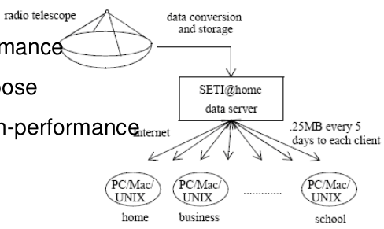
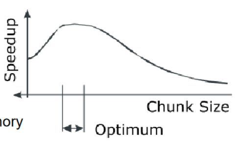
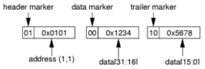
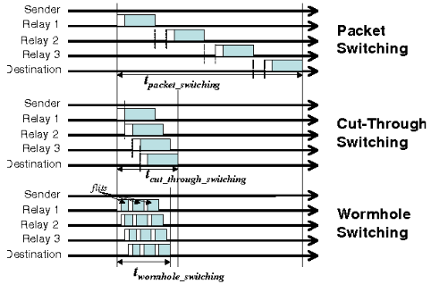
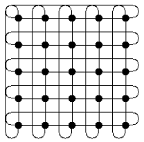
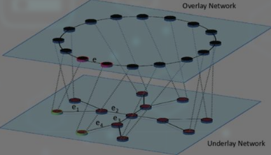
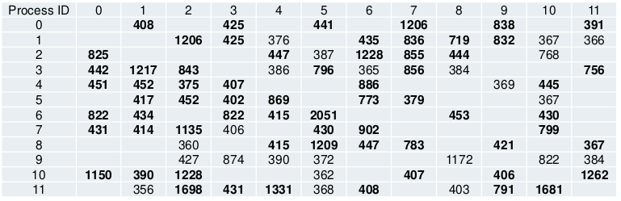
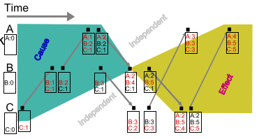

### 17 - Výpočetní prostředí s distribuovanou pamětí - topologie, možnosti komunikace a relokace procesů, vektorové hodiny. Přidělování práce v prostředí s distribuovanou pamětí, možnosti urychlení výpočtu a přiřazení procesů na jednotlivé uzly. [KIV/PPR]

- vypocetni prostredi s distribuovanou pameti
  - sklada se z vypocetnich (typicky sitovych) uzlu a komunikacnich kanalu
  - komunikace posilanim zprav
    - komunikacni kanal prenasi data mezi uzly
    - napriklad switch na linkove vrstve (router na 3. vrstve)
  - uzly nemaji sdilenou pamet (jsou to HW ruzne stroje)
  - vykon zavisi na: kvalite kodu, granularite dat, efektivni alokace tasku vzhledem k dostupnemu typu HW, ...
  - v inicializacni fazi je typycky potreba uzly identifikovat
    - Network Node Address
      - sekvence bytu kterou muzeme priradit dle topologie
      - mela by v sobe nest informaci o tom kdo jsou sousedi daneho uzlu (napr. mrizka)
      - => pote muzeme odvodit sousedy a optimalizovat posilani zprav
      - napriklad 2x integer (grid, toroid) - `struct {uint32 y, uint32_t x }`
      - komunikace
        - preferovani simplexni komunikace mezi sousedy (data se posilaji pouze v jednom smeru) => mensi overhead viz linkova vrstva
        - jinak musime Store & Forward - forwardovani packetu
- univerzalni pocitacova sit
  - specialni SW dovoluje vyuziti pocitacove site za ucelem provedeni distribuovaneho vypoctu  (= framework)
  - ostatni sitove funkce jsou zachovany
    - napriklad skolni laborator
    - SETI@Home, Folding@Home (Covid-19), atd.
    - casto farmer-worker model

- SETI@Home
  - patrani po mimozemske inteligenci
  - radio teleskop prijme data
    - signal je kvantifikovan do jednicek a nul
  - server distribuje bloky jednotlivym klientum
    - take je moznost poslat stejna data vicero klientum => fault tolerant
    - kdyz klient pri vypoctu selze, vrati se do podniho znameho stavu
  - farmer-work pristup
  - bezi na beznych domacich i kancelarskych pocitacich
  - hodne low-power zarizeni da dohromady distribuovany high-power pocitac

    

- univerzalni paralelni pocitac
  - urceny pro paralelni vypocty (= jeho primarni funkce)
  - sitova funkcionalita slouzi k distribuovanemu vypoctu (poskytuje rozhrani)
  - napriklad MPI cluster (= Message Passing Interface)
    - definuje API pro preposilani zprav
    - predpoklada stejny HW (je jedno kdo vypocet provede => vsichni maji stjeny vypocetni vykon)
  - opakem je single-purpose computer
    - postaven pro specifickou ulohu (ucel)
    - obetovani univerzalnosti za maximalni urcyhleni
    - napriklad TWINKLE
      - vicero LED diod meri jake je vysledne osviceni v bode kam jsou LED namireny
        - = analogove scitani pomoci mereni svetla
      - problem faktorizace velkych cisel je mene narocny
      - pouziti v kryptografii (napr. prolamovani RSA klice)

- Distributed-Memory System
  - dovoluje vetsi urychleni nez SMP diky
    - pralelni komunikaci (musi byt dobre navrzena tak aby se prekryvala komunikace a vypocet)
      - provadim vypocet, kdyz prijdou data, poslu je dal (=> 100% vyuziti procesoroveho casu)
  - zvyseni poctu CPU a pameti
  - efekticni urychleni zavisi na
    - granularite dat, celkovym pocetu dat ktera se zpracovavaji, alokace dat a tasku jednotlivym uzlum, vyiziti HW a kvalite SW

    

  - moc male bloky => frekventovana komunikace zpomaluje vypocet
  - moc velke bloky => prenos trva prilis dlouho
  - pokud nevime jaka velikost je vhodna => nahodne velke bloky jsou rozumne reseni?

- moznost komunikace procesu
  - procesy mohou komunikovat pomoci zprav -> existuje nekolik moznosti predavani a smerovani zprav
  - Wormhole Switching
    - cas Store & Forward paketu zavisi na velikosti daneho paketu
    - uz v ramci designu rozdelime packet na mensi jednotky
      - flit (= flow unit); fixni delka
    - prvni flit zakoduje cilovou adresu a flit-sequence tag (=> ze se bude jednat o flit sekvenci)

    

    - flitj je mensi
      - muzeme zpracovat vice paketu soucasne
      - zvysuje rychlost dane site
      - snizuje latenci
      - real-time komunikace
    - smerovaci zarizeni obsahuji buffery ktere jsou rezerovave pro jednu sekvenci
      - pokud se v bufferu objevi header fit => buffer je rezervovan a jina sekvence do nej nemuze byt ulozena
      - posledni flit sekvence buffer uvolnuje

  - cut-through switching
    - minimalizuje latenci
    - zacne preposilat packety hned pote co prijme alespon cast packetu
      - z principu designu dorucuje rozbite packety
      - => problem kdyz chceme na nejakem uzlu pocitat napr. CRC protoze potrebujeme mit vsechna data (ne jenom zacatek)
    - prijemce musi byt stejne rychly jak odesilatel

  - sore & forward - packet je predan az po prijeti celeho packetu

  - adaptive switching
    - prepinani mezi store & forward a cut-through na zaklade aktualniho vytizeni site

    

    - komunikoval lze pres ethernet, fibre channel, atd. (pecne pres media co maji vysoke rychlosti)

- topologie
  - fixni (napr dany pocet vypocetni jednotek v clusteru) vs flexibilni (napr. real-time dynamicke zpracovavani signalu jako je SETI@home?)
  - komunikace
    - typicky 2D mrizka, toroid (kruh), N-dimenzionalni krychle
    - parametry
      - `N` - celkovy pocet uzlu (chceme maximalizovat)
      - `Dij` - vzdalenost mezi dve uzly (sousedi maji 1)
      - `D_max` - nejdelsi cesta (nejhorsi pripad - chceme minimalizovat)
      - pocet sousedu uzlu
      - bandwidth (sirka pasma)
    - toroid

      - nejdelsi cesta bude k prostrednimu prvku
        - pro sude delky stran -> `n / 2.0`
        - pro liche delky stran -> `std::floow(n / 2.0)`
        - => tyhle dve cisla sectem

        

  - virtualni topologie
    - = overlay network
    - komunikacni schema procesu v distribuovane aplikaci
    - jak spolu procesy komunikuji
    - mapuje se na fyzickou topologii

    

    - virtualni topologie definuje v aplikaci clustery
      - cluster = skupina procesu ktere mezi sebou komunikuji
      - muze byt tolik clusteru kolik je procesu
      - myslenka je takova ze nekdy muzeme komunikovat jen s jednim zastupcem clusteru (masterem)
        - cluster je pak autonomni skupina ktera resi dany task
    - v idealnim pripade by virtualni topologie mela odpovidat 1:1 fyzicke topologii (nebo se o to alespon pokusit)
      - snazime se toho docilit napr. s pouzitim hvezdicove topologie
    - komunikace dobre navrzenych distirbuovanych systemu
      - kazdy proces komunikuje pouze s podmnozinou vsech procesu
      - komunikacni klastr
      - kazdy proces ma svuj vlastni unikatni klastr
    - klicova vlastnost: proces nepotrebuje komunikovat se vsemi procesy v nedavnem casovem kvantu
    - nekdy muze proces komunikovat vne sveho klastru (napr na zacatku pri prijmani inicializactnich dat)
    - poskytnutim send/receive funkce muzeme sledovat a odhalit klastry
      - nemusime odhalit celou virtualni topologii (muze zaviset na datech)

        

- lamportovo hodiny
  - casova razitka dovoluji castecne usporadani udalosti
    - => nezachycuji zavislosti
  - casove razitko je monoliticky se zvysujici integer pro kazdy node / proces / vlakno
    - vlakno inkrementuje citac pred kazdou udalosti
    - pri interakci (napr. posilani zpravy) jej vlakno spoji s danym citacem
    - pri prijeti zpravy aktualizuje vlakno hodiny na maximum svych vlastnich hodin a druhe strany (uzlu) => synchronizace
  - necht `a` a `b` jsou udalosti `C(x)` je cas udalosti `x`
    - pokud je udalost `b` zpusobena udalosti `a`, potom `c(a) < c(b)`
    - ALE! implikace neni obousmerna: pokud je `c(a) < c(b)`, nemuzeme dedukovat ze udalost `a` zpusobila udalost `b`

- vektorove hodiny
  - detekce poruseni klauzality v distribuovanem systemu
    - kauzalita: pricina -> nasledek => chceme detekovat kdyz nejaky proces porusi to jak ma reagovat na urcite udalosti
  - necht existuje lamport-clock vetor
    - kodovani hodin interagujicich vlaken (-> muzeme posilat cely vektor nebo jen tu cast, ktera se zmenila)
    - kazda vypocetni jednotka (uzel) si drzi kopii tohoto vektoru
  - matice hodin generalizuje vektorove hodiny

    

  - jak to udelat?
    - resetovat vsechna casova razitka na 0
    - proces/vlakno inkrementuje sve hodiny pri jakekoliv udalosti
      - odeslani/prijem dat, interni udost (napr. stav prechodu)
    - pri prijeti zpravy
      - zprava muze obsahovat libovolny pocet casovych razitek od jinych procesu
      - pro kazdy prvek vektoru hodin nastavi maximum ze zname a prijate hodnoty (B:2 -> B:3)
    - `VC(x)` jsou vektorove hodiny udalosti `x`
    - pro udalosti `a` a `b` plati ze `VC(a) < VC(b)` pokud
      - `for i:=0 to clockvector.size()-1: VC(a)[i] <= VC(b)[i]`
      - a alespon jeden `VC(a)[i] < VC(b)[i]`
      - pote plati ze `VC(a) < VC(b)` pokud udalost `a` zpusobila udalost `b`

- pridelovani prace, prirazovani procesu, realokace
  - load sharing -> pokud je uzel pretizeny, offloaduje cast prace na mene zvytizeny uzel (master-slave)
    - alternativne nepredpokladame sit dedikovanou distribuovanemu vypoctu
      - tj. mame tedy napr kancelarske pocitace
    - Worm
      - procesy se mohou replikovat na jine uzly
      - proces se sklada z
      - kodu pro inicializaci master
      - kodu pro inicializaci slave kodu
      - kodu pro samotny vypocet
      - sklada se ze segmentu (procesu) => aktivne hleda nepouzivane uzly
      - decentralizovany prostup
    - Condor
      - snazi se rovnomerne vytizit vsechny uzly
      - existuje arbiter ktery kontroluje jaky proces se vykonava kde => centralizovany pristup
      - provadi se checkpointing vypoctu pro pripad selhani
  - load balancing
    - predpokladame ze je cela sit dedikovana (urcena) pro distribuovane vypocty
    - snazime se rozmistit ulohy tak aby byla zatez rozlozena
    - rozdil mezi load sharingem je relativne maly ale da se rict ze
      - cilem load balancingu je vytizit kazdy node stejne
      - cilem load sharingu je nepretizit zadny uzel
        - neni zde ale zadny pozadavek na rovnomerne zatizeni
    - staticky load balancing
      - planovani dle predem zname topologie v siti
      - => nemuzeme reagovat na zmeny za runtimu
      - jednodussi algoritmy, snazsi implementace
      - pro efektivni chod je treba znat spoustu parametru o dane siti abychom mohli predem navrhnout strategii kde co a jak pobezi
    - dynamicky load balancing
      - prirazeni procesu k danemu uzlu se provadi behem behu aplikaci
      - => moznost reagovat na zmeny v siti -> adaptace v case
      - algoritmus musi byt rychly aby planovani netrvalo delsi dobu nez samotny vypocet
      - procesy musi umet preemci (tj. uloz a obnovit stav)
      - moznosti realizace
        - preemptivni
          - procesy je mozne pozastavit (prerusit) a premystit na jiny uzel (nezahodime vsechny odpracovanou praci)
          - napriklad se uvolnil PC s vysokym vykonem => premigrujem na nej proces
        - centralizovany
          - v siti musi byt arbiter (= load-balancer ktery praci rozdeluje)
          - vyhoda je ze vi o cele siti (analogie "condor" u load-sharingu)
          - bottle neck -> pokud arbiter spadne, sit nemuze dale pokracovat
            - => potreba aby byl stabilni/zalohovany
          - vyzaduje komunikaci se vsemi uzly
        - distribuovany
          - opak centralizovaneho
          - "peer-to-peer" sit
          - o rozdeleni prace rozhodule nekolik (nebo i vsechny) nody v siti
          - mene nachylne na chyby (umoznuje lepsi adaptaci v case) ale nachylne (komplexnejsi) na synchronizaci
          - vetsi vytizeni linek vzhledek k poctu zprave (consensus)
          - pokud jeden node selze, nic se nedeje
        - kooperativni
          - kooperace vicero procesu rozhodovani (primo vs neprimo)
          - vsechny procesy se musi shodnout vs proces ucici rozhodnuti sam a informuje ostatni
        - sender-initiated
          - pokud je uzel vytizeny nad urcity threshhold, snazi se presunout cast sve prace na jine uzly
        - receiver-initiated
          - opak k sender-initiated
          - neco jako task-stealing scheduler
          - pokud vytizeni uzlu klsne pod urcitou hranici snazi se od ostatnich uzlu prevzit cast jejich prace
        - adaptive
          - provadi rozhodnuti na zaklade predchozich stavu systemu (history-based)

- mobile agents
  - distribuovane entiti ktere se pohybuji systemem a provadeji vypocty na uzlech
  - mohou byt autonomni a odolne vuci chybam
  - typicky postavene na IP sitich
  - ANT routing
    - alternativa k OSPF (= Open Shortest Path First)
      - nepropaguje celou routovaci tabulku (narozdil od RIP)
      - pouze zmenu stavu linky
      - posila kratke HELLO pakety kazdych 10s
      - pokud sousedoho HELLO paket neni viden ve 3 posobejdoucich
      intervalech => soused je povazaovat za down
      - v siti se vybere jeden DR router (hlavni) a jeden zaolzni
        - novy router pripojeny do site si od jen jen prevezme routovaci tabulku
    - mobilni agenti nahodne prochazeji sit a zjistuji jeji topologii
    - nedeterministicky

- aktivni site
  - v kontextu aktivnich siti je redistribuce zateze a obecne distribuovane systemy zajimavejsi
  - aktivni sit pouziva Capsule (analogie k packetu v IP siti)
    - capsule je asociovana s kodem ktery se na kazdem navstivenem uzlu spusti
    - tento kod muzu manipulovat s daty a provadet obecne jakekoliv aktivity definovane uzivatelem
  - v aktivni siti je potreba standardizovat aplikacni kod a zpusob jeho redistribuce
    - = code distribution protocol
  - pokud uzel v aktivni siti nema odpovidajici kod pro Capsule
    - pomoc code distribution protocolu si sezene od jineho uzlu a kod pak provede
  - na aktivnich sitich lze postavit metodu pro redistribuci zateze naprosto nezavislou na aplikaci, sitove topologii a vykonnosti uzlu
  - redistribuci lze implementovat jako knihovnu
    - => programator pouze zajisti ulozeni a obnoveni stavu procesu
  - procesy pouzivaji `PerformanceScout` Capsule pro zjisteni informaci o dalsich uzlech
    - topologie, zatez, komunikacni zpozdeni, atd.
    - na zaklade toho je pak mozne proces realokovat
    - pokud se proces realokuje, zmeni adresu -> muze na starem uzlu nechat informaci o novem uzlu kam se premigroval
      - => Capsule urcena pro proces to to zjisti kam ma dale smerovat (redirect)

- problemy u load-balancingu a load-sharingu
  - masova migrace - nekolik procesu se muze rozhodnout migrovat na stejny uzel ktery je pak pretizeny
  - oscilace - proces se pouze relokuje ale nic nepocita
    - muzeme zavest kreditovy system
      - kdyz proc nic nepocita tak nema kredity
      - pro realokaci potrebuje kredity
  - zbytecne migrace
    - pokud maji dva uzly priblizne stejne mnozstvi procesoroveho casu ktery mohou nabidnout procesu
      - => muze dojit k migraci aniz by doslo k urychleni
