### 18 - Základní struktura překladače, datové struktury potřebné pro překlad. [KIV/FJP]

- prekladac = rozhrani mezi programatorem a HW
  - psani v assembleru je tezko udrzovatelne a casto neprehledne => chceme abstrakci abychom se mohli zamerit na reseni samotneho problemu (ne realizaci jeho implementace)
  - vyuziti prekladacu
    - strukturalni editory (napovidani v IDE)
    - staticke analyzatory (lint, Axivion, clang-tidy, PMD - pro Javu...)
    - prikazove interprety (napr. shell v OS)
    - dotazovaci jazycy (napr. SQL)
    - preprocesory -> uprava programu do dalsi podoby
    - formatovani textu (napr. MS Word)
    - silikonove prekladace
    - analyzatory texty (napr. grammarly.com)
  - vicevrstvy prekladac
    - umoznuje snaze zpracovavat vice jazyku pro ruzne platformy
    - potrebujeme mit oddeleny frontend, middleend a backend
    - potrebujeme spolecnou vnitrni reprezentaci programu
    - modularizace
    - napr. LLVM?

- zakladni struktura prekladace a procesu sestavovani a zadadeni programu

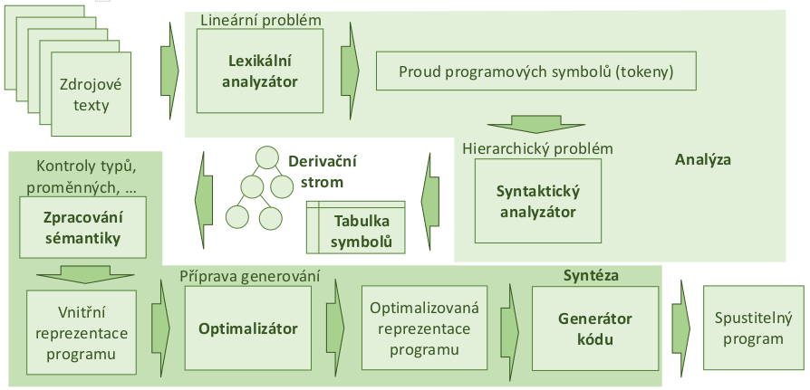

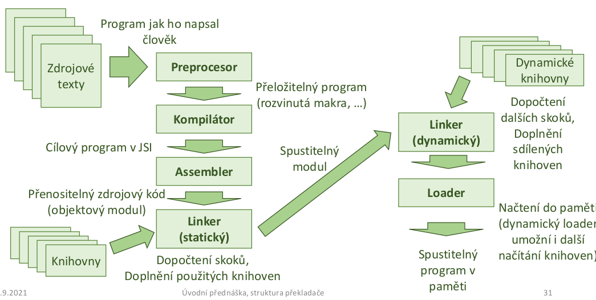

- zakladni struktura interpretu
  - => negeneruje kod ale misto toho bere vstupni data a rovnou jej interpretuje

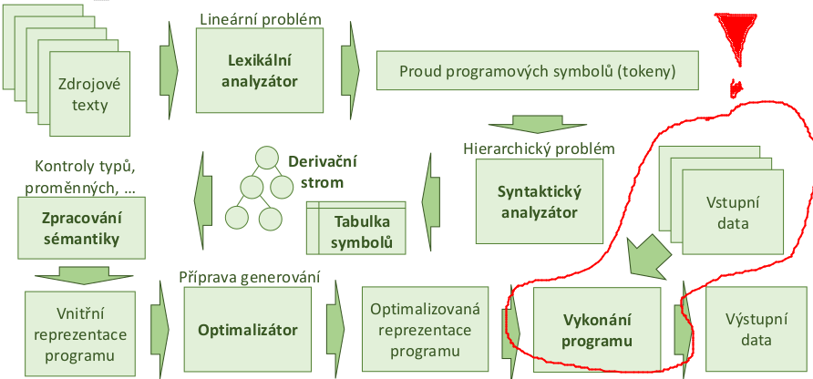

- lexilani analyzator
  - cilem je prevest vstupni soubor (zdrojak) na stream tokenu, ktere budou dale pouzite syntaktickim analyzatorem pro vytvoreni AST (= abstraktni syntakticky strom)
  - pomoci ukazovatka (= pointer) prochazime znak po znaku vstupni soubor a hledame klicova slova
  - identifikator je vetsinou to co neni zadne klicove slovo (az jako posledni moznost)

  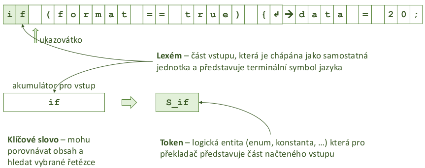

  - nektere lexemy nenesou prilis informaci a neni potreba z nich vyrabet tokeny (napr mezery/prazdne znaky)
  - nektere lexemy (a tokeny) maji jen jeden symbol, napr '('
  - taktika - hledam nejdelsi mozny retezec, ktery se da prijmout
    - nalezeno: format
      - for (cyklus) + mat (identifikator)
      - format (identifikator)
    - nezbytne pro cisla
  - u nekterych tokenu (cislo, identifikator) je treba si i drzet jejich hodnotu
  - lexikalni analyza probehne v `O(n)`, kde `n` je # znaku vstupniho souboru
  - jak volit tokeny?
    - vsechna klicova slova - prosty vycet
    - operatory (i viceznakove)
    - identifikatory
    - numericke a logicke konstanty
    - retezcove konstanty
    - oddelovaci symboly (zavorky, uvozovky)
    - bile znaky? ignorovat? (ne napr. pro Python?)
      - obecne muze byt problem s bilimi znaky protoze nevime kdyz skoncit se ctenim

  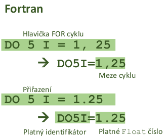

  - automaty a lexikalni analyza
    - kazdy token je popsan regularnim vyrazem
      - => lexikalni analyzator = spojeni nekolika DKA kde jeden DKA = jeden token
        - pozn.:  pro kazdy NKA existuje ekvivalentni DKA (-> DKA akceptujici stejny jazyk)
    - nesmi nstat shoda 2 DKA - 2 stejne lexemy vedou na 2 ruzne tokeny
    - kazda kombinace lexem - token ma svuj koncovy stav
    - nemusi byt efektivni
      - alternative muzu jen hledat klidove slova v tabulce (od nejdelsiho)
    - token muze mit atributy (napr hodnotu)
    - co kdyz pridame identifikator?
      - potrebujeme pridat priority (prvni definovany ma prednost)
      - uplatnuje se nejdelsi mozny vstup (automat ktery bezi nejdele)
      - pokud dojde ke konfliktu, uplatni se prvni definovany (viz double = identifikator?)

    - slouceni automatu

    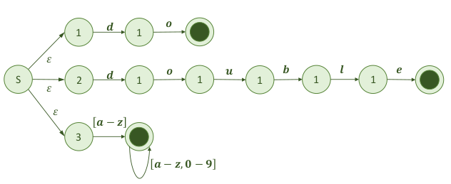

    - = nedeterministicky konecny automat (mame `e` na zacatku) -> prevedeme na DKA a mame lexer
    - KA maji obecne nemaji pamet -> neumi pocitat pocty zanoreni (viz C-style comments) -> tohle resi napr az syntakticka analyza
    - lexikalni analyzator neni jen DKA
      - => DKA je pouze teoreticky, formalni pohled na vec
      - => muze delat i nasledujici funkce:
        - CTI = bere znaky ze vstupu a meni stav DKA podle potreby
        - SLOZ = sklada znaky do promenne (akumulator TEXT) pro zpracovani lexemu
        - PROHLEDEJ = hleda v tabulce vyhrazenych slov (pokud je potreba)
        - VYPOCTI = vycisluje konstanty do promenne (strukctura HODNOTA)

- syntakticka analyza
  - = hirearchicky problem => cilem je sestavit derivacni strom resp. AST (= Abstract Syntax Tree)
    - derivacni strom
      - reprezentace vstupu ziskana parserem (syntaktickym analyzatorem)
      - zachycuje vsechny vlastnosti derivace -> obsahuje radu "nepodstatnych uzlu"
    - AST
      - zachycuje jen "dulezite veci" potrebne pro spravne vykonani programu
      - lze ziskat zjednodusenim derivacniho stromu

    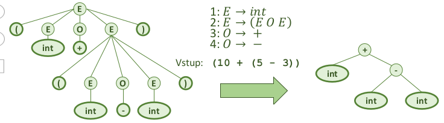

  - defakto mame dve moznosti -> formalni automaticke generovani vs rekurzivni sestup
  - jednoducha analyza shora dolu
    - primocary postup
    - ctu ctu zleva doprava po tokenech
    - na zaklade tokenu pouziju pravidlo podle toho cim zacina

    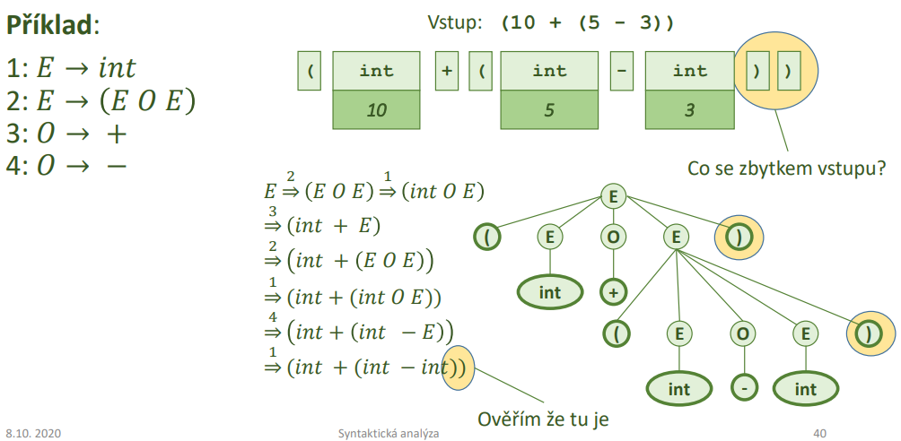

  - pokud mame gramatiku nadefinovanou spravne ("to jak nas programovaci jazyk vypada")
    - muzeme pouzit nastroje jako ANTLR nebo yacc/bison pro automaticke vygenerovani AST -> doplnime jen handlery jednotlivych uzlu stromu
    - snazsi formalni postup

  - rekurzivni sestup
    - pouzity napr v `gcc`
    - snazsi a pruhlednejsi implementace (mame plnou kontrolu nad tim jak se AST vytvari)
    - snadna implementace backtrackingu
    - defakto mame `switch` pro jednotlive tokeny a z nich volame jednotlive handlery dle dane gramatiky
    - AST se vytvari s operacni pameti prekladace tim jak se volaji funkce (obsluhy jednotlivych tokenu)

      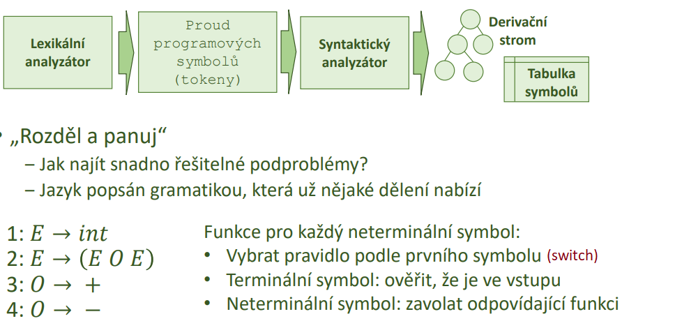

- semanticka analyza
  - vime ze program je lexikalne (v textu nejsou nesmyslne znaky) i syntakticky spravny (napr. spravny tvar ridicich struktur)
  - => musime overit ze program ma smysl (overeni vlastnosti ktere neni mozne zkontrolovat v predchozich dvou krocich)
    - promenne jsou definovane pred pouzitim
    - typy ve vyrazech jsou kompatibilni
    - podprogramy jsou volany s odpovidajicimi parametry
    - smysluplne inicializace promennych
    - funkce vraci to co maji
  - => chceme odmitnout co nejvice nespravnych programu a prijmout co nejvice spravnych programu
  - dalsi prakticke vlastnoti
    - nalezeni promennych (trid, metod, funkci, struktur, ...), urceni jejich identifikatoru a typu
    - urceni rozsahu viditelnosti (scope)
    - vytvoreni vnitrni reprezentace hirearchie dedicnosti
  - implementace
    - atributovane gramatiky
      - rozsirim gramatiku o semanticke vlastnosti spojene s kazdym pravidlem (=> gramatika je primo spojena se semantikou)
    - rekurzivni prochazeni AST
      - sestavim abstraktni syntakticky strom (AST)
      - semanticka analyza provadena pri jeho prochazeni
        - => gramatika a semantika jsou oddelene (imeplementovani napr. v ANTLR)

  - atributovana gramatika
    - = bezkontextova (nebo) jina gramatika doplnena o atributy
    - syntetizovane atributy = spoctene z atributu potomku v derivacnim stromu
      - `x = y + z`
      - `x + z` je `int` => `x` je tim padem take `int`
    - zdedene - ziskane z atribudu rodice nebo "sourozencu" v derivacnim stromu
      - `std::string a = "hello"`
      - `hello` je string => `a` musi byt take string
    - formalne
      - 𝐺 = (𝑁, Σ, 𝑃, 𝑆)
      - 𝐴.𝑎 je syntetizovaný atribut (atribut prepisovaciho pravidla)

  - vyhodnoceni atributu
    - lze provadet behem lexikalni a syntakticke analyzy
      - muzeme vytvorit jednopruchodovy prekladac (neni nezbytne, ale oblibene)
      - kombinace lex a yacc
      - rychlejsi kompaktnejsi, horsi optimalizace (tim jak je analyza pouze jednopruchodova)
    - lze provest dodatecne po vytvoreni AST (jeho prochazenim)
      - muzeme provest dalsi manipulace s AST nebo prekladac snaze rozdelit na  samostatne casti
      - implementace ANTLR
      - => lze aplikovat optimalizace tim jak je vyhodnoceni vicepruchodove
    - obecne
      - pri ceste "dolu" od korene k listum vypocet dedicnych atributu
      - pri ceste "nahoru" od listu ke koreni vypocet syntetizovanych atributu

  - rozsireni rekurzivniho sestupu
    - umoznuje provest jednopruchodovou analyzu
    - lexikalni analyzator preda krome tokenu i jeho atributy (hodna cisla, jmeno identifikatoru, ...)
    - syntakticky analyzator navic musi zjistit
      - predani dedicnych atributu na vstup podprogramu rekurzivniho sestupu
      - predani syntetizovanych atributu jako vystupnich parametru podprogramu

  - rozsah viditelnosti
    - zanorovani scopes
    - prekladac musi byt schopen rozpoznat jaky identifikator patri ke ktere promenne
    - zajisti ze mohu pristoupit jen k nekterym promennym
    - zajistit prekryti identifikatoru lokalnimi (shadowing)
    - staticky rozsah viditelnosti (za prekladu)
    - dynamicky rozsah viditelnosti (behem vykonavani programu)

  - tabulka symbolu
    - potrebujeme nekde ukladat co identifikator oznacuje promennou, metodu, datovy typ, navesti, ...
    - potrebujeme sledovat ktere identifikatory jsou viditelne a ktere ne
    - potrebujeme sledovat ktere identifikatory se prekryvaji
    - tabulka symbolu mapuje jmeno (atribut ziskany lexikalni analyzou) na deskriptor
      - vytvarena a udrzovana behem semanticke analyzy
      - v dekriptoru je typ (promenna, trida, struktura, ...) + dalsi info podle typu (adresa, velikost, misto deklarace, ...)

      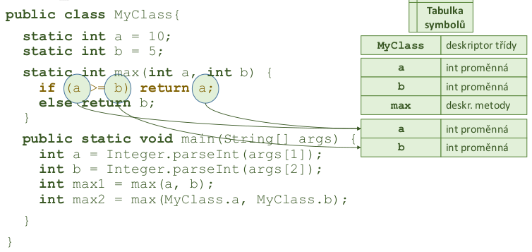

      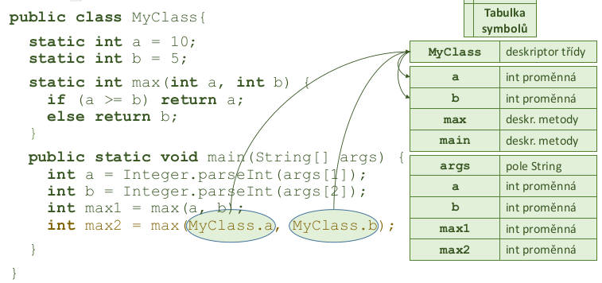

    - operace nad tabulkou
      - vetsinou implementovano jako linked list (LIFO pristup - zasobnik) hash map
      - pro kazdy rozsah (scope) je vytvorena nova mapa  `O(1)`
      - operace: vloz rozsah, odstran rozsah, vloz symbol, najdi symbol, najdi rozsah
    - typicke pouziti
      - pro kazdou cast programu (blok prikazu, deklarace metody, funkci, tridy, ...)
        - vytvor v zasobniku novy rozsah
        - vloz vsechny deklarace do tabulky symbolu
        - zpracuj odpovidajici cast programu
        - ukonci zpracovani -> odstran rozsah
      - vetsina semanticke analyzy je zalozena na tomto postupu
        - nektere jazyky jsou navrzeny tak, aby umoznili jednopruchodove zpracovani (C/C++) - vyzaduji deklaraci vsech identifikatoru pred jejich pouzitim (prototypy funkci)
        - nektere jazyky vyzaduji vice pruchodu (Java) - metody mohou byt deklarovany kdekoliv
        - vetrina prekladacu vyuziva nekolikanasobneho prochazeni - leze lepe optimalizovat
    - rozsahy dedicnosti

      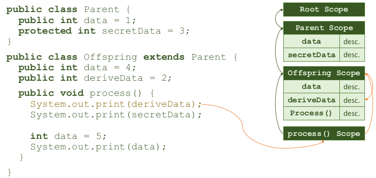

      - rozsah potomka typicky odkazuje na rozsah predka
      - pri hledani prochazim rozsahy v retezci dokud nenajdu shodu (nebo nekonstatuji chybu)
      - explicitni hledani rozsahu (napr. `super.my_var` nebo `this.my_var`)
      - muze se vyplatit si nad danou hirearchii vytvorit neaco jako index pro rychleji vyhledavani
        - databaze toto zajistuji napriklad s pouzitim B-stromu

        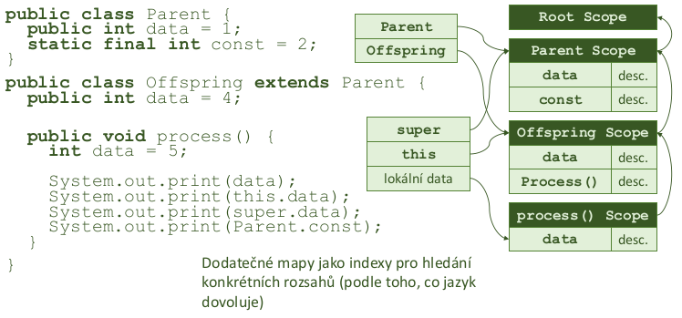

    - vicenasobna dedicnost/rozhrani
      - napr v C/C++ -> musime prohledat oba dva podstromy
      - jak se resi kdyz oba predci maji stejnou deklaraci funkce/promenne? Vezmeme 1. kterou najdeme? => nejednoznacnost

      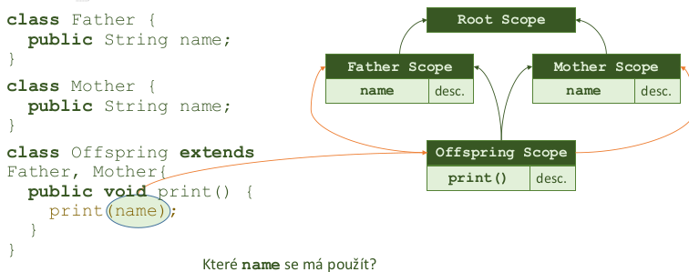

    - vicepruchodova analyza
      - syntakticka analyza potrebuje jen jeden pruchod
        - muze slouzit jako prvni pruchod pro semantickou analyzu
        - nemusi nutne generovat kod pro procesor, jen sestavit derivacni strom resp AST
      - typicky postup
        - sestaveni plneho AST
        - pruchod AST, ziskani informaci o tridach, atributech
        - pruchod AST, kontrola ostatnich vlastnosti (+ optimalizator)
        - generovani instrukci

    - dynamicky rozsah
      - predchozi priklady predstavuji staticke (lexikalni) vyhodnoceni rozsahu
        - jazyky Java, C (az na makra), Pascal, R
      - rozsah viditelnosti vyhodnocen az za behu programu
        - hledam nejblizsi vnoreny identifikator bez ohledu na to kdo ho deklaroval -> spojuje zasobnik vykonavaneho programu a tabulku symbolu
      - jen v nekterych jazycich
        - vyzaduje vyhodnoceni jmen promennych za behu programu (preklad primo do instrukci je obtiznejsi, pri interpretaci snazsi)
        - azyk Lisp, Perl, LaTeX, bash, Logo, Emacs
        - podobny mechanismus je volani virtualnich metod

      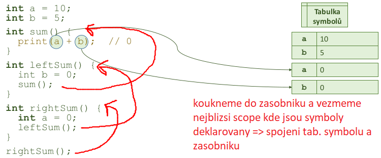

    - mozne implementace tabulky symbolu
      - potrebuji
        - rychle hledat a rychle vkladat
        - jednotlive casti mohou existovat pri prekladu jen po kratkou dobu (velke mnozstvi kratkych metod)
      - implementace po blocich
        - bloky vkladany do zasobniku nebo stromu (pokud potrebuji z nejakeho duvodu celou tabulku)
        - zanoreni bloku nebyva prilis hluboke
      - tabulka pro jeden blok
        - linearni seznam (serazeny nebo nesezareny podle identifikatoru)
        - binarni vyhladavaci strom (podle identifikatoru)
        - hash tabulka (key = identifikator)
      - prohledavani zevnitr ven
        - pri zahazovani nepotrebnych casti nemusim resit
        - pri zachovani cele tabulky je treba sledovat kde jsem

    - vyuziti tabulky symbolu
      - pri prekladu pro zpracovani identifikatoru
      - pri ladeni programu (debugging) pro analyzu pameti
      - u interpretovanych jazyku je k dispozici za behu
        - umoznuje snazsi dynamicke zpracovani
        - usnadnuje zpracovani pameti pro profiler

    - data v tabulce symbolu
      - druh zaznamu (navesti, konstanta, funkce, ...)
      - uroven zanoreni
      - adresa (nebo jaky register pouzit)
      - pouziti (byl symbol pouzit nebo je zbytecny)
      - inicializace (implicitni/explicitni)
      - datovy typ
      - zpusob pristupu (odkazem/hodnotou)
      - hodnota (u konstant)

    - typy (typova kontrola)
      - neni obecna definice (v kazdem jazyce muze byt jiny pohled viz JS)
        - popisuji mozne hodnoty
        - popisuji mozne operace nad nimi
      - typove chyby: pokus o provedeni nepodporovanych operaci
        - muzu scitat retezce? uzu nasobit pole konstantou? muzu nasobit pole polem?
      - typove systemy (= sady pravidel pro praci s typy)
        - silne - nikdy nedovoli typovovou chybu - kontrola pri prekladu (Java, Python, Lisp, ...)
        - slabe - za behu muze dojit k typove chybe (C)
          - proto je jazyk C povazovan za nebezpecny (prevazna vetsina cyber utoku je postavane na nejake variante buffer overflow)
          - C++ se snazi zavest co nejvic silne typove kontrolu (porad kompatibilni s C)
      - staticka
        - analyza v dobe prekladu - hleda jestli nejsou pouzity nepovolene operace
          - => za be behu nemuze dojit k chybe
          - => neznam nektere informace (co se vrati z metody, na co ukazuje pointer) -> restriktivni
        - vyvoj stabilnejsich, robustnejsich programu
      - dynamicka
        - kontrola operandu az pri provadeni operace za behu
        - presnejsi nez staticka kontrola ale drazsi
        - snazsi prototypovani, rychlejsi vyvoj
      - zadana -> programator vi co dela

      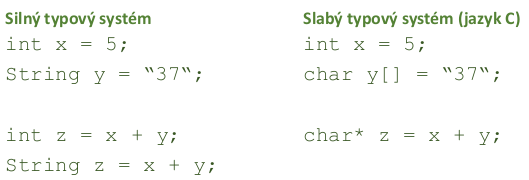

    - odvozovani typu
      - muze byt explicitne deklarovan
        - definice nove promenne/konstanty
        - ahlavi podprogramu s typem parametru a navratove hodnoty
      - muze byt implicitni (napr. `auto` v C++)
        - u vyrazu - typ musi byt odvozen ze slozek vyrazu, je treba overit ze type odpovida ocekavani
          - bacha na implicitini typovou konverzci
        - odvozeni probiha nad AST
      - operator prirazeni = ma nejmensi prioritu (vykonava se az uplne nakonci vyrazu; lezi nejbliz ke koreni AST)

      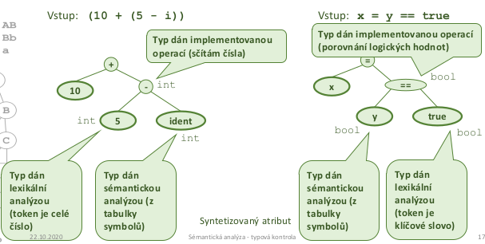

    - odvozeni typu formalne
      - popis odvozovacimi (inferencnimi pravidly)
        - srozumitela definice chovani typoveho systemu
        - overeni/vyhodnoceni pravidel je snadno implementovatelne
        - umoznuje formalne overovat vlastnosti programu (tvorba robustnejsiho SW)
      - syntakticka analyza zjistuje tvrzeni o typech ve fragmentech vyrazu
      - pripravena sada axiomu ze kterych lze vyjit
      - typ vyrazu odvozen aplikaci odvozovacich pravidel na jeho cleny
      - identifikatory platne jen v danem rozsahu - pravidla musi zohlednit scope
      - priklad:
        - pokud je ``a identifikator ktery ukazuje na objekt typu `T`, vyraz `a` je typu `T`
        - pokud je `i` celociselna konstanta, `i` je typu `int`
        - pokud jsou operandy `a` a `b` typu `int`, vysledek operace `a + b` je take typu `int`
    - pretypovani
      - co v pripade ze se zpracovavaji ruzne (a vzajemne komatibilni typy)
        - pravidla jako u dedicnosti nebo implicitni/explicitni pretypovani
      - ktery z danych dvou operandu se ma pretypovat na datovy typ toho druheho?
    - typovani dedicnosti
      - je nutne rozpoznat, ktere typy jsou vzajemne zamenitelne/prevoditelne (dedicnost, genericita, rozhrani)
      - zakladni vlastnosti
        - reflexivita (kazdy type je vzdy prevoditelny na sam sebe)
        - tranzitivita (pokud ja A prevoditelne na B a B je prevoditelne na C, tak je i A prevoditelne na C)
        - slaba antisymetrie (pokud je A prevoditelne na B a B je prevoditelne na A, A a B musi byt stejne typ)
    - omezeni statickeho typoveho systemu
      - povede k odmitnuti programu, ktere by bez problemu fungovaly
      - staticky deklarovany typ muze byt jiny nez skutecny (dynamicky zjistitelny) -> prekladac pro jistotu nepovoli provedeni operace, ktera by mohla probehnout (nelze prokazat ze v programu neni chyba)
    - "znely" typovy system
      - snazi se prokazat pro vsechny vyrazy `DynamickyTyp(E)` <= `StatickyType(E)`
        - myslenka je takova ze vsechny dynamicke typy jsou prevoditelny na nejake staticke typy
      - takovy typovy system ktery odmitne i spravne programy ale nepovoli spatne programy
      - pro vetsinu jazyku lze dokazat ze je nemozne mit uplny a "znely" typovy system
      - snaha udelat typovy system co nejuplneji se "znelymi" pravidly
      - alternativne lze rict, ze pokud je typovy system znely (tedy odmitne spatne programy) a zaroven rozhodnutelny (tedy je mozne u programu rozhodnout jestli je spravny) tak typovy system musi byt neuplny

- optimalizator
  - optimalizuje kod pro zlepseni vykonu programu (rychlost, vyuziti zdroju a pameti atd)
  - kde optimalizovat?
    - nad AST
      - nezavisle na cilove platforme
      - vysoka uroven -> rada veci jeste neni rozhodnuta (adresy v pameti, ...)
      - inlining, eliminace mrtveho kodu, vyhodnocovani konstant
    - nad cilovym jazykem (assembly)
      - rada prilezitosti dane architekturou
      - zavisle na platforme -> nova implementace pro kazdou platformu
      - alokace registru, vyuziti cache, rozbaleni smycek
    - nad mezijazykem (vysokourovnovy assembler)
      - nezavisle na platforme
      - potrebuji vnitrni reprezentaci programu (viz jazyk trojic/ctveric)
      - hledani nejlevnejsich instrukci, eliminace podvyrazu
  - zakladni blok
    - posloupnost instrukci bez navesti (s vyjimkou prvni instrukce) a bez skoku (s vyjimkou posledni instrukce)
    - nejde skocit do stredu bloku (musi se vykonat od zacatku do konce)
    - CFG (= Graf toku rizeni; Control-Flow Graph)
      - orientovany graf
      - uzly jsou zakladni bloky

    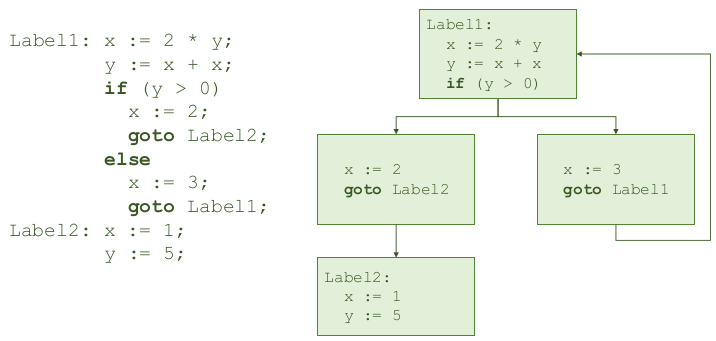

  - cile optimalizace
    - zlepseni vyuziti zdroju
      - zkraceni doby vykonavani
      - zmenseni velikosti programu
      - zmenseni mnozstvi zprav (napr pri sitove komunikaci)
    - NESMI zmenit chovani programu z pohledu uzivatele
      - vypocet skonci se stejnym vysledkem

  - cena za optimalizaci
    - ne vzdy se musi vyplatit pouzit vsechny optimalizace
    - problemy
      - tezka implementace
      - preklad trva prilis dlouho
      - nektere optimalizace nemaji prilis velky prinos
    - => vazit mezi optimalizacemi a vykonem prekladace

  - priklady optimalizaci
    - rozbalovani smycek (vektorizace) -> program bude ale delsi
    - vkladani konstant
      - operace nad konstantami muze vykonat prekladac
      - konstanty se objevuji napr v adresaci poli, definovani rozmeru, atd
      - v C++ je `constexpr` => exekuce casti kodu primo prekladacem v dobe prekladu
    - zjednoduseni algebry
      - nektere operace nedelaji nic uzitecneho => mohu je odstranit (viz `* 1`, `+ 0`, ...)
      - prekladac zkusi do vypoctu dosadit promenne a pak cely vyraz zjednodusit
    - eliminace mrtveho kodu
    - inlining funkci
    - optimalizace vyuzivani registru
    - autovektorizace
    - eliminace spolecneho podvyrazu (opak inliningu - operace napr `i + 2 * 4` se ulozi do pomocne promenne aby se vyraz nemusel vyhodnocovat 2x)
    - nahrada invariantniho vyrazu
      - pokud se vyraz nemeni -> nemusime ho volat porad dokola

- generovani kodu
  - interpretace a preklad
    - rozdil je jen v zaverecne fazi
      - prekladac generuje kod - vytvari soubor s instrukcemi pro CPU
      - interpret vykonvava program rovnou
  - vstup
    - AST - pruchod stromem urcuje poradi vykonavani operaci (obdoba rekurzivniho sestupu)
    - mezijazyk (trojice, ctverice) - snazsi zpracovani nez samotny strom
      - umozneni obecnych optimalizaci bez ohledu na konretni architekturu
  - jazyk trojic
    - nemusi resit alokaci docasne promenne (jsou implicitni)
    - v podstate obdoba AST
    - misto docasne promenne - reference na dalsi trojici

    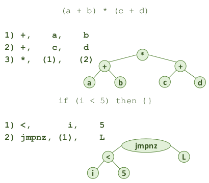

  - jazyk ctveric
    - podobne jako instrukce CPU -> lze snaze prevest do JIS
    - snadne pro zpracovani optimalizatorem
      - vzdy vim kde jsou data
    - potrebuji pamet pro pomocne promenne (mezivysledky)
      - realne pak registry

    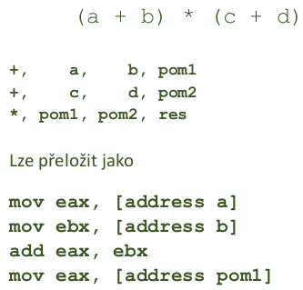

- datove struktury (shrnuti)
  - tabulka symbolu
  - derivacni strom
    - zachycuje postup odvozovani slova z pocatecniho symbolu
  - abstraktni syntakticky strom
    - zjednoduseni derivacniho stromu
    - pro potreby semanticke analyzy a generovani kodu je derivacni strom zbytecne sloziti (obsahuje nerelevantni symboly)

    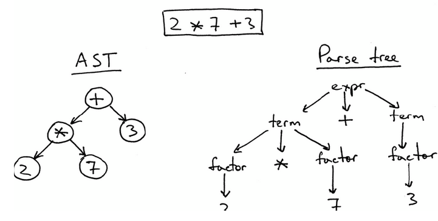
