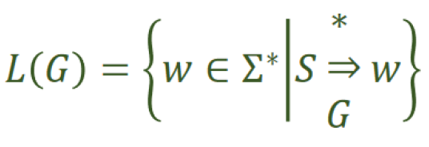
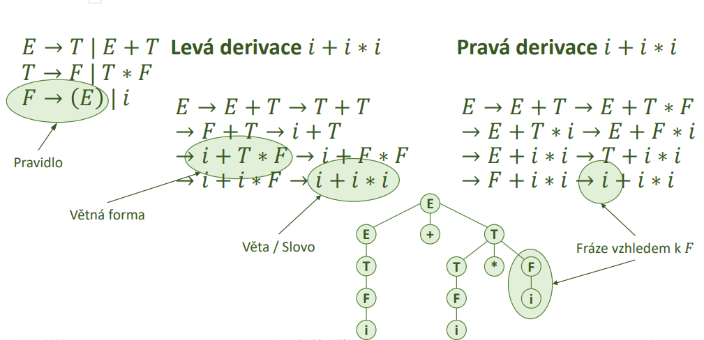
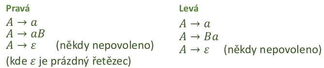
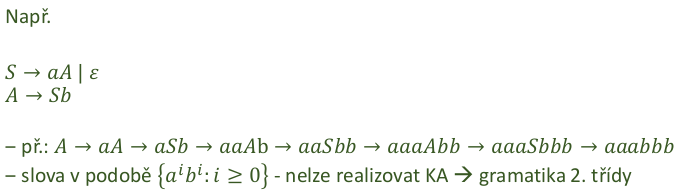
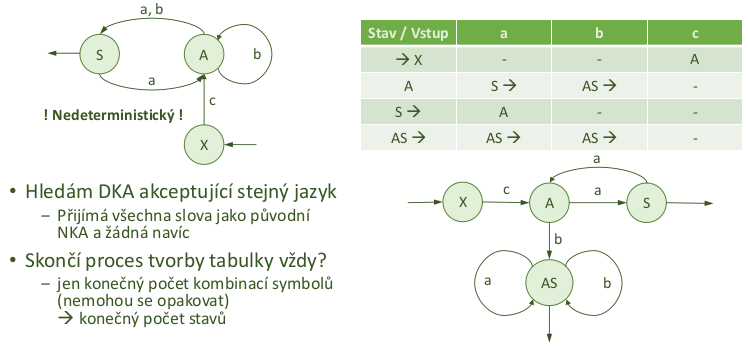
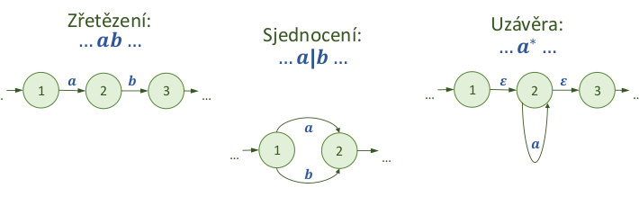
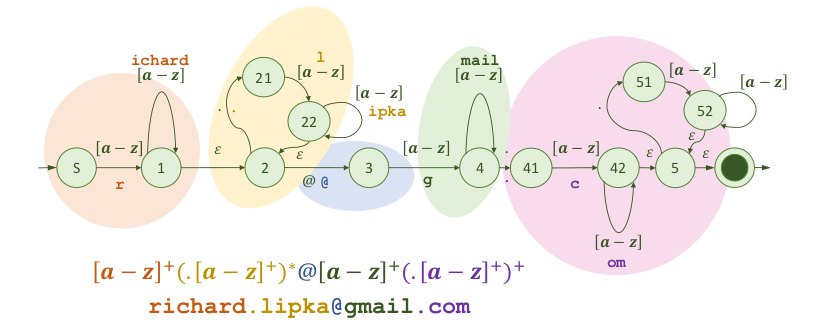

### 19 - Definice regulární gramatiky, vztah regulárních gramatik a konečných automatů, implementace automatu, způsoby a příklady využití. Nástroje pro práci s regulárními výrazy. [KIV/FJP]

- grmatika
  - = matematicky aparat pro popis formalnich jazyku
  - jazyk popsan jako sada pravidel umoznujici vytvaret promluvy
  - myslenka:
    - zyk je slozen ze souveti, souveti je slozeno z veta, veta je slozena z podmetu a prisudku, ...
  - formalni definice
    - G = (𝑁, Σ, 𝑃, 𝑆)
      - 𝑁 - konecna mnozina neterminalnich symbolu
      - Σ - konecna neprazdna mnozina terminalnich symbolu
      - 𝑃 - konecna mnozina prepisovacich (produkcnich) pravidel 𝑁 → (Σ ∪ 𝑁)∗
      - "neterminal se prepise na libovolne velkou mnozinu terminalu i neterminalu"
      - 𝑆 - pocatecni symbol (𝑆 ∈ 𝑁)
    - L(G) - jazyk generovaný gramatikou G
      - mnozina vsech vet ktere lze ziskat (vyderivovat) z pocatecniho symbolu pomoci prepisovacich pravidel
      - chceme aby jazyk byl nekonecny (jinak bychom ho mohli zapsat vyctem a nejaka gramatika by vubec nebyla potreba)
      - ruzne gramatiky mohou generovat stejny jazyk

    

    - "Neterminal obaleny jak zleva tak zprava mnozinout terminalu i neterminalu se prepisuje na mnozinu terminalu i neterminalu"

    

    - "mnozina slov `w` ktere jsou slozeny z terminalnich symbolu takove ze existuje posloupnost prepisovacich pravidel gramatiky G ktere z pocatecniho symbolu `S` vedou na slovo `w`"

  - derivace = odvozeni slova (jedna cesta od korene k listu derivacnim stromem)
    - prava derivace = expandujeme neterminal nejvice vpravo
    - leva derivate = expandujeme neterminal nejvice vlevo

    

- klasifikace gramatik
  - 4 zakladni skupiny podle tvary odvozovacich pravidel
  - cim obecnejsi gramatika (slozitejsi struktura) tim slozitejsi analyza
  - symboly:
    - a, b - terminalni symboly
    - A, B - neterminalni symboly
    - 𝛼, 𝛽 - retezce terminalu i neterminalu (muzou byt prazdne)
    - 𝛾 - neprazdny retezec terminalu i neterminalu
  - typ 0 (rekurzivne spocetne)
    - 𝛼𝐴𝛽 → 𝛾
    - "uplne cokoliv lze prepsat na uplne cokoliv"
  - typ 1 (kontextove)
    - 𝛼𝐴𝛽 → 𝛼𝛾𝛽
    - A se prepise na 𝛾 pouze v kontextu 𝛼 a 𝛽, jinak ne
  - typ 2 (bezkontextove)
    - 𝐴 → 𝛼
    - neterminal A se muze prepsat na cokoliv
    - A neni v zadnem kontextu
  - typ 3 (regularni)
    - ma dva typy prepisovacich pravidel:
      - A → a
      - A → aB
    - regularni gramatika tedy umoznuje pouze prepis neterminalu na terminal nebo terminal + neterminal nebo prazdny retezec (e)

  - BNF – Backus-Naurova forma
    - metoda zapisu pro bezkontextove gramatiky
    - snaha o efektivni zapis pomoci symbolu na klavesnici
    - existuje rada variant a rozsireni (Yacc, ANTLR, ...), kazdy to zapisuje trochu jinak

- regularni gramatiky
  
  

  - lze primocare chapat jako popis NKA (= nedeterministicky konecny automat)
    - terminalni symboly = vstupy (hrany/prechody)
    - neterminalni symboly = vystupy (uzly/stavy)
  - to jestli regularni gramatika generuje nekonecny jazyk lze poznat pokud obsahuje rekurzi (neco jako S -> A, A -> S)
  - limity regularnich gramatik
    - "neumi pocitat", nepamatuji si jak se do daneho stavu dostaly, berou v uvahu jen aktualni stav + to co prislo na vstupu
    - lze pocitat paritu, delitelnosti, ale pocty ne
  - linearni, neregularni jazyk
    - smichame levou a pravou regularni gramatiku
    - => nejde ji popsat NKA (= nedeterministicky konecny automat)
    - stava se z ni gramatika 2. tridy (bezkontextova gramatika)

  

  - pokud mame pravou regularni gramatiku => trivialni prevod na DKA
  - u leve regularni gramatiky je to komplikovanejsi
    - nejprve je potreba udelat reverzi jazyka
      - => obratit preve strany prepisovacich pravidel
      - => generuje slova pozpatku
    - tim padem mame pravou regularni gramatiku
      - => lze trivialni sestavit konecny automat
    - v KA obratime orientaci hran
    - KA nemusi byt deterministicky (jedna se o NKA)
      - => prevedem na deterministiky (DKA) ktery bude prijimat stejny jazyk
    - pro kazdy NKA existuje ekvivalentni DKA

  

  

- priklady vyuziti a nastroje pro praci s regularnimi vyrazy
  - typickym prikladem vyuziti regularnich gramatik jsou regularni vyrazy - regexy
    - lze pomoci nic popisovat i pomerne komplexni struktury napr. email, ip adresa, atd.
  - overovani spravnosti vstupu
  - symboly e nebo 𝜺 predstavuji prazdny vyraz
  - symbol a predstavuje znak "a" ve vstupu
  - povolene oprace
    - predpokladejme ze Ri je platny regularni vyraz
    - zretezeni (konkatenace): R1R2
    - sjednoceni: R1 + R2
    - (Kleeneho) uzavera - jeli R regularni vyraz pak R* je regularni vyraz popisujici libovolny pocet opakovani textu popsaneho R (vcetne zadneho)
  - vylepseni regularnich vyrazu (prakticke pouziti)
    - aa* -> a+ (alespon jeden vyskyt)
    - (a|e) -> a? (zadny nebo jeden vyskyt)
    - aaaa -> a{4} (4x opakovani znaku a)
    - a|b|c... -> [a-z] (nekolik znaku z ASCII)
    - b|c|d... -> X-a (vsechno krome a)
  - priklad jednoduche validace e-mailove adresy:
    - [a-z]+(.[a-z]+)*@[a-z]+(.[a-z]+)+
    - <radek.novak@gmail.com>

- regularni vyrazi a NKA
  - prevod na NKA je snadny
  - nasledke aplikujeme prevod NKA na DKA - pro kazdy NKA existuje ekvivalentni DKA (-> DKA akceptujici stejny jazyk)

  

  - priklad postupu prevodu regularniho vyrazu na NKA

    

    - nakonec dostaneme

      

- automaty a lexikalni analyza
  - kazdy token je popsan regularnim vyrazem
    - lexikalni analyzator = spojeni nekolika DKA kde jeden DKA = jeden token
  - potrebuji hledat nejdelsi symbol
    - DKA jsou vyuzivany "paralelne", token priradi ten, ktery bezel nejdele
    - nesmi nstat shoda 2 DKA - 2 stejne lexemy vedou na 2 ruzne tokeny
    - kazda kombinace lexem - token ma svuj koncovy stav
    - nemusi byt efektivni
      - alternative muzu jen hledat klidove slova v tabulce (od nejdelsiho)

    

    - = nedeterministicky konecny automat (mame e na zacatku) -> prevedeme na DKA a mame lexer
    - potize s vnorovanim
      - KA maji obecne nemaji pamet -> neumi pocitat pocty zanoreni -> tohle resi napr az syntakticka analyza (viz C-style komentare)
    - pozn.:
      - lexikalni analyzator neni jen DKA
      - DKA je pouze teoreticky, formalni pohled na vec

- implementace automatu
  - DKA typicky implementujeme pomoci prechodove tabulky
  - mame stavy (radky), mame vstupu (sloupce) a na zadklade tech konstruujeme prechodovou tabulku
    - indexace v tabulce probiha `curr_state = [curr_state, nex_intput]` (radek, sloupec)
  - existuji online nastroje pro vizualizaci regexu
    - Regex101, Lex (stream znaku na stream tokenu podle definovanych pravidel)
