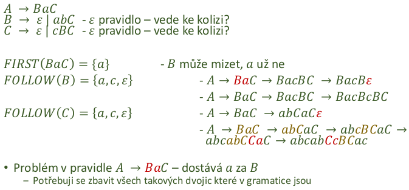

### 20 - Definice bezkontextové gramatiky, vztah bezkontextové gramatiky a obecného zásobníkového automatu. Využití bezkontextových gramatik. Nástroje pro generování automatu a překladače, jejich výhody a omezení. [KIV/FJP]

- bezkontextova gramatika (typ 2 gramatika)
  - kdyz se nad tim zamyslime tak vetsina programovacich jazyku je popsana prave bezkontextovou gramatikou?
  - neterminalni symboly `N`
  - terminalni symboly `T`
  - pocatecni neterminalni symbol `S`
  - mnozinu prepisovacich pravidel `P`
  - => tyhle mnoziny definuji jakoukoliv obecnou gramatiku
  - o jaky typ gramatiky se jedna rozhoduje tvar prepisovacich pravidel
  - bezkontextova gramatika:

    

    - "jeden neterminal se preipsuje na menozinu terminalnich i neterminalnich symbolu"

  - bezkontextova gramatika generuje bezkontextovy jazyk

  

- obecny zasobnikovy automat
  - = abstraktni model vypocetniho stroje - syntaktickeho analyzatoru
  - jednocestny
  - nedeterministicky (realne muzeme potrebovat backtracking)
    - tim jak nevime ktere pravidlo pouzit
    - deterministicky pouze pokud ta gramatika ma dalsi vlastnosti jako schopnost rozhodnout jako pravidlo pouzit z prvnich `n` terminalnich symbolu
  - ma nekonecne velky zasobnik (v praxi jsme omezeni pameti PC)

  

  - formalni popis PDA (= Pushdown Automata; zasobnikovy automat)
    - 𝑃𝐷𝐴 = { 𝑄, Σ, Γ, 𝛿, 𝑞0 , 𝑧0 , 𝐹 }
      - 𝑄 = konecne mnozina stavu radice
      - Σ = vstupni abeceda
      - Γ = abeceda zasobnikovych symbolu (muze byt `T U N`), teoreticky jakekoliv znaky
      - 𝛿 = prechodova funkce - aktualni vstup, vrchol zasobniku, aktualni stav -> novy stav + novy obsah zasobniku
      - 𝑞0 ∈ 𝑄 = pocatecni stav radice
      - 𝑧0 ∈ Γ = dno zasobniku (typycky #, nemuze podtect)
      - 𝐹 ⊂ 𝑄 = mnozina koncovych stavu
    - konfigurace PDA: (𝑞, 𝑤, 𝛼) ∈ 𝑄 × Σ*× Γ*
      - (stav/uzel, aktulani vstup, stav zasobniku)
    - akceptacni automat - vystupem je ano/ne (prijimam/neprijimam slovo)
      - ze vstupu se dostanu do nejakeho stavu F
      - neni to prekladac
  - priklad - PDA pro L = { 0^n1^n}

    

- vztah BKG a zasobnikovych automatu
  - pro kazdou BGK jde sestrojit nedeterministicky zasobnikovy automat
    - typicky ale chceme determinismus
  - syntakticka analyza shora dolu
    - intuitivnejsi
    - problem s levou rekurzi
    - LL parsery, Antrl
  - syntakticka analyza zdola nahoru
    - ne prilis intuitivni
    - naivni postup = backtracking (=> casove slozite)
    - poradi si s levou rekurzi a obecne vetsi skupinou gramatik
    - LR parsery, yacc, bison

- postup shora dolu
  - pro bezkontextovou gramatiku G lze sestavit PDA a naopak
  - 2 operace ktere automat pouziva (definice 𝛿)
    - expanze
    - redukce/srovnani

  

- obecnejsi podoba modifikuje zobrazeni definujici chovani
  - misto toho aby se bral v potaz pouze vrchol zasobniku tak se bere v potaz podretezec nebo cely zasobnik
  - => tomu se rika stack automaton

- vyuziti BKG (= bezkontextovych gramatik)
  - podmnozina BKG umoznujici deterministickou analyzu (konstrukci deterministickeho PDA)
    - cte vstup zleva doprava
    - provaci nejlevejsi derivaci s prihlednutim ke `k` symbolum vstupniho retezce
  - analyza v `O(n)`
  - BKG jsou vyuzivany pro syntaktickou analyzu zdrojoveho kodu programovacich jazyku
  - vyuziti napr v yacc/bison nebo ANTLR
  - pro analyzu BKG se pouzivaji LL, LR, LALR parsery
    - gramatiky zpracovatelne temito parsery jsou podmnozinou vsech BKG
  - alternativne lze pouzit rekurzivni sestup

- nastroje pro generovani automatu a prekladace
  - atributovana gramatika (gramatika rozsirena o semantickle vlastnosti spojene s kazdym pravidlem)
  - vyuzivaji zasobnikovy automat
  - Yacc/Bison
    - vyuziva analyzu zdola nahoru
  - ANTLR
    - vyuziva analyzu shora dolu
  - Lex - lexikalni analyza

  

  

  

- neco navic
  - pro kazdou BKG existuje GNF cimz lze vlastne dokazat ze kazdou BKG lze analyzovat zasobnikovym automatem

  - LL(1) - trivialni priklad
    - (1) znamena ze berem v uvahu pouze 1 vstupni symbol
    - LL(n) - uvazujem prvnich `n` symbolu na vstupu

    

    - derivacni strom lze ziskat primo z automatu tim jak akceptujeme vstupni data

    

    - jednoducha implementace
      - pomoci tabulky
      - potrebujeme jen lexer co nam doda tokeny
      - realna implementace pomoci switchu

  - GNF (= Greinbachove Normalni forma)
    - forma gramatiky ktera splnuje nasledujici pravidla
      - pouze `S` se muze prepisovat na `e` (prazdny retezec)
      - kazda prava strana zacina terminalem
      - `S` se nevyskytuje v zadne prave strane
      - pro jednu levou stranu -> vsechny prave strany maji rozdilne prvni symboly
    - => takovou gramatiku lze pak analyzovat jednoduchym LL(1) parserem
      - lze rozhodnout na zaklade jednoho prvku a vrcholu zasobniku
    - GNF pocet pravidel po prevedeni je ale obecne `O(n^4)` -> takze byva neprakticky velka

  - LL analyzator - mozne komplikace
    - co kdyz je jako prvni neterminalni symbol => musim pouzit funkci FIRST abych vedel kdy dane pravidlo muzu pouzit (pro jake vstupy)
    - e-pravidla - pro volbu pravidla musim pouzit prvni symbol prave strany - co s prazdnou pravou stranou? => musim pouzit funkci FOLLOW abych vedel jaky terminalni symboly mohou nasledovat
    - first-first kolize
      - prave stany zacinaji stejnym terminalem / skupinou terminalu
      - nevim jeke pravidlo zvolit
      - muzu zkusit lookahead (casova slozitost?)
      - muzu gramatiku zkusit upravit - najit LL(1) gramatiku bez kolize pro stejny jazyk

        

      - reseni pomoci leve faktorizace

        

        

    - first-follow kolize
      - prava stana zacina terminalem, ktery je ve follow mnozine leve strany prepsatelne na 𝜀
      - objevuje se pri existenci 𝜀 pravidel, bez nich se ji nemusim obavat
      - opet budu hledat jinou LL(1) gramatiku pro stejny jazyk
      - reseni pohlcenim terminalu
        - ostatnich pravidel si opet nevsimam, potrebuji ale identifikovat vsechna mista vedouci k 𝑎 ∈ 𝐹𝑂𝐿𝐿𝑂𝑊(B) (dvojice Ba)
        - lze vytvorit novy neterminalni symbol [Ba], kterym nahradim vsechny vyskyty Ba

      

      

  - funkce FIRST
    - detekce cim vsim muze zacinat dana vetna forma
    - vstup: libovolny retezec pro ktery se analyza provadi + gramatika
    - vystup: mozina terminalnich symbolu, ktere mohou byt na zacatku vetne formy
    - formalne je definovana rekurzivne
      - pokud `a = e` `FIRST(a) = {e}`
      - pokud `a` je terminalni symbol -> `FIRST(a) = {a}`
      - pokud `S -> a|b|c..` -> `first(S) = {a,b,c,...}`
      - `S -> AB` kde`A` je v mnozine `Ne` (muze se prepsat na e) -> `FIRST(S) = FIRST(A) - e U FIRST(B)`
      - `S -> AB` kde `A` neni v mnozine `Ne -> FIRST(S) = FIRST(A)`

    

    - "rozvijime" symbol ktery je za teckou
    - casto zvladnutelne metodou "kouknu a vidim"
      - pokud je na zacatku terminalni symbol -> je to vysledek
      - pokud je v retezci alespon jeden terminalni symbol -> nedostanu se za nej
      - aby mohl byt vysledek 𝜀 -> musim hledat funkci first jen pro retezce neterminalnich symbolu (jsou v mnozine Ne)

    - funkce FOLLOW
      - detekuje co vsechno se muze objevit za zadanym symbolem
      - definovana pro terminalni i neterminalni symboly
      - nema smysl pro retezce (je stejna jako pro posledni symbol daneho retezce)
      - poznam jaky symbol ve vetne forme muze nasledovat za tim, ktery ma "zmizet" (S -> e)
      - vstup: jeden symbol pro ktery se analyza provadi (+ gramatika)
      - vystup: mnozine terminalnich symbolu, ktere za nim mohou nasladovat v libovolne vetne forme

      

      

      

      - postup
        - kouknu kde vsude je D na prave strane, pridam ty pravidla a dam tecky za D
        - kouknu z jakeho N symbolu jsem se tam dostal (napr. T -> FD. => dostal jsem se tam z T) => pridam pravidla s T na prave strane (tecku dam za T)
        - hlidam si jaka pravidla jsem uz prosel, pokud se pravidlo objevi znova s teckou na koneci => e muze nastat?
        - posouvam tecku v pravo dokud jsem nezpracoval vsechny symboly

      - podstatne mene intuitivni
      - je treba mit prehled
        - ktera pravidla uz byla zpracovana
        - ktere kroky byly na pravidlo aplikovany
        - hlidat si pozice tecky
        - nezapomenout na peclive vyhodnoceni Ne - chyba v ni znamena vynechani pravidel...
        - 𝜀 tam patri pokud symbol muze stat na konci nejake vetne formy

  - pokud nelze sestavit jednoduchy LL(1) parser kvuli first-first a first-follow kolizim
    - => muzeme zkusit sestavit obecny LL(1) parser za pouziti FIRST a FOLLOW funkci
    - pokud to nejde, nezbyva nez navysovat `k`
      - LL(k) analyzatory ale maji velke tabulky (exponencialni narust s `k`)
        - napr pro `k = 3` musime mit ve sloupci tabulky vsechny terminalni znaky + vsechny dvojice a vsechno trojice (FIRST_3(a) = {a} => proto nestaci mit jen vsechny trojce)
- LL analyza si neporadi s levostrannou rekurzi => proto existuje LR analyza ktera ma v zasobniku vetsi cast vstupu protoze jde zleva doprava - i tam ale narazime
- LR(0) analyzatory jsou nachylne na reduce-reduce a shift-reduce kolize
  - to lze resit lookaheadem => coz jsou SLR(k) - ty delaji prostou FOLLOW analyzu
  - SLR(k) analyzatory zase mohou mit kolize => takze existuji LALR(k) analyzatory ktere maji chytrejsi lookahead
  - misto toho aby delali prostou FOLLOW analyzu, lookahead je zavisly na tom jakym zpusobem jsme se k LR polozce dostali => tim lze eliminovat kolize ktere nastavaji v SLR(k) analyze
  - nejobecnejsi LR analyza je pak LR(k) analyza
  - zatimco LALR analyza sjednoduce LR polozky podle jejich jadra (a tedy ignoruje ruzne lookaheady z ryznych zdroju), LR analyza polozky se stejnym jadrem a ruznym lookaheadem rozdeluje => tim muze eliminovat nektere kolize, ale graf vyrazne naroste => proto se v praxi LR analyzatory moc nepouzivaji
- LALR(k), tedy LALR(1) v pripade yaccu jsou tedy aktualni limit co se tyce obecnosti analyzatoru ktere pracuji v linearnim case
  - nezpracuji ale vsechny BKG => na to je potreba backtracking coz pohorsuje linearitu
    - i s linearni komplexitou trva build Linuxoveho jadra nekolik hodin => napr s komplexitou treba `n^4` bychom se toho uz nemuseli dozit :D
  - existuji ale i analyzatory s backtrackingem
- take existuji jine pokrocilejsi analyzatory, jako treba GLR (= General LR) ktere umi chytre uplatnit backtracking
  - nebo ALL(*) ktery pouziva ANTRL4
  - nepracuji ale v linearnim case
