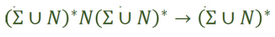
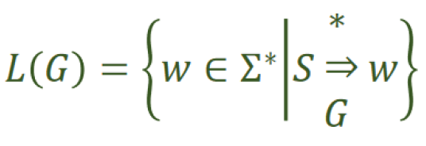
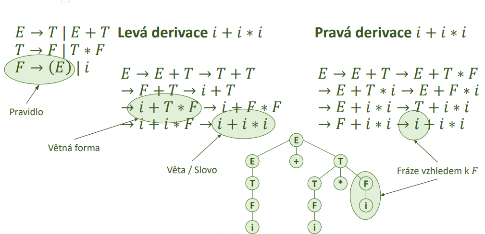
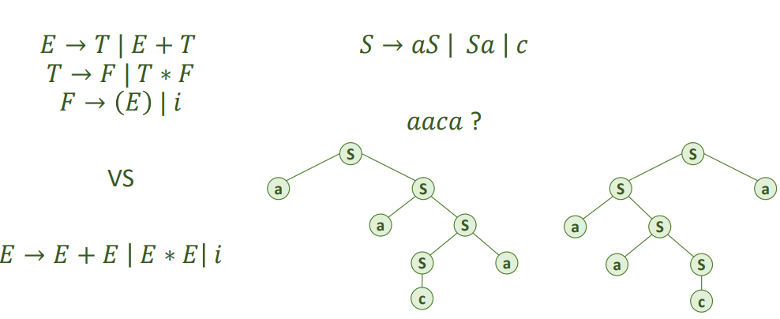
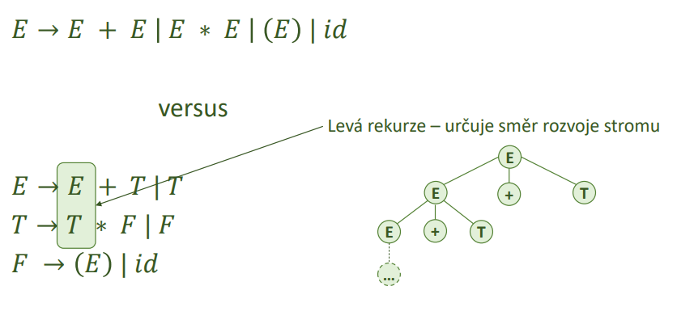
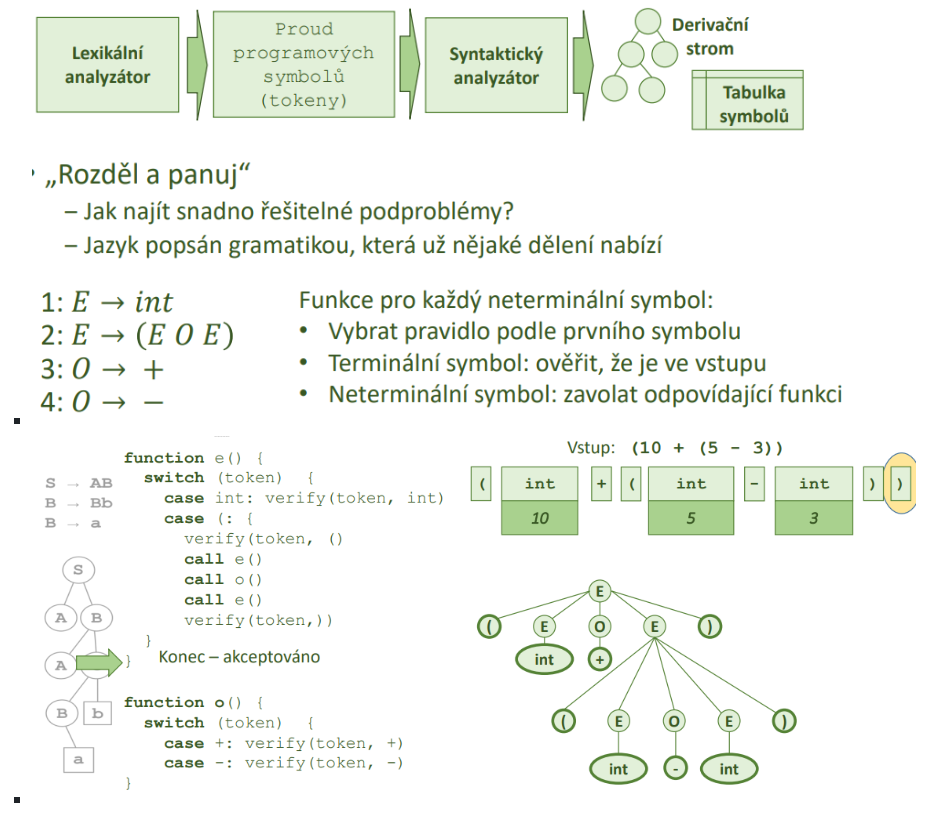

### 21 - Metody syntaktické analýzy. Výhody a nevýhody rekurzivního sestupu. [KIV/FJP]

- gramatika
  - = matematicky aparat pro popis formalnich jazyku
  - jazyk popsan jako sada pravidel umoznujici vytvaret promluvy
  - myslenka:
    - jazyk je slozen ze souveti, souveti je slozeno z veta, veta je slozena z podmetu a prisudku, ...
  - formalni definice
    - G = (𝑁, Σ, 𝑃, 𝑆)
      - 𝑁 - konecna mnozina neterminalnich symbolu
      - Σ - konecna neprazdna mnozina terminalnich symbolu
      - 𝑃 - konecna mnozina prepisovacich (produkcnich) pravidel 𝑁 → (Σ ∪ 𝑁)∗
      - "neterminal se prepise na libovolne velkou mnozinu terminalu i neterminalu"
      - 𝑆 - pocatecni symbol (𝑆 ∈ 𝑁)
    - tvar prepisovacich pravidel urcuje typ gramatiky

        

    - L(G) - jazyk generovaný gramatikou G
      - mnozina vsech vet ktere lze ziskat (vyderivovat) z pocatecniho symbolu pomoci prepisovacich pravidel
      - chceme aby jazyk byl nekonecny (jinak bychom ho mohli zapsat vyctem a nejaka gramatika by vubec nebyla potreba)
      - ruzne gramatiky mohou generovat stejny jazyk

      

  - derivace = odvozeni slova (jedna cesta od korene k listu derivacnim stromem)
    - prava derivace = expandujeme neterminal nejvice vpravo
    - leva derivate = expandujeme neterminal nejvice vlevo

  

- syntakticka analyza
  - cilem je konstrukce derivacniho stromu (= parse tree)
  - existuji 2 zakladni zpusoby pro konstrukci derivacniho stromu
    - shora dolu
      - intuitivnejsi
      - chci z pocatecniho symbolu odvozovat slova
      - je ale zapotrebi vybrat spravne poradi operaci k derivovani
    - zdrola nahoru
      - obtiznejsi
      - postupne redukujeme slovo na vetne fraze a nakonec na pocatecni symbol
    - postupy
      - backtracking (analyza s navratem)
        - univerzalni ale neefektivni
      - deterministicka analyza
        - funguje jen pro nektere druhy BKG (bezkontextovych gramatik)
          - viz. first-first kolize, first-follow kolize, e pravidla, atd => pouze podmnozinu vsech BKG je mozne dereministicky popsat zasobnikovym automatem
          - derivacni strom lze pak automaticky vygenerovat = posloupnost aplikovani jednotlivych pravidel nad vstupnim retezcem

- viceznacnost gramatiky
  - slovo je viceznacne pokud existuji alespon 2 ruzne derivacni stromy k jeho odvozeni
  - nutna podminka jednoznacnosti! (neni postacujici)
    - pro zadny neterminal neexistuje pravo i levorekurzivni pravidlo (=> nemohu se rozhodnout)
  - muze ale nemusi existovat ekvivalentni jednoznacna gramatika

  

  - je mozne zapsat jednoznacne ale gramatika muze byt slozitejsi
  - gramatika je viceznacna pokud pro rekurzivni neterminal A existuji alespon 2 pravidla
    - jedno rekurivni zprava, se shodnym prefixem symbolu A s druhym pravidlem
    - jedno rekurzivni zleva se shodnym postfixem symbolu A s prvnim pravidlem
  - eliminace nejednoznacnosti
    - seskupovani operatoru podle priority
    - nastaveni smeru rekurze podle asociativity operatoru
    - odstraneni obousmerne rekurze pridanim dalsich symbolu
  - rozdelni gramatiky do vice urovni = definice priorit
  - leva/prava gramatika resp. derivace = urceni poradi vyhodnocovani operatoru (napr. u vyrazu)

  

- jednoducha analyza shora dolu
  - primocary postup
  - ctu zleva doprava po tokenech
  - na zaklade tokenu pouziju pravidlo podle toho cim zacina
  - leva derivace do hloubky

  

  - analyza shora dolu lze provest pomoci zasobnikovych automatu nebo rekurzivniho sestupu
    - automatizovane pristupy se zasobnikovym automatem
      - automaticke generovani gramatik
      - snazsi formalni postup
      - mensi kontrola nez rekurzivni sestup

- rekurzivni sestup
  - snazsi a pruhlednejsi implementace
    - sledovani co program dela a uprava funkcionality
    - timto zpusobem je implementovano napr. gcc
    - snadna implementace backtrackingu
  - rozdel a panuj algoritmus
    - vytvorime handler (funkci) pro kazdy neterminalni symbol
    - pouzijeme `switch` pro vybrani `case` dle aktualniho symbolu na vstupu => zavolame prislusne handlery
      - pokud je na prave strane terminal -> overime ze je na vstupu
      - pokud tam je neterminal -> zavolame odpovidajici funkci (handler)
  - derivacni strom nam vznika v operacni pameti postupnym volanim funkci

  

  - problemy
    - pokud je na vstupu neco jineho => syntakticka chyba
    - prava strana neobsahuje terminal
      - analyza do hloubky a zjistit zacatky funkce first
        - musime zjistit na jaky terminal se neterminalni symbol prepisuje (co mame vlastne verifikovat na vstupu)
    - leva rekurze => nekonecny cyklus => musime prepsat (upravit gramatiku)
      - porad volam dokola tu samou funkci (handler) - neterminalni symbol
    - dve prave strany se stejnym zacatkem
      - => vybrat podle neceho (lookahead)
    - na prave strane prazdny symbol
      - jak overim je "nic" na vstupu?
        - v `case` se overuje je na vstupu ocekavany terminalni symbol
      - muzeme zjistit co vsechny (terminaly) muze na vstupu pak nasledovat a podle toho se rozhodnou jestli e pravidlo odstranit nebo ne
