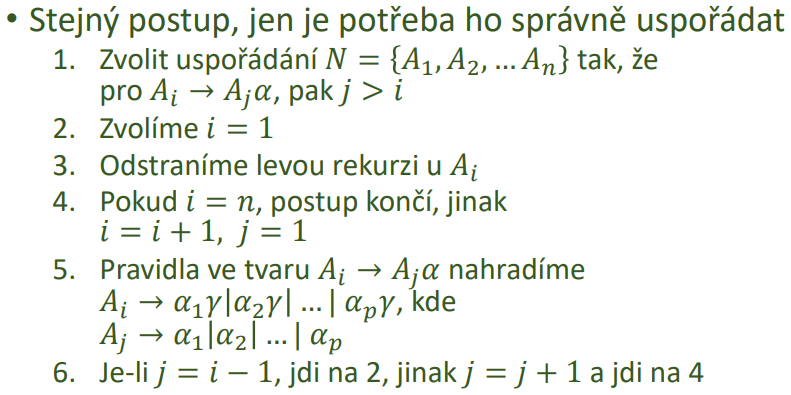

### 22 - Ekvivalence gramatik, transformace gramatik vč. transformace do podoby LL gramatiky. Důvody pro transformace. Úlohy algoritmicky nerozhodnutelné. [KIV/FJP]

- ekvivalence gramatik
  - gramatiky jsou ekvivalentni pokud produkuji stejny jazyk
  - napr. `S -> aS | e` a `S -> Sa | e` jsou ekvivalentni gramatiky

- ekvivalentni upravy
  - ekvivalentni upravy jako u rovnic (nesmi se zmenit jazyk ktery dana gramatika generuje)
  - odstraneni zbytecnych symbolu
  - odstraneni prazdnych pravidel
  - odstraneni jednoduchych pravidel a cyklu
    - substituce pro odstraneni libovolneho pravidla
  - odstraneni leve rekurze

- funkce FIRST
  - cim vsim muze retezec symbolu zacinat
  - vstup: libovolny retezec terminalu i neterminalu
  - vystup mnozina terminalu kterymi muze retezec zacinat

    

- funkce FOLLOW
  - zjisti co muze nasledovat za danym symbolem
  - nema smysl pro retezce (je stejna jako pro posledni symbol daneho retezce)
  - vstup: symbol
  - vystup: mnozina terminalu ktere mohou nasledovat

  

- hledani zbytecnych symbolu
  - = symboly ktere se nepodili na generovani slova
  - nejsou dosazitelne z pocatecniho symbolu (neexistuje vetna forma kde by byly obsazeny)
  - typicky indikuji problem v navrhu gramatiky
  - postup
    - oznacime vsechny 𝑥 ∈ T
    - oznacime vsechny 𝑋 ∈ 𝑁, pro nez existuje pravidlo 𝑋 → 𝛼, kde 𝛼 obsahuje jen oznacene symboly
    - opakuji dokud muzu oznacovat
    - neoznacene symboly = zbytecne symboly

    

    

- odstraneni e pravidel
  - pri rekurzivnim sestupu nevim kdy pravou stranu muzu pouzit
  
  

- odstraneni jednoduchych pravidel
  - prepsani jednoho terminalu na druhy (A -> B)
  - lehci orientace
  - odstraneni prostou substituci

  

- odstraneni cyklu
  - existence cyklu implikuje jednoducha pravidla
    - => jejich odstraneni by melo odstrant cykly
  - s poctem cyklu roste slozitost, nepridavaji novou informaci a tezko se ukoncuji
  - postup
    - gramatika musi po odstraneni cyklu generovat stejny jazyk!

    

- odstraneni leve rekurze

  

  - odstraneni bez e pravidel

    

  - odstraneni s e pravidly

    

  - srovnani

    

  - neprima leva rekurze i vicenasobna leva rekurze

    

- transformace gramatik do podoby LL gramatiky
  - transformace na LL gramatiku - GNF (= Greinbachove Normalni forma)
  - pro kazdy bezkontextovy jazyk lze najit gramatiku ktera je v GNF
    - pravidla ve tvaru `X -> aY1...Yn`, kde `Y` neni `S` ani `e`, a `S -> e` a kazda prava strana zacina jinym neterminalnim symbolem
    - algoritmus konstrukce je komplikovany
      - mame-li obecnou BKG nalezeni jeji GNF muze byt `O(n^4)`
  - pri sestavovani LL(1) gramatiky muze dojit k FIRST-FIRST a FIRST-FOLLOW kolizim
    - ty lze take castecne eliminovat
    - nektere FIRST-FIRST ale eliminovat nelze

- duvody transformace
  - moznost odstraneni kolize
  - odstraneni leve rekurze (abychom mohli pouzit LL analyzator nebo rekurzivni sestup)

- ulohy algoritmicky nerozhodnutelne
  - viceznacnost gramatiky
    - existuje vice nez jeden zpusob pro odvozeni slova v dane gramatice
    - nutna podminka pro jednoznacnost gramatiky je pritomnost pouze levo nebo pravo rekurzivnich prepisovacich pravidel (ne kombinace!)
    - tato podminka je pouze nutna => neni postacujici!
    - existence ekvivalentni jednoznacne gramatiky je algoritmicky nerozhodnutelna
      - muze i nemusi existovat
      - pokud ji najdu => tak vim ze existuj
      - pokud ji nenajdu => dokazat neexistenci je slozite
  - obecne chceme najit co nejjednodussi gramatiku ktera generuje jazyk ktery potrebujeme
