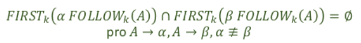

### 23 - Využití zásobníkového automatu k analýze shora dolů. Konstrukce deterministického automatu, vhodný tvar gramatiky. Vyjadřovací síla LL a LR gramatik. [KIV/FJP]

- zasobnikovy automat
  - podobne jako KA
  - jednocestny (nevraci se)
  - nedeterministicky
  - akceptacni (ano/ne)
  - nekonecna pamet (zasobnik)

  

- zasobnikovy automat pro syntaktickou analyzu shora dolu
  - odvozujeme slovo z korene jazyka
  - vstupni abeceda = terminalni symboly jazyka
  - abeceda zasobniku = terminalni i neterminalni symboly jazyka
  - v zasobniku zacne s korenem
  - operace
    - expanze - nahradi neterminal na vrcholu zasobniku nejakou pravou stranou
    - srovnani - porovna (a odstrani) symbol ze vstupu a z vrcholu zasobniku
  - akceptace - prazdny vsup i zasobnik (= jen jeden pracovni stav)

  

- konstrukce deterministickeho automatu, vhodny tvar gramatiky
  - pokud provadime analyzu shora dolu pomoci zasobnikoveho automatu
    - cteme vstup zleva doprava a vzdy provadime nejlevejsi moznou derivaci (bereme v uvahu prvnich `k` symbolu vstupniho retezce -> LL(k) analyzator)
  - takovyto automat potrebuje mit gramatiku ve vhodnem tvaru
  - umoznuje analyzu v `O(n)` (neni zavisle na `k` -> to nam urcuje pouze velikost  tabulky prechodu)
  - je potreba dodat pravidla pro volbu prave strany
  - jednim z vhodnych tvar gramatiky je GNF (= Greinbachove Normalni forma)
    - pouze `S` se muze prepisovat na `e` (prazdny retezec)
    - kazda prava strana zacina terminalem
    - `S` se nevyskytuje v zadne prave strane
    - pro jednu levou stranu -> vsechny prave strany maji rozdilne prvni symboly
    - => takovou gramatiku oznacujeme jako jednoduchou LL gramatiku (LL(1) gramatiku)

- pro LL analyzator potrebujeme
  - prechody jsou definovane prechodovou tabulkou
    - vrchol zasobniku (symbol) = radek
    - vstupni symbol = sloupec
    - => to definuje jake pravidlo pouzijeme
  - pokud prvnich `k` symbolu na zasobniku odpovida prvnim `k` symbolum na vstupu => provedeme srovnani
  - implementace je jednoducha a funguje obecne pro vsechny zasobnikove automaty
    - nastrel (myslenka) implementace:

    - ```c++
      std::size_t i{ 0 };

      while (i < input.length())
      {
        // Provest akceptaci?
        if (first_symbols(stack, k) == first_symbols(&input[i], k))
        {
            pop_k(stack);
            i += k;
            continue;
        }

        // Provest expanzi?
        if (tab[curr_state][input[i]] == UNDEF)
        {
            // ERR -> neakceptujeme vstupni retezec
        }
        else
        {
            curr_state = tab[curr_state][input[i]];
            ++i;
        }
      }

      if (!stack.empty())
      {
        // ERR -> neakceptujeme vstupni retezec
      }
      ```

  - pro jakoukoliv zpracovatelnou gramatiku staci obecny engine do ktereho se dosadi tabulka prechodu a doplni se gramatika
  - pokud gramatika neni v GNF, NEZNAMENA to ze nelze vyrobit LL analyzator!!
  - prikladem komplikace je neterminal na levem konci prave strany
    - bez vice informaci nejsem schopen rozhodnout jestli dane pravidlo (pravou stranu) aplikovat nebo ne
    - => musime pouzit funkci FIRST, kera vrati mnozinu vsech terminalu kterymi muze prava strana zacinat
    - funce FIRST ma rekurzivni definici
      - pokud `a = e` `FIRST(a) = {e}`
      - pokud `a` je terminalni symbol -> `FIRST(a) = {a}`
      - pokud `S -> a|b|c..` -> `first(S) = {a,b,c,...}`
      - `S -> AB` kde`A` je v mnozine `Ne` (muze se prepsat na e) -> `FIRST(S) = FIRST(A) - e U FIRST(B)`
      - `S -> AB` kde `A` neni v mnozine `Ne -> FIRST(S) = FIRST(A)`
        - `A` se nemuze prepsat na `e` => musi v sobe obsahovat alespon jeden terminal => nedostaneme se za nej => `FIRST(B)` nas tim padem vubec nezajima
  - dalsim problemem je prazdna prava strana
    - pokud si muzeme vybrat mezi nejakou pravou stranou a pravou stranou ktera se pripisuje na e, tak nevim kdy pravidlo muzu pouzit
    - => musime pouzit funkci FOLLOW
      - definovana pro jeden neterminalni symbol
        - pro retezce je stejna jako posledni symbol retezce
      - vrati mnozinu terminalnich symbolu ktere se mohou vyskytovat za danym neterminalnim symbolem
      - pokud mam tedy nejaky neterminal ktery se muze prepsat na e
        - tak se muzu na zaklade funkce FOLLOW rozhodnout, jestli to co nasleduje muze nasledovat pokud dany neterminal zmizi (prepise se na e)
      - funkce FOLLOW ma opet rekurzivni definici
        - vstup: symbol `A ∈ (𝑁 ∪ 𝑇 )` a gramatika `G = {N,T,P,S}`
        - zacni s `FOLLOW(A) = {}`
        - pokud `A = S` (je pocatecni symbol), pak do `FOLLOW(A)` pridej `𝜀`
          - urcite muze stat na konci - hned na zacatku derivovani
        - projdi vsechny prave strany v `G` ktere obsahuje `A` (maji tvar `𝛼𝐴𝛽`) a pridej do `FOLLOW(A)` vsechny `FIRST(𝛽)`
          - pokud v nejake bude `𝜀`, nepridavej ho
        - pokud je v `G` pravidlo `𝐿 → 𝛼𝐴` nebo `𝐿 → 𝛼𝐴𝛽` a zaroven `𝜀 ∈ 𝐹𝐼𝑅𝑆𝑇(𝛽)`, pridej do `FOLLOW(A)` take `FOLLOW(L)`

  - LL(1) tedy gramatika nemusi byt GNF ale musi platit ze
    - bezkontextova gramatika, nema levou rekurzi
    - navic musi platit

    

    - jinak receno:
      - prave strany se musi lisit prvnim terminalnim symbolem
      - pokud nemaji prvni symbol jako terminalni, tak se musi lisit jejich FIRST mnoziny
      - pokud prave strany first mohou zmizet kvuli e pravidlum, tak FOLLOW funkce tech levych stran musi byt jine nez FOLLOW funkce vsech tech pravych stran
    - => jsme schopni tedy sestavit rozkladovou tabulku za pouziti FIRST a FOLLOW funkci
    - takovou gramatiku nazyvame obecnou LL(1) gramatikou

  - tomu mohou zabranit dve situace
    - first-first kolize
      - prunik mnozin FIRST funkce alespon dvou pravych stran neni prazdna mnozina
      - => nevim jake pravidlo muzu pouzit
      - lze resit lookaheadem
        - => coz vyrazne zvetsi rozhladovou tabulku (musime pouzit vsechny kombinace vstupnich symbolu (sloupce) => exponencialni)
          - musime pouzit vsechny znaky + vsechny dvojice + vsechny trojice atd.
          - `FIRST_3(ab) = {ab}` => prvni 3 znaky ze dvou znaku jsou dva znaky => proto i vsechny `k-1`-tice
      - nebo upravou gramatiky aby byla LL(1)
      - postup transformace gramatiky kvuli first-first kolizim
        - nejprve provedeme substituci - tak aby byla kolize na stejne urovni
          - tedy aby kolizni prave strany zacinaly stejnym terminalem
        - pote provedeme levou faktorizaci

            

          - => to muze zpusobit dalsi kolize, leva rekurze, `e` pravidla, atd.

    - first-follow kolize
      - = problem s e pravidly
      - objevuje se pri existenci 𝜀 pravidel, bez nich se ji nemusim obavat

      

      - lze resit pohlcenim terminalu
      - opet budu hledat jinou LL(1) gramatiku pro stejny jazyk

      

      - nevim nic o 𝛾1 … 𝛾𝑛 -> mohou vzniknout (zrejme) first-first kolize, leve rekurze, atd

      

      - pohlceni terminalu (priklad 2)

      

      - alternativne se muzeme `e` pravidel zbavit (budeme mit jen first-first kolize)

        

  - pokud se nam nepodari najit LL(1) analyzator, muzeme pouzit LL(k) analyzator
    - to znamena precist vice symbolu ze vstupu (k)
    - FIRST-k a FOLLOW-k funkce
      - nekdy se hodi analyzovat delsi retezce nez jen prvni neterminalni symbol
      - intuitivne
        - FIRST-k = hleda k-znakove (a kratsi!) zacatky vetnych forem
        - FOLLOW-k = hleda k-znakove (a kratsi!) nasledujici vetne formy
      - definice moc nepomahaji hledani

  - silne LL(k) gramatiky
    - kdyz se nepovede LL(1) analyzator, mozna mohu rozhodnout na zaklade prvnich k-symbolu
      - neni skutecny lookahead (ten je az v LR analyze)
    - definice podobna jako u LL(1)

    

  - LL(k) gramatiky
    - rozdil mezi silnout LL(k) a obecnou LL(k) gramatikou
      - silne LL(k) gramatiky jsou zaroven LL(k), ale ne naopak
      - LL(1) je vzdy silna gramatika - pro ni definice splynou
      - obecne LL(k) parser rozhoduje na zaklade vsech nactenych symbolu + vrcholu zasobniku + k symbolu ze vstupu
      - silne LL(k) potrebuji jen zasobnik a vstup

    

    

    - pro silnou LL(k) gramatiku lze sestavit LL(k) analyzator
    - prakticke vyuziti maji hlavne LL(1) analyzatory a gramatiky protoze maji rozmne velke rozkladove tabulky
      - pro kazdou BKG existuje ekvivalentni gramatika GNF => takze LL(>1) nejsou vlastne vubec potreba (pokud nas netrapi pocet preipisovacich pravidel samozrejme)

- vyjadrovaci sila LL a LR gramatik
  - LL parsery akceptuji vyrazne mensi mnozinu gramatik nez LR parsery
  - problemy LL parseru jsou levorekurzivni pravidla
  - BKG muze obsahovat first-first kolize, ktere nelze odstranit a tedy na ne LL analyza nestaci
  - LR analyza tyto konflikty nemusi resit - LL analyzatory nemohou akceptovat LR gramatiky ale LR analyzatory mohou akceptovat LL gramatiky

  

  - vztah mnozin gramatik
    - kazdou BKG lze zapsat v Greinbachove normalni forme
      - problem je ale ze to vyzauje az O(n^4) dalsich neterminalu
    - pro kazdou BKG lze postavit zasobnikovy automat
    - muze obsahovat first-first kolize ktere nejsou odstranit -> LL analyza na to nestaci
    - pro kazdy jazyk muze existovat libovolne mnozstvi gramatik
    - jedna gramatika generuje prave jeden jazyk
    - nektere jazyky je mozne akceptovat jen nekterymi druhy automatu

  - shrnuti
    - leva rekurze je prekazdkou - pokud v gramatice je => neni mozne ji analyzovat
      - levou rekurzi lze odstranit (ne vzdy)
    - gramatika GNF = jednoducha LL(1) gramatika
      - tu lze analyzovat bez pouziti FIRST/FOLLOW funkci protoze prave strany lze jednoznacne rozlisit na zaklade prvniho terminalu (zacinaji temrminalem)
      - jedine `S -> e` je povoleno => neni potreba FOLLOW funkce
    - to ze gramatika neni v GNF neznamena ze neni LL(1)
      - muze to byt obecna LL(1) gramatika
      - v tom pripade pouzivame FIRST a FOLLOW funkce pro reseni kolizi
        - first-first kolize
          - reseni: substituce + leva faktorizace
        - first-follow kolize
          - reseni: pohlceni terminalu
        - => neni ALE zarucene ze upravy nekam povedou => kolize mohou byt neodstranitelne
    - potom to ale muze byt LL(k > 1) gramatika
      - pokud nechceme nebo nemuzeme odstranit kolize, muzeme se rozhodovat podle `k` symbolu na vstupu
      - tady rozlisujeme dva druhy
        - silna LL(k)
          - = ta ktera nas zajima
          - => tabulky lze sestavit pomoci FIRST_k a FOLLOW_k funkci, vrcholu zasobniku a k symbolu na vstupu
        - slaba LL(k)
          - = obecna LL(k) gramatika ma mensi omezeni a proto jeji zpracovani je potreba se rozhodnout na zaklade `k` symbolu na vstupu, vrcholu zasobniku a vsech nactenych symbolu
          - => proto jsou slabe gramatiky v praxi nevyuzitelne!!
