### 24 - Využití zásobníkového automatu k analýze zdola nahoru. Konstrukce nedeterministického automatu, třídy gramatik pro deterministickou analýzu zdola nahoru. Vyjadřovací síla LL a LR gramatik. [KIV/FJP]

- analyza zdola nahoru
  - hledam ktere symboly sloucit (ziskat pravou stranu pravidla) a nahradit neterminalnim symbolem (levou stranou)
  - postup zleva doprava, ale hledam nejpravejsi mozne derivace (Left-to-right, Rightmost derivation - LR)
  - obecne lze backtrackingem, ale cilem je mit linearni algoritmus

- automat pro postup zdola nahoru
  - definice je defakto stejna (lisi se pouze prechodova funkce 𝛿)
  - povolene operace (shift-reduce parsing)
    - presun (shift)
      - symbol ze vstupu presunout do zasobniku a prelozen do abecedy zasobniku Γ
    - redukce
      - symboly na zasobniku tvori pravou stranu nejakeho pravidla -> nahradime levou stranou
  - cilem je se dostat do pocatecniho symbolu po zpracovani celeho vstupu
  - nedeterminismus = nevime jake pravidlo zvolit pro redukci hodnot na zasobniku

   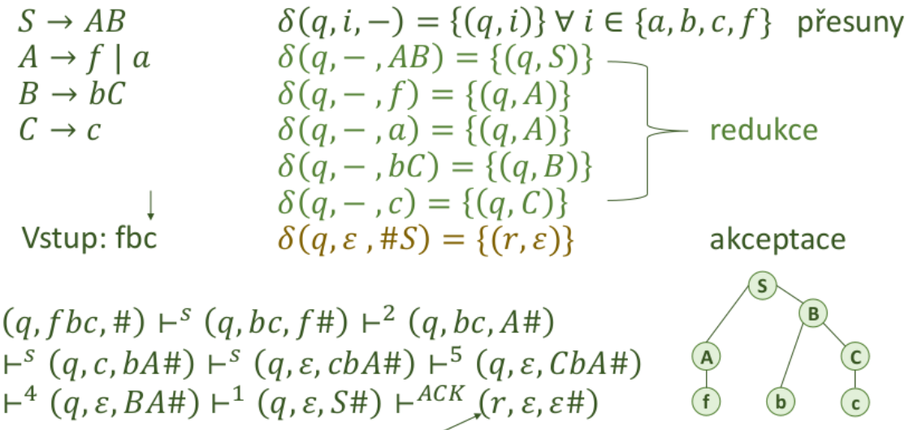

- popis tabulkou
  - jednoduche pro trivialni gramatiky (podobne jako u LL(1) - vyber podle 1 vstupu)
    - akce vybiram jen podle obsahu zasobniku (LR(0) - nerozhoduji se podle vstupu ale podle symbolu na vrcholu zasobniku)
- tabulka akci - tri akce
  1) na vrcholu zasobniku je (jen) S -> muzu akceptovat (pripadne se rozhodnout co se zbytkem; zdrojak obsahuje kod navic?)
  2) na vrcholu zasobniku je symbol stojici na konci nejake prave strany -> muzu zkusit redukovat podle daneho pravidla
  3) na vrchnolu zasobniku je neco jineho -> ctu ze vstupu (v ostatnich pripadech presun symbolu - push na zasobnik)

- tabulka prechodu - preklad mezi jazykem vstupu a jazykem zasobniku
  - nebo jako stavy konecneho automatu radice
  - mohu vkladat terminalni symboly (presun), i neterminalni symboly (pri redukci) -> sloupce N U T, radky N U T U #
    1) pokud je symbol na zacatku vetnych forem, muze byt nad dnem zasobniku
    2) pokd symbol muze nasledovat za symbolem na vrcholu zasobniku
    3) chyba v ostatnich pripadech

  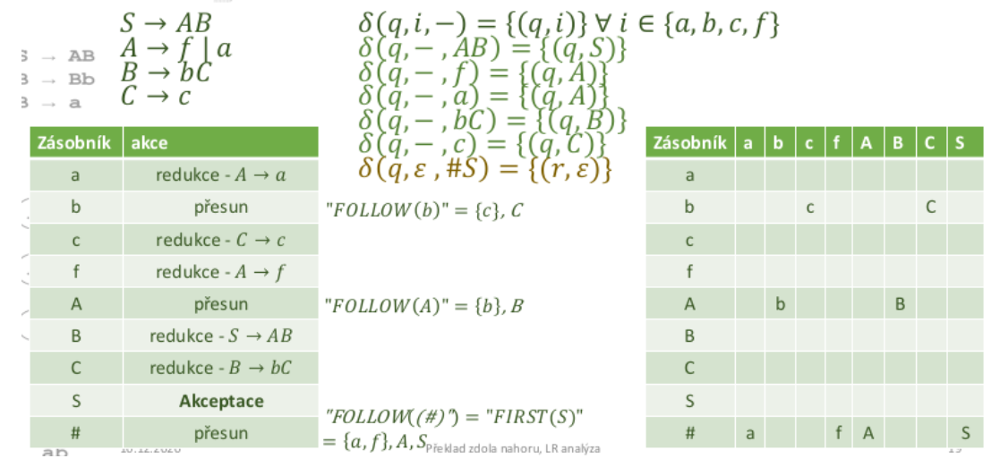

- algoritmus analyzy
  1) podle vrcholu zasobniku `X` vyber akci
        - akce presun -> precti symbol ze vstupu a jdi na 2.
        - akce redukce podle pravidla `i: A -> 𝛼` -> odstan pravou stanu `𝛼` ze zasobniku a jdi na 2.
        - akce prijeti -> pokud je vstup prazdny akceptuj, jinak zamitni
  2) je-li symbol `Y` vkladan do zasobniku
        - pokud je v tabulce prechodu pro `X`,`Y` symbol `Z`, vloz ho do zasobniku a vrat se na 1.
        - pokud je v tabulce prechodu pro `X`,`Y` chyba, skonci a vypis chybu

- akceptace podle tabulky

    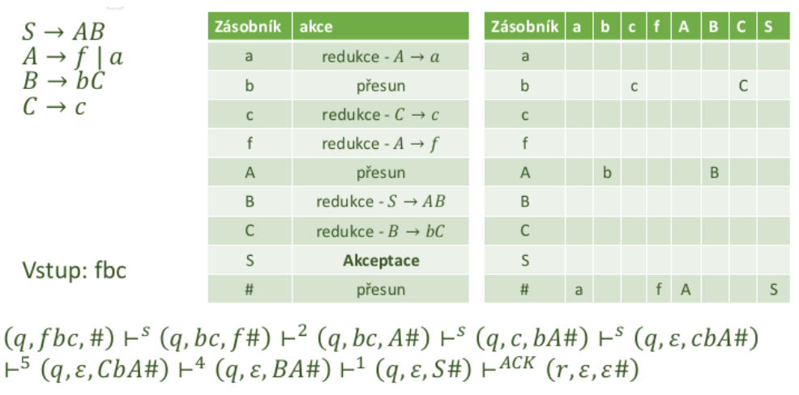

- LR(0) gramatiky
  - je treba odlisit symboly na prave strane pravidel (pokud se opakuji, lze je indexovat) - rozlisuje se jazyk zasobniku

    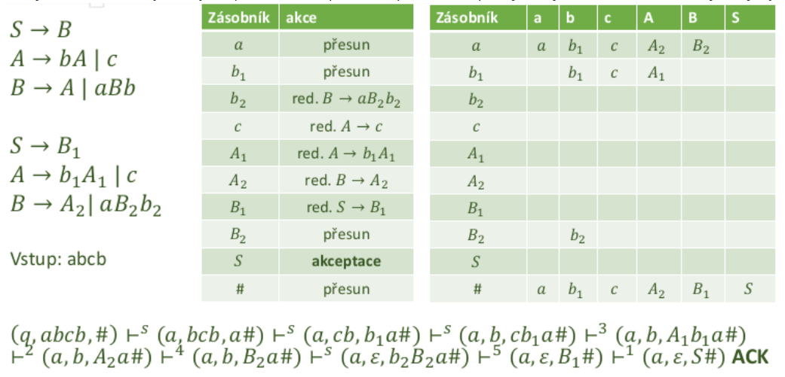

- LR polozky
  - indexovani symbolu neni moc prehledne, zejmena u slozitejsich gramatik
  - alternativni popis grafem - LR polozky
    - portrebuji najit mozne vrcholy zasobniku
    - pro kazdy vrchol popsat co ocekavam ve vstupu a jake mozne derivace mohou nasledovat

    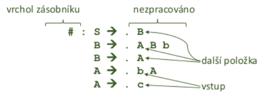

    - tecka = rozhrani mezi zpracovanou casti (zasobnikem) a nezpracovanou casti
      - vkladani symbolu (presunem i redukci) = posun tecky

- Graf LR polozek
  - vytvorene polozky Mi lze chapat jako uzly grafu (nebo funkci GOTO - cesta po hrane z jedne polozky do druhe)
  - hrana mezi polozkami podle mista odkud polozka vznikla

    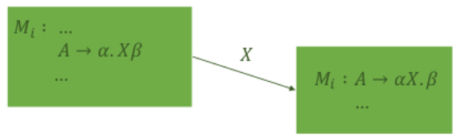

  - priklad

    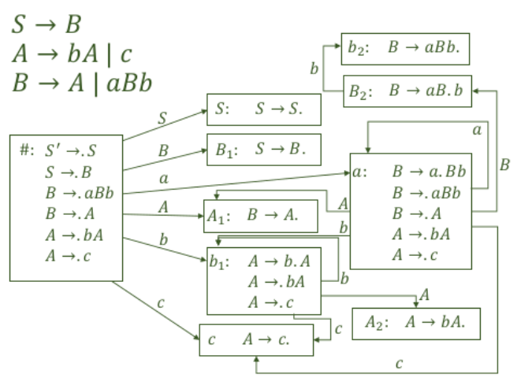

- tabulka akci LR(0)
  - radky tabulky akci i prechodu odpovidaji jmenum polozek (jmena polozek tvori jazyk zasobniku)
  - pokud je nekterem pravidle dane polozky tecka nakonci -> redukuju podle toho pravidla
    - mohou nastat i kolize (= nedeterminismus - nevim podle jakeho pravidla redukovat)
  - pokud v zadanem pravidle neni tecka nakonci -> presun do zasobniku

  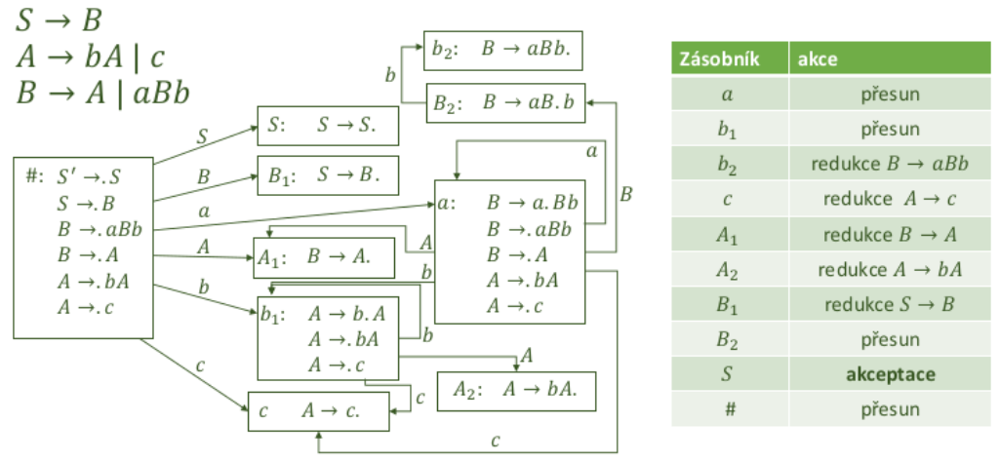

- tabulka prechodu pro LR(0)
  - napr z polozky oznacene `b1` se pres `A` dostanu do `A2`, pres `b` do `b1` a pres `c` do `c`

  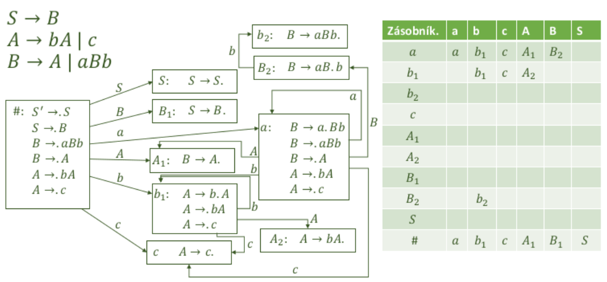

- SLR(k) gramatiky
  - co kdyz tabulku nelze vyplnit?
    - v jedne bunce jsou soucasne polozky ve tvaru
      - `𝐴 → 𝛼.`
      - `𝐵 → 𝛽.`
      - => kolize redukce-redukce (nevime podle jakeho pravidla redukovat)
    - v jedne bunce jsou soucasne polozky ve tvaru
      - `𝐴 → 𝛼.`
      - `𝐶 → 𝛾.𝛿`
      - => kolize presun-redukce - nevim jestli mam redukovat podle 𝐴 → 𝛼 nebo prijmat symbol do zasobniku
  - => zaver je ze takova gramatika neni LR(0) gramatika
    - muzu zkusit pridat dalsi informaci - symbol na vstupu -> lookahead
    - nebo hledat jinou gramatiku pro stejny jazyk

- priklad SLR(K) - gramatika pro aritmetiku

  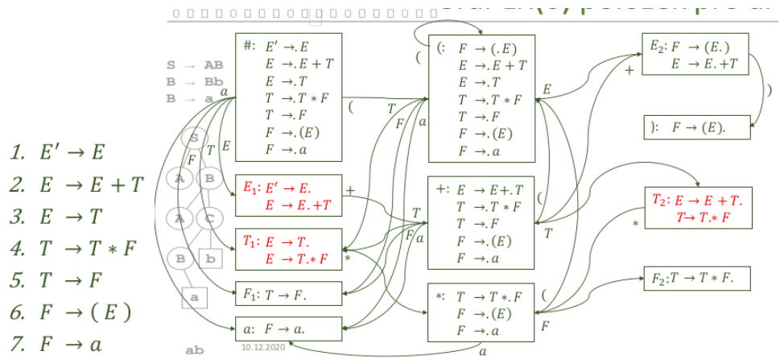

  - reseni kolizi - lookahead
    - pokud mame napriklad
      - A -> B.
      - E -> E.+T
    - tak pokud je na vstupu znak z follow(A) -> budeme redukovat podle A -> B
    - pokud je na vstupu znak z first(+T) -> budeme prijimat

- konstrukce SLR(k) tabulky akci
  - ve sloupcich jsou terminalni symboly (nebo k-dlouhe retezce a vsechny kratsi - podle delky lookaheadu)
    - s rostouci velikosti lookaheadu roste exponencialne pocet kombinaci moznych symbolu -> NEVYHODA!

  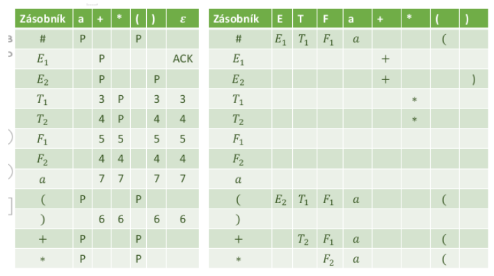

- algoritmus syntakticke analyzy pro SLR(k)
  - funguje i pro LALR(k) a LR(k) gramatiky
    - maji lehce jinak postavene tabulky, ale pracuji s nimi stejne
    - v zasade jen rozsirene podobu algoritmu pro LR(0)
  1) precti `k` symbolu ze vstupu (prvni cast slova - znacime `u`)
  2) najdi akci v tabulce akci
      - presun / redukce
  3) pokud je do zasobniku vkladan symbol `Y` (precteny) -> koukni do tabuky prechodu (= preklad vstupni abacedy do abecedy PDA), ktery symbol se ma vlozit

- LALR(k) gramatiky
  - = lookahead LR(k) gramatika (yacc, bison)
    - v mnozine LR(0) polozek muze dojit ke konfliktum (redukce-redukce nebo redukce-presun)
    - k jeho odstraneni lze vyuzit dopredne prohlizeni symbolu v LALR(k) polozkach
  - tvar polozky:
    - `𝐴 → 𝛼.𝛽, 𝑤`
    - `𝑤` je dopredu prohlizeny retezec - vsechno co muze byt za timto `𝛽`, `𝑤 ∈ 𝐹𝑂𝐿𝐿𝑂𝑊_𝑘(𝐴)`
    - obecnejsi nez LR(0) polozky, obsahuji dodatecnou informaci

- tvorba LR(0) polozek
  1) pocatecni LR(0) mnozina
      - a) vlozim pravidla vychazejici z pocatecniho symbolu (zaklad mnoziny)
      - b) doplnim pravidla jejihz leve strany jsou za teckou (= tvorba uzaveru)
      - c) opakuji dokud je co pridat
  2) pro kazdou mnozinu `Mi`
      - najdeme symboly `X ∈ N U T`, ktere jsou v `Mi` za teckou a vytvorime pro ne nove polozky `Mj`, kde `j` se postupne zvysuje nasledovne:
        - a) posouvame teckou o jedna doprava (zaklad mnoziny)
        - b) opakujeme pro vsechny Mi dokdu jde nekam neco pridat

- tvorba LALR(k) polozek pragmaticky
  - velmi podobny algoritmus jako u LR(0) polozek
  - v podstate tvorime uplne stejny graf
  - pro kazde pravidlo v polozce je treba dohledat retezec `w`
    - za "umelym" pocatecnim symbolem jazyka vzdy `e` (`S' -> S`)
    - kdyz polozka `B -> .𝛽` vznikne z `𝐴 → .B𝛼`, `u` bude za ni `FIRSTk(𝛼u)`
    - kdyz polozka vznikne posume tecky (nova polozka), zdedi jeji `u`
  - pokud se dve mnoziny LALR(k) polozek lisi jen v retezcich `w`, pak je slucuji - doplnim dalsi retezce `w`
  - gramatika je LALR(k) pokud v polozkach nejsou zadne konflikty

- priklad LALR(k)

  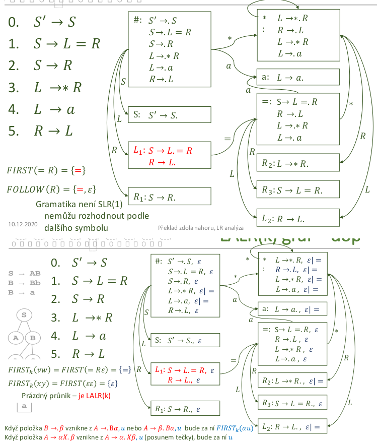

  - v pripade kolize:
    - retezce ktere mohou vzniknout za teckou se musi lisit v prvnik k symbolech
    - (to co je za teckou sjednodeno s `u` mnozinou)

- sestaveni tabulky pro LALR(k)
  - tabulka prechodu je stejna jako u LR(0) a SLR(k)
  - tabulka akci ma stejnou strukturu jako u SLR(k)
    - sloupce = retezce terminalnich symbolu
    - radky - jmena LALR(k) polozek
  - volba akci:
    - a) presun, pokud je na vstupu `k` dlouhy retezec ktery muze byt v pravidle za teckou
    - b) pokud je na vstupu to co muze byt za polozkou s redukcnim pravidlem
    - c) prijeti pokud `S'->S`
    - d) jinak chyba

  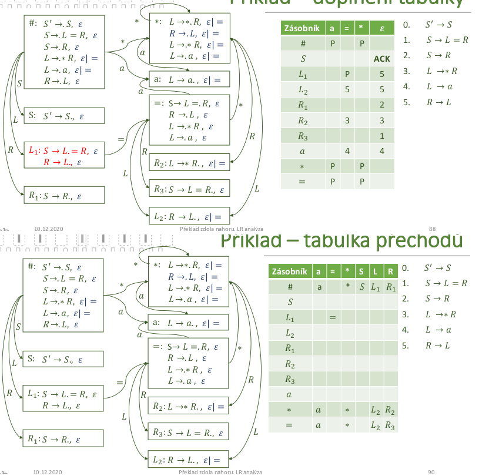

  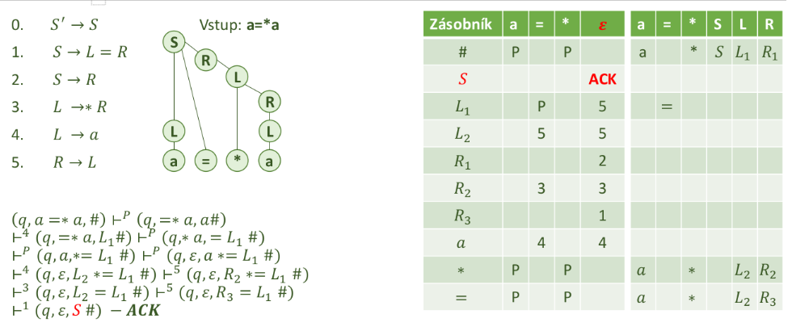

- LR(k) gramatiky
  - velmi podobne jako LALR(k) gramatiky
    - pri tvorbe grafu se neslucuji polozky se stejnym jadrem (= vznika vic polozek v grafu)
    - pokud je graf / tabulka bez konfliktu, jde or LR(k) gramatiku
    - postup akceptace je stejny jako u LALR(k)

- vztah mnozin gramatik
  - kazdou BKG lze zapsat v Greinbachove normalni forme
    - problem je ale ze to vyzaduje az O(n^4) dalsich neterminalu
  - pro kazdou BKG lze postavit zasobnikovy automat
  - muze obsahovat first-first kolize ktere nejsou odstranit -> LL analyza na to nestaci
  - pro kazdy jazyk muze existovat libovolne mnozstvi gramatik
  - jedna gramatika generuje prave jeden jazyk
  - nektere jazyky je mozne akceptovat jen nekterymi druhy automatu

  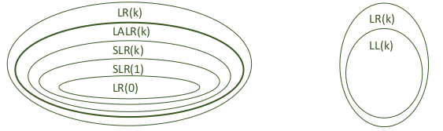
