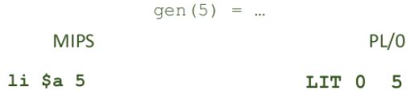
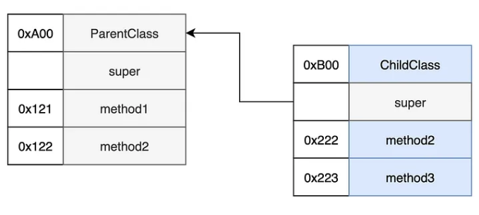

### 25 - Vnitřní jazyky překladače. Interpretace a generování cílového kódu, výhody a nevýhody obou přístupů. [KIV/FJP]

- vnitrni jazyk prekladace
  - mezijazyk
    - jedna se o formu univerzalni reprezentace (podobne jako AST)
    - AST je ale velmni abstraktni struktura nad kterou muze byt slozite vymyslet
    pravidla
    - mezavisly na cislove architektura
    - generovani mezijazyka je jednodussi nez generovani instrukci
    - mezijazyk je neco jako abstraktni assembly language
      - je blize finalni podobe strojoveho kodu
      - => abstrakce nad realizaci instrukci
      - lepe se z nej provadi finalni preklad do instrukci cilove architektury

  - postfixova / prefixova notace
    - snadne zpracovani vyrazu pomoci zasobniku (kdyz narazime na operator zpracujeme posledni dva operandy)
    - jednoducha zmena priorit (= prehozeni poradi operatoru)
    - nemusi se pouzit pouze pro aritmetiku ale muzeme je pouzit napriklad primo pro instrukce CPU - jde jen o poradi

  - jazyk ctveric
    - podobne jako instrukce CPU => lze snaze prevest do JIS (jazyka symbolickych instrukci)
    - informace o operaci: operator, operand 1, operand 2, vysledek operace
    - snadne pro zpracovani optimalizatorem (vim kde jsou data)
    - potrebuji mezipamet pro pomocne promenne (mezivysledky)
      - realne pak registry CPU
      - potrebuji mnoho mezivysledku

    

  - jazyk trojic
    - v podstate struktura AST
    - podobna strukture bez explicitni pameti pro mezivysledek
      - misto docasne promenne reference na dalsi trojici => vytvari stromovou strukturu (AST = abstraktni synktakticky strom)
    - informace o operaci: operator, operand 1, operand 2
      - vsechny operace jsou funkce dvou promennych
    - nemusim resit alokaci docasne promenne (jsou implicitni)
    - obtiznejsi optimalizace - nelze tak snadno menit poradi

    

  - Static Single Assignment Form
    - kazda promenna je deklarovana prave jednou a jeji opetovne pouziti je verzovani
    - pouziva se to ve spouste kompilatoru a prinasi to vyhody pri optimalizaci

    

- interpretace a generovani ciloveho kodu
  - generovani isntrukci se odviji od platformy
    - ruzne architektury podporiji ruzne instrukce, ruzna kodovani instrukci, ruzne zdroje (cache, sirky registru, datove typy, atd.)
    - napr. registrova vs akumulatorova architektura
  - na vetsine platforem lze simulovat zasobnikovy automat
    - zasobnik v pameti
    - akumulator
    - vrchol zasobniku
    - baze zasobniku
    - => vse v pameti nebo registru
  - na zaklade cilove architektury se prekladac musi postarat o vsechno
    - inkrementovani ukazatelu (napr. stack pointer)
      - na nekterych architekturach to muze byt automaticke
    - ukladani registru na zasobnik pri interruptu (napr. u ARMu)
    - dynamicka pamet
    - uvolnovani zasobnikovych ramcu
    - stehovani promennych na vrchol zasobniku/do registru
    - aktivacni zaznamy a dopocet adres nemusi zajistovat procesor
      - viz lazy address resolving u dynamickych knihoven
  - generovani kodu obecne
    - podobna strategie jako u rekurzivniho sestupu
      - pro kazdy fragment generuji kod, ktery
        - ma vysledek ulozeny na definovnem miste (vrcho zasobniku / akumulator)
        - uklidi po sobe vsechny nezadouci efekty
      - snadne pro aritmetiku
      - slozitejsi pro ridici konstrukce (if else, while, ...)
        - musime dopocitat adresu
          - pokud se jedna o skok v ramci jedne translation unit jinak to resi az linker
  - zpracovani konstant
    - vlozeni konstanty do pracovniho prostredi (vrchol zasobniku / akumulator)

    

  - zpracovani aritmetiky
    - pro jeden uzel AST -> jednu jednu aritmetickou/logickou operaci
    - ziskame data, provedeme operaci, vysledek ulozime zpet

    

    - poradi operaci
      - urceno
        - strukturou derivacniho stromu/AST
        - dodatecnymi pravidly pro priority a smer cteni operatoru
      - pro zpracovani vyrazu lze kod generovat rekurzivnim sestupem

  - zpracovani podminek
    - isntrukce rizeni toku programu
    - podmineny/nepodmineny skok
    - kdyz ma cilova patforma navesti (naspr MIPS), tak nemusime adresu skoku zpetne dopocitavat
    - u PL/0 nezname adresu skoku - musime ji pak zpetne dopocitat

    

  - zpracovani volani podprogramu
    - volani podprogramu je skok
      - musime najit polohu podprogramu (lze staticky)
    - navrat z podprogramu je skok
      - musim si pamatovat navratovou adresu -> nelze staticky (nevim kdo me bude volat a kolikrat)
    - navratova hodnota
      - po skonceni funkce je vysledek v pracovnim prostredi (vrchol zasobniku / akumulator); dle architektury
    - potrebuji spravovat obsah zasobniku (pokud nemam instrukce jako je call co to udelaji za me)

  - AZ (= Aktivacni Zaznam)
    - ukazatel na vrchol zasobniku -> vim kam pridavat data
    - ukazatel na bazi zasobniku -> vim kde aktualni zasobnik zacina (relativni adresy)
    - staticky ukazatel -> ukazatel na bazi nadrazeneho zasobniku
      - pristup ke statickym nadrazenym promennym
    - dynamicky ukazatel -> ukazatel na bazi volajiciho zasobniku
      - vim kde bude baze po skonceni volani aktualniho podprogramu

    

    - jedine promenne jsou parametry
      - vsechny jsou v AZ, ulozene po volani funkce
      - adresy (v tabulce symbolu) maji pevny offset k bazovemu registru
    - postup
      - vypocet baze + offset (v PL0 automaticke - instrukce LOD)
    - potrebuji tabulku symbolu a jasny mechanismus prideleni pameti

  - zpracovani deklaraci
    - nepotrebuje explicitni kod
      - pokud jde o inicializaci pri deklaraci, tak stejne jako u prirazeni
    - potrebuje prideleni pameti (zaznam v tabulce symbolu)

  - docasne promenne
    - je fajn vedet kolik mista na zasobniku potrebujeme pro docasne promenne
    - funkce `Temp(e)` = pocet docasnych promennych k vyhodnoceni `e`
      - lze vyhodnotit pro kazdy podstrom zvlast, zavisle na mechanice vypoctu
      - C++ je dobre v tom ze ma `constexpr` a `template` => hodvne veci muze vyresit uz prekladac
    - Temp(a+b)
      - pokud jsou `a` a `b` cele cisla, kolik bude docasnych promennych? => `Temp(a+b) = 1`

      

    - kdyz jsou `a` a `b` obecne vyrazy

      

    - generator kodu musi vedet kolik jich aktualne pouziva
      - musi umet najit misto pro dalsi docasnou promennou

- objektove jazyky
  - navic polymorfni chovani
    - v dobe prekladu nejsou znamy adresy skoku na volane metody (virtualni funkce)

- struktura objektu CIR (= Class Instance Record) v pameti
  - za kompilace se vytvari CD (= Class Descriptor)
    - obsahuje informace o atributech tridy
    - jake ma metody, typy, jestli jsou virtualni
    - je soucasti tabulky symbolu
    - kompilator potom pribali CD k vyslednemu programu
  - pro kazdou instanci tridy se za behu udrzuje Class Instance Record (CIR)
    - tam jsou ulozeny atributy podle offsetu definovanem v CD
    - oznaceni tridy
    - odkaz na CD
  - struktura podobna jako u zaznamu
    - atributy maji pevnou pozici vuci bazi zaznamu
    - oznaceni tridy jako cislo
    - odkaz na tabulku skoku
  - ulozeny v dynamicke pameti
    - tabulky skoku (Dispath table)
    - stejne v ramci tridy -> ne primo v CIR
    - kazda trida ma pevny seznam metod (vcetne zdedenych, pro usnadneni)
    - tabulka jako index pro adresy skoku
    - adresa metody na fixni pozici vuci bazi tabulky
  - prvni volani funkci je pomaly (slowdown at runtime)
    - => muzeme zapojit cachovani pro dalsi volani te same funkce
  - pokud objekt neni polymorfni
    - volani metody je klasicky skok na adresu => urcena typem reference (lze zjistit pri prekladu)
  - pokud objekt je polymorfni
    - mame problem
    - adresa skoku neni urcena typem reference ale typem odkazovaneho objektu
      - to nelze zjistit staticky a je to nutne resit za behu

- pozn:
  - volani metody (vztazene k nejake tride) lze realizovat tak ze funkce predpoklada ze ndekde na zasobniku nebo v registru bude odkaz na danou tridu
  - v podstate to jak to funkcuje v Pythonu (`self` parametr metody)
    - => ostatni jazyky to jen chytre nemaji v syntaxi

- tabulka skoku
  - = umoznuje ziskat adresu pro skok
  - je mozne ji vytvorit v dobe prekladu
  - najit adresu je ale nutne za behu
  - v dobe prekladu obtizne rozhodnout jake volani se provede
  - ne vzdycky je mozne staticky zjistit na co ukazuje zadana reference
  - pristup podobny jako u atributu
    - metody na fixni pozici vuci bazi tabulky
    - pri generovani kodu jde alespon urcit offsety
    - pri dedicnosti tabulka roste ve vsech radcich (pridaji se funkce rodice)

  

  

  

  

- interpretace
  - pri interpretaci neni kod generovan ale primo vykonavan
  - vykonavani interpretovaneho kodu je rizeno jinym programem => interpretem
  - casto interaktivni rezim
  - umoznuje pouziti slozitejsich konstrukci nez kompilator
  - je lepsi na ladeni (debuggovani)
  - interpretace umoznuje snaze implementovat dynamicky rozsah platnosti
    - akovy ktery se vyhodnoti az za behu programu
    - hledam nejblizsi identifikatory bez ohledu na to kdo ho deklaroval
  - efektivne spojuje tabulku symblu a zasobnik
  - tabulka symbolu je k dispozici za behu
    - => usnadneni dynamickeho zpracovani
      - volani virtualnich metod
      - dynamicky scope
      - reflexe (= umozneni programu kontrolovat a manipulovat s vlastnim kodem za behu)
        - napriklad schopnost tridy ziskat nazvy vsech jejich clonskych promennych
        - nebo treba nazev enumu do stringu
      - debugging a profiling (mame popis obsahu heapu)

- vyhody a nevyhody interpretace vs kompilace
  - interpretace je flexibilnejsi
    - umoznuje reflexi, lepsi debugging, dynamicky rozsah, ...
    - typycky jsou interprety pomaleji nez zkompilovane binarky
      - => je tam mezivrstva prekladu do strojoveho kodu navic
      - to lze resit treba JIT (= Just-In-Time) prekladem casto pouzivanych funkci
        - dynamicky preklad (JIT) je kompilace ktera se provadi behem vykonavani programu
          - tedy za behu narozdil od kompilace pred spustenim
        - = suboptimalni pokud o vyrovnani se vykonu kompilovanych programu
  - interpretovane jazyky mohou byt praktictejsi - staci jedna verze programu kterou lze spustit interprety pro ruzne platformy
