### 26 - Přidělování paměti pro data programu - způsoby, použití, související datové struktury. Volání podprogramů a předávání parametrů, řešení rekurze a paralelních výpočtů. [KIV/FJP, (KIV/PPR)]

- pridelovani pameti - zpusoby a datove struktury
  - zakladni uloha
    - v tabulce symbolu jsou identifikatory pro: promenne, konstanty
    - v pragramu: vyrazy, volani podprogramu (+ predavani vstupnich parametru), ukazatele/reference
    - v kodu: instrukce pro ulozeni/zapsani na danout adresu, instrukce pro presun mezi pameti a registry
  - => potrebuji vedet kde budou ulozena moje data (promenne, mezivysledky, parametry, navratove hodnoty, ...)

- behove prostredi
  - prace s pameti zavisy na tom kde je program vykonavan
    - jaka je architektura ALU (odkud cte, kam zapisuje)
    - jaka pamet je k dispozici (Von Neumann / Harvard)
  - typicky mam
    - oblast pro program (vetsinout staci pevna velikost pro skoky pri volani)
    - oblast statickych dat
      - k dispozici po celou dobu behu programu, pevna velikost
      - muze byt pouze pro cteni nebo i k zapisu
    - zasobnik
      - nezbytny pro volani podprogramu!!
      - vsechno co je potreba behem zivota podprogramu
      - po navratu se ztraci
    - halda
      - dynamicky alokovana pamet
      - rizena programorem nebo rucne (Garbage collector)
      - typicky pro data, ktere nemaji statickou pevne danou velikost

    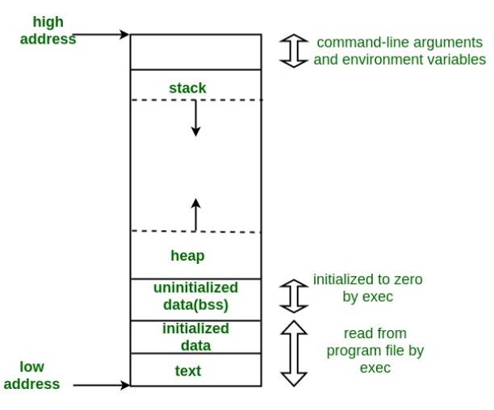

  - umisteni dat
    - lokalni promenne
      - v zasobniku, mohu je "zahodit" po skonceni jejich bloku
      - CyS => mazani lokalnich promenny a bufferu pred navratu z podprogramu
    - navratove hodnoty
      - na vrcholu zasobniku nebo na snadno nalezitelne adrese nebo v registru
    - mezivypocty
      - v zasobniku (nejsnaze ukliditelne => nepotrebuju GC)
    - staticke globalni promenne
      - pri prekladu urcit jejich velikost v pameti
      - oblast statickych dat
        - pozn: preferovany zpusob alokoace pameti v safety-critical systemech => umozneni dukladnejsi staticke analyzy
    - promenne nezname velikosti
      - napr. `std::string`, `std::vector`, atd.
      - typicky halda, ale muzou byt i na zasobniku (C ma funkci podobnou malloc, ktera alokuje data na zasobniku)
    - komunikace mezi podprogramy
      - vzdy v halde

  - kdy pridelovat
    - staticke pridelovani
      - misto v pameti urceno pri prekladu
      - staticka oblast pameti (konstanty, globalni promenne)
      - zasobnik (lokalni promenne, navratove hodnoty)
      - prekladac musi byt schopen vedet jak velka data jsou a kde budou (viz generovani instrukci)
    - dynamicke pridelovani
      - misto v pameti urceno za behu
      - muze byt v zasobniku (jednodussi - uvolnovani) nebo na halde (slozitejsi sprava)
      - potrebuji instrukce pro cteni z pameti

  - sprava zasobniku
    - uzitecny pro spravu pameti pri volani podprogramu
    - v podprogramu mam pristup
      - k lolanim promennym
      - ke globalnim datum volajiciho programu
    - sprava
      - pri interpretaci virtualnim strojem - snazsi implementace
      - pri prekladu primo - program pracuje se zasobnikem po bytech (nebo jinych jednotkach -> strove slovo?)

  - data podprogramu
    - lokalni promenne
    - parametry
    - RA (= Return Address)
    - pomocne promenne, mezivysledky
    - ridici informace pro spravu podprogramu (ulozeno v aktivacnim zaznamu)
    - data vznikaji pri volani a zanikaji po navratu
      - podobna platnost jako u tabulky symbolu

  - ridici informace pro zasobnik (aktivacni zaznam)
    - ukazatel na vrchol zasobniku (vim kam pridavat data)
    - kazatel na bazi zasobniku
      - vim kde aktualni zasobnik zacina
      - relativni adresy promennych
    - staticky ukazatel = ukazatel na bazi nadrazeneho zasobniku
      - pristup ke staticky nadrazenym promennym
      - "kdo me deklaroval"
    - dynamicky ukazatel = ukazatel na bazi volajiciho zasobniku
      - kdo me zavolal"
      - nutne pri navratu z podprogramu (vim kde bude baze po skonceni aktualniho podprogramu)

- priklad sprava zasobniku 1
  - AZ: RA, dynamicky ukazatel, staticky ukazatel
  - po skonceni podprogramu
    - `SP = BP - 1` -> uklizeni zasobniku
      - `*BP = RA` (na adrese base pointeru je ulozena navratova adresa)
    - `BP = dynamicky ukazatel`

    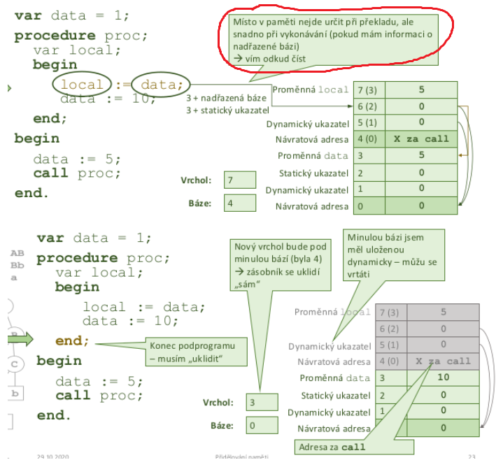

- priklad sprava zasobniku 2

  - dynamicky ukazatel = staticky ukazatl => funkce ktera podprogram deklaruje ho i vola

    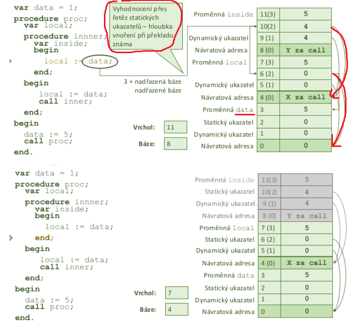

- priklad sprava zasobniku 3
  - lolani promenne v zasobniku musi mit pevnou delku (data jsou naskladane hned za sebe)

    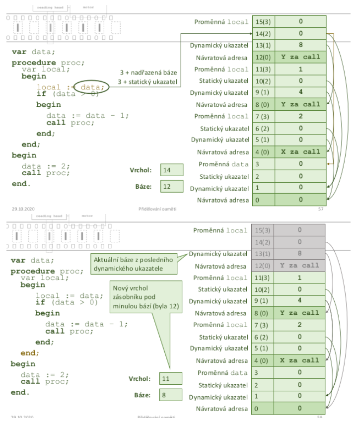

- predavani parametru
  - hodnotou
    - C/C++, Java pro primitivny typy
    - vytvoreni lokalni promenne se zadanou hodnoutou
  - odkazem
    - C++ pointery, Java pro objektovy typy
    - predava se adresa skutecneho parametru
    - => vsechny operace jsou vykonane primo nad predanou pameti
  - vysledkem
    - vytvoreni lokalni promenne se zadanou hodnotou, pred ukoncenim se hodnota zkopiruje do zdrojove promenne
    - odobne jako s odkazem, ale lokalni vypocet je jen nad kopii originalich dat

- predavani podprogramu
  - parametrem muze byt dalsi program
  - v C++ napr lambda vyrazy
    - ve skutecnosti se nevykonava kod predane funkce
    - lamba vyraz je implementovan funktor (struktura/trida s operatorem `()`)
    - => cele to vede na volani dalsi metody
  - C/C++ ma napriklad pointery na funkce, ktere lze predat jako parametr
  - nutno predat
    - adresu odkud se bude predany program vykonavat
    - platne behove prostredi (dostupne symboly)

- predavane prostredi
  - s melkou vazbou
    - plati prostedi v nemz se nachazi volani formalniho podprogramu
    - napr JavaScript
    - programaovaci jazyky s dynamickym scopem
  - s hlubokou vazbou
    - plati prostedi v nemz je predavany program definovan
    - "rodicovske prostredi"
    - Java, C#, Python, C++
    - jazyky se statickym scopem
  - s ad hoc vazbou
    - plati prostedi kde je vydan prikaz volani podprogramu jez ma za parametr podprogram
    - behove prostredi mezikroku se nepredava => predava se prostredi kde se vola funkce ktera ma jako parametr funkci kterou zavola
    - nenasel jsem priklad
    - teoreticka moznost?

    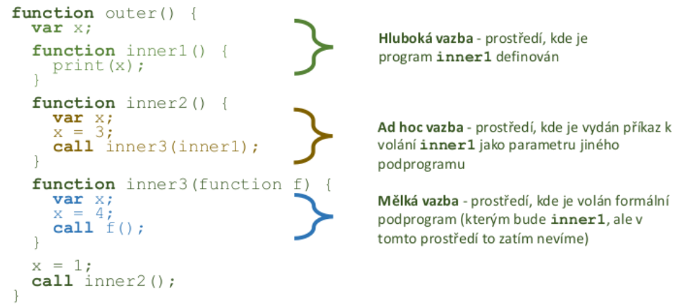

- zasobnik a paralelismus

  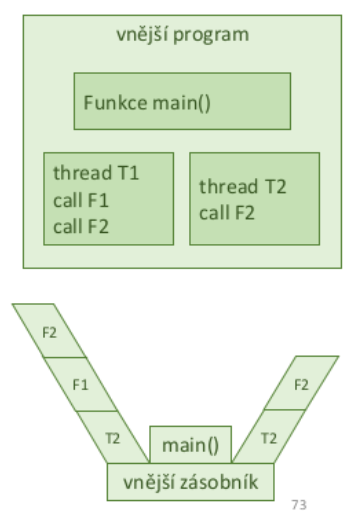

  - kazde vlakno potrebuje vlastni zasobnik
  - kazde vlakno obsahuje AZ (= Aktivacni Zazna,)
  - alezi na tom kdo vlakna spravuje - OS nebo napr Java si vlakna planuje sama (mapovani na vlakna jadra)
  - preklad netrivialnich datovych typu
    - s kazdym netrivialnim typem je spojen deskriptor
    - taticke struktury
      - deskriptor je vytvoren hned pri prekladu (vyuzitelny k adresovani)
    - dynamicke struktury
      - nektere polozky lze vytvorit az za behu
  - halda je sdilena mezi vlakny
  - OS poskytuje struktury/funkce pro exkluzivni pristup

- vyhodnoceni deskriptoru v AST

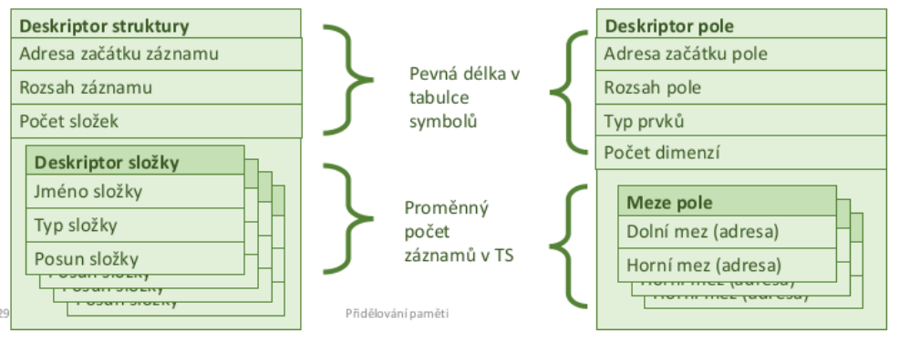

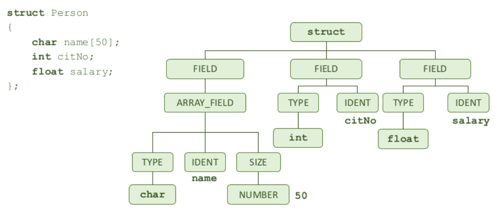

- ukladani poli - jednoduche
  - 1D pole lze alokovat v hlade i v zasobniku (pri prekladu znam rozmery)
  - adreace `arr[i] = base + (sizeof(int) * index)`
  - nD pole pevne dane rozmery ve vsech dimenzich -> lze vytvori mapovaci funkci
  - napr pro 2D: `arr[i][j] -> i * m + j` kde m je pocet sloupcu pole
  - pokud pole nema konstantni rozmery -> potrebujeme v deskriptoru uchovat zaznam o jednotlivych rozmerech abychom je mohli pouzit pri vypoctu adresy daneho prvky z indexu i, j, k, l,...

    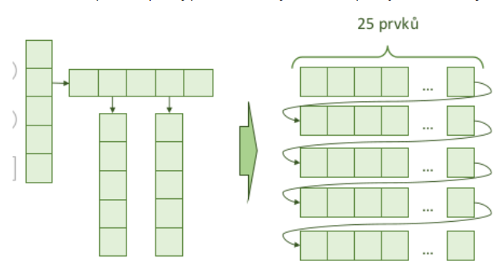

- ukladani poli - obecne
  - N-rozmerne pole s volnymi mezemi
  - deklarace v podobe array [D1..H1, D2...H2, ..., Dn...Hn]
  - stejny typ polozek v celem poli
  - jine pohledy na pole
  - napr v Jave pole poli
  - nebo "dynamicke" pole - String

    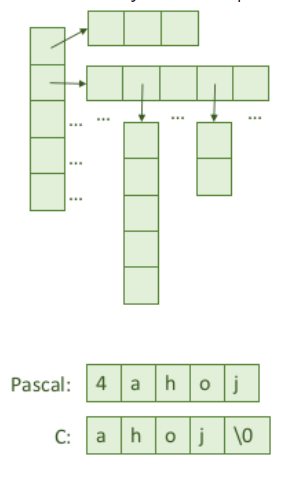

- kontrola mezi pole
  - Pascal pristup
    - velikost znama pri prekladu
    - pri kazdem pristupu generuji instrukce pro kontrolu mezi (prilis restriktivni)
      - slowdown at runtime
  - Java pristup
    - velikost pole ulozena spolu s polem
    - pri pakzdem pristupu generuji instrukce pro kontrolu mezi (meze jsou nactene dynamicky z pameti)
    - pomalejsi - nacitam vic veci
  - C pristup
    - vas problem :) - nedefinovane chovani

- obecny deskriptor pole
  1) typ prvku (pro vypocet offsetu od baze)
  2) pocet dimenzi
  3) meze indexu - horni dolni
  4) koeficienty mapovaci funkce (velikost jednotlivych dimenzi)
        - i, j, k, l, ...
  5) konstantni cast mapovaci fce (bazova adresa?)
  6) velikost pameti pro cele pole

- ukladani struktur
  - nekolik polozek ruznych typu seskupenych dohromady
    - primitivni datove typy nebo dalsi struktury
    - serazene s pevne danym poradim = indexace

    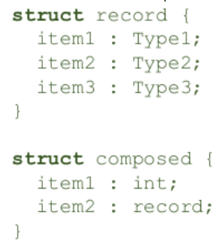

- zpracovani objektovych konstrukci
  - podobne jako u struktur, ale navic
    - dedicnosti -> potrebuju dohledavat predky
    - volani metod
  - 2 deskriptory
    - deskriptor tridy v tabulce symbolu vznika pri prekladu
    - deskriptor instance
  - pozice podle zpusobu vzniku
    - halda (new)/zasobnik

    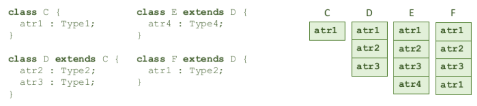

- alokace dynamicke pameti
  - z pohledu prekladace - knihovna nebo volani API OS (RTL)
    - malloc() free()
    - C++ new delete
    - Java new + GC
  - typ podle spravy pameti
    - implicitni - Java & GC
    - explicitni - C/C++
  - alokator spravuje pamet po blocich
    - bloky mohou mit ruznou velikost
    - volne nebo obsazene
    - obecne vlastnosti alokatoru
      - poradi alokaci a mazani neni dopredu zname
      - chceme co nejvyssi vykon (rychlost)
      - nesmi zasahnout do jiz alokovane pameti
      - po alokaci uz nesmi cokoliv v danem bloku presouvat (zmenily by se adresy pointeru)

        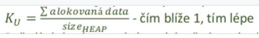

    - sledovani pridelene pameti

      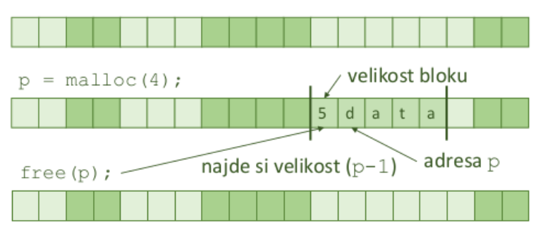

    - sledovani volneho mista
      - implicitni seznam
        - spojovy seznam vsech bloku o neznamych delkach
        - ziskanou pamet rovnou rozdeli na bloky
        - => pri hladani volneho bloku iterujeme pres vsechny bloky (volne i zabrane)?

        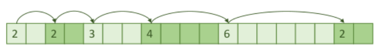

      - explicitni seznam
        - spojuje jen volne bloky
        - zalozen na dodatecnych ukazatelych
        - => rychlejsi hledani volneho bloku?

        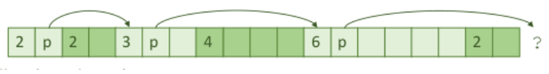

    - hledani volneho bloku
      - first fit (prvni volny)
        - od zacatku hledame dokud nenajdeme nejaky volny blok s dostatecnou pameti
      - next fit (dalsi volny)
        - nezacina od zacatku ale od toho kde napodled skoncil
        - na konci zacina zase od zacatku ("doufa" ze do te doby jiz nekdo uvolnil zabranou pamet)
      - best fit (nejvhodnejsi)
        - snazi se nalezt volny blok tak aby velikost bloku byla maximale vyuzita
        - co nejmensi free block ktery je >= nez pozadaovana velikost
        - pomale

    - fragmentace
      - interni
        - bloky jsou alokovane v urcitych velikostech / nasobcich
        - skutecny obsah muze byt mensi nez alokovany prostor
      - externi
        - bloky jsou prubezne alokovane a uvolnovane

        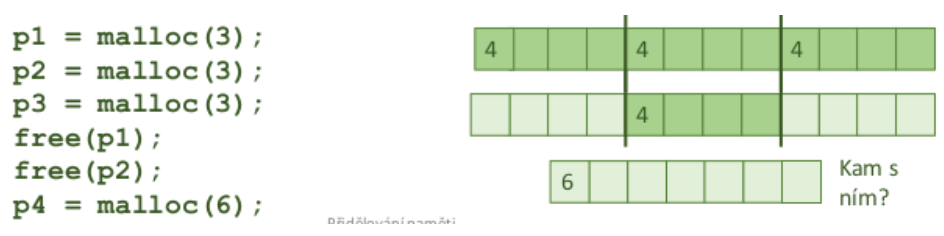

    - slucovani volnych bloku
      - pri uvolneni sleduji jestli neni nasledujici blok volny -> sloucim je
      - alternativne to jde delat pri alokaci kdyz hledame volne bloky
      - obousmerne slucovani
        - dovoluje nam slucovat bloky obema smery - muzeme prochazet od zadu i od zacatku
        - obousmerne zretezeny spojovy seznam

            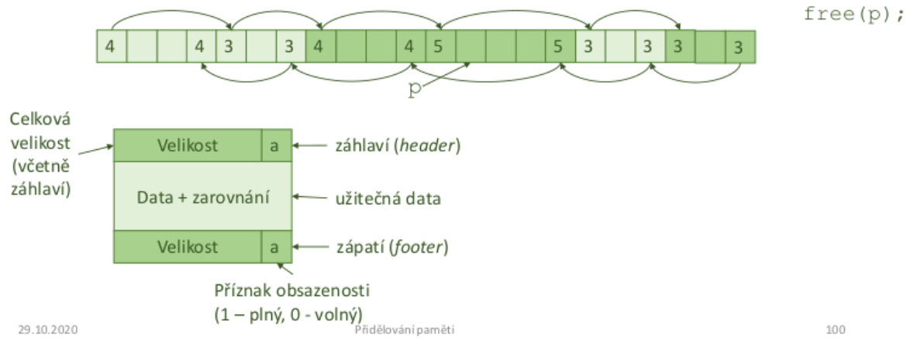

- Garbage kolekce
  - v C/C++ programech rada bugu z duvodu memory leaku (programu dojde pamet)
  - vyhoda proc je Java pouzivana na webu je ze server nespadne pokud obsahuje memory leak (naopak by tomu bylo u serveru napsanym v C)
    - JRE je napsany v C/C++ :)
  - snaha zabranit potencionalnim chybam
  - objekty jsou z pameti mazany automaticky -> jak poznat ktere smazat?
    - objekt je dostupny pokud na nej existuje reference ze zasobniku!
    - vsechny dostupne objekty lze nalezt prochazenim grafu
    - jak ale nezt ty co dostupne nejsou?
    - pozn.: pocitadlo odkazu selze v pripade ze dve instance odkazuji na sebe tu druhou ale nikdo na ne neodkazuje ze zasobniku
  - obecny postup pri GC
    - alokovat misto pro nove objekty
    - pokud misto dochazi
      - prohledat dostupne objekty
      - smazat nedostupne objekty
    - bezem hledani dostupnych objektu nesmi dochazet ke zmenam v pameti!
  - Mark and Sweep
    - prohledavanim grafu oznacim vsechny dosazitelne objekty = mark
    - projdu seznam vsech objektu v pameti a smazu ty ktere nejsou oznacene mark
      - => potrebuju si uchovavat seznam objektu v pameti (nevim jak bude dlouhy)
      - reseni: skladovat data (seznam) primo v objektech?
    - nebrani fragmentaci pameti
    - objekty se v pameti nikam nepresouvaji
    - jiny pohled na GC
      - vetsina objektu zije jen kratce
      - sledovat jejich zivotnost a na zaklade toho urcit jestli maji byt odstaneny?

    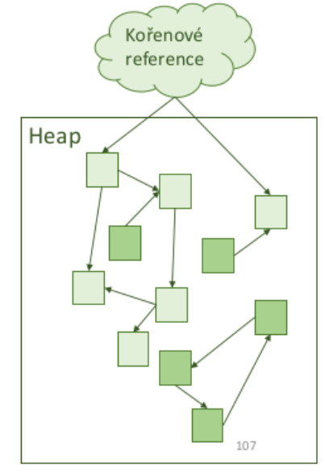

  - Stop and Copy
    - rozdelim pamet na dve casti (old space, new space)
    - pri prochazeni grafu presunu nalezeny objekt do 2. casti
    - po skonceni prohledavani muzu celou 1. cast smazat

    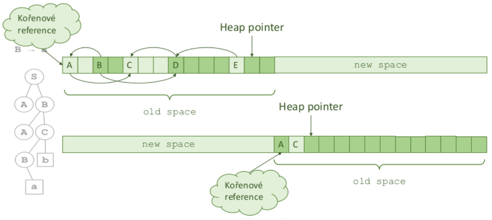

    - pri kopirovani se zmenily adresy objektu (=> nutne aktualizovat vsechny ukazatele)
    - povazovan za rychlejsi nez Mark & Sweep
    - v C by tohle bylo obtizne tim jak mam pointery (vsechny by se zmenily), Java nedovoluje primy pristup do pameti (zapouzdreno primo pres dany object)
    - dynamicka alokace vede k nepredvidatelnemu chovani

  - Pamet v Jave
    - navrzena pro efektivni implementaci Stop and Copy GC
    - muze ale implementovat vice zpusobu GC a v danou chvili se rozhodnout co je nejvhodnejsi
