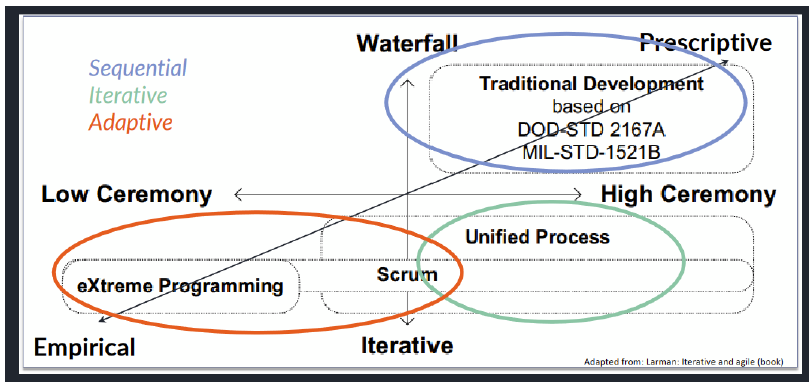
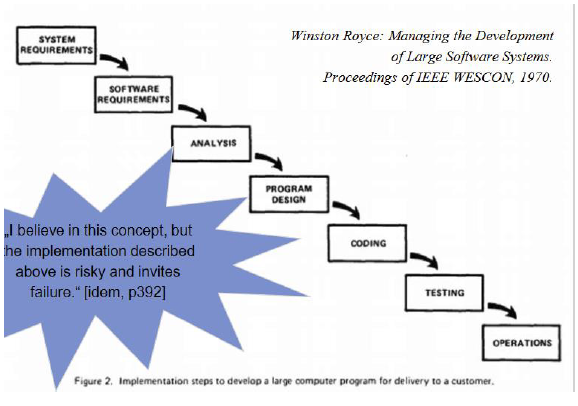
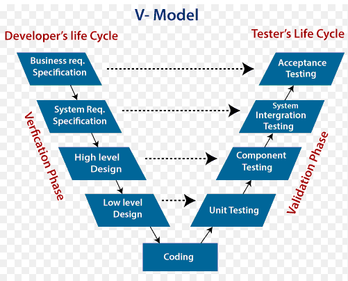
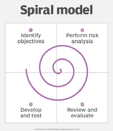
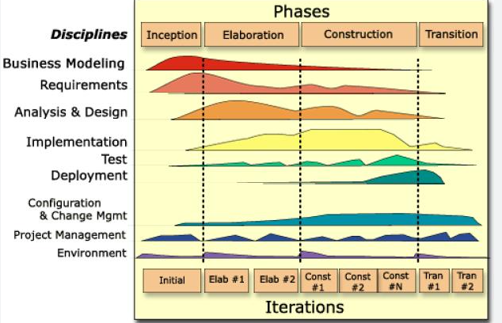
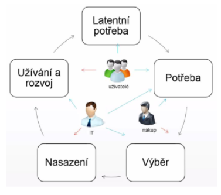

### 01 - Životní cyklus softwarového produktu (informačního systému), jeho modely a jejich charakteristiky. Softwarový proces, jeho klíčové prvky. [KIV/ASWI, (KIV/ZSWI)]

- zivotni cyklus SW produktu
  - lze obecne rozdelit na nekolik fazi
  - k jejich oddeleni pouzijeme milniky
    - faze zahajeni (konci dosazenim LCO = Life Cycle Objectives)
      - cilem je vytvorit vizi produktu (tedy vedet co vlastne delame)
        - obsah vize:
          - popis problemu a ucelu
          - stakeholders
          - prehled ocekavanych schopnosti a funkci produktu
          - omezeni, standardy, zavislosti
          - ramec planu projektu (hruby odhad)
      - mit business case (vedet ze se to vyplati)
      - mit technicky koncept (vedet ze to vubec lze technicky udelat)
        - muzeme pouzit PoC (= Proof of Concept)
        - nebo PoT (= Proof of Technology)
      - zaroven chceme mit predstavu o moznych realizacich
      - cilem je ziskat pozadavky na SW a dokumentovat je
      - pri zahajeni je nutne mit klicove pozadavky (ne nutne vsechny do detailu)
      - nutne identifikovat stakeholderes (vsechny zainterosovane osoby)
        - i treba uklizecka pokud spada do dane domeny
        - chceme mit shodu na rozsahu prace, casu jako dlouho to potrva a cene
    - faze projektovani (konci dosazenim LCA = Life Cycle Architecture)
      - cilem je se pripravit na vyvoj
      - v ramci projektovani chceme ziskat vsechny klicove pozadavky
      - chceme mit zakladni technicke reseni a mit pripravene prostredi pro realizaci
        - => infrastrukturu pro vyvojare
      - vetsina prace probiha v oblasti analyzy a designu
    - faze konstrukce/realizace (konci dosazenim IOC = Initial Operational Capability)
      - cilem je vytvorit SW, resp dostat ho do pouzitelneho stavu
      - jakesi feature-complete beta verze
      - idealne i testy
    - faze nasazeni/predani (konci dosazenim GA = General Availability, Release)
      - v teto fazi uvadime produkt do rutinniho provozu
      - => to znamena doresit nedostatky z beta testovani
      - zajistit potrebnou integraci (pripadne s dalsim SW)
      - konzulatcni cinnost
      - overit SW v provozu (napr. smoke testy)
      - zacit resit uzivatelskou podporu
    - provoz a podpora
      - primarne zajisteni provozu produktu
      - maintenance prostredi (updaty, backupy, atd.)
      - uz jede uzivatelska podpora
        - L1 podpora - uzivatelska (helpdesk)
        - L2 podpora - systemova (admin)
        - L3 podpora - aplikacni (vyvojar) - zmena kodu
      - resi veci jako zalohovani, opravy nalazenych chyb, recovery, planovani odstavky, atd.
    - vyrazeni
      - odebrani systemu z provozu/nahrazeni novym systemem
      - analyzuji se vazby na ostatni systemy -> co vsechno rozbijem
      - urci se postup vyrazeni, migruji se data, upravuje se dokumentace, napr se muze meni i konfigurace site,
      - system se archivuje a pak se vypne
      - muze probihat po etapach, najednou, nebo paralelne se zavadenim noveho systemu
      - je dulezite s touto fazi pocitat uz pri navrhu systemu!!
        - => aby byl lehce odstavitelny (viz. LCA milnik)

- takhle by v podstate fungoval vodopadovy mocel (pokud to bereme bez nejake abstrakce)
- v kontextu DevOps a CI/CD
  - faze konstrukce a nasazeni splyvaji dohromady
- iterativni metodiky nasazeni provadeji periodicky -> vhodne vyuzit prave CI/CD
  - takze neni na konci zadny big-bang kdy system najednou nefunguje
  - muze existovat bod kdy dojde k nasazeni a prejde se do podpory
- s primhourenim oka ale faze sedi
  - je potreba planovat a analyzovat pred programovanim
  - v nejakem bode je system  pripraveny na spusteni (nasazeni)
  - potom podpora neni pouze support + bugfixy ale pokracuje se ve vyvoji

- SW proces a jeho klicove prvky
  - proces = systematicka serie akci ktere vedou k urcitemu vysledku
  - sklada se z: aktivit, roli, artefaktu, nastroju a guidelines
  - aktivity
    - tecnicke - komunikace, planovani, modelovani, konstrukce, nasazeni
    - podpurne - rizeni, kontrola kvality, sprava konfigurace, dokumentace
    - veci jako ziskavani a analyza pozadavku
    - aktivity lze organizovat do workflows
    - aktivia sama o sobe neni proces
      - ale jejich poradi a vzajemne interakce uz jsou
  - role
    - technick - analytik, vyvojar, architekt, spravce konfigurace, tester, DB specialista
    - manazerske - team leader, technicky vedouci projektu, CEO, product owner (= osoba zodpovedna za zajisteni uspechu projektu; pod koho to vsechno spada? zodpovedny za spravu a optimalizaci product backlogu)
    - podpurne - konzultant, uzivatelska podpora, atd.
    - => ruzne procesy maji ruzne role
  - artefakty
  - v podstate vysledky prace
  - hotovy produkt je take artefakt
  - patri sem i technicke dokumenty (specifikace, analyzy, poznamky ze schuzek)
  - proces definuje jake artefakty jsou produktem jake cinnosti, kdo je za jejich tvorbu zodpovedny, jak jsou tvoreny (napr. v jakem nastroji) a jakou roli v procesu maji
  - mohou mit ruznou miru formalnosti
    - prespektivni metodiky maji typicky vysokou miru formalnosti
    - empiricke a agilni metody maji miru formality spojenou s dulezitosti dokumentu
      - napr. delivery email asi bude dost formalni? ale poznamky ze schuzky zas tak moc asi ne?

- proces vs metodologie
  - proces = obecny koncept
  - metodologie = specificky proces pro konkretni druhy projektu
    - implikuje proces
  - projekt = instance procesu
  - typicky u procesu merime cyklicknost, rigiditu a ceremonii jako tri ortoginalni dimenze

- stupne volnosti pri planovani
  - = cas, zdroje, rozsah, kvalita
  - klasicke modely
    - sekvenci, necyklicke, rigidni procesy (napr. Waterfall nebo V-model => pouziti v automotive)
    - rozsah pevny, cas + zdroje planovatelne
    - obtizne meritelne, odhadovane
    - kvalita spatne riditelna (v takovem case za takove penize v nejlepsi kvalite)
    - typicky statni zakazky
  - iterativni modely
    - napr. RUP, Scrum nebo Agile
    - cas + zdroje jsou pevne, rozsah je planovatelny
    - nejlepsi faktor pro rizeni projektu
    - vhodna granularita => snadne a presne odhady
      - muze byt prizpusobana dane metodice

  

- sekvencni procesy
  - napr. vodopadovy model nebo V-model
  - funguji pouze pokud jsou pozadavky jasne, scope rozumny a kontext stabilni
  - faze jsou oddelitelne prediktivni
  - kdyz se pri testovani neco pokazi => musime se vratit do predchozi faze

  

  

- iterativni procesy
  - hlavni aktivity se cyklicky opakuji
  - produkt je vyvijen napric iteracem
    - kde kazda iterace je svym zpusobem forma vodopadu
  - => umoznuje flexibilnejsi vyvoj
    - lepsi reakce na zmeny pozadavku
    - funguje dobre pro velke komplexni projekty
  - napr. DAD, RUP (= Rational Unified Process) nebo napr. spiralovy model se zamerenim na kontrolu rizik
  - projekt je planovan predem
    - ALE reaguje na zpetne vazbu z jednotlivych iteraci

    

    

    - u RUP modelu je myslenka takova ze se aktivity rozpinaji pres vsechny faze projektu (nekde vic nekde min ale furt tam do jiste miry jsou vsechny => zpetna vazba z ruznych uhlu pohledu)

- adaptivni procesy
  - = forma iterativnich procesu
  - vyznacuji se tim ze je proces modifikovan dle potreby v prubehu projektu
  - planovani je adaptivni
  - procesy jsou spektrum
    - extremne adaptivni proces je XP
  - spada sem ale i DAD nebo Scrum ktere ale nemusi byt fluidni v jejich forme v ramci projektu
  - jako vysoce adaptivni metody lze oznacit Kanban nebo DevOps
  - klade se duraz na zpetnou vazbu a komunikaci se zakaznikem
  - velmi dobre reaguji na zmeny prostredi a pozadavcich
  - take lze rict ze deadliny jsou vetsi prioritou nez scope
  - podle PMBOK jsou adaptivni procesy kombinaci iterativnich a inkrementalnich pristupu
    - PMBOK
      - = souhrn znalosti o tom jak delat projekty
      - mezinarodne uznavany standard rizeni projektu
      - zakladem jsou rozpoznatelne znalostni oblasti
        - sada pojmu, poznatku, procesu, technik, ktere tvori oblast projektoveho rizeni
  - vhodne pro relativne male projekty
    - lze je ale usporadat do hirearchicky vyssich procesu kde adaptivni proces vyvoje je pouze jednou z konponent vyvoje SW systemu
    - jine faktory jako mechanismus planovani a definice fazi projektu ho doplnuji

- s danymi procesy jsou spojeni i delivery strategie
  - one-time
    - funguje pro male projektu, jasne a stabilni pozadavky
  - inkrementalni
    - zpetna vazba od zakaznika je zarazena do vyvoje
    - postupne pridavame funkcionalitu
  - evolucni
    - funguje dobre kdyz jsou pozadavky nestabilni (meni se)
    - vydavame ruzne evoluce/modifikace daneho SW
  - kontinualni
    - porad (kontinualne) neco dodavame (napr na konci kazde iterace)
    - pouziti CI/CD

- zpohledu EITM

  

  - zacne to latentni (skrytou) potrebou uzivatelu mit nejakou funkcionalitu
  - z toho vykrystalizuje pojmenovana potreba
  - pri vyberu se hledi na to jaky prinos bude mit konkretni reseni pro uzivatele (IT resi architekturu a integraci, technicke reseni, bezpecnost, atd)
  - management resi cenu
  - IT to pote nasadi
  - po nejake dobe -> inovacni cyklus ci trvale odebrani systemu
  - planovani IS
    - identifikace potreb
    - vnitrni vlivy (strategie firmy, fuze - muze vest ke sjednoceni vicero systemu)
    - vnejsi vlivy - legislativa (napr zavedeni EET - nutne reagovat)
    - planovani financi a zdroju (napr kde se system nasadi atd)
    - koordinace projektu - ve firme toho muze bezet spoustu a je potreba to nejak koordinovat
    - zpusob porizeni - krabicove reseni vs reseni na miru?
  - analyza IS
    - detailni analyza potreb, funkci, parametru - muze byt casto obtizne
    - ustanoveni realizacniho tymu, pracovni skupiny - u velkych zmen (velkych systemu) na analyze pracuje cely tym
    - identifikace omezeni - napriklad finance, cas, lide, atd.
  - vyber reseni a dodavatele (nakup)
    - poptavka
    - vyberove rizeni
  - dodavka, implementace IS
    - implementace - dny az roky
    - soucinnost
    - customizace
    - integrace se stavajicimi systemy
    - migrace dat
    - QA (= quality assurance testing), testovani
    - UAT (= uzivatelske akceptacni testy)
    - zaskoleni lidi
    - predani
  - postimplementacni podpora
    - doladeni systemu (tydny az mesice)
    - L1 (helpdesk), L2 (admin), L3 (vyvojar, zmena kodu)
  - provoz a podpora
    - radove roky
    - implementace dilcich zmen
    - aktualizace, patchovani bezpecnostnich chyb a bugu
    - monitoring (vykon, spolehlivost)
    - helpdesk, servicedesk, ITIL
      - helpdesk = zameren na bug-fix
      - servicedesk = zameren i na RQI a request for new services
    - reportovani chyb
    - sledovani nakladu (cena za energii a provoz)
  - ukonceni, migrace
    - doziti
    - zamrazeni investic
    - priprava akvizice noveho systemu
    - casto opomijena faze zivotniho cyklu IS (musi byt brana v potaz uz pri navrhu aby bylo na konci jednoduche vyradit system z provozu)
