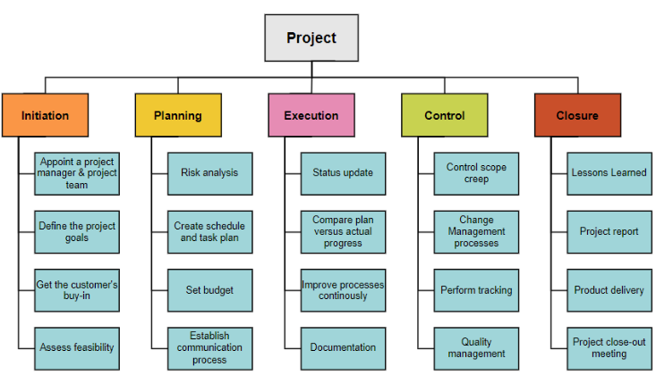

### 02 - Iterativní vývoj software, jeho prvky a postupy, výhody a nedostatky. Příklady iterativních metodik, jejich složky a fáze. [KIV/ASWI]

- iterativni vyvoj SW je jistym zpusobem reakci na menici se kontext SW vyvoje
  - doslo k prechodu od "jednoduchych" projektu kde stacil vodopadovy model ke komplexnim projektu s menicimi se pozadavky => na to vodopadovy model neni schopny reagovat
  - vidi proces vyvoje SW jako posloupnost iteraci
    - => jednotky prace ktere cca odpovidaji vodopadovemu modelu a ve kterych se vyskytuji prislusne aktivity
      - aktivity provadene v ramci iteraci se v principu nemeni
      - ale jejich podil na celkovem case se meni v zavislosti na fazi vyvoje (viz RUP model)
  - cilem iterace = iteracni release
    - produkt z pohledu pozadavku neuplny (neobsahuje veskerou funkcnionalitu) ale funkcni a otestovany
  - zaroven iterativni pristup ma pozitivni psychologicky  vliv
    - scope iterace je maly
    - takze cil je jasny a jeho splneni je relativne rychle
  - navic byva horsi prekrocit deadline nez vypustit funkcionalitu

  

  - jedna iterace se typicky sklada z
    - planovani
      - stanoveni cilu iterace (jakou funkcionalitu budeme implementovat)
    - zpresneni pozadavku
      - pokud se pozadavky meni -> upravit je (napr. podle feedbacku)
      - pripadne je zpresnit pokud se najde nejasnost
        - => muze nasledovat uprava navrhu
      - prvek adaptibility - reakce na zapetnou vazbu
    - implementace
      - typicka programovaci cast
    - verifikace overeni
      - provedeni testu na strane vyvojoveho tymu
      - prochazi testy dle specifikace?
    - validace (nasazeni)
      - validace zakaznikem = delat to co jsem chtel?
      - poskytnuti verze SW zakaznikovi (tzv. customer demo)
      - pripadne nasazeni do provozu
    - retrospektivy
      - ziskani zpetne vazby zakaznika
      - retrospektiva, zhodnoceni prace, co by slo v pristi iteraci udelat lepe?

- iterace
  - iterace mohou mit ruznou delku
    - typicky jsou preferovane kratsi delky => umozneni vetsi flexibility
    - zarovne ale myslet na to ze iterace maji jistou rezii
      - meni se v zavislosti
    - typicky se jedna o rozmezi 2-6 tydnu (zalezi na velikosti projektu a zvolene metodice)
  - pocet iteraci se odvidi od velikosti projektu
  - uzavrena zmenam zvenci => nutne pro stabilitu
  - vzdy pevne datum ukonceni
    - naplanovane nejpozdeji na zacatku iterace
    - => jeji delka je znama predem

- iterativni vyvoj lze zasadit do sirsiho kontextu vyvoje SW
  - viz faze LCO, LCA, IOC, GA
  - => charakter prace se meni v zavislosti v jake fazi se projekt nachazi
  - zakladni schema zustava, ale pomery cinnosti a produkovane artefakty se meni
  - navic to umoznuje videt vyvoj v kontextu projektu a nesoustredit se pouze na aktualni praci
  - napr. RUP (= Rational Unified Process)

  

- iterativni pristup k vyvoji umoznuje predejit tzv. "late design breakage"
  - fenomen typicky pro vodopadovy model
  - v pozdejsi fazi projektu se projevi potencialni spatna rozhodnuti uskutecnena na zacatku vyvoje
  - zaroven umoznuje lepe odhadovat parametry projektu jako je cena a cas => to vse diky zpetne vazbe

- iterativni vyvoj klade duraz na schopnost reagovat na zmenici se prostredi, inkrementalni dodavani funkcionality a zpetnou vazbu od zakaznika
- ridicimi faktory jsou rizika a uzivatelske (zakaznicne) priority!

- UP (= Unified Process)
  - framework ktery implementuje nekolik metodik jako RUP, OpenUP nebo AgileUP
  - RUP
    - definuje 4 faze projektu (LCO, LCA, IOC, a GA)
    - zakladnimi jednotkami RUP jsou role, artefakty a tasky
    - tasky jsou deleny do 9. kategorii
    - klade duraz na testovani, spravu pozadavku, komponentovou architekturu a iterativni vyvoj za ucelem snizeni rizika

- Scrum
  - myslenka je takova ze aplikovani stabilni a detailni metodologii na vyvoj SW ve vysledku selze
    - protoze vyvoj SW neni stabilni (viz zmeny v pozadavcich)
    - "potrebujeme nestabilni (agilni) nastroj na vyreseni nestabilniho (agilniho) problemu?"
  - => je potreba pristup ktery umozni dostatecnou miru flexibility a ktery umozni tymum dostatecne operovat v komplexnim prostredi za pomoci nedokonalych procesu
  - Scrum definuje nekolik roli
    - Scrum master
      - zodpovedny za provadeni scrumu
      - reprezentuje management projektu
      - ma za cil mit funkcni a produktivni tym
      - zajistuje izolaci tymu od externich vlivu!
    - Product owner
      - osoba zodpovedna za produkt a jeho ROI (= Return on Investment)
      - reprezentuje zajmky zakaznika, prioritizuje, rozhoduje obsah a vydani
      - definuje featury a akceptuje/odmita vysledek prace
    - Team
      - teamy jsou cross-functional (mezidiscriplinarni)
      - samoorganizujici se jednotky
  - sprint je izolovan od zmen (stejne jako iterace)
    - jeho obsah a casovy odhad je odpovednosti tymu
    - na konci sprintu se pak resi DoD (= Definition of Done), provede se review a retrospektiva
      - review = review prace ktera byla naplanovana pro dany sprint
      - retrospektiva = sdileni pocitu, hodnoceni jak se nam darilo, co zlepsit, atd.
  - neni dobre skalovaleny na velke tymy
    - ale lze ho do jiste miry abstrahovat na tymy tymu

- XP
  - jedna z prvnich popularnich iterativnich metodik
  - klada duraz na testovani => zpusob eliminace defektu
  - problem je omezena moznost skalovani a mala moznost ceremonie

- planovani
  - v ramci vyvoje SW je podstatne planovani
    - prediktivni
      - = harmonogram praci az do konce projektu
      - vodopad - jasne definovana linearni faze
      - typicke pro sekvencni modely
      - nese sebou velkou miru nejistoty
        - co kdyz napr. nekdo onemocni?
        - mnoho neznamych a menicich se pozadavku
      - vetsinou u smluv o dilo (pevne dany cas a rozsah)
    - adaptivni
      - planujeme pouze to co muzeme a odhady postupne zpresnujeme
      - iterace zahrnuje maly zivotni cyklus jehoz dulezitou casti je i planovani dalsich iteraci
      - jsou tu dva problemy - narocnost a orientace
        - je potreba mit kvalitni management
        - zaroven ale muze proces pusobit z venku chaoticky -> pridame milniky ktere jsou snaze uchopitelne
  - klasicke planovani operuje s fixnim rozsahem
    - => planuje se cas a zdroje
    - => mensi flexibilita a obtizne riditelna kvalita
  - agilni planovani ma cas a zdroje pevne
    - => planuje se rozsah (= nejlepsi riditelny faktor)
      - nez treba omezit rozpocet nebo to dodat co nejdriv

  - rozsah
    - = mnozstvi funkci a jejich charakter
    - souvisi se sberem a analyzou pozadavku
    - lze reprezentovat pomoci WBS (= Work Breakdown Structure)

      

  - kvalitu kontrolujeme podle DoD (= Definition of Done)
    - = definice toho co musi cast projektu splnovat aby mohla byt prohlasena za hotovou

      

  - je potreba resit cas
    - pouzivame metriky jako MH (= man hour) nebo story points (obodovani dle narocnosti)
    - je treba odhadovat pracnost - dobu a zdroje
    - to delame na zaklade rozsahu a kvalitativnich pozadavku (vize), zpusobu a kvality realizace (DoD), dostupnych zdroju a zkusenosti
    - odhadovani pracnosti
      - analyticky
        - napr. na zaklade WBS
      - adaptivne
        - planning poker - anonymni odhad pracnosti pomoci karet cislem dolu
        - predchazi kognitivnim biasum
        - kazdy za sebe anonymne napise jak moc si mysli, ze je to narocny?
      - odhadem
        - = na zaklade zusenosti
      - vypoctem
        - COCOME = model pro planovani odhadu v SW projektech
  
  - odhad ceny
    - casto se odviji od odhadu casu
    - zahrnuje ale i infrastrukturni polozky nebo rozhodnuti typu make vs buy (nebude nakup krabicoveho reseni vyhodnejsi?)

  - dale je treba zjistit navaznost aktivit
    - jejich poradi a termin dokonceni
    - pouziti nastroju jako
      - CPM (= Critical Path Method)
      - Gantt
        - pri vetsim poctu aktivit je prehlednejsi nez CPM

        

      - PERT (= Program Evaluation and Review Technique)
        - pouziva se k rizeni slozitych akci majici nahodnou povahu
          - doba trvani akce se chape jako nahodna velicina
        - je to zobecneni kriticke cesty
          - nejkratsi doba projektu ktera je realna => kdykoliv prodlouzim task ktery je na kriticke ceste dojde k prodlouzeni celeho projektu
  
  - alternativne se muzeme ridit riziky
    - zacit s tim kde je nejvetsi riziko a vcas ho eliminovat
    - v agilnich metodikach je podstatne rizeni pozadavky zakaznika

  - rizeni rizik
    - prime (projekt ma velkou miru kontroly)
    - neprime (projekt nema skoro zadnou kontrolu)
      - viz koronavirus nebo statni narizeni
    - rizika popisujeme jeji ppsti a dopadem
  
  - dale je potreba prioritizovat tasky
    - cilem je implementovat podstatnou (kritickou) funkcionalitu a neimplementovat hned ty nepodstatne
    - prioritizace se ridi napr. pomoci MOSCOW
      - M = must have
      - S = should have
      - C = could have
      - W = won't have

- planovani v iterativnim vyvoji
  - na zacatku hruby plan, postupne zpresnovani
  - milniky mohou projekt rozdelit na faze
    - kazda obsahuje urcity pocet iteraci
  - iterativni metodiky planuji na zacatku projektu (v ramci faze inception = zahajeni) a pote na zacatku kazde iterace
  - cilem planovani iterace je urcit cil iterace
  - typicky se planuje nejpozdeji v prvnim dni iterace
  - je potreba odhadnout pracnost a vybrat pozadavky
    - pozadavky je pak treba rozdelit na jednotlive ukoly
  - plan iterace je pak finalizovat a commitnut
    1) vysledek iterace - business value, cil
    2) vyber pozadavku - pozadavky co podporuji cil
    3) zpresneni pozadavku a odhad pracnosti - rozpad na ukoly, DoD
    4) urceni praci - kdo bude delat co, co je jak dulezite
    5) vytvoreni planu - artefakt

  - presnovani pozadavku muze probihat podle nejake metody
    - podkladem je specifikace pozadavku a zkusenosti
    - vysledkem je pak rozpad pozadavku na tasky
      - task je konkretni zadani
      - je nekomu prirazeny
      - ma odhad pracnosti
      - muze souviset s dalsimi tasky
  - tradicne se vytvari plan iterace
    - = formalni dokument ktery obsahuje popis cinnosti, jejich narocnosti a organizaci aktivity

  - agilne se pouziva backlog
    - produktovy
      - obsahuje ukoly na vyssi urovni abstrakce (epics (hlavni ukoly/problemy) a user stories = pozadavky na produkt)
      - reprezentuje pozadavky na vysledny produkt
      - jeho obsah je rizen "backlog groomingem"
        - v podstate schuzkou kde se projdou jednotlive polozky
          - provede se reprioritizace, odstranovani nebo pridavani
    - iteracni
      - reprezentuje plan iterace
      - obsahuje stories a tasky
      - jeho obsah je definovan pri planovani iterace pomoci planning game
  - plan iterace muze mit vice forem
    - graf typu PERT nebo Gantt
    - WBS
    - backlog
    - dokumenty (plan iterace, plan projektu, atd.)

- sledovani prubehu iterace
  - je potreba vedet co uplne nevychazi jak by melo, ridit rizika, reagovat na zmenu
  - existuji metody - metriky, reporting, komunikace
    - komunikace je klicova -> schuzky (deaily standup v agilnich metodikach)
    - metrika burndown chart - jak rychle ubyva prace oproti planu
      - typicky v ramci jedne iterace

      

  - na zaklade prubehu iterace lze pak resit upravy postupu - opatrne
  - zmeny uvnitr iterace jsou obecne nedoporucovany az na vyjimky
    - mezi iteracemi je idelani cas na to delat upravu planu (viz retrospektiva?)

- jsme schopni planovat iterace ale nevime jak moc dopredu
  - zakaznik se pta kdy bude hotovo ale my vime co bude hotovo za iteraci nebo dve
  - k tomu slouzi metriky vykonnosti typu
    - team velocity = prumerna hodnota za poslednich `n > 2` iteraci kterou pak muzeme pouzit pro prjekty do budoucna
      - napr. kolik stry pointu/tasku zvladneme prumerne za itraci

      

- neco z EITM
  - projekt
    - = docasne usili podstoupene s cilem vytvorit unikatni produkt, sluzbu nebo vysledek
    - casove, nakladove a zdrojove omezeny proces koordinovanych cinnosti
    - projektovy trojuhelnik: cas, naklady (zdroje), kvalita
      - dve strany trojuhelnika urcuji tu 3. (obsah trojuhelnik = rozsah)
  - projektovy management
    - proces ve kterem se vyuzivaji zdroje k realizaci projektu
    - jedna se o zpusob planovani a realizace aktivit, tak aby bylo dosazeno nadefinovanych cilu
  - proces vs projekt
    - proces = znama OPAKOVANA cinnost (zname postup i reseni)
    - projekt = unikatni, prvek neznama, nezname reseni/postup jak dousahnout cile
      - projekt je instanci procesu?
  - artefakt
    - entita, ktera vznikla behem projektoveho rizeni
    - dokumenty, grafy, kod, meziprodukty, dema, ...
    - typy artefaktu jsou typicky definovane zvolenou metodikou (RUP, Scrum, ...)
  - milnik (milestone)
    - pevne stanovena mista v planu projektu, ukazuji projektovy pokrok!
    - vetsinou po dokonceni faze projektu
  - kriticke faktory uspechu
    - podpora vedeni - top management commitment
      - zajisti potrebne zdroje, schvaleni unikatnich potreb
      - zajisteni soucinnosti lidi z cele organizace
    - zkuseny PM (= project manager)
    - jasne cile
    - minimalizace rozsahu
    - standardni prostredi
    - formalni metodika
    - spolehlive odhady
    - zapojeni uzivatelu (stakeholderu)
    - dobra KOMUNIKACE!
  - faktory neuspechu
    - nerealisticke terminy (prilis optimismu)
    - menici se pozadavky (=> proto zavadime agilni metodiky)
    - malo zdroju
    - rizika (predvidatelna i nepredvidatelna)
      - dovolena vs koronavirus
    - spatne projektove rizeni, komunikace, rizeni zmen
    - technicke obtize (nejsou na 1. miste; tam je spatna komunikace)
  - metodiky rizeni projektu
    - metodika
      - zpusob rizeni projektu (postup?)
      - cilem metodiky je zvysit ppst uspechu projektu a snizit riziko ze bude spatne rizen
      - "vim, co mam delat" + "delam to co mam delat" + "umim to odlozit"
    - slozeni metodiky
      - principy-koncepty
      - procesy
      - praktiky
      - role
      - artefakty
      - nastroje
    - priklady
      - waterfall, iterativni (RUP), agilni, lean (LSD = lean sw development = snazi se identifikovat a eliminovat zdroje plytvani v prubehu celeho vyvojoveho procesu)
