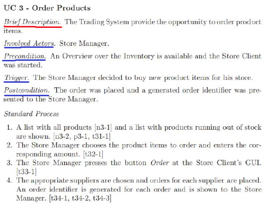

### 03 - Definice účelu softwarového produktu. Metody získávání a definice požadavků, související dokumenty, modely a standardy. [KIV/ASWI, (KIV/ZSWI, KIV/EITM)]

- faze zahajeni koncici milnikem LCO (= Life Cycle Objectives) ma za cil definovat ucel SW produktu
  - = vize produktu (ucel a duvod projektu z hlediska zainteresovanych osob = stakeholderu)
    - popis problemu a ucel (ekonomicka navratnost = ROI)
    - seznam stakeholderu
      - kdo investuje, kdou jsou zakaznici, kdo jsou programatori, atd.
    - seznam rizik (cim drive je identifikujeme tim lip abychom se je mohli pokusit eliminovat)
    - omezeni, standardy, zavislosti
      - vztahujici se k projektu nebo treba i k produktu viz kontextove diagramy
      - napr. vyhlasky zakonu, standardy napr. komunikacni protokol atd.
    - klicove pozadavky (co produkt ma umet - popis, priority; ne treba zabihat do detailu)
      - napr. system bude umet spravu uzivatelu - jeste ale neresime konkretne jak
    - plan projektu, komunikacni plan, plan rizeni zmen
      - casovy rozsah, planovane verze / vydani

- faze konstrukce koncici milnikem LCA (= Life Cycle Architecture) se take na definici ucelu podili protoze v ni probiha shromazdovani pozadavku
  - ted jiz detailnich

- definice systemu - strucny popis ucelu
  - vyjadruje cil projektu
  - soulad zakaznik-dodavatel
  - definovat rozsah (zabranit velkemu odchyleni behem vyvoje)
  - take je to banchmark pro zhodnoceni uspesnosti projektu
  - muzeme napr. sledovat to jestli nase aktivity odpovidaji tomu jak to ma vypadat v RUP (= Rational Unified Process)
  - s definici systemu muze souviset business case
    - soucast vize a rozsahu nebo treba studie proveditelnosti
    - specifikace pozadavku
      - detailnejsi nez definice systemu
    - technicky koncept (PoC, PoT)

  

- MVP (= Minimum Viable Product)
  - nejmensi mnozina funkci potrebna na to aby byl produkt pouzitelny!
  - odpovida kriteriim uspechu projektu
  - muze slouzit jako forma "fail early"
    - = ziskani zpetne vazby zakazniku v momente kdy uz to dava smysl ale porad se nepropalili vsechny zdroje

- metody ziskavani a definice pozadavku
  - v ramci zahajeni (LCO) je podstatne ziskat klicove pozadavky
  - v ramci konstrukce (LCA) je pak potreba mit podsatne pozadavky uplne => pote dochazi k jejich zpresnovani
  - pozadavek
    - = schopnost nebo vlastnost kterou ma SW mit aby jej uzivatel mohl pouzivat k vyreseni problemu ktery puvodne vedl k zadani nebo aby splnil podminky dane smlouvou, standardem nebo jinou specifikaci
    - pozadavek musi byt jednoznacny, uplny, jedinecny, trasovatelny a overitelny!
    - specifikace pozadavku poskytuje dostatenou miru abstrakce pro to aby ji zakaznik pochopil ale zaroven je dost detailni na to by se na jejim zaklade dala delat vyvojarska rozhodnuti
      - = rozhrani mezi zakaznikem a vyvojari?
    - typy pozadavku
      - business (rozsah a vize projektu, napr. deadline dokonceni?)
      - funkci (po prihlaseni se objevi "Welcome okno")
      - mimofunkci (skalovatelnost, pouziti daneho typu DB, ...)
      - systemovy (ja to na Linux/Windows? nebo nejaky mikrokontroler)
      - legislativni (napr. udrovat osobni udaje 2 roky -> pak smazat)
    - analyzy pozadavku se zucastnuje vice lidi
      - zakaznik (ten kdo to chce)
      - domenovy expert (kdo ma v te oblasti zkusenosti)
      - stakeholder (kdo zodpovida za dodani produktu, programator, ...)
      - analytik
    - postup pro ziskavani pozadavku je typicky nasledujici
      - ziskat je, analyzovat je, prokonzultovat je, zdokumentovat je a schvalit je
      - pote je potreba je spravovat (new, reviewed, accepted, released, ...)
    - zpusoby ziskavani pozadavku
      - interaktivni (rozhovory; pozorovani (shadowing); prototypovani)
        - on-site customer = reprezentuje zakaznika, ma znalost businessovych pozadavku a potreb zakaznika, je pristupny vyvojovemu tymu
      - neinteraktivni (analyza trhu; studium; konkurencni systemy)
    - je pak otazka jak pozadavky formalizovat
      - struktura podle funkcionalit
      - use-case (pripad uziti)
        - popis pozadavku z pohledu vnejsi funkcnosti systemu
        - => jak s nim uzivatel bude interagovat
        - jaka chovani ocekava
        - sekvence akci ktere system provadi v dusledku nejakeho vnejsiho vlivu -> a ktere maji viditelny vysledek
        - muze mit velmi obecnou formu ktera se behem faze konstrukce (LCA) dopracuje

            

        - typicky pak obsahuje popis, aktery (muze byt uzivatel nebo treba i jiny system/aplikace), stav pred provedenim akce, trigger, stav po provedeni akce a seznam aktivit
        - pripady uziti hledame od akteru
      - agilni metodiky specifikuji pozadavky formou "produkt by mel umet XY" ("product shall XY")
        - user story
          - = popisuje co od systemu uzavatel ocekava a proc
          - nazev, popis, priorita, overovaci kriteria
          - mohou mit ruzne urovne
            - na zacatku to jsou featury = velke celky co se rozeberou na nekolik iteraci
            - ty jsou pak rozpracovany do epics ktere lze implementovat v jedne iteraci
            - epics jsou pak rozdeleny na user stories
            - "As a \<role> I want to \<what> so that \<outcome>"
    - kombinace pripadu uziti, akteru a modelu systemu dava dohromady model uziti
      - "vicero use-casu dohromady = model uziti?"
        - vcetne vsech akteru, atd.
      - ten je po dosazeni milniku LCA uplny
      - podstatne veci jsou popsane detailneji

    

    

    - pozadavky jsou kladeny i na data
      - cilem je zachytit domenu uzivatele a tedy i informace ktere system pak zpracovava
        - glosar = seznam dulezitych zkratek a pojmu
          - stejna definice na vsech zusastnenych stranach
          - predchazi nedorozumneni
        - domenovy model
          - popisuje strukturu problemove oblasti
          - obsahuje zakladni abstrakce a jejich vlastnosti a vztahy
          - nezavisly na implementaci
          - typicky nabyva podoby propojenych domenovych objektu
            - domenove objekty hledame pomoci domenove analyzy - konzultace, domenovy experti, atd.
        - datovy model
          - logicky
            - abstraktni zavislosti a workflow
            - neobsahuje datove typy

            

          - fyzicky
            - konkretni usporadani (ulozeni) napriklad v DB
            - datove typy, primarni a cizi klice, atd.

            

          - cilem je popsat entity a jejich vztahy (napr.  (= Entity-Relationship-Attribute) model)
        - model vyvoje datovych entit
          - datova entita muze mit zivotni cyklus
          - modelem toho cyklu je pak stavovy diagram
          - ten ma vazby na datovy model
        - CRUD(L) matice (Create, Read, Update, Delete)
          - co kdo muze vytvaret, cist, updatovat a mazat
          - napr jake entity mohou co

    - dalsi oblasti pozadavku jsou charakteristiky prostredi
      - popis provozniho prostredi
      - z tech pak vyplivaji mimofunkcni pozadavky
        - skalovatelnost? typ pouzte DB?
      - chceme vedet na jakem HW pobezime, s cim vsim budeme komunikovat a jaky bude proces finalniho nasazeni
      - greenfield vs brownfield projektem
      - prikladem je diagram nasazeni

        

- FURPS+
  - = model tridy vlastnosti systemu (tridy kvality)
    - F -> functionality (splnuje system veskerou funkcionalitu?)
    - U -> usability (je system pouzitelny nebo je to jako spravovat emaily v terminalu?)
    - R -> reliability (je system stabilni nebo to obcas spadne kvuli memory leaku?)
    - P -> performace (je system vykonny nebo cekam 20 let nez se neco nacte?)
    - S -> supportability (mam se na koho bratit kdyz neco nejde?)
    - \+ -> others?
  - vlastnosti jsou typicky meritelne resp. lze je definovat tak aby byly meritelne

- business pozadavky
  - u nich pouzivame procesni modely co jsou popisy scenaru pri slozitem rozhodovani

- specifikace pozadavku
  - textovy popis pozadavku (bacha na jednoznacnost; hlavne u mezinarodnich projektu)
  - graficke modely
  - kazdy pozadavek je jednoznacny, uplny, jedinecny, trasovatelny a overitelny
  - specifikace jako takova je bezporna, uplna, konzistentni a realizovatelna

- ve zkratce
  - pri zahajeni chceme mit vizi projektu, klicove aktery a jejich cile, popis podstatnych funkci a vlastnosti
  - ve fazi projektovani chceme kompletni seznam akteru, presne a detailni diagramy/pripady uziti

- z pohledu EITM
  - pro ucel a pozadavky jsou podstatne dokumenty
    - studie proveditelnosti
    - RFI (= Request For Information)
      - "kdyz chceme neco po trhu"
      - "mame problem a hledame reseni"
      - jeste uplne nevime co chceme
      - resime nejaky problem - oslovime par firem a firmy vy nam reknete jake produkty v teto oblasti mate, jake s nimi mate zkusenosti + reference
      - prvni faze RFP
      - odpovedi mohou mit ruzny format
      - studie proveditelnosti
      - case study = studie jednoho nebo vice pripadu za ucelem aplikace ziskanych poznatku
        - napr pouziti MongoDB pro high-performance aplikace
    - RFP (= Request For Proposal); poptavka
      - zadavatel chce realizovat nakup
  - ty pak do jiste miry definuji ucel systemu a pozadavky na jeho funkcionalitu
