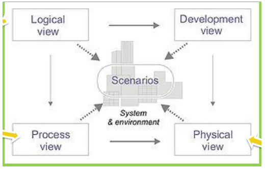

### 04 - Architektura softwarového systému, vztah k požadavkům na systém, formy popisu a modely. Způsoby ověření architektury, pojem „spustitelná architektura“. [KIV/ASWI, KIV/SAR, (KIV/EITM)]

- v momente kdy jiz vime PROC a CO budeme delat tak nas zajima JAK to budeme delat => tedy architektura
- SW architektura
  - = mnozina hlavnich navrhovych rozhodnuti o SW systemu
  - architektura je vnitrni organizace systemu
  - zavadi pravidla pro celou implementaci a definuje jak budou jednotlive casti poskladany dohromady
  - jedna se o predlohu podle ktere bude dany system implementovan
    - analogie k architekture domu - blue prints
      - v cem se lisi SW architektura a stavebni architektura
        - SW architektura ma mnohem vetsi uroven abstrakce
        - typem pouzitych diagramu
  - zahrnuje popis rozhodnuti o nasledujicich vlastnostech systemu
    - struktura - popis prvku ze kterych je system slozen
    - chovani - chovani jednotlivych prvku systemu
    - interakce - interakce mezi prvky
    - mimofunkcni vlastnosti - napr. omezeni nebo pozadavky na rychlost
  - mela by obsahovat pouze hlavni rozhodnuti
    - ne vsechny navrhnove rozhodnuti musi mit vliv na architekturu systemu
    - granularita popisu SW architektury zavisi na stakeholderech
  - pri tvorbe architektury nas omezuje okoli systemu, stakeholders, legislativa?
  - pro SW architekturu je klicove
    - funkcionalita definuje moduly, subsystemy a rozhrani
    - mimofunkcni pozadavky definuji datovy model, implementaci a struktury
    - existuje trida architektonicky vyznamnych pozadavku
      - cca 20% pozadavku ktere musi byt dobre definovany

  

  - na SW architekturu se muzeme divat z vice pohledu - 4+1
    - logicky pohled
      - deli system do komponent (subsystemu) ktere reprezentuji funkcni celky
      - mezi nimi jsou vazby reprezentujici toky dat a rizeni
      - stejne tak se divame na rozhrani pres ktere spolu komponenty komunikuji
      - logicky pohled na SW architekturu take implikuje architektonicky styl
        - monolit, vrstvena architektura, komponentova architektura, SOA, mikroservicy, datove orientovane architektury
      - pro zachyceni logickeho pohledu jsou typicky vyuzity UML diagramy
        - use case diagram, class diagram, state diagram
    - vyvojovy pohled
      - z jakych projektu se system sklada
        - system muze byt slozen z nezavislych prjektu na kterych muzou pracovat napr. dva tymy => dulezite je stanovit si rozhrani (napr. UI a backend)
      - jake technologie obsahuje
      - jak je cely system pak sestaven
      - resime konvence a baliky
    - fyzicke cleneni
      - divame se na to z pohledu subsystemu (funkcne uzavrenych prvku se samostatnou spravou - nasazeni, pristup, udrzba)
      - jak jsou nasazeny komponenty, jak spolu komunikuji a jake maji rozhrani
      - typicky pouzivame komponentovy diagram nebo diagram nasazeni
    - procesni pohled
      - struktura paralelizace v systemu
      - resi procesy, vlakna, synchronizaci, komunikace, ...
      - pouziva se tzv procesni model (workflow systemu)
      - sekvencni a komunikacni diagramy
    - scenare
      - sada use-casu nebo scenaru
      - lze je pouzit pro identifikovani prvku architektury, pro validaci architektury nebo jako vychozi bod pro design architektury
      - lze to brat jako tech 20%
  - vazby mezi pohledy jsou dany souvislostmi mezi prvky systemu
    - vazby architekru na logicke celky
    - nasazeni artefaktu na infrastrukturu a postupem tvorby
    - zavislosti artefaktu definuji postup pri jejich skladani

  - z 4+1 modelu vychazi C4 model
    - ten ma 4 pohledy od abstraktnich po konkretnich
      - context diagrams
        - system ke vztahu k akterum z vnejsiho prostredi
      - container diagrams
        - system jako sada kontejneru ktere mezi sebou maji vazby
      - component diagrams
        - dekompozite kontejneru na komponenty -> modelovani vztahu mezi nimi
      - code diagrams
        - poskytuje detaily tykajici se navrhu prvku architektury ktere mohou byt mapovany na kod
        - typicky se jedna o UML diagramy
          - pozn: ostatni nejsou UML?

- jakmile mame architekturu chceme vedet jestli je spravna - jestli IOC a GA budou plnit podminky LCO
  - => chceme validovat (bacha ne verifikovat!) navrh architektury
    - aby byla konzistentni a splnovala pozadavky (co zakaznik chce)
  - typicky je architektura nejak dokumentovana => chceme vedet jak je SW postaven a proc
  - takto postavena architektura je "as intended"
  - implementace je architektura "as implemented"
  - pokud je maly rozdil mezi "as intended" a "as implemented" => rikame tomu drift
    - = male odkloneni co explicitne neporusuje dokumentaci architektury jinak je to eroze
  - dokumentaci architektury se rika SAD (= Software Architecture Document)
  - validace architektury typicky overuje klicove use-casy a mimofunkcni pozadavky (napr. skalovatelnost)
    - vyuziva prvky oponentury nebo PoC implementace

- executable architecture (= "spustitelna architektura")
  - popis systemu formalnim zpusobem ktery umoznuje poloautomaticke generovani artefaktu - GCA (= Generated Code Alteration/Architecture?)
  - kod ktere mohou byt dale vyuzity pro jejich analyzu nebo implementaci
  - podle (Kruchten, 2004) je spustitelna architektura castecna implementace systemu ktera pokryva subset usecasu => ty ktere jsou architektonicky vyznamne
  - cilem je demonstrovat to ze architektura bude vhodna pro implementaci systemu a bude vyhovovat mimofunkcnim pozadavkum (=> spolehlivost, vykon, ...)

- architekturu lze popisovat i formalnim modelem - AADL (= Architecture Analysis and Design Language)
  - ta je human and machine readable
  - zameruje se na strukturu
  - umoznuje architekturu analyzovat
  - umoznuje dedailni HW i SW aspektu systemu
  - existuji automaticke nastroje ktere dokazi analyzovat celou radu vlasnostni daneho systemu

- model-driven architecture
  - = novy zpusob vyvoje systemu ktery je zalozen na UML modelovani
  - myslenkou je ze vytvorime model systemu natolik detailni ze z nej dokazeme kod generovat
  - nejprve vytvorime PIM (= Platform Independet Model) systemu
  - nasledne z nej vytvorim jeden ci vice PSM (= Platform Specific Model)
    - PSM definuje jak je dany PIM implementovan na specificke platforme
    - => z PSM mohu generovat kod
      - castecne vygeneruji, castecne dopisu rucne

- preskriptivni a deskriptivni architektura
  - preskriptivni = "as intended"
    - zachyceni systemu tak jak byl navrzen pred jeho konstrukci
  - deskriptivni = "as implemented"
    - zachyceni systemu jak byl ve skutecnosti implementovan
