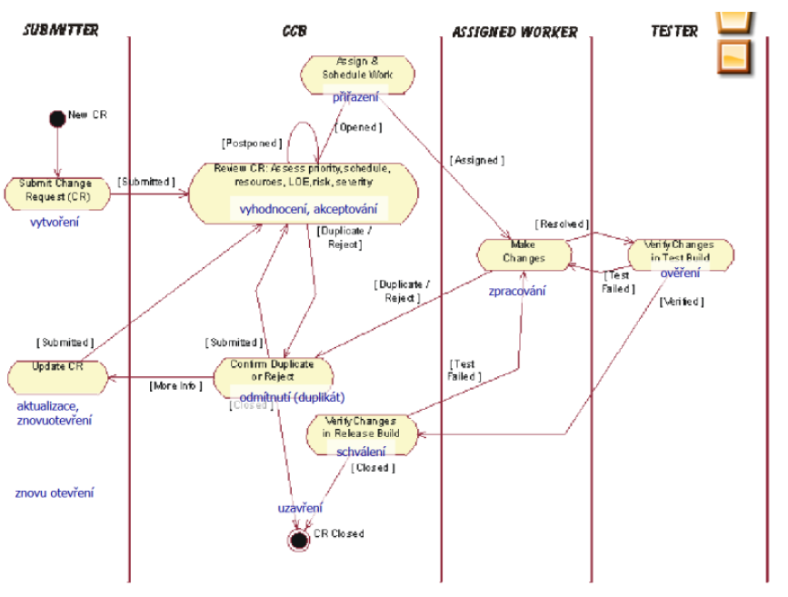
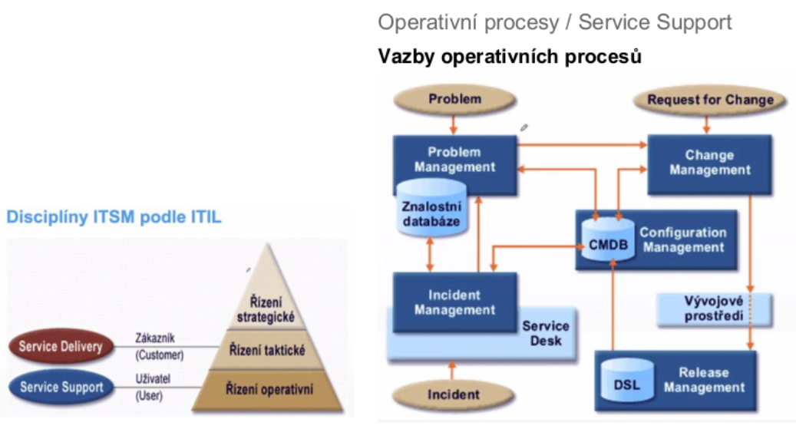

### 05 - Postupy pro správu a řízení změn v projektu vývoje software, typy a možnosti nástrojů. Souvislost správy změn s ostatními disciplínami vývoje software. [KIV/ASWI, KIV/EITM]

- konfiguracni management
  - = proces identifikovani a definovani prvku systemu, rizeni zmen techto prvku behem zivotniho cyklu, zaznamenavani a oznamovani stavu prvku a zmen a overovani uplnosti a spravnosti prvku
  - v konfiguracnim managementu jsou dve oblastni - sprava zmen a sprava verzi
    - sprava zmen se zabyva organizaci zmenovych pozadavku
      - chceme vedet jestli jsou vytvoreny, pripadne v jakem stavu jsou a kdo je za ne zodpovedny a jakou maji prioritu
      - je potreba striktni postup akci => jinak bude proces nestabilni
      - ma vyznam ve vsech fazich vyvoje SW
        - evidence pozadavku behem sberu
        - prirazeni prace vyvoji
        - hlaseni a opravy chyb
        - upravy produktu behem udrzby
      - hlaseni problemu, pozadavek na featuru
        - = popis problemu nebo pozadovane funkcionality
        - zalozim ticket
        - z ticketu se pak vytvory zmenovy pozadavky - specifikace zmen v konfiguraci ktere vedou k odpovidajici uprave SW systemu
        - pozadavky se nachazi v ruznych stavek (=> zavisi na konretnim procesu)

            

      - ve sprave zmen jsou ruzne role ktere maji v procesu na starost ruzne ukony
      - CCB (= Change Control Board)
        - skupina clenu projektu kteri jsou zodpovedni za zmenove rizeni
        - vyhodnocuji schvaluji/odmitaji pozadavky na zmeny
        - typicky je to cross-functional team
          - = typicke tymy jsou rozdeleny dle jejich oblasti kde pracuji - IT, marketing, HR, atd.
          - cross-functional team je tvoren lidmy prave z ruznych oblasti (oddeleni) v ramci organizace
      - vazba ticket-commit
        - souvislost spravy zmen/verzovani a podpory
        - bugtracking systemy
          - Bugzilla, Flyspray
        - ALM tools (= Application Lifecycle Management)
          - readmine, Jira
      - proces sice musi byt dobre nastaveny ale i tak se muze stat ze nejaka udalost vyzaduje jeho poruseni => je potom treba udelat vyjimku
        - mela by mit jasne opodstatneni a prinost
        - mela by byt trasovatelna a dokumentovana
        - opakovane vyjimky by pak mely vest ke zmene samotneho procesu
      - tickety pri vytvoreni obsahuji
        - shrnuti, metadata, popis, konfiguraci, log, vstupni data, zavaznost
        - pote je je jeho zpracovani naplanovano do odpovidajici iterace
        - pri uzavreni je pak zaznamenana opravdova narocnost a shrnuti informaci
    - sprava zmen neni izolovana aktivita a ma souvislost s ostatnimi procesy
      - umoznuje efektivnejsi release management
      - ve fazi udrzby je pak sprava zmen v podstate ridici prvek vyvoje!
      - ve spojeni s verzovanim je pak cilem trasovatelnost
        - v jake verzi se chyba objevila
        - v jake verzi/commitu je zmena implementovana
      - ve spojeni s pozadavky to jsou feature requesty
        - sprava zmen efektivne vytvari backlog tasku
        - radi se sem jak implementace pozadavku tak opravy a podobne veci
      - v souvislosti s uzivatelskou podporou a udrzbou
        - umoznuje se efektivne vyporadat s nahlasenymi chybami nebo pozadavky na vylepseni
    - systemy se typicky rozdeluji na dva druhy
      - bug trackery
        - spise jednoduche a orientovane na hlaseni chyb
        - napr. BugZilla nebo Mantis
      - ALM (= Application Lifecycle Management)
        - umoznuji spravu hlaseni chyb
        - k tomu ale navic umoznuji spravovat cely vyvojovy cyklus
        - typicky podporuji planovani a sledovani (burndown, velocity, atd.)
        - maji tesnou vazbu na VCS (= Version Control System)
          - Bitbucket, Git, ClearCase, atd.
          - => mohou tak spravovat vice projektu s vice tymy
        - obecne jsou komplexnejsi
        - napr. Jira nebo Redmine

- souvislost s EITM
  - jsou vlastne dva modely vyvoje SW
    - prediktivni
      - v podstate vodopad
      - mame definovane faze kde je kazda odsouhlasena
      - => to znamena spatnou schopnost reagovat na zmeny ale moznost odhadnout predem cenu a plan projektu
    - adaptivni
      - na zacatku je obtizne vytvorit detailni zadani nebo plan
        - => je tedy tezke odhadnout naklady
      - to pak vede na iterativni metodiky
      - je lepe vybaven na zmeny
        - je treba je dostatecne formalne popsat
      - zmenove rizeni je soucasti projektoveho rizeni
        - zahrnuje identifikaci pozadavku
        - formulovani cilu
        - balancovani kvality, rozsahu a penez
        - prizpusobeni parametru projektu ocekavani stakeholderu
        - zmenove rizeni zajistuje PM (= Project Manager)
        - zmenove rizeni take znamena brat v uvahu jake pozadavky jsou relevantni a jake ne (= vyhodnocovani pozadavku)
        - spatne formulovane pozadavky mohou byt problem
          - -> vice nez 40% rozpoctu vyvoje padne na spatne a nekvalitni pozadavky
  - ITIL (= Information Technology Infrastructure Library)
    - = ITIL je rozsahly a procesne orientovany framework pro ITSM (= IT Service Management)

        

    - service desk
      - "single point of contact" pro adresovani pozadavku uzivatelu (rozhrani pro uzivatele)
      - zajistuje obnovu standardni dodavky sluzby s minimalnim dopadem na zakazniky
        - plni roli 1. urovne podpory
        - koordinuje 2. a 3. uroven podpory

    - change management
      - zajistuje hladkou a nakladove efektivni implementaci schvalenych zmen
      - vstup z problem managementu nebo "rozhrani" change request
      - odpovida za
        - rizeni change requestu
        - schvalovani a planovani zmen
        - koordinaci implementace zmen
      - zajistuje svoji cinnosti flexibilitu infrastrukutry
