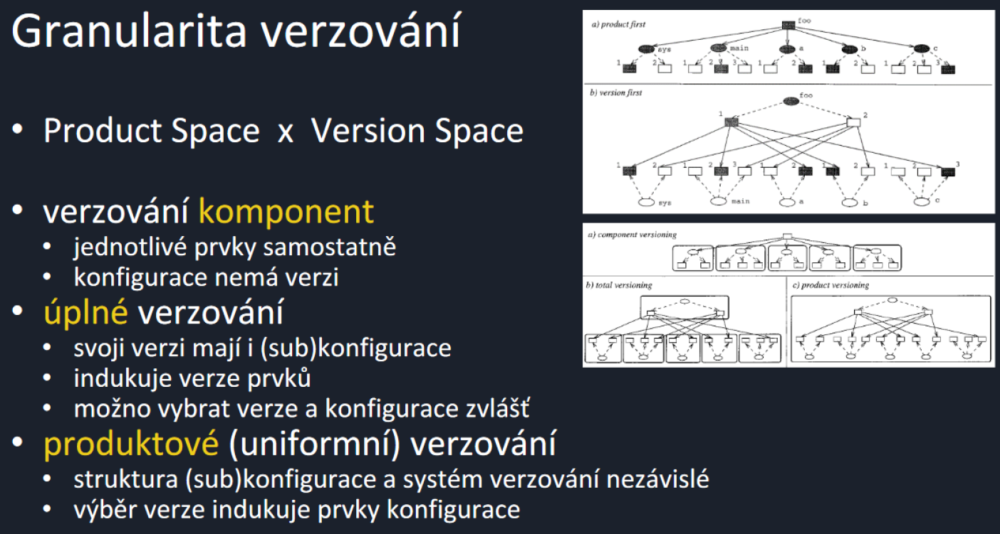
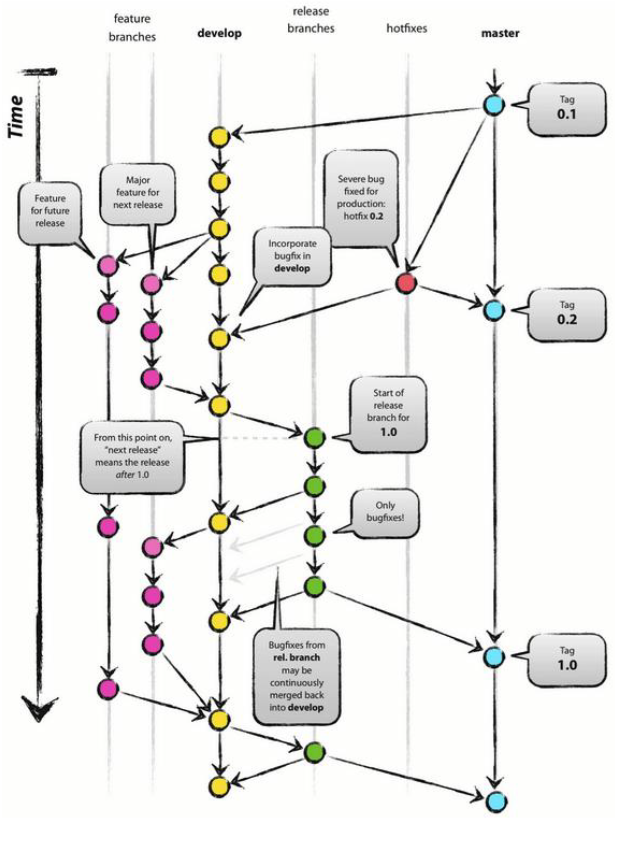

### 06 - Správa verzí, základní pojmy a postupy (hlavní vývoj, použití větví, značky). Struktura úložiště pro projekty různé velikosti. Nástroje pro správu verzí, jejich možnosti. [KIV/ASWI]

- sprava verzi je soucasti ulohy konfiguracniho managementu
  - => identifikace dane konfigurace
- ucelem je udrzovat prehled o stavu a navaznosti konfiguraci systemu a jeho prvku
- verze
  - = jedna konkretni podoba prvku konfigurace (napr. souboru)
  - jake aspekty podoba zahrnuje se odviji od druhu verzovani, co je verzovano od granularity verzovani a jaka je verze urcena od typu verzovani
  - verze maji nekolik druhu
    - revize = historicka podoba (napr. MS Word 2009)
    - varianta = akternativni podoba (napr. MS Word pro MAC)
      - viz preprocesor switche v C/C++
  - verzovat muzeme dvema zpusoby
    - podle stavu
      - identifikuji se podoby prvku
      - vysledna verze vznkne vhodnym vyberem prvku konfigurace
    - podle zmen (prirustky)
      - identifikuji se take zmeny prvku
      - vysledna verze vznikne aplikaci jednotlivych zmen

    

    - tagy v gitu = uplne verzovani (vycheckoutovani verze)
    - komponentove verzovani
      - struktura produktu je dana
      - konfigurace vznika vyberem verzi jednotlivych komponent ze kterych se zklada
        - napr. verze MCALu (= Microcontroller Abstraction Layer), ErrorManageru, a dalsich ruznych komponent ktere tvori vysledny system
      - pokud chceme identifikovat konkretni verzi produktu, jsou tu opet dva zpusoby
        - extenzionalni (1.5.1 x 2.5.0 (major.minor.micro + build))
        - intenzionalni (OS=WIN10,AVX512=True => popsan skupinou atributu)
  - delta = mnozina zmen prvku konfigurace mezi dvemi verzemi
  - changeset = souvisejici delty tvorici atomicky celek
  - tag = oznaceni konfigurace jmenem
  - baseline = konzistentni konfigurace tvorici zaklad pro produkcni verzi nebo dalsi vyvoj
    - iteracni release, alfa verze, beta verze, finalni release
    - pouziti taky napr po review specifikace => abychom vedeli z ceho vychazet v implementacni fazi
  - codeline = serie podob verzi mnozinu prvku konfigurace tak jak se meni v case + pravidla (cast grafu verzi)
  - pro verzovani potrebujeme uloziste - sdileny datovy prostor kde jsou vsechny prvky konfigurace
    - je potreba rizeny pristup
    - to zajistuje VCS (= Version Constrol System)
    - varianty zamykani
      - pesimisticky
        - read-only
        - read-write kopie jen pro autorizovane (privatni repo na GitHub?)
      - optimisticky
        - RW kopie pro koholiv
        - pak resime konfliky
    - varianty uloziste
      - centralni
        - jen jedno misto kde je vse ulozeno
        - bottle neck?
        - napr. ClearCase
      - distribuiovany
        - napr. Git
    - pracovni prostor = soukrome uloziste ve kterem je mozne provadet zmeny konfigurace bez ovlivneni ostatnich
  - sprava verzi musi umoznovat paralelni praci na stejne konfiguraci
    - => k tomu je zapotrebi paralelni praci izolovat cimz vznikaji konflikty ktere je treba resit (napr. pri rebase)
  - typicky se pouziva model vetsi (branch strategy)
    - main pro hlavni vyvojovou linii
    - branch pro paralelni vyvojovou lii
    - => merge pro spojeni vetve (musi se resit konflikty)
  - s VCS se poji mnozina konvenci ktere je treba pri vyvoji dodrzovat
    - jak pojmenovavat vetve (napr. `task/main/my_feature`)
    - jak je mergovat `feature -> dev -> main`?
  - existuji vzory pro verzovani
    - typicky mame privatni verzi lokalne
    - potom minimalne task-level commity, nekdy spise task-level vetve
    - mame hlavni vyvojovou linii
    - casto je pak vetev pro release, vetev pro testovani, vetev pro vyvoj, a spousta vetvi pro featury/tasky
    - casto je pak pred releasem nejake stabilizacni obdobi pro uklid a pripravu
  - verzovani muze byt
    - manualni (napr. semestralni prace na USB flashce)
    - zakladni (centralni uloziste; verzovani modelu - RCS (= Revision Control System), subversion)
    - distribuovane (vice ulozists, synchronizace napr. Git)
    - pokrocile (intergrace CI/CD, ALM - ClearCase)
  - RCS (= Revision Control System)
    - spravuje jednotlive soubory pomoci extenzionalniho verzovani
    - uklada historii vsech zmen a vyuziva diff
  - CVS (= Concurrent Versions System)
    - umoznuje praci s celymi konfiguracemi najednou
    - podporuje centralni sdilene a privatni uloziste
    - ma optimisticke zamykani
  - SNV
    - je naslecnik CVS bez omezeni predchudce
      - prejmenovani
      - verzovani adresaru
      - automicky commit
      - HTTP pristup
  - Git

    

- rizeni nastaveni
  - aktivity provadejici transformaci zdrojovych prvku konfigurace na odvozene, zejmena sestaveni celeho produktu
  - cilem je vytvorit systematicky a automatizovany postup

- proces ma ruzne miry formalnosti
  - typicky priprava: check-out, processing, preklad, linkovani, nasazeni, spusteni, testovani, check-in, znackovani (tags), informovani (napr. e-mail)
  - pravidla sestavovani
    - jedinacnost a idetifikace
      - sestaveni jako artefakt: PROJEKT_v2_BUILD2134_20180612
      - identifikator je jednoznacny, citelny
      - vytvoreny a zpracovany automaticky
    - uplnost (tvori kompletni system, obsahuje vsechny komponenty)
    - konzistence (vzniklo ze spravnych verzi spravnych komponent)
    - opakovatelnost (mozst opakovat build kdykoliv v budoucnu)
    - dodrzuje pravidla vyvojove linie (codeline)
  - sestaveni muze byt z velke casti automatizovane
    - je to i zadouci
    - proces sestaveni je pak jednoznacne dany a replikovatelny
    - znamena to ale vice rezije kolem (sprava okolo pipeline atd)
      - je potreba mit sestavovaci prostredi (in-house, remote?)
      - po kazdem buildu (sestaveni) je potreba ho vycistit
      - mit scripty ktere je potreba udrzovat
      - automatizovane testy
  - nastroju pro sestaveni je vice
    - napr. make, cmake, maven, ant
  - potom jsou nastroje pro CI/CD
    - napr. GitHub actions, GitLab pipeline
    - pri push do dane vetve se trigne spusteni pipeline
      - build, testy, integrace, staticka analyza
      - reportovani vysledku napr. pres e-mail
  - obsah sestaveni
    - co je pouzito
    - prirustkovy build (napr. nepreklada znovu uz vytvorene `.o` soubory)
    - uplny build (smaze dostavani soubory a vse prlozi znovu)
    - cisty build (smaze vse)
  - ucel sestaveni
    - proces sestaveni se take odviji od ucelu
    - napr. task build vs release build
    - relese ma typicky mnohem vice chcecku a testu (napr. smoke testy?)
    - typy buildu
      - soukromy build
        - proveden programatorem
        - typicky inkrementalne bez sanitoveho prostredu
      - integracni build
        - typicky proveden na urcenem stroji
        - cilem je overit celistvost a sestaveni cele aplikace
        - idealne co nejpodobnejsi release buildu
        - casto bezi celou noc (napr. stress testy)
      - release build
        - je dodan zakaznikovi
        - typicky jine naroky na prostredi, formalnost a dokumentaci celeho procesu sestaveni
  - sestaveni se casto kombinuje s kvalitou
    - po sestaveni se spusti automatizovane testy
    - staticka analyza
    - cilem je odhalid chybu co nejdrive
