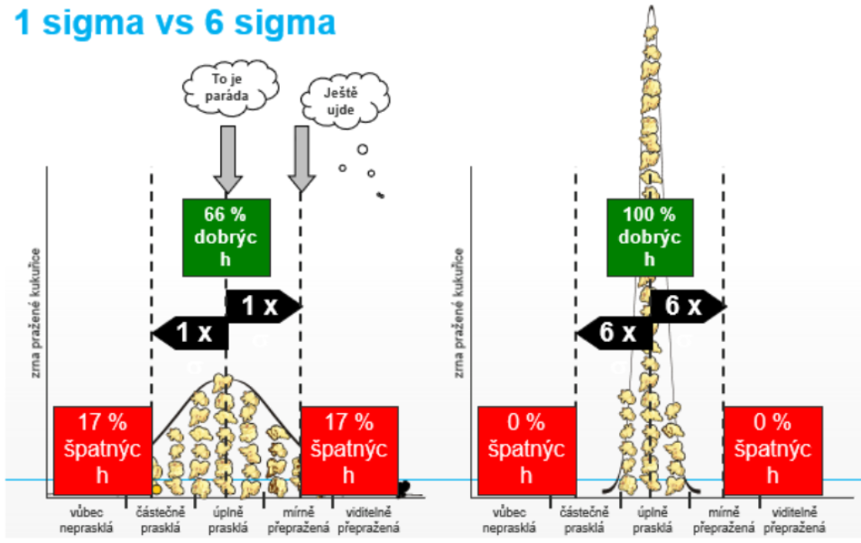
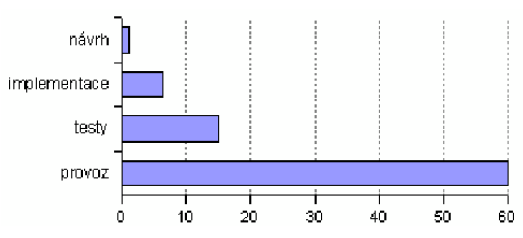
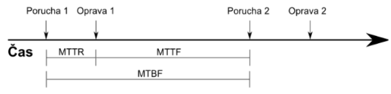
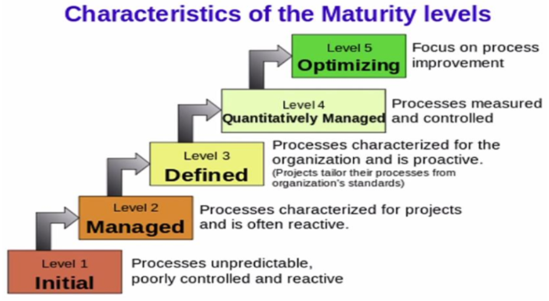

### 07 - Měření kvantitativních a kvalitativních charakteristik sw produktu či procesu, metoda GQM, příklady metrik. Využití metrik při řízení a zajištění kvality vývoje. [KIV/ASWI]

- v kontextu kvality SW je klicovy pojem "fit for purpose" = program musi splnit svuj ucel
- to lze interprettovat nejen jako uzivatelskou spokojenost ale i treba absenci chyb
- program dela to co ma a nedela to co nema
- definuje vnejsi a vnitrni kvalitu
  - vnitrni je treba dobry navrh architektury, testovatelnost a typicky implikuje vnejsi kvalitu
  - venejsi kvalita: spolehlivost, bezpecnost, vykonnost, atd. (z pohledu uzivatele)
- kvalitou SW se zabyva ISO 25010
- kvalita neni pouze technicka disciplina ale i organizacni disciplina
  - => pokud je kvalitni proces bude kvalitni produkt
- s tim souvisi napr. Six Sigma
  - project management improvement
  - sbirka technik a nastroju pro proces improvement
  - kvalita vyrobniho procesu
  - meritelne (statisticke) charakteristiky
  - sigma je interval ppst (1 sigma - hodne zmetku, 6 sigma - 99.99996 kvalitnich)

  

- opak kvality
  - error = provedena chyba -> zpusobuje defekt; napr. neosetrena vyjimka v kodu
  - defekt = zavada jehoz dusledkem je chybovy stav; napr. login se spravnym username a heslem neprojde
  - chybovy stav = vyhozena vyjimka jehoz dusledkem muze byt; napr. uzivateli se vrati chybovy stav
  - selhani = ztrata dat, pad systemu

- existuje jednoducha motivace pro udrzovani vysoke urovne kvality napric vyvojovym procesem - cim pozdeji je chyba odstranena, tim je to drazsi

  

- kvalitu zajistujeme
  - verifikaci -> splnujeme specifikaci? (bezchybny produkt)
  - validaci -> vyhovujici produkt? (spravny produkt)
  - techniky se vetsinou deli na preventivni a detekcni/opravne
    - viz napr. IDS (= Introsion Detection System) a IPS (= Intrusion Prevention System) v zabezpeceni site
    - detekcni techniky
      - unit testy
        - idealne automatizovane v ramci sestaveni/commitu
        - klicove pro TDD (= Test-Driven Development)
      - regresni testy
        - subset funcnich testu
        - kontrola jestli nove upravy nerozbili jiz existujici a fungujici funkce
        - aplikovani testu kterymi jiz drive SW prosel
        - umoznuje vcas detekovat problemy
      - smoke testy
        - jejich ukolem je overi ze nasazeni aplikace probehlo v poradku, aplikace odpovida (zda se ze funguje)
        - nesnazime se aplikaci zatizit
        - nechceme po sobe nechat data v DB
      - zatezove testy, bezpecnostni testy
      - staticka analyza kodu
        - Axivion, clang-tidy, PMD, MISRA, atd.
        - kontrola konvenci a standardu
      - formalni verifikace
        - PathFinder pro Javu (taky analyzuje kod, hleda napr. race conditions)
        - ne vzdy aplikovatelne nebo nutne
    - preventivni techniky
      - best practices
        - navrhove vzory
        - konvencep pojemenovacani funkci, promennych, atd.
        - refactoring
        - oponentura
        - automaticke testy
        - retrospektivy, atd.
      - dobry proces
        - dobry proces je klicovym indikatorem uspesnosti projektu a tedy i jeho kvality
      - technicka oponentura
        - skupinova technika kde je cilem odhalit chyby v dokumentu nebo kodu
          - role
            - moderator - ridi diskuzi
            - pruvodce - predklada dilo (napr. kod)
            - autor - vysvetluje nejasnostni
            - zapisovatel - zaznamenava
            - oponentni - hledaji chyby
          - typicky je nejprve priprava (cas pro oponenty aby si mohli projit kod), pak schuzka, kde se oponentura provede a pak zaver
          - lze aplikovat na spoustu veci
          - efektivne detekuje chyby
          - narocna na cas a je potreba mit zkusene lidi
      - peer review - autor vysvetluje kod a kolega kouka a komentuje
      - parove kodovani
        - technika agilniho vyvoje z XP (= Extreme Programming)
        - dva vyvojari spolupracuji na jednom PC
          - spolecne navrhuji design, koduji a testuji
      - metriky = statisticke rizeni procesu

- metriky
  - kvantitativni ukazatele pomahaji najit slabiny kvality
    - kvantitativni ukazatele => ciselna/statisticka hodnota co nam pomuze urcit uroven kvality?
    - napr. GQM pristup, FURPS
  - zakladem statistickeho rizeni procesu
  - jsou indikatorem toho ze je nekde neco spatne
  - spravne nastavne kvantitativni ukazatele nam pomohou detekovat slaba mista
  - navic metriky jsou exaktni
  - typicky je potreba stanovit ocekavane / tolerovane hodnoty a pak prubezne monitorovat
  - typicke jsou metriky kodu
    - cyklomaticka slozitost (pocet urovni zanoreni funkce)
    - LOC (= Lines of code) a jejich varianty (napr. s komentari, bez, pocet prazdnych radku, atd.)
    - => cilem je mit prehledny kod ktery lze udrzovat
  - spolehlivostni metriky
    - MTBF = MTTF + MTTR
      - MTBF = mean time before failure (stredni doba mezi dvema poruchami systemu)
      - MTTF = mean time to failure (stredni doba do poruchy systemu)
      - MTTR = mean time to repair (napr. doba restartu serveru)

        

  - dalsim prikladem je pokryti kodu testy
    - staticka analyza testu code style nebo charakteristiky defektu (co se ma/nema pouzivat)
  - v projektu pak mame metriky jako
    - burdown = kolik prace zbyva, kolik casu zbyva
    - velocity =
    - pracnost
    - turnover
    - brakage = pocet radku na CR (= Change Request)
    - DDR (= Defect Discovery Rate)
    - je jich proste hodne
  - je potreba vedet co merit, jak to merit a proc to merit
  - pak na zaklade vysledku mereni musime provest akce
    - to vse popisuje dokument plan mereni
  - mereni muze byt ruzne komplexni
    - muze byt pevne dany predpis nebo mereni za pochodu jako u agilnich metodik

- Goal-Question-Metric
  - pristup k definovani metrik - ramec pro system zamereny na konkretni problemy
  - Goal - problem + cil mereneho programu
  - Question - merene objekty a zpusob mereni
  - Metric - konkretizuji ziskavana data
  - priklad
    - G: zlepsit spravedlnost v ocenovani prace na projektu
    - Q: kolik prace odvadi jednotlivy celnove tymu?
    - M: pocet radku ulozenych v SVN / pocet uzavrenych tasku

- CMMI (= Capability Maturity Model Integration)
  - model kvality organizace prace urceny pro vyvojove tymy
  - model ma 5 urovni zralosti a prostrednictvim auditu se hodnoti na jake urovni kvalita tymu je

  

  - initial - Ad-hoc procesy (neprediktovane reaktivni)
  - managed - projekty jsou planovane, monitorovane
  - defined - proaktivni, pouziti standarnich postupu
  - quantitatively managed - sbiraji se namerena staticka data a na jejich zaklade se rozhoduje
  - optimizing - stabilni a flexibilni, zamereni na vylepseni
