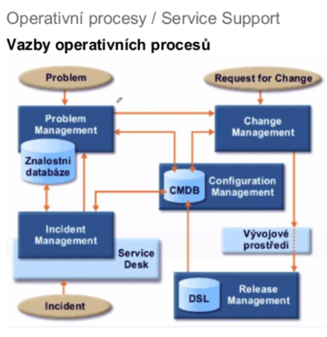
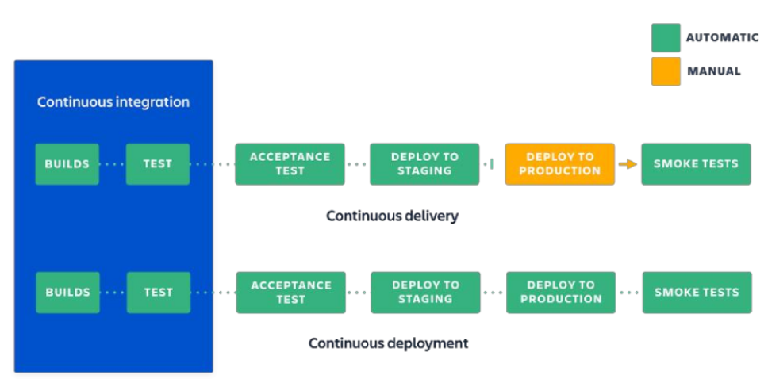
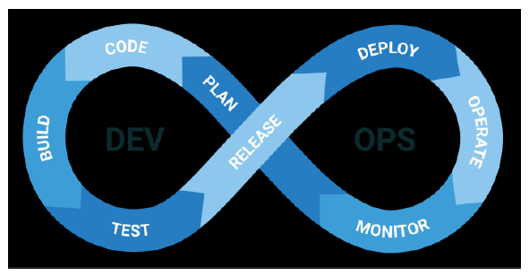

### 08 - Postupy a techniky související s nasazením produktu do provozu. Postup vyřazení softwarového produktu z provozu. [KIV/ASWI, (KIV/EITM)]

- nasazeni produktu do provozu je faze transition s cilem GA (= General Availability)
  - v dnesni dobe se pouzivaji technologie jako Docker nebo Kubernetes
- v teto casti vyvoje jsou klicove aktivity zejmena sprava prostredi, project management, deplyment, SCM (= Software Configuration Management)
- pocet iteraci a povaha faze se lisi
- typicky je potreba udelat field testing a korekce (konfigurace, s funkcnosti je ted uz problem), skoleni uzivatelu
  - smoke testy
    - jejich ukolem je overi ze nasazeni aplikace probehlo v poradku, aplikace odpovida (zda se ze funguje)
    - nesnazime se aplikaci zatizit
    - nechceme po sobe nechat data v DB
  - pred nasazenim se take mohou provest zatezove a bezpecnostni testy
- od zakaznika chceme formalni odsouhlaseni dodavky, pokud bylo dosazeno cilu projektu a produkt splnuje ocekavane pozadavky (viz DoD - Definition of Done)
  - vysledkem je
    - akceptace
    - akceptace s vyhradami
    - neakceptace
- pote nasleduje uzaverka projektu - retrospektiva celeho projektu
  - je to typicky posledni iterace s cilem formalne projekt uzavrit, shrnout nabite zkusenosti, provest interni audit konfigurace, kontrola baseline a obecny uklid
- post-mortem review
  - to je ta retrospektiva na konci projektu
  - hledavme problemy a diskutujeme
- pote uz je produkt v provozu
  - je treba zajistit peci o prostredi
  - provoz produktu
  - monitorovani systemu
  - zalohovani
  - obcasne upravy
  - opravy chyb
  - customer support
    - L1 podpora - uzivatelska (helpdesk)
    - L2 podpora - systemova (admin)
    - L3 podpora - aplikacni (vyvojar) - zmena kodu

  - => je to porad hodne prace

- ITIL (= Information Technology Infrastructure Library)
  - = ITIL je rozsahly a procesne orientovany framework pro ITSM (= IT Service Management)

  

- cilem udrzby produktu je zabranit jeho degradaci
  - klasicke typy udrzby jsou
    - adaptivni (zmeny SW vuci zmenam prostredi)
      - napr. mame vice zakazniku nez jsme ocekavali nebo nastup GDPR
    - preventivni
      - future-proofing pro zabraneni degradaci
      - napr. IPS (= Intrusion Prevention System)
    - korektivni
      - odstranovani chyb
    - perfektivni
      - napr. vylepsovan UX (= User Experience)
  - radove roky
  - implementace dilcich zmen
  - aktualizace, patchovani bezpecnostnich chyb a bugu
  - monitoring (vykon, spolehlivost)
  - helpdesk, servicedesk, ITIL
    - helpdesk = zameren na bug-fix
    - servicedesk = zameren  i na RQI a request for new services
  - reportovani chyb
  - sledovani nakladu (cena za energii a provoz)

- DEVOPS
  - prpojeni vyvoje SW s jeho provozem a rozvozem
  - od velkych monolitickych vydani k prubezne aktualizaci
  - business agilita, flexibilita
  - Dev = vyvojari, jejihz ukolem je vyvinout produkt a nasledne ho udrzovat
    - kazdou novou verzi predava oddeleni pro podporu rozvozu k nasazeni na produkci
  - Ops = zodpovedni za hadke fungovani infrastruktury
    - to zahrnuje predevsim spravu PC siti a serveru
    - casto i poskytovani technicke podpory
  - zmenseni mezery mezi oddelenimi pomoci automatizace - hlavne zavedenim automatizacnich nastroju, spolecnych easy nastroju, se kterymi nasazeni zvladnou i vyvojari
  - techniky
    - Continuous integration (CI)
      - kazdy clen tymu integruje svoji cast prace prubezne, obvykle alespon jednou za den
      - kazda integrace je overena automatickym sestavenim po kterem nasleduji automaticke testy
    - Continuous delivery (CD)
      - dodani zmen na produkci a to bezpecne a rychle a udrzitelnym zpusobem
      - klicove je vytvoreni spolehliveho automatizovaneho procesu pro nasazeni produktu (nasazeni by nemela byt mimoradna udalost)
    - Continuous deployment (CD)
      - jede jeste dale, nez continuous delivery
      - kazda zmena ktera projde vsemi fazemi od sestaveni po testovani je nasazena k zakaznikovi (odpada tedy i posledni manualni krok)
      - odpada tzv "release day"

  

  - CI/CD je fenomen moderni doby
    - aplikace jiz nejsou krabicove a casto se ani neinstaluji
      - => vsechno je to web-based v cloudu
    - time-to-market je kriticky, rychla zmena na problemy take
    - principem je prace v malych davkach a vysoka mira automatizace (bez ni to nejde)
    - tyka se celeho vyvojove cyklu, ne jen nasazeni

    

- debrazni systemu z provozu
  - doziti
  - zamrazeni investic
  - priprava akvizice noveho systemu
  - casto opomijena faze zivotniho cyklu IS (musi byt brana v potaz uz pri navrhu aby bylo na konci jednoduche vyradit system z provozu)
  - typicky proto ze se system stal zastaralym, redundantnim nebo jiz neudrzovanym
  - zainteresovane skupiny jsou vlastnici, uzivatele, obchodaci, ops a podpora
  - typicky se analyzuji napojeni ostatni systemu => chceme vedet co vsechno rozbijeme az to vypneme
  - take musime urcit strategii vyrazeni a nasazeni noveho systemu
    - big-bang - vse naraz najednou
    - po etapach - postupna migrace na novy system
    - paralelne s nasazovanim noveho systemu
  - musime aktualizovat dokumentaci, migraovat data a uzivatele, archivovat data, kod, vypnout pristupy a system odstranit
